# Windows下安装Intellij Idea

- 系统支持：Microsoft Windows 8 / 7 / Vista / 2003 / XP（每个系统版本的 32 位和 64 位都可以）
- JDK 版本：Oracle JDK 1.6 或以上

## 首次安装

- 和普通软件一样安装

## 版本升级

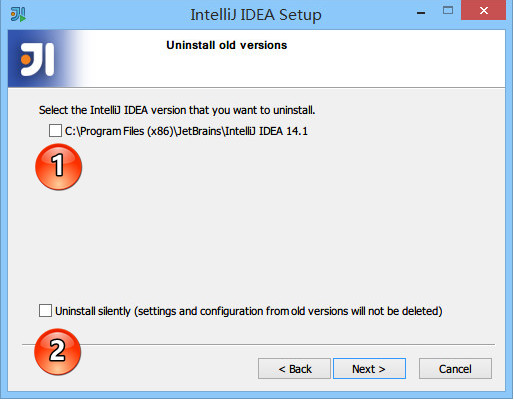

> - 上图，显示我目前电脑中已经有一个 IntelliJ IDEA 版本，如果我勾选了标记 1，则表示安装之前会先卸
>   载掉电脑上的旧版本。
> - 上图标记 2，如果勾选了，则 IntelliJ IDEA 会直接安静地卸载旧版本，而旧版本的个性化设置不会被删
>   除。
> - 在小版本迭代中建议是卸载掉旧版本的，然后再进行新版本安装，因为小版本迭代一般都是 Bug 的修
>   复，保留旧版本没有多大意义。
> - 在大版本迭代中建议是保留旧版本，也就是不勾选上图标注 1，IntelliJ IDEA 是支持一台电脑装多个版本
>   的。
> - 接下来的步骤我们假设勾选了标注 1 再进行安装。 

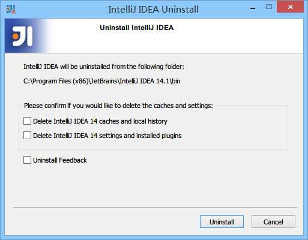

> - 上图，由于上一步勾选了卸载旧版本选项，所以出现了选择删除旧版本的配置选项。
> - 第一个选项：删除旧版本的缓存和本地历史记录。
> - 第二个选项：删除旧版本的个人个性化设置。
> - 建议两个都不要勾选。
> - 点击 uninstall，进入全自动的卸载过程，卸载完成接下来的步骤跟上文“首次安装”一致，这里不再进行
>   说明。

# IntelliJ IDEA 相关核心文件和目录介绍

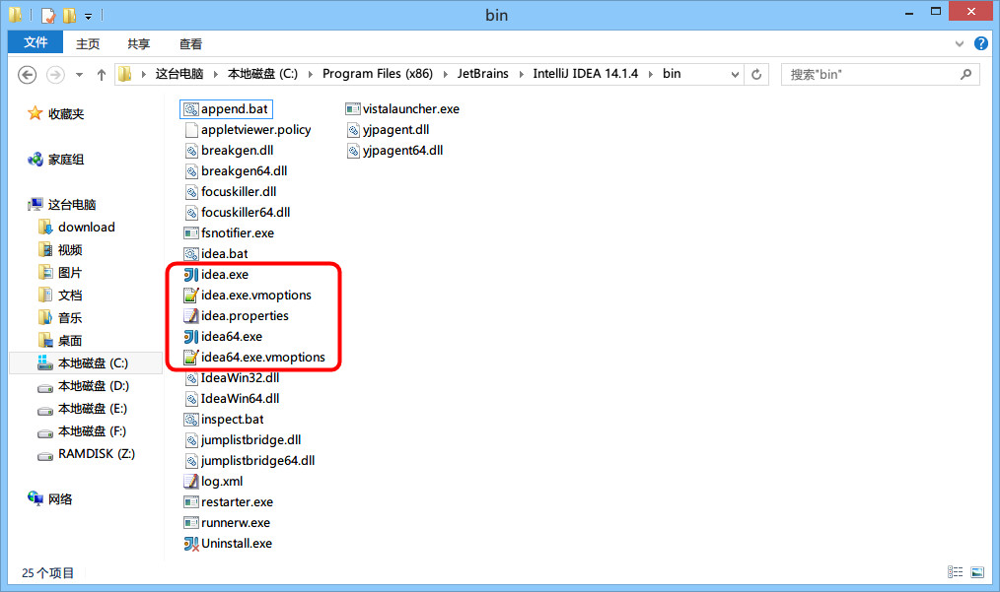

- IntelliJ IDEA 的安装目录并不复杂，上图为最常改动的 bin 目录，经常会改动的文件或是必须介绍就是
  如图红色框中的几个。
- idea.exe 文件是 IntelliJ IDEA 32 位的可行执行文件，IntelliJ IDEA 安装完默认发送到桌面的也就是
  这个执行文件的快捷方式。
- idea.exe.vmoptions 文件是 IntelliJ IDEA 32 位的可执行文件的 VM 配置文件。
- idea64.exe 文件是 IntelliJ IDEA 64 位的可行执行文件，要求必须电脑上装有 JDK 64 位版本。64 位
  的系统也是建议使用该文件。
- idea64.exe.vmoptions 文件是 IntelliJ IDEA 64 位的可执行文件的 VM 配置文件。
- idea.properties 文件是 IntelliJ IDEA 的一些属性配置文件。

## 设置目录介绍

- 路径 : C:\Users\Administrator\\.IntelliJIdea2017.1
- IntelliJ IDEA 的设置目录命名是统一的、有规律：IntelliJIdea2017.1。其中2017.1 表示版本号
- 如果删除这个目录, 重启Idea会重新生成一个全新的默认配置, 所以如果Idea的配置改出问题了, 删掉这个目录即可
- **config :** 是 IntelliJ IDEA 个性化化配置目录，或者说是整个 IDE 设置目录。安装新版本的 IntelliJ IDEA 会自动扫描硬盘上的旧配置目录，指的就是该目录。这个目录主要记录了：IDE 主要配置功能、自定义的代码模板、自定义的文件模板、自定义的快捷键、Project 的 tasks 记录等等个性化的设置
- **system :** 是 IntelliJ IDEA 系统文件目录，是 IntelliJ IDEA 与开发项目一个桥梁目录，里面主要
  有：缓存、索引、容器文件输出等等，虽然不是最重要目录，但是也是最不可或缺目录之一

## 配置文件常见修改内容说明

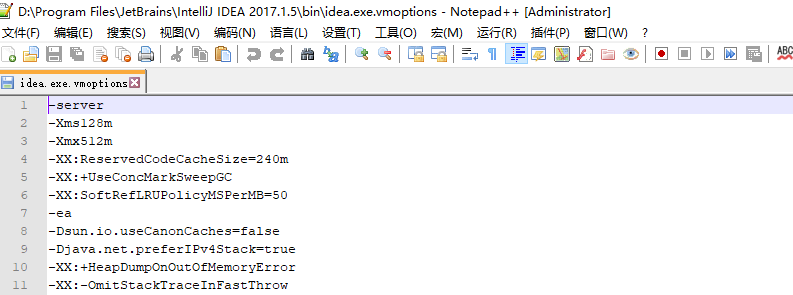

- 32位的文件为idea.exe.vmoptions, 64位的文件为idea64.exe.vmoptions, 32位的由于内存太小, 一般无需调整

- 修改的原则主要是根据自己机器的内存情况来判断的, 一般8G内存以下的机子可以不用调整, 大于8G内存的建议进行修改, 常修改的就是下面 4 个参数:

  > - -Xms128m ，16 G 内存的机器可尝试设置为 -Xms512m
  > - -Xmx750m ，16 G 内存的机器可尝试设置为 -Xmx1500m
  > - -XX:MaxPermSize=350m ，16G 内存的机器可尝试设置为 -XX:MaxPermSize=500m
  > - -XX:ReservedCodeCacheSize=225m ，16G 内存的机器可尝试设置为 -XX:ReservedCodeCacheSize=500m

## idea.properties文件常见修改内容说明

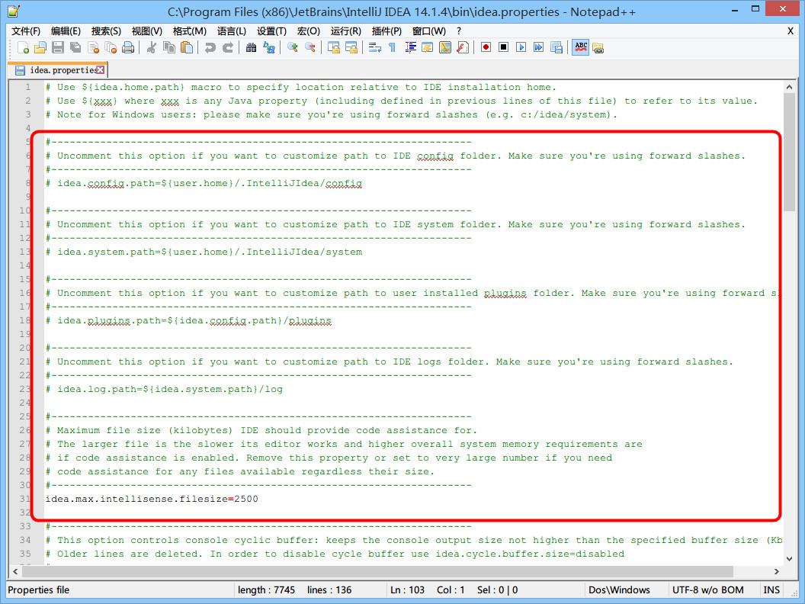

- idea.config.path=${user.home}/.IntelliJIdea/config ，该属性主要用于指向 IntelliJ IDEA 的个性化
  配置目录，默认是被注释，打开注释之后才算启用该属性，这里需要特别注意的是斜杠方向，这里用的是
  正斜杠
- idea.system.path=${user.home}/.IntelliJIdea/system ，该属性主要用于指向 IntelliJ IDEA 的系统文
  件目录，默认是被注释，打开注释之后才算启用该属性，这里需要特别注意的是斜杠方向，这里用的是正
  斜杠。如果你的项目很多，则该目录会很大，如果你的 C 盘空间不够的时候，还是建议把该目录转移到
  其他盘符下
- idea.max.intellisense.filesize=2500 ，该属性主要用于提高在编辑大文件时候的代码帮助。IntelliJ I
  DEA 在编辑大文件的时候还是很容易卡顿的。
- idea.cycle.buffer.size=1024 ，该属性主要用于控制控制台输出缓存。有遇到一些项目开启很多输
  出，控制台很快就被刷满了没办法再自动输出后面内容，这种项目建议增大该值或是直接禁用掉，禁用语
  句 idea.cycle.buffer.size=disabled

## 设置目录进行多台设置同步化处理

- 修改 idea.properties 属性文件中的 idea.config.path 值设置同步目录

# IntelliJ IDEA 主题、字体、编辑区主题、文件编码修改
## 主题修改

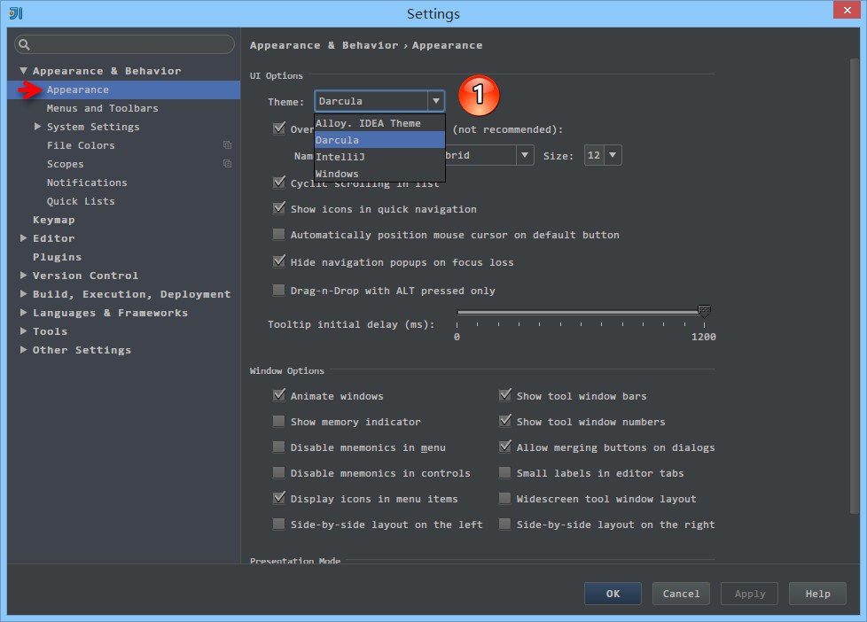

- 上图标注 1 所示为 IntelliJ IDEA 修改主题的地方，在 Windows 系统上 IntelliJ IDEA 默认提供的主题
  有四套： Darcula 、 IntelliJ 、 Windows 、 Alloy. IDEA Theme 。除了 Darcula 是黑色主题，其他三套
  都是以白色为背景的。
- File->Settings->Appearance

## 字体修改

### 主题字体修改

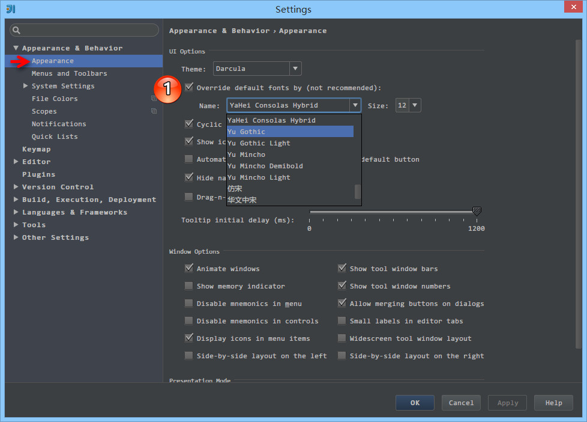

- 如上图标注 1 所示，IntelliJ IDEA 主题字体的修改要先勾选 Override default fonts by 。默认 Intel
  liJ IDEA 是不推荐修改的，但是由于字体是有分包含中文和不包含中文之分的，一般使用英文的国家是不
  需要额外担心乱码问题的，而我们需要
- 选择的字体必须含有中文

### 代码编辑字体修改

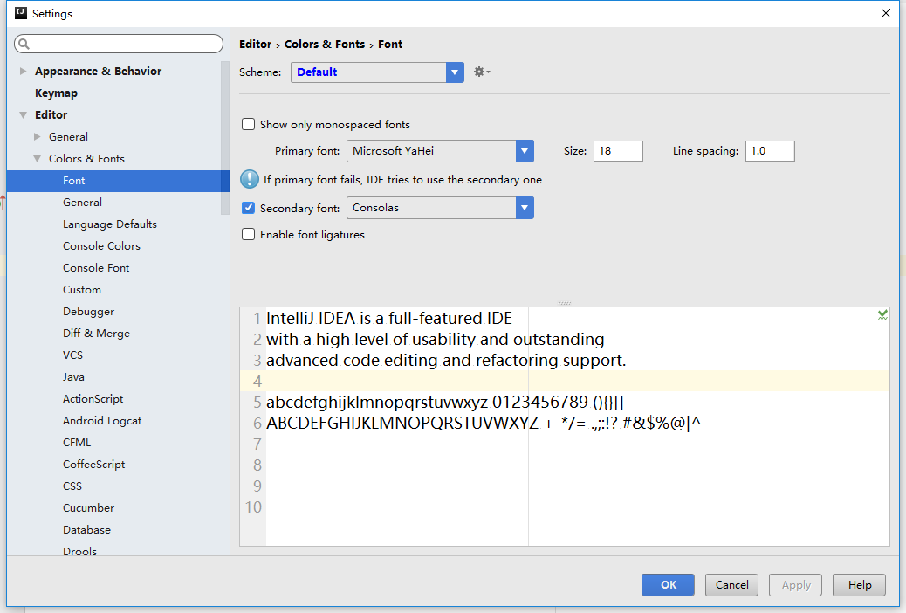

- File->Settings->Editor->Colors & Fonts->Font

### 控制台输出字体修改

- File->Settings->Editor->Colors & Fonts->Console Font

## 编辑区主题修改

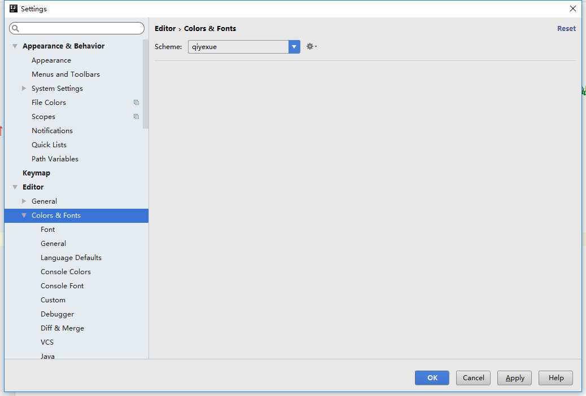

一般也就修改General的一些设置, 也可以直接从网上下载一些主题模板

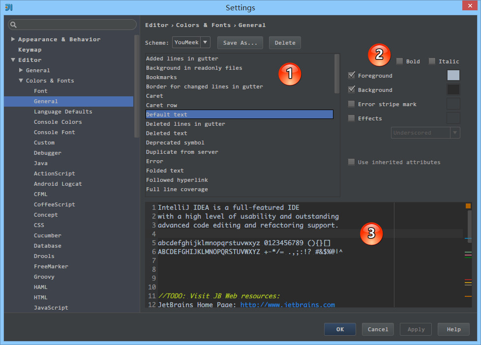

- 上图标注 1 为可修改的通用细节内容

- 上图标注 2 为可修改属性，其中并不是每个细节都可以修改所有属性的。比如细节： Default text 是可
  以勾选 Bold ，而 Caret row 则是无法勾选 Bold ，因为只有文本才有加粗的属性需求

- 上图标注 3 为修改后的预览区，预览区是实时动态展示的

- 在General区，我常修改的有：

  > - Default text ，指的是默认代码文本，我一般会修改其 Background 属性。
  > - Caret row ，指的是光标所在行，我一般会修改其 Background 属性。
  > - Vertical indent guide ，指的是垂直缩进线，我一般会修改其 Foreground 属性。
  > - Identifier under caret ，指的是光标所在位置的相同标识符呈现什么效果，我一般会修改其 Background 属性。
  > - Text search result ，指的是在查找模式下，匹配字符的样式，我一般会修改其 Background 属性。

## 文件编码修改

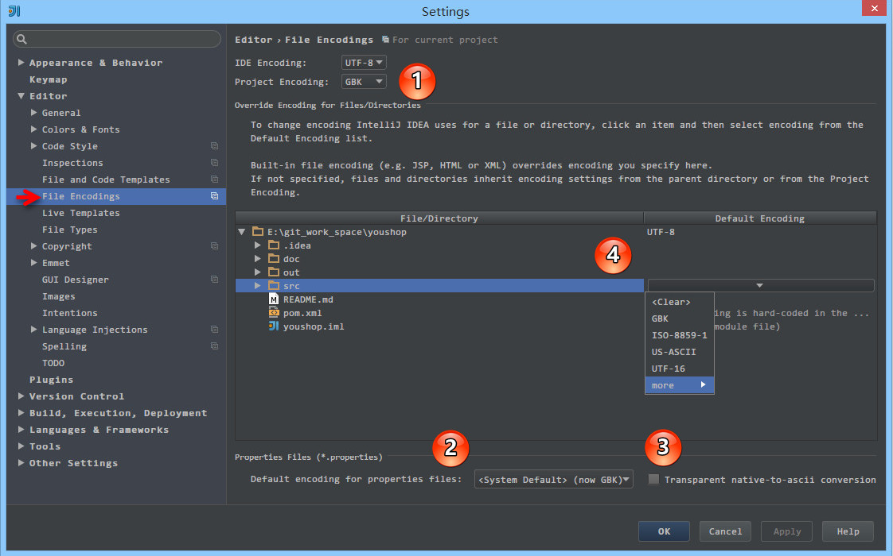

- 上图标注 1 所示，IDE 的编码默认是 UTF-8 ， Project Encoding 虽然默认是 GBK ，建议修改为 UTF-8 。
- 上图标注 2 所示，IntelliJ IDEA 可以对 Properties 文件进行专门的编码设置，建议改为 UTF-8 ，其中有一个重点就是属性 Transparent native-to-ascii conversion ，
- 上图标注 3 所示，对于 Properties 文件，重要属性 Transparent native-to-ascii conversion 主要用于转换 ascii ，一般都要勾选，不然 Properties 文件中的注释显示的都不会是中文。
- 上图标注 4 所示，IntelliJ IDEA 除了支持对整个 Project 设置编码之外，还支持对目录、文件进行编码设置。如果你要对目录进行编码设置的话，可能会出现需要 Convert 编码的弹出操作选择，议 强烈建议 在转换之前做好文件备份，不然可能出现转换过程变成乱码，无法还原。
- 单个文件的编码修改可以在窗口右下角进行修改

### 由于编码问题引起的编译错误

- 编译报错：**找不到符号** 、**未结束的字符串文字** 等的解决办法：

  > - 由于 UTF-8 编码文件有分 有BOM 和 无BOM 之分，默认情况下 IntelliJ IDEA 使用的编译器是 java
  >   c ，而此编译只能编译 无BOM 的文件，有很多 Eclipse 用户在使用 IntelliJ IDEA 开发 Eclipse 项
  >   目的时候常常会遇到此问题。主要是因为 Eclipse 的编译器是 Eclipse ，此编译器支持 有BOM 的文件编译。顾，解决办法是对于此文件进行 BOM 去除。
  > - 批量去除 BOM，可以上网查询： **批量去除 BOM** 、 **批量转换无 BOM** 等关键字，网络上已有提供各种方案
  > - 除了通过去除 BOM 还有设置 IntelliJ IDEA 的编译器为 Eclipse ，但是一般不建议这样做
  > - 如果上述问题都无法解决，而且你也确认 IntelliJ IDEA 各个配置编码的地方都是 UTF-8 ，报错文件编
  >   码也是是 UTF-8 无 BOM 的话，那还有一种可能也会出现这种情况：项目配置文件有问题。项目编码的配置文件在： /项目目录/.idea/encodings.xml 。如果你会修改此文件可以进行修改，如果不会，那就删除掉 .idea 整个目录，重启 IntelliJ IDEA 重新配置这个项目即可。

# 常见文件类型的图标介绍

## Java 类相关图标介绍

- 官网地址 : http://www.jetbrains.com/idea/webhelp/symbols.html
- Source root ，你可以理解为源目录，源码的作用就是用来专门放 Java 类文件，相对于编译出来的 cla
  ss 文件而言，它就是源。我们一般默认名字叫 src 的目录就是源目录，但是其实并不是这样的，在 In
  telliJ IDEA 中，即使叫 srcs 也是可以设置为 Source root ，所以源目录跟目录命名是没有关系
  的，而是在于 IntelliJ IDEA 支持对任意目录进行设置为 Source root ，具体设置在会后面章节进行详
  解。 Source root 的作用是标记该目录下的文件是可编译的。
- Java class located out of the source root ，由于上一条我们知道 Source root 目录是用来告诉 Int
  elliJ IDEA 这是编译目录，而假如你 Java 类文件没有放在该目录或是该目录的子包下，那该 Java 类
  则无法编译，就会被表示成这个图标。

##  各类文件类型图标介绍

- 官网地址 : http://www.jetbrains.com/idea/webhelp/file-types-recognized-by-intellij-idea.html

- JavaScript 两种图标介绍:

  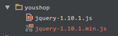

- 如上图所示，对于压缩过的 JavaScript 文件，图标会有 010 图案。

# IntelliJ IDEA 缓存和索引介绍和清理方法

- IntelliJ IDEA 已经自带提供清除缓存、索引的路口 : File -> Invalidate Caches / Restart
- 清除索引和缓存会使得 IntelliJ IDEA 的 Local History 丢失，所以如果你项目没有加入到版本控制，而你又需要你项目文件的历史更改记录，那你最好备份下你的 LocalHistory目录, 目录地址在：system/LocalHistory
- 通过上面方式清除缓存、索引本质也就是去删除system 目录下的对应的文件而已，所以如果你不用上述方法也可以删除整个 system 。当 IntelliJ IDEA 再次启动项目的时候会重新创建新的 system 目录以及对应项目缓存和索引
- 如果你遇到了因为索引、缓存坏了以至于项目打不开，建议也可以直接删除 system 目录，一般这样都可以很好地解决问题
- system文件较大, 如果C盘空间不足的情况下, 建议转移到其他盘

# IntelliJ IDEA 编译方式介绍

如下图所示, Idea默认不自动编译, 需要进行手动编译 :

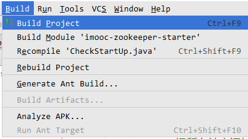

## 编译器的设置和选择

- **路径 :** File->Settings->Build...->Compiler

- **设置自动编译 :** Compiler界面勾选Build project automatically

- **设置编译时heap大小 :** Compiler界面的Build process heap size

- **设置编译排除 :** Compiler->Excludes, 可以设置添加文件或者目录进行编译排除

- **Java类编译 :** Compiler->Java Compiler支持几种常见的编译器 Javac 、Eclipse 、 Ajc 等, 默认是javac

- **设置Jdk版本 :** Compiler->Java Compiler

  > - Project bytecode version 针对项目字节码编译版本，一般选择的是当前项目主 JDK 的版本
  > - Per-module bytecode version 可以针对 Project 下各个 Module 的特殊需求单独设置不同的 bytecode version ，前提是电脑上必须有安装对应的 JDK 版本。

# IntelliJ IDEA项目相关概念

## 必备材料介绍

IntelliJ IDEA 针对其他 IDE 转过来的用户，专门整理了一些资料 :

- Eclipse 用户可以看：https://www.jetbrains.com/idea/help/eclipse.html
- NetBeans 用户可以看：https://www.jetbrains.com/idea/help/netbeans.html

## Project 和 Module 介绍

- 在 IntelliJ IDEA 中 Project 是最顶级的级别，次级别是 Module。一个 Project可以有多个 Module。目前主流的大型项目结构都是类似这种多 Module 结构

> 一个 Project 是由一个或多个 Module 组成，模块之间尽量是处在同一个项目业务的的情况下，彼此之间互相依赖关联。这里用的是 尽量 ，因为 IntelliJ IDEA 的 Project 是一个没有具备任何编码设置、构建等开发功能的，主要起到一个项目定义、范围约束、规范等类型的效果，也许我们可以简单地理解为就是一个单纯的目录，只是这个目录命名上必须有其代表性的意义。

## SDK（Software Development Kit）介绍

- Ctrl + Shift + Alt + S 弹出项目结构设置区
- 界面上很容易进行jdk的设置,  支持多个jdk版本快速切换
- 官网介绍：https://www.jetbrains.com/idea/help/sdk.html

## language level 介绍

- 限定项目编译检查时最低要求的 JDK 特性。

## Module 下的 SDK 和 language level

- 对于大型项目，各个 Module 用到的 SDK 和 language level 很有可能是各不一样的，IntelliJ IDEA 对此也
  进行了支持
- Ctrl + Shift + Alt + S弹出项目设置区, 选择右侧Project Settings -> Modules

# 实时代码模板的使用

- File->Settings->Editor->Live Templates
- 官网介绍 Live Templates ：https://www.jetbrains.com/idea/help/live-templates.html

- 调用常规的实时代码模板主要是通过两个快捷键： Tab 和 Ctrl + J

# 文件代码模板的使用

- File->Settings->Editor->File and Code Templates

# Emmet的使用

- IntelliJ IDEA 自带 Emmet 功能，使用的快捷键是 Tab 。

- **Emmet资料介绍：**

  > - Emmet 官网：http://emmet.io
  >
  > - Emmet 官网文档：http://docs.emmet.io/
  >
  > - Emmet 速查表：http://docs.emmet.io/cheat-sheet/
  >
  > - Emmet 项目主页：https://github.com/emmetio/emmet

# Postfix Completion 的介绍

- Postfix Completion 功能本质上也是代码模板，只是它比 Live Templates 来得更加便捷一点点而已
- File->Settings->Editor->General->Postfix Completion

# 插件的使用

在 IntelliJ IDEA 的安装讲解中我们其实已经知道，IntelliJ IDEA 本身很多功能也都是通过插件的方式来实现
的，只是 IntelliJ IDEA 本身就是它自己的插件平台最大的开发者而已，开发了很多优秀的插件

- 官网插件库：https://plugins.jetbrains.com/
- File->Settings->Plugins

## 插件推荐

| 插件名称                       | 插件介绍                                                     | 官网地址                                                     |
| ------------------------------ | ------------------------------------------------------------ | ------------------------------------------------------------ |
| Gitee                          | 开源中国的码云插件                                           | <https://plugins.jetbrains.com/plugin/8383-gitee>            |
| Alibaba Java Coding Guidelines | 阿里巴巴出的代码规范检查插件                                 | <https://plugins.jetbrains.com/plugin/10046-alibaba-java-coding-guidelines> |
| 360 FireLine Plugin            | 360 的代码静态分析工具                                       | <https://plugins.jetbrains.com/plugin/9292-360-fireline-plugin> |
| IDE Features Trainer           | IntelliJ IDEA 官方出的学习辅助插件                           | <https://plugins.jetbrains.com/plugin/8554?pr=idea>          |
| Key promoter                   | 快捷键提示                                                   | <https://plugins.jetbrains.com/plugin/4455?pr=idea>          |
| Grep Console                   | 自定义设置控制台输出颜色                                     | <https://plugins.jetbrains.com/idea/plugin/7125-grep-console> |
| String Manipulation            | 驼峰式命名和下划线命名交替变化                               | <https://plugins.jetbrains.com/plugin/2162?pr=idea>          |
| CheckStyle-IDEA                | 代码规范检查                                                 | <https://plugins.jetbrains.com/plugin/1065?pr=idea>          |
| FindBugs-IDEA                  | 潜在 Bug 检查                                                | <https://plugins.jetbrains.com/plugin/3847?pr=idea>          |
| MetricsReloaded                | 代码复杂度检查                                               | <https://plugins.jetbrains.com/plugin/93?pr=idea>            |
| Statistic                      | 代码统计                                                     | <https://plugins.jetbrains.com/plugin/4509?pr=idea>          |
| JRebel Plugin                  | 热部署                                                       | <https://plugins.jetbrains.com/plugin/?id=4441>              |
| CodeGlance                     | 在编辑代码最右侧，显示一块代码小地图                         | <https://plugins.jetbrains.com/plugin/7275?pr=idea>          |
| GsonFormat                     | 把 JSON 字符串直接实例化成类                                 | <https://plugins.jetbrains.com/plugin/7654?pr=idea>          |
| Markdown Navigator             | 书写 Markdown 文章                                           | <https://plugins.jetbrains.com/plugin/7896?pr=idea>          |
| Eclipse Code Formatter         | 使用 Eclipse 的代码格式化风格，在一个团队中如果公司有规定格式化风格，这个可以使用。 | <https://plugins.jetbrains.com/plugin/6546?pr=idea>          |
| Jindent-Source Code Formatter  | 自定义类、方法、doc、变量注释模板                            | <http://plugins.jetbrains.com/plugin/2170?pr=idea>           |
| Translation                    | 翻译插件                                                     | <https://github.com/YiiGuxing/TranslationPlugin>             |
| Maven Helper                   | Maven 辅助插件                                               | <https://plugins.jetbrains.com/plugin/7179-maven-helper>     |
| Properties to YAML Converter   | 把 Properties 的配置格式改为 YAML 格式                       | <https://plugins.jetbrains.com/plugin/8000-properties-to-yaml-converter> |
| Git Flow Integration           | Git Flow 的图形界面操作                                      | <https://plugins.jetbrains.com/plugin/7315-git-flow-integration> |
| Rainbow Brackets               | 对各个对称括号进行着色，方便查看                             | <https://github.com/izhangzhihao/intellij-rainbow-brackets>  |
| MybatisX                       | mybatis 框架辅助（免费）                                     | <https://plugins.jetbrains.com/plugin/10119-mybatisx>        |
| Lombok Plugin                  | Lombok 功能辅助插件                                          | <https://plugins.jetbrains.com/plugin/6317-lombok-plugin>    |
| .ignore                        | 各类版本控制忽略文件生成工具                                 | <https://plugins.jetbrains.com/plugin/7495--ignore>          |
| mongo4idea                     | mongo客户端                                                  | <https://github.com/dboissier/mongo4idea>                    |
| iedis                          | redis客户端                                                  | <https://plugins.jetbrains.com/plugin/9228-iedis>            |
| VisualVM Launcher              | 项目启动的时候也启动 VisualVM                                | <https://plugins.jetbrains.com/plugin/7115-visualvm-launcher> |
| GenerateAllSetter              | new POJO类的快速生成 set 方法                                | <https://plugins.jetbrains.com/plugin/9360-generateallsetter> |

# Debug 介绍

## Debug 常用快捷键

| 快捷键            | 介绍                                                         |
| ----------------- | :----------------------------------------------------------- |
| F7                | 在 Debug 模式下，进入下一步，如果当前行断点是一个方法，则进入当前方法体内，如果该方法体还有方法，则不会进入该内嵌的方法中 `必备` |
| F8                | 在 Debug 模式下，进入下一步，如果当前行断点是一个方法，则不进入当前方法体内 `必备` |
| F9                | 在 Debug 模式下，恢复程序运行，但是如果该断点下面代码还有断点则停在下一个断点上 `必备` |
| Alt + F8          | 在 Debug 的状态下，选中对象，弹出可输入计算表达式调试框，查看该输入内容的调试结果 `必备` |
| Ctrl + F8         | 在 Debug 模式下，设置光标当前行为断点，如果当前已经是断点则去掉断点 |
| Shift + F7        | 在 Debug 模式下，智能步入。断点所在行上有多个方法调用，会弹出进入哪个方法 |
| Shift + F8        | 在 Debug 模式下，跳出，表现出来的效果跟 `F9` 一样            |
| Ctrl + Shift + F8 | 在 Debug 模式下，指定断点进入条件                            |
| Alt + Shift + F7  | 在 Debug 模式下，进入下一步，如果当前行断点是一个方法，则进入当前方法体内，如果方法体还有方法，则会进入该内嵌的方法中，依此循环进入 |
| Drop Frame        | 这个不是一个快捷键，而是一个 Debug 面板上的按钮。该按钮可以用来退回到当前停住的断点的上一层方法上，可以让过掉的断点重新来过 |

