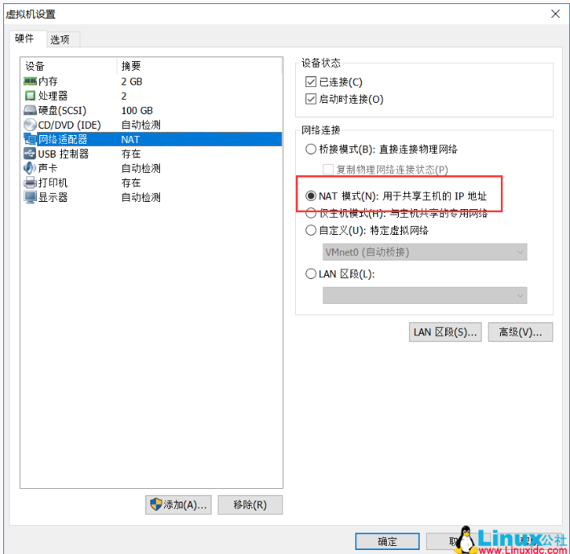
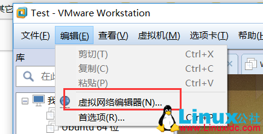
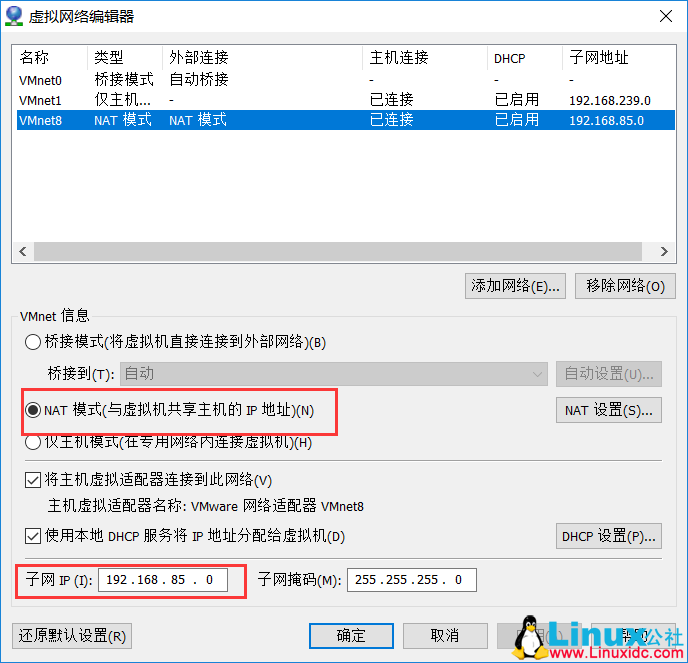
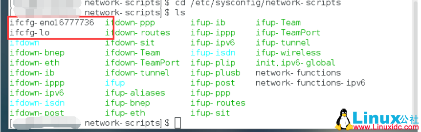

# 虚拟机设置




这里我使用的NAT模式,接着配置虚拟机的虚拟网络:



这里主要看一下VMnet8的设置:



# Linux设置

1. 这里首先是进入**/etc/sysconfig/network-scripts**中查看现有的配置文件:

   cd /etc/sysconfig/network-scripts

2. 通过ls查看文件看到该文件目录下的文件:

   

这里需要使用的配置文件是:**ifcfg-eno16777736**,每个人的可能不一样,切换root权限,通过vim进到里面,可以看到里面的内容:

```properties
TYPE=Ethernet
BOOTPROTO=dhcp
DEFROUTE=yes
PEERDNS=yes
PEERROUTES=yes
IPV4_FAILURE_FATAL=no
IPV6INIT=yes
IPV6_AUTOCONF=yes
IPV6_DEFROUTE=yes
IPV6_PEERDNS=yes
IPV6_PEERROUTES=yes
IPV6_FAILURE_FATAL=no
NAME=eno16777736
UUID=ae05ccde-6a29-4332-b486-f3042da73ac0
DEVICE=eno16777736
ONBOOT=no
```

**需要修改的配置:**

```properties
#修改
BOOTPROTO=static #这里讲dhcp换成ststic
ONBOOT=yes #将no换成yes
#新增
IPADDR=192.168.85.100 #静态IP
GATEWAY=192.168.85.2 #默认网关
NETMASK=255.255.255.0 #子网掩码

# 添加DNS配置, 按本机实际DNS进行配置, 不然无法连接外网
DNS1=8.8.8.8
DNS2=8.8.8.8

保存退出后,重启网络服务:

# service network restart
```

