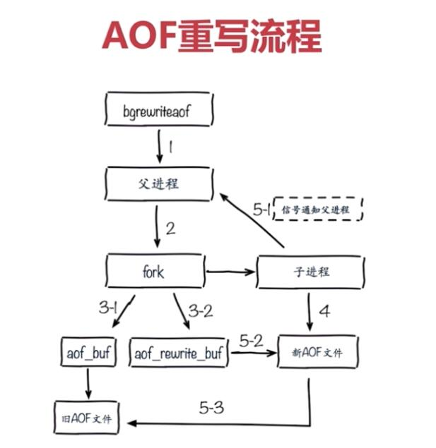
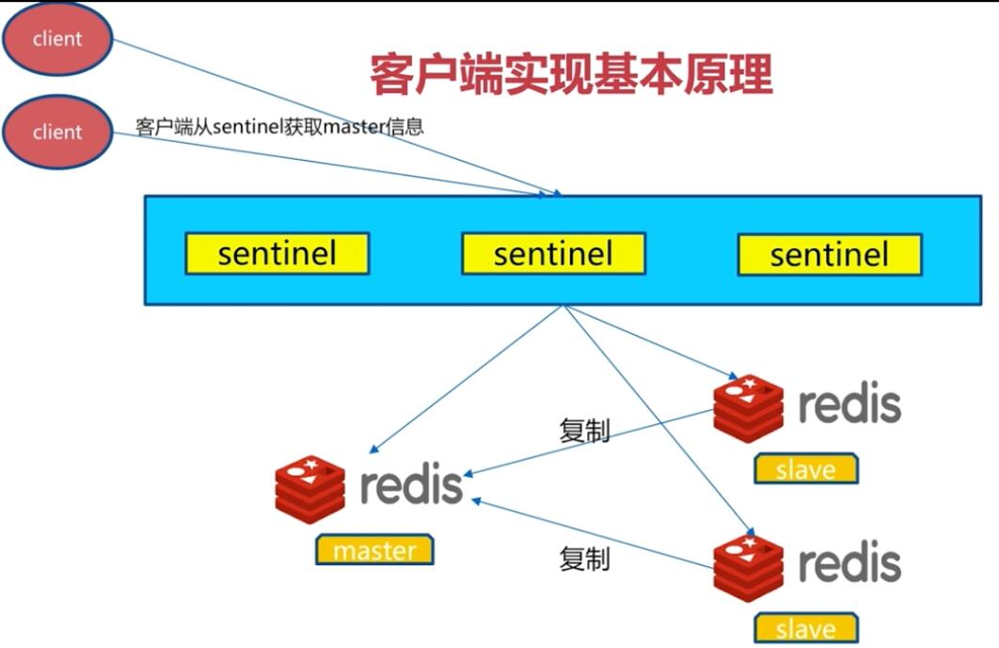
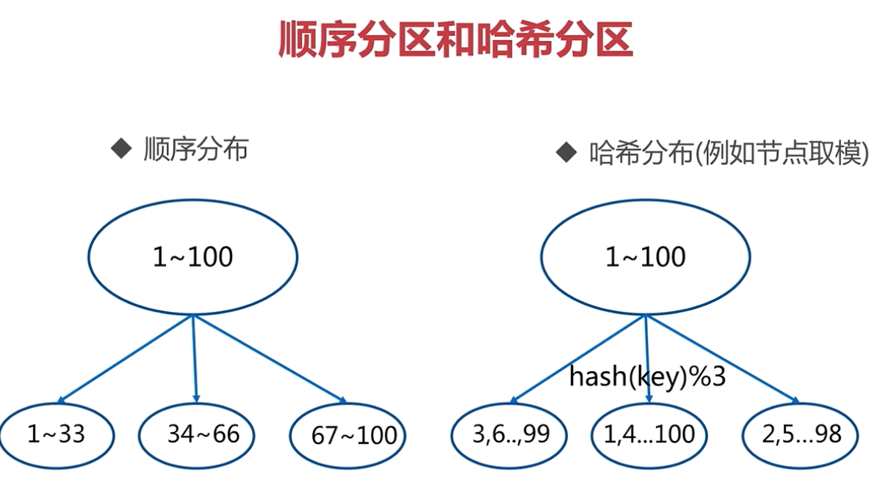
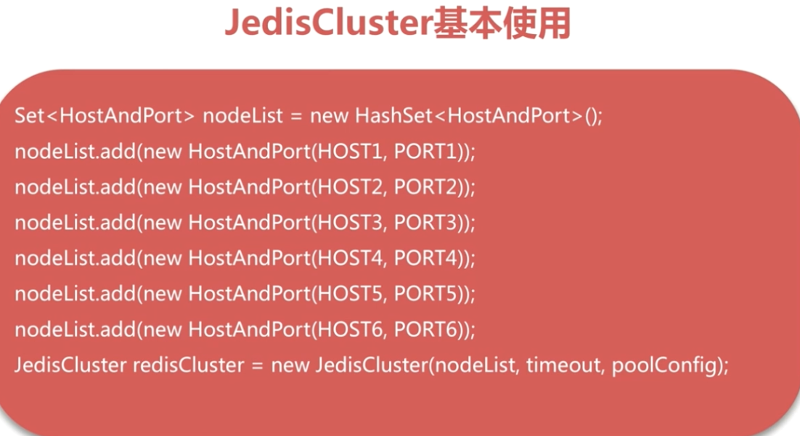

# Redis简介

- 开源
- 高性能Key-Value服务器
- 多种数据结构
- 丰富的功能
- 高可用分布式支持

# Redis特性

- 速度快-内存
- 持久化-异步保存到磁盘中
- 多种数据结构
  - 字符串
  - Hash Table
  - Linked Lists
  - Sets
  - Sorted Sets
  - BitMaps: 位图
  - HyperLogLog: 超小内存唯一值计数
  - GEO: 地理信息定位
- 支持多种编辑语言
- 功能丰富
  - 发布订阅
  - Lua脚本
  - 事务
  - pipeline
- 简单
- 主从复制
- 高可用,分布式
- 单线程

# Redis典型使用场景

- 缓存系统
- 计数器
- 消息队列系统
- 排行榜
- 社交网络
- 实时系统

# Redis安装

##安装

- wget http://download.redis.io/releases/redis-4.0.1.tar.gz

- tar -zxvf redis-4.0.1.tar.gz

- 通过make命令，如果编译的时候报gcc命令找不到的话，可以通过下面的命令安装gcc命令，gcc是c的编译命令

  - yum install gcc-c++

- make命令执行完成之后,会在src目录下生成几个文件

  ```Linux
  -rw-r--r--. 1 root root   15024 8月  21 17:39 siphash.o
  -rw-r--r--. 1 root root   89536 8月  21 17:39 rax.o
  -rwxr-xr-x. 1 root root 8309691 8月  21 17:39 redis-server
  -rwxr-xr-x. 1 root root 8309691 8月  21 17:39 redis-sentinel
  -rw-r--r--. 1 root root  225992 8月  21 17:39 redis-cli.o
  -rwxr-xr-x. 1 root root 5730486 8月  21 17:39 redis-cli
  -rw-r--r--. 1 root root   70248 8月  21 17:39 redis-benchmark.o
  -rwxr-xr-x. 1 root root 5599526 8月  21 17:39 redis-benchmark
  -rwxr-xr-x. 1 root root 8309691 8月  21 17:39 redis-check-rdb
  -rwxr-xr-x. 1 root root 8309691 8月  21 17:39 redis-check-aof
  ```

- 将上面几个文件加入到/usr/local/bin目录下,在src目录下执行make install

### 文件介绍

- redis-server : Redis服务器
- redis-cli : Redis客户端
- Redis-benchmark : Redis性能测试工具
- redis-check-aof : AOF文件修复工具
- redis-check-rdb : RDB文件修复工具
- redis-sentinel : Sentinel服务器(2.8以后)

## 启动方式

###最简启动

> 直接指向redis-server

### 动态参数启动

> redis-server --port 6380

###配置文件启动

> redis-server configPath

生产环境建议使用配置文件启动

## 客户端连接

> redis-cli -h ip地址 -p 6379

# Redis常用配置

- daemonize : 是否是守护进程(no|yes),默认是no
- port : Redis对外端口号
- logfile : Redis系统日志 
- dir : Redis工作目录

#Redis API使用和理解

##Redis通用命令

- keys : 遍历所有key
  - 格式 : keys 通配符, keys *查出所有key
  - keys命令一般不在生产环境使用
  - 时间复杂度O(n)
- dbsize : 计算key的总数
  - 时间复杂度O(1)
- exists key : 检查key是否存在
  - 时间复杂度O(1)
- del key  : 删除指定key-value
  - 时间复杂度O(1)
- expire key seconds : key在seconds秒之后过期
  - 时间复杂度O(1)
- ttl key : 查看key剩余的过期时间
  - -1 : 代表key存在,并且没有过期时间
  - -2 : 代表key已过期,或不存在多的key
- persist key : 去掉key的过期时间
  - 时间复杂度O(1)
- type key : 返回key的类型
  -  string
  - hash
  - list
  - set
  - zset
  - none : 不存在的key
  - 时间复杂度O(1)

## Redis单线程

Redis单线程为什么会快

1. 纯内存
2. 非阻塞IO
3. 避免线程切换和竞态消耗

需要注意内容:

- 一次只运行一条命令
- 拒绝长(慢)命令

## 数据结构

### 字符串

#### 场景

- 缓存
- 分布式锁
- 计数器
- ...

#### 常用命令

- get key : 获取key对应的value
- set key value : 设置key-value,
  - set key value : 不管key存不存在都进行设置
  - setnx key value : key不存在,才设置
  - set key value xx : key存在,才设置
- del key : 删除key-value
- incr key : key自增1,如果key不存在,自增后get(key)=1,仅用于整数
- decr key : key自减1,如果key不存在,自减后get(key)=-1,仅用于整数
- incrby key k : key自增k,如果key不存在,自增后get(key)=k,仅用于整数
- decrby key k : key自减1,如果key不存在,自减后get(key)=-k,仅用于整数
- mget key1 key2 key3... : 批量获取key,原子操作
- mset key1 value1 key2 value2... :  批量设置key-value

####其他命令

- getset key newvalue : set key newvalue并返回旧的value
- append  key value : 将value追加到旧的value
- strlen key : 返回字符串长度(注意中文)
- incrbyfloat key 3.5 : 增加key对应的值3.5,自减传负值实现
- getrange key start end : 获取字符串指定下标所有的值
- setrange key index value : 设置指定下标所有对应的值

 ### 哈希(hash)

#### 特点

> key field-value
>
> key-value, value是个map

### 常用命令

- hget key field : 获取hash key对应的field的value
- hset key field value(可多个) : 设置hash key对应的field的value
- hsetnx key field value : 设置hash key对应field的value(如field已经存在,则失败)
- hdel key field : 删除hash key对应的field的value
- hexists key field : 判断hash key是否有field
- hlen key 获取hash key field的数量
- hmget key field1 field2...fieldn : 批量获取hash key的一批field对应的值
- hmset key field1 value1 field2 value2...fieldn valuen : 批量设置hash key的一批field value
- hincrby key field intCounter : hash key对应的field的value自增intCounter
- hincrbyfloat key field floatCounter : hincrby浮点数版本
- hgetall key : 返还hash key对应所有的field和value
- hvals key : 返回hash key对应所有field的value
- hkeys key : 返回hash key对应所有的field

###列表

 #### 特点

- 有序
- 可重复
- 左右两边进行弹出

#### 常用命令

- rpush key value1 value2...valueN : 从列表右端插入值(1-N个)
- lpush key value1 value2...valueN : 从列表左端插入值(1-N个)
- linsert key before|after value newValue : 在list指定的值前|后插入newValue
- lpop key : 从列表左侧弹出一个item
- rpop key : 从列表右侧弹出一个item
- lrem key count value
  - 根据count值,从列表中删除所有value相等的项
    - count>0,从左到右,删除最多count个value相等的项
    - count<0,从右到左,删除最多Math.abs(count)个value相等的项
    - count=0,删除所有与value相等的项
- ltrim key start end : 按照索引范围修剪列表
- lrange key start end(包含end) : 获取指定列表索引范围所有item
- lindex key index : 获取列表指定索引的item
- llen key : 获取列表长度
- lset key index newValue : 设置列表指定索引值为newValue

#### 其他命令

- blpop key timeout : lpop的阻塞版本,timeout是阻塞超时时间,timeout=0位永远不阻塞
- brpop key timeout : rpop的阻塞版本,timeout是阻塞超时时间,timeout=0位永远不阻塞

#### Tips

- lpush + lpop = Stack
- lpush + rpop = Queue
- lpush + ltrim = Capped Collection
- lpush + brpop = Message Queue

 ### 集合(Set)

#### 特点

- 无序
- 不重复
- 支持集合间操作

#### 常用命令

- sadd key element(可多个) : 向集合key添加element(如果element已经存在,添加失败)
- srem key element(可多个) : 将集合key中的element移除掉
- scard key : 计算集合大小
- sismembber key  item :  判读item是否在key对应的集合中
- srandmember key count : 从集合中随机挑选count个元素
  - 不会破坏集合
- spop key : 从集合中随机弹出一个元素
  - 从集合中弹出,弹出之后集合中该元素就被删除了
- smembers key : 获取集合所有元素
  - 集合元素数量较多的时候 慎用
- sdiff key1 key2 : 差集,key1中存在,key2中不存在的元素,以key1中元素为主
- sinter key1 key2 : 交集
- sunion key1 key2 : 并集
- sdiff |sinter |sunion + store destkey : 将差集|交集 | 并集结果保存到destkey中
  - sdiffstore destkey key1 key2
  - sinter store destkey key1 key2
  - sunionstore destkey key1 key2

#### Tips

- sadd = Tagging
- spop/srandmember = Random item
- sadd + sinter = Social Graph

### 有序集合(zset)

#### 特点

- 无重复元素
- key value score

#### 常用命令

- zadd key score element(可以是多对) : 添加score 和element
- zrem key element(可以多个) : 删除元素
- zscore key element : 返回元素的分数
- zincrby key incrScore element : 增加或减少元素的分数
- zcard key : 返回集合元素总个数
- zrank key element : 获取元素element的排名
- zrange key start end : 返回指定索引范围内的升序元素(分值)
- zrangebyscore key minScore maxScore : 返回指定分数范围内的升序元素(分值)
- zcount key minScore maxScore : 返回有序集合内在指定分数范围内的个数
- zremrangebyrank key start end : 删除指定排名内的升序元素
- zremrangebyscore key minScore maxScore : 删除指定分数内的升序元素

## Redis客户端

### Java客户端 : Jedis

- 直连方式使用

```java
	@Test
	public void testJedis(){
		Jedis jedis = new Jedis("192.168.72.129", 6379);
		System.out.println(jedis.ping()) ;
		jedis.set("hello", "world");
		System.out.println(jedis.get("hello")) ;
		jedis.close();
	}
```

- 连接池方式使用

```java
	@Test
	public void testJedisPool(){
		JedisPool pool = new JedisPool("192.168.72.129", 6379);
		Jedis jedis = null;
		try {
			jedis = pool.getResource();
			jedis.lpush("tlist", "aaa", "bbb");
			System.out.println(jedis.lrange("tlist", 0, -1)) ;
		} catch (Exception e) {
			e.printStackTrace();
		} finally {
			if (jedis != null) {
				jedis.close();
			}
		}
	}
```

# Redis其他功能

## 慢查询

**生命周期**

- 发送命令
- 排队
- 执行命令
- 返回结果

在"执行命令"阶段较慢的才是慢查询

### 相关配置

**特点:**

- 保存在一个先进先出队列中
- 固定长度
- 保存在内存中

> slowlog-max-len : 慢查询队列长度
>
> slowlog-log-slower-than : 慢查询阈值(单位 : 微秒)
>
> > 0 记录所有命令
> >
> >  <0 不记录任何命令

#### 配置方法

- 默认值
  - config get slowlog-max-len = 128
  - config get slowlog-log-slower-than = 10000
- 修改配置文件重启--不建议使用,仅初次启动redis时使用
- 动态配置
  - config set slowlog-max-len = 1000
  - config set slowlog-log-slower-than = 1000

#### 相关命令

- showlog get n : 获取慢查询队列,n表示获取n条记录
- showlog len : 获取慢查询队列长度
- showlog reset : 清空慢查询队列

#### Tips

- slowlog-log-slower-than不要设置过大,默认10ms,通常设置1ms
- slowlog-max-len不要设置过小,默认128,通常设置1000左右
- 理解redis命令执行的生命周期
- 定期持久化慢查询

## 流水线(pipeline)

将多次命令打包统一传输到redis上去执行,主要是因为对redis进行操作时,redis本身执行速度是很快的,在复杂的网络环境中,通常大量的时间消耗在了网络传输中,pipeline就是通过将多个命令打包的方式,减少了网络传输次数

### 使用建议

- 注意每次pipeline携带数据量
- pipeline每次只能作用在一个Redis节点上
- M操作与pipeline区别

## 发布订阅

### 角色

- 发布者(publisher)
- 订阅者(subscriber)
- 频道(channel)

### 命令

- publish channel message : 向channel频道发布消息,返回该频道的订阅者个数
-  subscribe channel : 订阅一个或多个频道
- unsubscribe channel : 取消订阅
- psubscribe [pattern] : 可以按照模式订阅
- punsubscribe [pattern] : 可以按照模式退订

## 位图(Bitmap)

 ### 命令

- setbit key offset value : 给位图指定索引设置值,offset偏移量之前未设置的位会补0
- getbit key offset value : 获取位图指定索引的值
- bitcount key [start end] : 获取位图指定范围位值为1的个数(start-end,单位:字节,如果不指定就是获取全部)
- bittop and(交集) | or(并集) | not(非) | xor(异或) destkey [key...] : 做多个Bitmap的and,or,not,xor操作并将结果保存到destkey中
- bitpos key targetBit start end : 计算位图指定范围(start-end,单位字节,不指定获取全部),第一个偏移量的对应的值等于targetBit的位置

### 简单使用

- 独立用户统计

### Tips

- type=string,最大512MB
- 注意setbit时的偏移量,可能有较大耗时

## HyperLogLog

本质还是string

### 命令

- pfadd key element... : 向hyperloglog添加元素,可多个
- pfcount key ...  : 计算hyperloglog的独立总数
- pfmerge destkey sourcekey ... : 合并多个hyperlloglog  

### Tips

- 有错误率(0.81%)
- 无法取出单条数据

## 地理信息定位(GEO)

用于存储经纬度,计算两地距离,范围计算等

### 命令

- geoadd key longitude latitude member : 增加地理位置信息
- geopos key member... :获取地理位置信息
- geodist key member1 member2 [unit] : 获取两个地理位置的距离
  - unit : m(米),  km(千米), mi(英里), ft(尺)
- georadius : 获取指定位置内地理位置信息集合


### Tips

- since 3.2+
- type GeoKey = zset,GEO是使用zset实现的
- 没有删除API : 可以使用zset的命令对GEO进行删除操作

# Redis持久化的取舍和选择

## 持久化的作用

- 什么是持久化

> Redis的数据都保存在内存中,将对数据的更改异步保存到磁盘中,称之为持久化

- 持久化方式
  - 快照
    - MySQL Dump
    - Redis RDB
  - 写日志
    - MySQL Binlog
    - Hbase HLog
    - Redis AOF

## Redis的持久化方式

### RDB

#### 什么是RDB

> 将Redis中数据,以快照方式生成一个二进制的RDB文件存储到硬盘中,重启时可以从RDB文件中恢复数据

#### 触发机制

##### save(同步) 

- 执行一条save命令,就会生成一个RDB文件

- 阻塞
- 如存在老的RDB文件,会替换

##### bgsave(异步) 

- 执行bgsave命令
- fork()一个子进程在后台去创建RDB文件
- 返回成功

**具体执行流程如下图:**


**save与bgsave对比:**


##### 自动生成RDB

**相关配置:** 

- save 900 1 : 900秒内有一条记录更新就自动生成RDB文件
- save 30010 : 300秒内有10条记录更新就自动生成RDB文件
- save 60 10000 : 60秒内有10000条记录更新就自动生成RDB文件
- dbfilename dump.rdb : 配置RDB文件名
- dir ./ : 配置RDB文件存放路径
- stop-writes-on-bgsave-error yes : 如果bgsave出现错误,是否停止写入,一般都配置为yes
- rdbcompression yes : RDB文件是否采用压缩格式,默认yes
- rdbchecksum yes : 是否对RDB文件进行校验

**最佳配置:**

- 不使用自动生成RDB策略
- dbfilename dump--${port}.rdb : RDB文件最好以端口号区分
- dir /bigdiskpath : RDB文件存放路径配置一个专门的存放路径
- stop-writes-on-bgsave-error yes : 如果出现错误,就停止写入
- rdbcompression yes : 使用压缩方式

##### 触发机制-不容忽略的方式

- 全量复制
- debug reload : 不需要清空内存的重启
- shutdown

#### RDB缺点

- 耗时,耗性能
  - O(n)数据 : 耗时
  - fork() : 消耗内存,copy-on-write策略
  - Disk I/O : IO性能
- 不可控,丢失数据

#### RDB总结

- RDB是Redis内存到硬盘的快照,用于持久化
- save通常会阻塞Redis
- bgsave不会阻塞Redis,但会fork新进程
- save自动配置满足任意一个条件就会被执行
- 有些不容忽视的触发机制

### AOF

#### AOF简介

> 将执行命令记录到日志文件中,重启时从日志文件中根据执行命令进行数据恢复

#### AOF的三种策略

##### always

> 每条命令都写到AOF文件中

##### everysec

> 每秒钟将命令写到AOF文件中,可能会丢失一秒的数据,默认配置

##### no

> 操作系统自行决定命令写入AOF文件中时机

##### 三种策略对比


#### AOF重写

- 对于能够合成的命令会将多条命令重写成一条
- 删除过期数据


##### AOF重写作用

- 减少硬盘占用量
- 加速数据恢复速度

##### AOF重写的实现方式

- 执行bgrewriteaof命令

  

  **此处AOF重写,是根据Redis中数据生成一个AOF命令,并不是真的将执行的命令一条条写入到AOF文件中**

- 通过配置触发AOF重写

  - auto-aof-rewrite-min-size : AOF文件重写需要的尺寸
  - auto-aof-rewrite-percentage : AOF文件增长率
  - aof_current_size : AOF当前尺寸(单位: 字节)
  - aof_base_size : AOF上次启动和重写的尺寸(单位: 字节)

##### AOF重写流程



#### AOF相关配置

- appendonly yes : 打开AOF

- appendfilename "appendonly-${port}.aof" : 配置AOF文件名
- appendfsync everysec :  配置AOF策略,这里是每秒同步
- dir /bigdiskpath : AOF文件保存路径
- no-appendfsync-on-rewrite yes : AOF重写期间是否允许追加数据,yes不允许
- auto-aof-rewrite-percentage 100 : AOF重写配置,增长率
- auto-aof-rewrite-min-size  64mb : AOF重写需要的AOF文件的最小尺寸

### RDB和AOF抉择

#### RDB与AOF对比


#### RDB最佳策略

- "关"掉RDB
- 集中管理
- 主从,从开

#### AOF最佳策略

- "开" : 缓存和存储
- AOF重写集中管理
- 使用everysec策略

#### 最佳策略

- 小分片
- 缓存或者存储
- 监控
- 足够的内存

## 开发运维常见问题

### fork操作

- 同步操作
- 与内存量息息相关 : 内存越大,耗时越长
- info : latest_fork_usec,上一次执行fork操作消耗的微秒数

### 改善fork

- 优先使用物理机或者高效支持fork操作的虚拟化技术
- 控制Redis实例最大可用内存
- 合理配置Linux内存分配策略 : vm.overcommit_memory=1
- 降低fork频率 : 如放宽AOF重写自动触发时机,不必要的全量复制

### 子进程开销和优化

1. CPU
   - 开销 : RDB和AOF文件生成属于CPU密集型
   - 优化 : 不做CPU绑定,不和CPU密集型应用部署在一起
2. 内存
   - 开销 : fork内存开销, copy-on-write
   - 优化 : 
3. 硬盘
   - 开销 : AOF和RDB文件写入, 可以结合iostat,iotop分析
   - 硬盘优化
     - 不要和高硬盘负载服务部署在一起,如存储服务,消息队列等
     - no-appendfsync-on-rewrite = yes
     - 根据写入量决定磁盘类型 : 如ssd
     - 单机多实例持久化文件目录可以考虑分盘

### AOF追加阻塞


# Redis复制的原理与优化

## Redis单机问题

- 机器故障
- 容量瓶颈
- QPS瓶颈

## 主从复制作用

- 数据副本
- 扩展读性能(读写分离)

## 主从复制限制

- 一个master(主)可以有多个slave(从)
- 一个slave只能有一个master
- 数据流向是单向的,master到slave

## 主从复制配置

### 执行命令

> 主从复制 : 从节点执行slaveof ip port,会清除从节点数据
>
> 取消复制 : 从节点执行 slaveof no one,不会清除从节点数据

### 配置实现

> slaveof ip port : 设置Redis为哪个节点的从节点
>
> slave-read-only yes : 设置从节点只读

### 两种方式对比

| 方式 |    命令    |   配置   |
| :--: | :--------: | :------: |
| 优点 |  无需重启  | 统一配置 |
| 缺点 | 不便于管理 | 需要重启 |

## 全量复制开销

- bgsave时间
- RDB文件网络传输时间
- 从节点清空数据时间
- 从节点加载RDB的时间
- 可能的AOF重写时间

## 部分复制

1. slave丢失链接
2. master将之后数据写入复制积压缓冲区
3. slave重新连接到master
4. slave执行psync命令将自己的offset(偏移量)传给master
5. master判断如果偏移量在缓冲区范围之内,则进行部分复制,否则进行全量复制
6. 将master复制积压缓冲区数据复制到slave


## 故障处理

### slave故障

### master故障

## 开发与运维中的问题

- 读写分离 : 读流量分摊到从节点

  > 可能遇到问题 : 
  >
  > 1. 复制数据延迟
  > 2. 读到过期数据
  > 3. 从节点故障

- 主从配置不一致

  > 1. 如maxmemory不一致 : 丢失数据
  > 2. 如数据结构优化参数(hash-max-ziplist-entries) : 内存不一致

- 规避全量复制

  > 1. 第一次全量复制 : 
  >    - 第一次不可避免
  >    - 小主节点,低峰执行
  > 2. 节点运行ID不匹配 : 
  >    - 原因 : 主节点重启
  >    - 策略 : 故障转移(哨兵或集群等)
  > 3. 复制积压缓冲区不足
  >    - 网络中断,部分复制无法满足
  >    - 增大复制缓冲区配置rel_backlog_size,"网络"增强

- 规避复制风暴

> **概念:**
>
> 	主节点重启导致多个从节点都要进行全量复制
>
> 1. 单主节点复制风暴,如下图
>
>    - 问题 : 主节点重启, 多从节点复制
>    - 解决 : 更换复制拓扑
>
>    
>
> 2. 单机器复制风暴
>
>    - 单一主机上部署大量master,机器宕机后,大量全量复制
>
>    - 主节点分散多机器
>
>      

## 主从复制问题

- 手动故障转移
- 写能力和存储能力受限

# Redis Sentinel

## Redis Sentinel架构


## Redis Sentinel故障转移

1. 多个sentinel发现并确认master有问题
2. 选举一个sentinel作为领导
3. 选出一个slave作为master
4. 通知其余slave成为新的master的slave
5. 通知客户端主从变化
6. 等待老的master复活成为新的slave

**故障转移前:**


**故障转移后:**


## Redis Sentinel安装与配置

- 配置开启主从节点
- 配置开启sentinel监控主节点(sentinel是特殊的redis)

### Sentinel主要配置

- port : 端口号

- dir : 工作目录

- logfile "${port}.log" : 日志文件名

- sentinel monitor mymaster 127.0.0.1 6379 2

  > **命令格式 : **sentinel monitor \[masterName\] \[ip\]  \[port\] \[quorum\]
  >
  > **参数说明:**
  >
  > masterName : 要监控的Redis主节点名称
  >
  > ip : 要监控的Redis主节点ip
  >
  > port: 要监控的Redis主节点端口号
  >
  > quorum : 几个sentinel认为主节点不可用才出发故障转移,2表示有两个sentinel节点认为主节点不可用才会进行故障转移操作

- sentinel down-after-milliseconds mymaster 30000 : 

  > 指定了Sentinel认为Redis实例已经失效所需的毫秒数。当实例超过该时间没有返回PING，或者直接返回错误，那么Sentinel将这个实例标记为主观下线。只有一个 Sentinel进程将实例标记为主观下线并不一定会引起实例的自动故障迁移：只有在足够数量的Sentinel都将一个实例标记为主观下线之后，实例才会被标记为客观下线，这时自动故障迁移才会执行

- sentinel parallel-syncs mymaster 1

  > 指定了在执行故障转移时，最多可以有多少个从Redis实例在同步新的主实例，在从Redis实例较多的情况下这个数字越小，同步的时间越长，完成故障转移所需的时间就越长

- sentinel failover-timeout mymaster 180000

  > 如果在该时间（ms）内未能完成failover操作，则认为该failover失败

### Sentinel客户端

#### 客户端实现基本原理



#### 客户端接入流程

- Sentinel地址集合
- masterName
- 不是代理模式

#### Jedis连接Sentinel

```java
	@Test
	public void testSentinel(){
		Set<String> sentinels = new HashSet<String>();
        // 这个地址是我本地虚拟机地址
		sentinels.add("192.168.72.129:26379");
		sentinels.add("192.168.72.129:26380");
		sentinels.add("192.168.72.129:26381");
		JedisSentinelPool pool = new JedisSentinelPool("mymaster", sentinels);
		Jedis jedis = null;
		try {
			jedis = pool.getResource();
			System.out.println(jedis.ping()) ;
		} catch (Exception e) {
			e.printStackTrace();
		} finally {
			if (jedis != null) {
				jedis.close();
			}
		}
	}
```

## 定时任务

### 每10秒每个sentinel对master和slave执行info

- 发现salve节点
- 确认主从关系


### 每2秒每个sentinel通过master节点的channel交换信息(pub/sub)

- 通过\_\_sentinel\_\_:hello频道交互
- 交互对节点的"看法"和自身信息


### 每1秒每个sentinel对其他sentinel和redis执行ping

- 心跳检测,失败判定依据


## 主观下线和客观下线

### 主观下线

> 每个sentinel节点对Redis节点失败的"偏见"

### 客观下线

> 所有sentinel节点对Redis节点失败"达成共识",超过quorum个统一

## 领导者选举

- 原因 : 只有一个sentinel节点完成故障转移
- 选举 : 通过sentinel is-master-down-by-addr命令都希望成为领导者
  - 每个做主观下线的sentinel节点向其他Sentinel节点发送命令,要求将它设置为领导者
  - 收到命令的Sentinel节点如果没有同意通过其他Sentinel节点发送的命令,那么将同意该请求,否则拒绝
  - 如果该Sentinel节点发现自己的票数已经超过Sentinel集合半数且超过quorum,那么它将成为领导者
  - 如果此过程有多个Sentinel节点成为领导者, 那么将等待一段时间重新进行选举

## 故障转移(sentinel领导者节点完成)

- 从slave节点中选出一个"合适的"节点作为新的master节点
- 对上面的slave节点执行slaveof no one命令其成为master节点
- 向剩余的slave节点发送命令, 让它们成为新master节点的slave节点, 复制规则和parallel-syncs参数有关
- 更新对原来master节点的配置为slave, 并保持着对其"关注", 当其恢复后命令它去复制新的master节点

**选择"合适的"slave节点 : **

- 选择slave-priority(slave节点优先级)最高的节点, 如果存在则返回, 不存在则继续
- 选择复制偏移量最大的slave节点(复制的最完整), 如果存在则返回, 不存在则继续
- 选择runId最小的slave节点(最早启动的节点)

## 开发运维常见问题

### 节点运维

- 机器下线
- 机器性能不足
- 节点自身故障

#### 节点下线

**主节点下线 :**

- sentinel failover masterName : 对主节点执行这个命令进行手动故障转移

  

**从节点下线 :** 

> 临时下线还是永久下线, 例如是否做一些清理工作
>
> 需要考虑读写分离的情况

**Sentinel节点 :** 同上,不需要考虑读写分离

#### 节点上线

- 主节点 : sentinel failover进行替换
- 从节点 : slaveof即可, sentinel节点可以感知
- sentinel节点 : 参考其他sentinel节点启动即可

### 高可用读写分离

**从节点的作用 :** 

- 副本 : 高可用的基础
- 扩展 : 读能力

**读写分离需关注消息 :** 

- +switch-master : 切换主节点(从节点晋升主节点)
- +convert-to-slave : 切换从节点(原主节点降为从节点)
- +sdown : 主观下线

主要实现方式如下图:


> 将所有从节点放在一个资源池中,客户端只访问资源池获取资源

## Sentinel总结

- Redis Sentinel是Redis的高可用实现方案 : 故障发现, 故障自动转移, 配置中心, 客户端通知
- Redis Sentinel是Redis2.8版本开始才正式生产可用, 之前版本生产不可用
- 尽可能在不同的物理机上部署Redis Sentinel所有节点
- Redis Sentinel中的Sentinel节点个数应该大于等于3且最好为奇数
- Redis Sentinel中的数据节点与普通数据节点没有区别
- 客户端初始化时连接的是Sentinel节点集合, 不再是具体的Redis节点, 但Sentinel只是配置中心不是代理
- Redis Sentinel通过三个定时任务实现了Sentinel节点对于主节点, 从节点, 其余Sentinel节点的监控
- Redis Sentinel在对节点做失败判定时分为主观下线和客观下线
- 看懂Redis Sentinel故障转移日志对于Redis Sentinel以及问题排查非常有帮助
- Redis Sentinel实现读写分离高可用可以依赖Sentinel节点的消息通知, 获取Redis数据节点的状态变化

# Redis Cluster

 ## 为什么需要集群

- 并发量QPS较大
- 数据量较大

高并发和大数据量时, 单机无法满足,这个时候就需要使用分布式

## 数据分布

### 分布式数据库-数据分区


- 顺序分区

- 哈希分区



**顺序分区和哈希分区对比 :**

 

### 哈希分区

#### 节点取余(不建议)

- 客户端分片 : 哈希 + 取余

- 节点伸缩 : 数据节点关系变化, 导致数据迁移

- 迁移数量和添加节点数量有关 : 建议翻倍扩容

  

#### 一致性哈希

- 客户端分片 : 哈希 + 顺时针(优化取余)
- 节点伸缩 : 值影响临近节点, 但还是有数据迁移
- 翻倍伸缩 : 保证最小迁移数据和负载均衡


#### 虚拟槽分区

- 预设虚拟槽 : 每个槽映射一个数据子集, 一般比节点数大

- 良好的哈希函数 : 例如CRC16

- 服务端管理节点, 槽, 数据 : 例如Redis Cluster

  

## 集群搭建

### 基本架构

**单机架构 :**

 

**分布式架构 :** 


### Redis Cluster架构

- 节点

- meet : 节点之间进行通信, 所有节点共享信息

  

- 指派槽

  

  **客户端与指派槽 :** 

  

  > 对上面两幅图进行一下说明 : 
  >
  > 1. 将16384个槽分别分配给A, B, C三个节点
  > 2. 客户端访问时, 根据哈希对槽进行取余,就可以获取到数据存放的槽, 同时也能获取到负责这个数据槽对应的节点

- 复制

  > - 主从复制
  > - 高可用
  > - 分片

## Redis Cluster安装

### 原生命令安装

1. 配置开启节点

> port ${port}
>
> daemonize yes
>
> dir 工作目录
>
> dbfilename "dump-${port}".rdb
> logfile "\${port}.log
>
> **cluster-enabled yes : 配置是否开启cluster**
>
> **cluster-config-file nodes-${port}.conf  : 指定cluster配置文件, 节点启动之后会生成这个文件**

2. meet

   > redis-cli -h 127.0.0.1 -p 7000 cluster meet 127.0.0.1 7001
   >
   > 表示从7000 meet 7001

3. 指派槽

   > cluster addslots slot[slot...]
   >
   > redis-cli -h 127.0.0.1 -p 7000 cluster addslots {0...5461}, 将0-5461的槽分配给7000节点

4. 设置主从

   > cluster replicate node-id
   >
   > redis-cli -h 127.0.0.1 -p 7003 cluster replicate ${node-id-7000}, 表示7003节点去复制7000节点,作为7000节点的从节点

   **node-id在节点启动之后生成的cluster配置文件中查看**

#### Cluster节点主要配置

- cluster-enabled yes : 表示当前节点是Cluster节点
- cluster-node-timeout 15000 : 故障转移的时间,节点超时的时间,Redis中这个配置有很多用处
- cluster-config-file "nodes.conf" : 集群节点的配置
- cluster-require-full-coverage yes : 是否需要集群内所有节点都正常才能提供服务

### 官方工具安装集群

#### Ruby环境准备

- 下载, 编译, 安装Ruby

  > 1. 下载ruby:
  >
  > wget https://cache.ruby-lang.org/pub/ruby/2.5/ruby-2.5.1.tar.gz
  >
  > 2. 解压: tar -zxvf   ruby-2.5.1.tar.gz
  > 3. ./configure -prefix=/usr/local/ruby
  > 4. make
  > 5. make install
  > 6. cd /usr/local/ruby
  > 7. cp bin/ruby /usr/local/bin
  > 8. cp bin/gem /usr/local/bin

- 安装rubygem redis客户端

  > 1. 下载rubygem redis客户端
  >
  >    wget https://rubygems.org/downloads/redis-3.3.0.gem
  >
  >    gem install -l redis-3.3.0.gem
  >
  >    gem list -- check redis gem

- 安装redis-trip.rb

  > 拷贝redis-trip.rb脚本到/usr/local/bin目录下
  >
  > cp ${REDIS_HOME}/src/redis-trib.rb /usr/local/bin/

#### 创建集群

- 一键开启

  > redis-trib.rb create --replicas 1 127.0.0.1:7000  127.0.0.1:7001  127.0.0.1:7002  127.0.0.1:7003  127.0.0.1:7004  127.0.0.1:7005
  >
  > **注: replicas 后面跟的1表示每个节点有几个从节点**

## 集群伸缩

### 扩容集群

- 准备新节点

  > 1. 集群模式
  > 2. 配置和其他节点统一
  > 3. 启动后是孤儿节点

- 加入集群 : 

  - 加入集群-作用

    - 为它迁移槽和数据实现扩容
    - 作为从节点负责故障转移

  - 加入集群方式

    - 直接执行meet命令加入集群

    - 使用redis官方提供的redis-trib.rb脚本加入集群

      > - redis-trip.rb add-node new_host:new_port existing_host:existing_port --slave --master-id <arg>
      > - redis-trip.rb add-node 127.0.0.1:6385 127.0.0.1:6379

    - 建议使用redis-trip.rb,能够避免新节点已经加入其他集群,造成故障

- 迁移槽和数据

  - 槽迁移计划

  - 迁移数据

    1. 对目标节点发送 : cluster setslot {slot} importing {sourceNodeId}命令, 让目标节点准备导入槽的数据.

    2. 对源节点发送 : cluster setslot {slot} migrating {targetNodeId}命令, 让源节点准备迁出槽的数据.

    3. 源节点循环执行 : cluster getkeysinslot {slot} {count}命令, 每次获取count个属于从槽的键.

    4. 在源节点上执行 : migrate {targetIP} {targetPort} key 0 {timeout} 命令把指定的key迁移.

    5. 重复执行步骤3~4直到槽下所有的键数据迁移到目标节点

    6. 向集群内所有主节点发送cluster setslot {slot} node {targetNodeId} 命令, 通知槽分配给目标节点

       **迁移数据-完整流程图如下:**

       

  - 添加从节点

### 收缩集群


- 下线迁移槽

  

- 忘记节点

  cluster forget {downNodeId}

  

- 关闭节点

## 客户端路由

### moved重定向


**槽命中 : **


**槽未命中 :** 


### ASK重定向


### moved和ask区别

- 两者都是客户单重定向
- moved : 槽已经确定迁移
- ask : 槽还在迁移中

### Smart客户端 : 追求性能

1. 从集群中选一个可运行节点, 使用cluster slots初始化槽和节点映射
2. 将cluster slots的结果映射到本地, 为每个节点创建JedisPool
3. 准备执行命令, 客户端源码JedisClusterCommand


#### smart客户端使用-JedisCluster

##### JedisCluster基本使用

1. 单例 : 内置了所有节点的连接池
2. 无需手动借还连接池
3. 合理设置commons-pool



##### JedisCluster整合spring

##### 多节点命令实现


##### 批量命令实现

1. 串行mget

   

2. 串行IO

   

3. 并行IO

   

4. hash_tag


##### 四种方案优缺点分析


## Redis Cluster故障转移

### 故障发现

- 通过ping/pong消息实现故障发现 : 不需要sentinel

- 主观下线和客观下线

  - 主观下线

    > **定义 :** 某个节点认为另一个节点不可用, "偏见"
    >
    > **主观下线流程 :** 
    >
    > 

  - 客观下线

    > **定义 :** 当半数以上持有槽的主节点都标记某节点主观下线
    >
    > **客观下线逻辑流程 :** 
    >
    > 
    >
    > **尝试客观下线流程 :** 
    >
    > 
    >
    > - 通知集群内所有节点标记故障节点为客观下线
    > - 通知故障节点的从节点触发故障转移流程

### 故障恢复

- 资格检查

  - 每个从节点检查与故障主节点的断线时间
  - 超过cluster-node-timeout  *  cluster-slave-validity-factor取消资格
  - cluster-slave-validity-factor : 默认是10

- 准备选举时间

  

- 选举投票

  

- 替换主节点

  -  当前从节点取消复制变为主节点(slaveof no one)
  - 执行clusterDelSlot撤销故障主节点负责的槽, 并执行clusterAddSlot把这些槽分配给自己
  - 向集群广播自己的pong消息, 表明已经替换了故障从节点

## Redis Cluster开发运维常见问题

### 集群完整性

cluster-require-full-coverage默认为yes

-  集群中16384槽全部可用 : 保证集群完整性
- 节点故障或者正在故障转移 : (error)CLUSTERDOWN The cluster is down

大多数业务无法容忍, cluster-require-full-coverage建议设置为no

### 带宽消耗

 

- 消息发送频率 : 节点发现与其它节点最后通信时间超过cluster-node-timeout/2时会直接发送ping消息
- 消息数据量 : slots槽数组(2KB空间)和整个集群1/10的状态数据(10个节点状态数据约1KB)
- 节点部署的机器规模 : 集群分布的机器越多且每台机器划分的节点数越均匀, 则集群内整体的可用带宽越高

**优化 :**

- 避免"大"集群 : 避免多业务使用一个集群, 大业务可以多集群
- cluster-node-timeout : 带宽和故障转移速度的均衡
- 尽量均匀分配到多机器上 : 保证高可用和带宽

### Pub/Sub广播

- 问题 : publish在集群每个节点广播, 加重带宽
- 解决 : 单独"走"一套Redis Sentinel

### 集群倾斜

#### 数据倾斜 : 内存不均

- 节点和槽分配不均
- 不同槽对应键值数量差异较大
  - CRC16正常情况下比较均匀
  - 可能存在hash_tag
  - cluster countkeysinslot {slot}获取槽对应键值个数
- 包含bigkey
  - 如大字符中, 几百万元素的hash,set等
  - 从节点使用redis-cli --bigkeys 查找bigkey
  - 优化 : 优化数据结构
- 内存相关配置不一致
  - hash-max-ziplist-value, set-max-insert-entries等
  - 优化 : 定期"检查"配置一致性

#### 请求倾斜 : 热点

- 热点key : 重要的key或者bigkey
- 优化 : 
  - 避免bigkey
  - 热键不要用hash_tag
  - 当一致性不高时, 可以用本地缓存 + MQ

### 读写分离

**只读链接 : 集群模式的从节点不接受任何读写请求**

- 对从节点读取时, 会重定向到负责槽的主节点
- readonly命令可以读 : 连接级别命令

**读写分离 : 更加复杂, 不建议集群模式下使用读写分离**

- 同样的问题 : 复制延迟, 读取过期数据, 从节点故障
- 修改客户端 : cluster slaves {nodeId}

### 数据迁移

**官方迁移工具 : redis-trip.rb import**

- 只能从单机迁移到集群
- 不支持在线迁移 : source需要停写
- 不支持断点续传
- 单线程迁移 : 影响速度

**在线迁移 :** 

- 唯品会redis-migrate-tool
- 豌豆荚 : redis-port

### 集群vs单机

#### 集群限制

- key批量操作支持有限 : mget, mset必须在一个slot
- Key事务和Lua支持有限 : 操作的key必须在一个节点
- key是数据分区的最小粒度 : 不支持bigkey分区
- 不支持多个数据库 : 集群模式下只有一个db 0
- 复制只支持一层 : 不支持树形复制结构

#### 思考-分布式Redis不一定好

1. Redis Cluster : 满足容量和性能的扩展性, 很多业务"不需要"
   - 大多数时客户端性能会"降低"
   - 命令无法跨节点使用 : mget, keys, scan, flush, sinter等
   - Luau和事务无法跨节点使用
   - 客户端维护更复杂 : SDK和应用本身销毁
2. 很多场景Redis Sentinel已经足够好

## 集群总结

- Redis cluster数据分区规则采用虚拟槽方式(16384个槽), 每个节点负责一部分槽和相关数据, 实现数据和请求的负载均衡
- 搭建集群划分四个步骤 : 准备节点, 节点握手, 分配槽, 复制.redis-trip.rb工具用于快速搭建集群.
- 集群伸缩通过在节点之间移动槽和相关数据实现
  - 扩容时根据槽迁移计划把槽从源节点迁移到新节点
  - 收缩时如果下线的节点有负责的槽需要迁移到其他的节点, 再通过cluster forget命令让集群内所有节点忘记被下线节点
- 使用smart客户端操作集群达到通信效率最大化, 客户端内部负责计算维护键->槽->节点的映射, 用于快速定位到目标节点
- 集群自动故障转移过程分为故障发现和节点恢复. 节点下线分为主观下线和客观下线, 当超过半数节点认为故障节点为主观下线是标记它为客观下线状态.从节点负责对客观下线的主节点触发故障恢复流程, 保证集群的可用性.
- 开发运维常见问题 : 超大规模集群带宽消耗, pub/sub广播问题, 集群倾斜问题, 单机和集群对比等

# 缓存设计与优化

## 缓存的收益与成本

### 收益

- 加速读写, 通过缓存加速读写
- 降低后端负载, 后端服务器通过前端缓存降低负载 : 业务端使用Redis降低后端MySQL负载等

### 成本

- 数据不一致 : 缓存层和数据层有时间窗口不一致, 和更新策略有关
- 代码维护成本 : 多了一层缓存逻辑
- 运维成本 : 例如Redis Cluster

### 使用场景

- 对高消耗的SQL : join结果集/分组统计结果缓存
- 加速请求响应 : 利用Redis/Memcache优化IO响应时间
- 大量写合并为批量写 : 如计数器先Redis累加再批量写DB

## 缓存更新策略

- LRU/LFU/FIFO算法剔除 : 例如maxmemory-policy
- 超时剔除 :  例如expire
- 主动更新 : 开发控制生命周期

**三种策略对比 :** 


**两条建议 :**

-  低一致性 : 最大内存和淘汰策略
- 高一致性 : 超时剔除和主动更新结合, 最大内存和淘汰策略兜底

## 缓存粒度控制

- 通用性 : 全量属性更好
- 占用空间 : 部分属性更好
- 代码维护 : 表面上全量属性更好

## 缓存穿透优化


**产生原因 :** 

- 业务代码自身问题
- 恶意攻击, 爬虫等

**如何发现 :**

- 业务的响应时间
- 业务本身问题
- 相关指标 : 总调用数, 缓存层命中数, 存储层命中数

**解决方案 :**

- 方案一 : 缓存空对象(一般会设置超时时间)

  - 存在问题
    - 需要更多的键
    - 缓存层和存储层数据"短期"不一致

  

- 方案二 : 布隆过滤器拦截

  

## 无底洞问题优化


 **问题关键点 :** 

- 更多的机器!=更高的性能
- 批量接口需求(mget, mset等)
- 数据增长与水平扩展需求

**优化IO的集中方法 :** 

- 命令本身优化 : 例如慢查询keys, hgetall bigkey
- 减少网络通信次数
- 降低接入成本 : 例如客户端长连接/连接池, NIO等

## 热点key重建优化

**问题描述 :** 


**三个目标 :**

- 减少缓存重建的次数
- 数据尽可能一致
- 减少潜在危险

**解决方案 :** 

- 互斥锁

  

- 永不过期

  - 缓存层面 : 没有设置过期时间(没有使用expire)
  - 功能层面 : 为每个value添加逻辑过期时间, 一旦发现超过逻辑过期时间之后, 会使用单独的线程去构建缓存

  

**两种方案对比 :** 


## 总结

- 缓存收益 : 加速读写, 降低后端存储负载
- 缓存成本 : 缓存和存储数据不一致性, 代码维护成本, 运维成本
- 推荐结合剔除, 超时, 主动更新三种方案共同完成
- 穿透问题 : 使用缓存空对象和布隆过滤器来解决, 注意它们各自的使用场景和局限性
- 无底洞问题 : 分布式缓存中, 有更多的机器不保证有更高的性能.  有四种批量操作方式 : 串行命令, 串行IO, 并行IO, hash_tag
- 雪崩问题 : 缓存层高可用, 客户端降级, 提前演练是解决雪崩问题的重要方法.
- 热点key问题 : 互斥锁, 永远不过期 ,能够在一定程度上解决热点key问题, 开发人员在使用时要了解它们各自的使用成本

# Redis云平台Cachecloud

## Redis规模化运维困扰

**遇到的问题 :** 

- 发布构建繁琐, 私搭乱盖
- 节点&机器等运维成本
- 监控报警初级

**CacheCloud :** 

- 一键开启Redis(Standalone, Sentinel, Cluster)
- 机器, 应用, 实例监控和报警
- 客户端 : 透明使用, 性能上报
- 可视化运维 : 配置, 扩容, Failover, 机器/应用/实例上下线
- 已存在Redis直接接入和数据迁移

