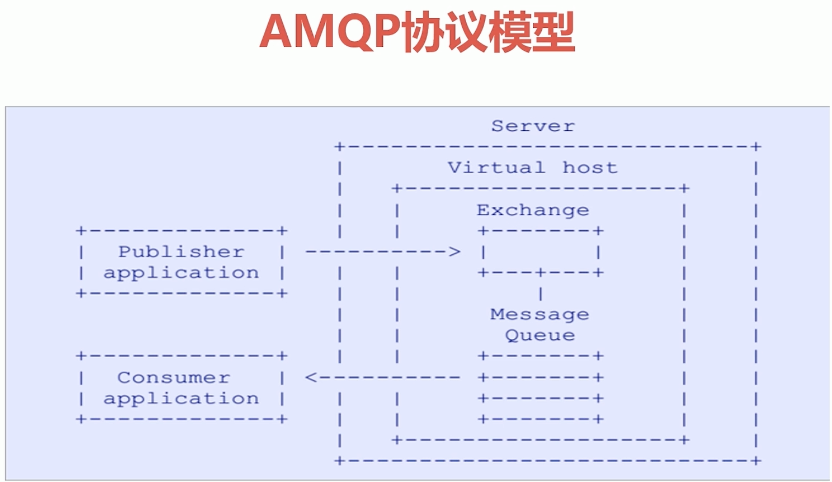
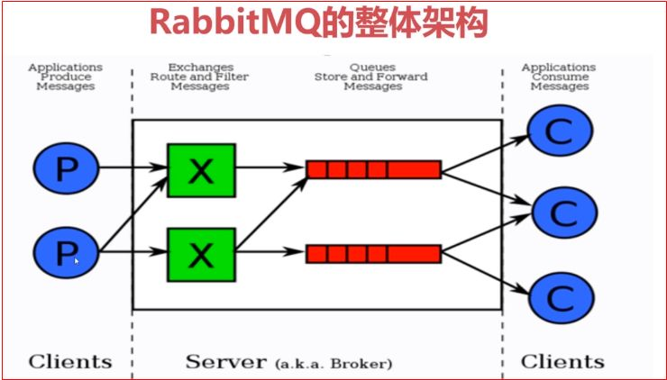
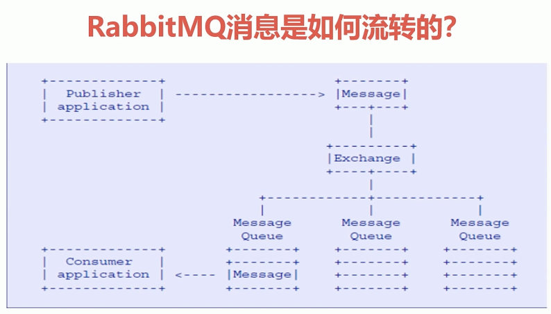
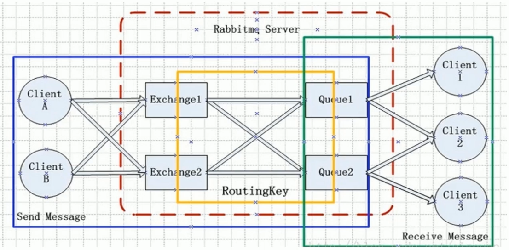
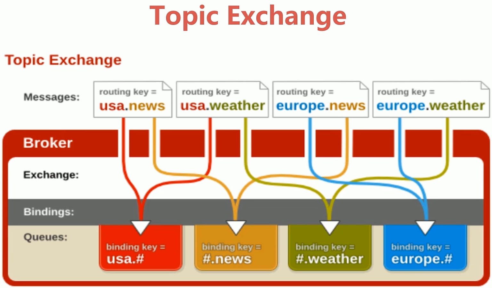
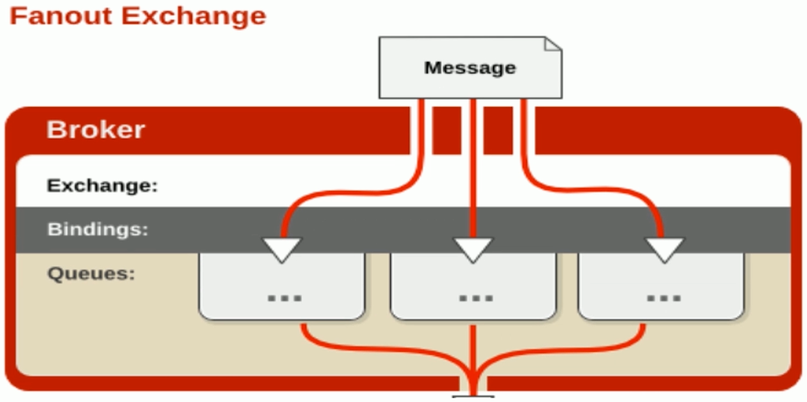
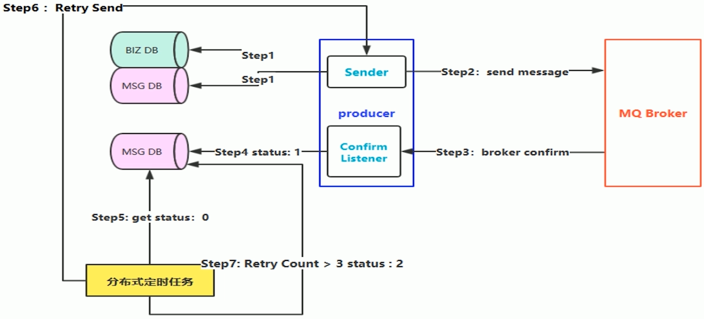
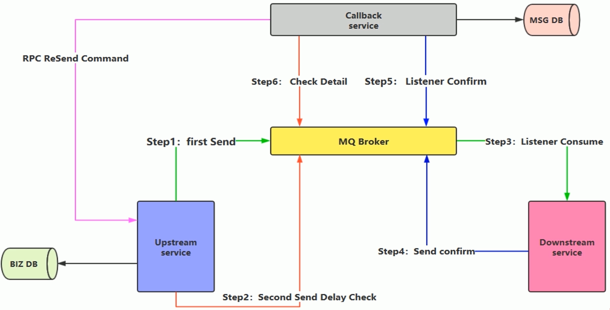
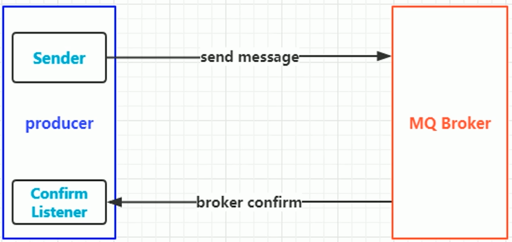
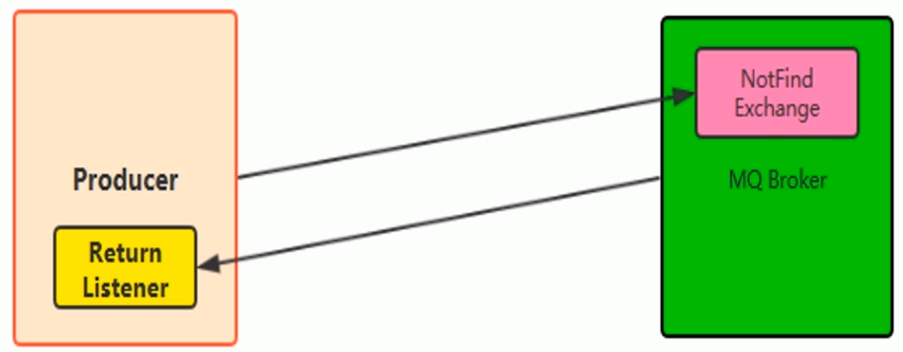

# 概述

> RabbitMQ是一个开源的消息代理和队列服务器, 用来通过普通协议在完全不同的应用之间共享数据, RabbitMQ使用Erlang语言来编写的, 并且RabbitMQ是基于AMQP协议的

## 优点

- 开源, 性能有效, 稳定性好
- 提供可靠性消息投递模式(confirm), 返回模式(return)等
- 与Springtime完美整合, API丰富
- 集群模式丰富, 支持表达式配置, 高可用HA模式, 镜像队列模型
- 可以保证数据不丢失的前提下做到高可靠性, 可用性

## RabbitMQ高性能的原因

- **Erlang语言**最初用于交换机领域的架构模式, 这样使得RabbitMQ在Broker之间进行数据交互的性能是非常优秀的
- **Erlang的优点 :** Erlang有着和原生Socket一样的延迟

# AMQP协议

## AMQP简介

- **AMQP全称 :** Advanced Message Queuing Protocol
- **中文 :** 高级消息队列协议
- **AMQP定义 :** 是具有现代特征的二进制协议, 是一个提供统一消息服务的应用层标准高级消息队列协议, 是应用层协议的一个开放标准, 为面向消息的中间件设计

## AMQP协议模型



## AMQP核心概念

- **Server :** 又称Broker, 接受客户端连接, 实现AMQP实体服务
- **Connection :** 连接, 应用程序与Broker的网络连接
- **Channel :** 网络信道, 几乎所有的操作都在Channel中进行, Channel是进行消息读写的通道。客户端可以建立多个Channel, 每个Channel代表一个会话任务。
- **Message :** 消息, 服务器和应用程序纸质件传送的数据, 有Properties和Body组成。Properties可以对消息进行修饰, 比如消息的优先级, 延迟等高级特性; Body就是消息体内容。
- **Virtual Host :** 虚拟地址, 用于进行逻辑隔离, 最上层的消息路由。一个Virtual Host里面可以有若干个Exchange和Queue, 同一个Virtual Host里面不能有相同名称的Exchange或Queue
- **Exchange :** 交换机, 用于接收消息, 根据路由键转发消息到绑定的队列
- **Binding :** Exchange和Queue之间的虚拟连接, binding中可以包含routing key
- **Routing Key :** 一个路由规则, 虚拟机可用它来确定如何路由一个特定消息
- **Queue :** 也成Message Queue, 消息队列, 用于保存消息并将它们转发给消费者

# RabbitMQ整体架构



- 生产者只需要将消息发送到Exchange即可
- 消费者只需要监听对应的消息队列即可
- Exchange绑定多个Queue时, 要通过Routing Key进行路由

# RabbitMQ消息流转



# RabbitMQ安装与使用

- **官网地址 :** http://www.rabbitmq.com/
- 需要安装Erlang安装包, 配置Erlang环境
- 需要安装Linux必须的一些依赖包
- 下载RabbitMQ必须的安装包
- 配置文件修改

## 安装步骤

1. 安装Erlang环境

   > wget www.rabbitmq.com/releases/erlang/erlang-18.3-1.el7.centos.x86_64.rpm
   >
   > yum install erlang-18.3-1.el7.centos.x86_64.rpm

2. 安装socat依赖

   > wget http://repo.iotti.biz/CentOS/7/x86_64/socat-1.7.3.2-5.el7.lux.x86_64.rpm
   >
   > yum install socat-1.7.3.2-5.el7.lux.x86_64.rpm

3. 安装RabbitMQ

   > wget www.rabbitmq.com/releases/rabbitmq-server/v3.6.5/rabbitmq-server-3.6.5-1.noarch.rpm
   >
   > yum install rabbitmq-server-3.6.5-1.noarch.rpm

4. 由于我的软件都安装在/usr/local/software目录下,所以我在这里建个软链接方便访问

   > ln -s /usr/lib/rabbitmq/lib/rabbitmq_server-3.6.5 /usr/local/software/rabbitmq

5. 修改配置文件

   > vim /usr/local/software/rabbitmq/ebin/rabbit.app

## RabbitMQ启动

- **服务的启动 :** rabbitmq-server start &

- **服务的停止 :** rabbitmqctl stop_app

- **管理插件 :** rabbitmq-plugins enable rabbitmq_management

  > 访问地址 : http://192.168.72.138:15672

## 命令行与管控台

- 关闭应用 : rabbitmqctl stop_app
- 启动应用 : rabbitmqctl start_app
- 节点状态 : rabbitmqctl status 

**用户相关 :**

- 添加用户 : rabbitmqctl add_user username password
- 列出所有用户 : rabbitmqctl list_users
- 删除用户 : rabbitmqctl delete_user username
- 清除用户权限 : rabbitmqctl clear_permissions -p vhostpath username
- 列出用户权限 : rabbitmqctl list_user_permissions username
- 修改密码 : rabbitmqctl change_password username newpassword
- 设置用户权限 : rabbitmqctl set_permissions -p vhostpath username

**虚拟主机相关 :**

- 创建虚拟主机 : rabbitmqctl add_vhost vhostpath
- 列出所有虚拟主机 : rabbitmqctl list_vhosts
- 列出虚拟主机上所有权限 : rabbitmqctl list_permissions -p vhostpath
- 删除虚拟主机 : rabbitmqctl delete_vhostpath

**队列相关 :** 

- 查看所有队列信息 : rabbitmqctl list_queues
- 清除队列里的消息 : rabbitmqctl -p vhostpath purge_queue blue

**高级操作(主要是集群相关) :**

- 移除所有数据 : rabbitmqctl reset, 要在rabbitmqctl stop_app之后使用过

- 组成集群命令 : rabbitmqctl join_cluster <clusternode> [--ram]

  > --ram表示指定数据存储模式, --ram表示数据存储到内存中

- 查看集群状态 : rabbitmqctl cluster_status

- 修改集群节点的存储形式 : rabbitmqctl change_cluster_node_type disc | ram

  > ram : 内存
  >
  > disc : 磁盘

- 忘记节点(移除节点) : rabbitmqctl forget_cluster_node [--offline]

  > offline表示可以在服务没启动时使用

- 修改节点名称 :  rabbitmqctl rename_cluster_node oldnode1 newnode1 oldnode2 new node2

# 快速入门

- ConnectionFactory : 获取连接工厂
- Connection : 一个连接
- Channel : 数据通信信道, 可发送和接收消息
- Queue : 具体的消息存储队列
- Producer & Consumer生产者和消费者

## 添加Maven依赖

```xml
<dependency>
            <groupId>com.rabbitmq</groupId>
            <artifactId>amqp-client</artifactId>
            <version>3.6.5</version>
        </dependency>
```

## 生产者代码

```java
package com.qiyexue.quickstart;

import com.rabbitmq.client.Channel;
import com.rabbitmq.client.Connection;
import com.rabbitmq.client.ConnectionFactory;

import java.io.IOException;
import java.util.concurrent.TimeoutException;

/**
 * 生产者
 *
 * @author 七夜雪
 * @create 2018-12-13 20:43
 */
public class Producer {

    public static void main(String[] args) throws Exception {
        // 1. 创建连接工厂, 设置属性
        ConnectionFactory factory = new ConnectionFactory();
        factory.setHost("192.168.72.138");
        factory.setPort(5672);
        factory.setVirtualHost("/");

        // 2. 创建连接
        Connection connection = factory.newConnection();

        // 3. 使用connection创建channel
        Channel channel = connection.createChannel();
        
        // 4. 通过channel发送消息
        String msg = "hello rabbitmq!";
        for (int i = 0; i < 5; i++) {
            // 不指定exchange的情况下, 使用默认的exchange, routingKey与队列名相等
            channel.basicPublish("", "test01", null, msg.getBytes());
        }

        // 5. 关闭连接
        channel.close();
        connection.close();
    }

}

```

## 消费者代码

```java
package com.qiyexue.quickstart;

import com.rabbitmq.client.Channel;
import com.rabbitmq.client.Connection;
import com.rabbitmq.client.ConnectionFactory;
import com.rabbitmq.client.QueueingConsumer;
import com.rabbitmq.client.QueueingConsumer.Delivery;
/**
 * 消费者
 *
 * @author 七夜雪
 * @create 2018-12-13 20:57
 */
public class Consumer {

    public static void main(String[] args) throws Exception {
        // 1. 创建连接工厂, 设置属性
        ConnectionFactory factory = new ConnectionFactory();
        factory.setHost("192.168.72.138");
        factory.setPort(5672);
        factory.setVirtualHost("/");

        // 2. 创建连接
        Connection connection = factory.newConnection();

        // 3. 使用connection创建channel
        Channel channel = connection.createChannel();

        // 4. 声明(创建)一个队列
        String queueName = "test01";
        channel.queueDeclare(queueName,true, false, false, null);

        // 5. 创建消费者
        QueueingConsumer consumer = new QueueingConsumer(channel);

        // 6. 设置channel
        channel.basicConsume(queueName, true, consumer);
        while (true) {
            // 7. 获取消息
            Delivery delivery = consumer.nextDelivery();
            System.err.println(new String(delivery.getBody()));
        }
        
    }

}
```

# Exchange 交换机

- Exchange : 接收消息, 并根据路由键转发消息所绑定的队列

  

## 交换机属性

- Name : 交换机名称

- Type : 交换机类型, direct, topic, fanout, headers

  - 

- Durability : 是否需要持久化, true为持久化

- Auto Delete : 当最后一个绑定到Exchange上的队列删除后, 自动删除该Exchange

- Internal : 当前Exchange是否用于RabbitMQ内部使用, 默认为False, 这个属性很少会用到

- Arguments : 扩展参数, 用于扩展AMQP协议制定化使用

## Direct Exchange

- Direct Exchange : 所有发送到Direct Exchange的消息被转发到RoutingKey中指定的Queue

  > **注意 :** Direct模式可以使用RabbitMQ自带的Exchange(default Exchange), 所以不需要将Exchange进行任何绑定(binding)操作, 消息传递时, RoutingKey必须完全匹配才会被队列接收, 否则该消息会被抛弃
  >
  > 

### Producer

```java
package com.qiyexue.exchange.direct;

import com.rabbitmq.client.Channel;
import com.rabbitmq.client.Connection;
import com.rabbitmq.client.ConnectionFactory;

import java.io.IOException;
import java.util.concurrent.TimeoutException;

/**
 * Direct模式的生产者
 *
 * @author 七夜雪
 * @create 2018-12-13 22:00
 */
public class ProducerByDirect {

    public static void main(String[] args) throws IOException, TimeoutException {
        // 1. 创建连接工厂, 设置属性
        ConnectionFactory factory = new ConnectionFactory();
        factory.setHost("192.168.72.138");
        factory.setPort(5672);
        factory.setVirtualHost("/");

        // 2. 获取连接
        Connection connection = factory.newConnection();

        // 3. 创建channel
        Channel channel = connection.createChannel();

        // 4. 声明
        String exchangeName = "test_direct_exchange";
        // Direct模式必须和消费者保持一致才能发送消息, 不然消息会被丢弃
        String routingKey = "test.direct";

        // 5. 发送消息
        String msg = "Hello RabbitMQ By Direct";
        channel.basicPublish(exchangeName, routingKey, null, msg.getBytes());

        // 6. 关闭连接
        channel.close();
        connection.close();
    }

}

```

### Consumer

```java
package com.qiyexue.exchange.direct;

import com.rabbitmq.client.Channel;
import com.rabbitmq.client.Connection;
import com.rabbitmq.client.ConnectionFactory;
import com.rabbitmq.client.QueueingConsumer;

import java.io.IOException;
import java.util.concurrent.TimeoutException;

/**
 * Direct模式消费者
 *
 * @author 七夜雪
 * @create 2018-12-13 22:01
 */
public class ConsumerByDirect {

    public static void main(String[] args) throws Exception {
        // 1. 创建工厂
        ConnectionFactory factory = new ConnectionFactory();
        factory.setHost("192.168.72.138");
        factory.setPort(5672);
        factory.setVirtualHost("/");

        // 2. 获取连接
        Connection connection = factory.newConnection();

        // 3. 创建channel
        Channel channel = connection.createChannel();

        // 4. 声明
        // 交换机名称
        String exchangeName = "test_direct_exchange";
        // 交换机类型
        String exchangeType = "direct";
        String queueName = "test_direct_queue";
        // Direct模式RoutingKey必须和生产者保持一致才能消费
        String routingKey = "test.direct";
        // 表示声明了一个交换机, 后面几个参数分别为durable, autoDelete, internal, arguments
        channel.exchangeDeclare(exchangeName, exchangeType, true, false, false, null);
        // 声明一个队列, 后面四个参数分别为durable, exclusive, autoDelete, arguments
        // durable : 是否持久化消息
        channel.queueDeclare(queueName, false, false, false, null);
        // 建立一个绑定关系
        channel.queueBind(queueName, exchangeName, routingKey);

        QueueingConsumer consumer = new QueueingConsumer(channel);
        // 参数 : 队列名称, autoAck:是否自动确认, consumer
        channel.basicConsume(queueName, true, consumer);
        while (true) {
            QueueingConsumer.Delivery delivery = consumer.nextDelivery();
            String msg = new String(delivery.getBody());
            System.out.println("收到消息 : " + msg);
        }
    }

}
```


## Topic Exchange

- 所有发送到Topic Exchange的消息将被转发到所有关心RoutingKey中指定Topic的Queue上

- Exchange将RoutingKey和某个Topic进行模糊匹配, 此时队列需要绑定一个Topic

  > - 可以使用通配符进行模糊匹配
  > - "#" : 匹配一个或多个词
  > - "*" : 匹配一个词
  >
  > 

### Producer

```java
package com.qiyexue.exchange.topic;

import com.rabbitmq.client.Channel;
import com.rabbitmq.client.Connection;
import com.rabbitmq.client.ConnectionFactory;

import java.io.IOException;
import java.util.concurrent.TimeoutException;

/**
 * Topic模式生产者
 *
 * @author 七夜雪
 * @create 2018-12-14 8:07
 */
public class ProducerByTopic {

    public static void main(String[] args) throws IOException, TimeoutException {
        // 创建工厂
        ConnectionFactory factory = new ConnectionFactory();
        factory.setHost("192.168.72.138");
        factory.setPort(5672);
        factory.setVirtualHost("/");

        // 创建连接
        Connection connection = factory.newConnection();

        // 创建channel
        Channel channel = connection.createChannel();

        // 声明
        String exchangeName = "test_topic_exchange";
        String routingKey1 = "tingxuelou.biluo";
        String routingKey2 = "tingxuelou.hongchen";
        String routingKey3 = "tingxuelou.hufa.zimo";

        String msg = "test topic By routingKey : ";
        channel.basicPublish(exchangeName, routingKey1, null, (msg + routingKey1).getBytes());
        channel.basicPublish(exchangeName, routingKey2, null, (msg + routingKey2).getBytes());
        channel.basicPublish(exchangeName, routingKey3, null, (msg + routingKey3).getBytes());

        // 关闭连接
        channel.close();
        connection.close();

    }

}

```

### Consumer

```java
package com.qiyexue.exchange.topic;

import com.rabbitmq.client.Channel;
import com.rabbitmq.client.Connection;
import com.rabbitmq.client.ConnectionFactory;
import com.rabbitmq.client.QueueingConsumer;

/**
 * topic模式消费者
 *
 * @author 七夜雪
 * @create 2018-12-14 20:10
 */
public class ConsumerByTopic {

    public static void main(String[] args) throws Exception {
        // 创建工厂
        // 创建工厂
        ConnectionFactory factory = new ConnectionFactory();
        factory.setHost("192.168.72.138");
        factory.setPort(5672);
        factory.setVirtualHost("/");

        // 创建连接
        Connection connection = factory.newConnection();

        // 创建channel
        Channel channel = connection.createChannel();

        // 声明Exchange
        String exchangeName = "test_topic_exchange";
        String exchangetype = "topic";
        // tingxuelou.#
        String routingKey = "tingxuelou.*";
        channel.exchangeDeclare(exchangeName, exchangetype);

        // 声明队列
        String queueName = "test_topic_queue";
        channel.queueDeclare(queueName, false, false, false, null);

        // 绑定队列
        channel.queueBind(queueName, exchangeName, routingKey);

        // 创建消费者
        QueueingConsumer consumer = new QueueingConsumer(channel);
        channel.basicConsume(queueName, true, consumer);

        while (true) {
            QueueingConsumer.Delivery delivery = consumer.nextDelivery();
            System.out.println(new String(delivery.getBody()));
        }
    }

}

```

## Fanout Exchange

- 不处理路由键, 只需要简单的将队列绑定到交换机上

- 发送到交换机的消息都会被转发到与该交换机绑定的所有队列上

- Fanout交换机转发消息是最快的

  > 

### Producer

```java
package com.qiyexue.exchange.fanout;

import com.rabbitmq.client.Channel;
import com.rabbitmq.client.Connection;
import com.rabbitmq.client.ConnectionFactory;

/**
 * fanout模式生产者
 *
 * @author 七夜雪
 * @create 2018-12-14 20:36
 */
public class ProducerByFanout {

    public static void main(String[] args) throws Exception {
        // 1. 创建连接工厂, 设置属性
        ConnectionFactory factory = new ConnectionFactory();
        factory.setHost("192.168.72.138");
        factory.setPort(5672);
        factory.setVirtualHost("/");

        // 2. 获取连接
        Connection connection = factory.newConnection();

        // 3. 创建channel
        Channel channel = connection.createChannel();

        String exchangeName = "test_fanout_exchange";
        String routingKey = "无所谓";
        for (int i = 0; i < 5; i++) {
            String msg = "Fanout 模式消息..";
            channel.basicPublish(exchangeName, routingKey, null, msg.getBytes());
        }

        // 关闭连接
        channel.close();
        connection.close();
    }

}
```

### Consumer

```java
package com.qiyexue.exchange.fanout;

import com.rabbitmq.client.Channel;
import com.rabbitmq.client.Connection;
import com.rabbitmq.client.ConnectionFactory;
import com.rabbitmq.client.QueueingConsumer;

/**
 * Fanout模式消费者
 *
 * @author 七夜雪
 * @create 2018-12-14 20:40
 */
public class ConsumerByFanout {

    public static void main(String[] args) throws Exception {
        // 1. 创建连接工厂, 设置属性
        ConnectionFactory factory = new ConnectionFactory();
        factory.setHost("192.168.72.138");
        factory.setPort(5672);
        factory.setVirtualHost("/");

        // 2. 获取连接
        Connection connection = factory.newConnection();

        // 3. 创建channel
        Channel channel = connection.createChannel();

        // 4. 声明Exchange
        String exchangeName = "test_fanout_exchange";
        String exchangeType = "fanout";
        channel.exchangeDeclare(exchangeName, exchangeType);

        // 5. 声明消息队列
        String routingKey = "";
        String queueName = "test_fanout_queue";
        channel.queueDeclare(queueName, false, false, false, null);
        channel.queueBind(queueName, exchangeName, routingKey);

        // 6. 创建消费者
        QueueingConsumer consumer = new QueueingConsumer(channel);
        channel.basicConsume(queueName, true, consumer);

        while (true) {
            QueueingConsumer.Delivery delivery = consumer.nextDelivery();
            String msg = new String(delivery.getBody());
            System.out.println("收到消息 : " + msg);
        }

    }

}
```

# Binding-绑定

- Exchange和Exchange, Queue之间的连接关系
- 绑定中可以包含RoutingKey或者参数

# Queue-消息队列

- 消息队列, 实际存储消息数据

- Durability : 是否持久化

  > Durable : 是
  >
  > Transient : 否

- Auto delete : 如选yes,代表当最后一个监听被移除之后, 该Queue会自动被删除

# Message-消息

- 服务和应用程序之间传送的数据

- 本质上就是一段数据, 由Properties和Payload(Body)组成
- 常用属性 : delivery mode, headers(自定义属性)

## Message-其他属性

- content_type, content_encoding, priority
- correlation_id : 可以认为是消息的唯一id
- replay_to : 重回队列设定
- expiration : 消息过期时间
- message_id : 消息id
- timestamp, type, user_id, app_id, cluster_id

## 代码演示

### Producer

```java
package com.qiyexue.message;

import com.rabbitmq.client.AMQP;
import com.rabbitmq.client.Channel;
import com.rabbitmq.client.Connection;
import com.rabbitmq.client.ConnectionFactory;

import java.util.HashMap;
import java.util.Map;

/**
 * 生产者
 *
 * @author 七夜雪
 * @create 2018-12-13 20:43
 */
public class Producer {

    public static void main(String[] args) throws Exception {
        // 1. 创建连接工厂, 设置属性
        ConnectionFactory factory = new ConnectionFactory();
        factory.setHost("192.168.72.138");
        factory.setPort(5672);
        factory.setVirtualHost("/");

        // 2. 创建连接
        Connection connection = factory.newConnection();

        // 3. 使用connection创建channel
        Channel channel = connection.createChannel();

        // 4. 通过channel发送消息
        String msg = "hello rabbitmq!";
        AMQP.BasicProperties properties = new AMQP.BasicProperties();
        Map<String,Object> headers = new HashMap<String, Object>();
        headers.put("name", "七夜雪");
        properties = properties.builder()
                // 设置编码为UTF8
                .contentEncoding("UTF-8")
                // 设置自定义Header
                .headers(headers)
                // 设置消息失效时间
                .expiration("5000").build();

        for (int i = 0; i < 5; i++) {
            // 不指定exchange的情况下, 使用默认的exchange, routingKey与队列名相等
            channel.basicPublish("", "test01", properties, msg.getBytes());
        }

        // 5. 关闭连接
        channel.close();
        connection.close();
    }

}
```

### Consumer

```java
package com.qiyexue.message;

import com.rabbitmq.client.Channel;
import com.rabbitmq.client.Connection;
import com.rabbitmq.client.ConnectionFactory;
import com.rabbitmq.client.QueueingConsumer;
import com.rabbitmq.client.QueueingConsumer.Delivery;

/**
 * 消费者
 *
 * @author 七夜雪
 * @create 2018-12-13 20:57
 */
public class Consumer {

    public static void main(String[] args) throws Exception {
        // 1. 创建连接工厂, 设置属性
        ConnectionFactory factory = new ConnectionFactory();
        factory.setHost("192.168.72.138");
        factory.setPort(5672);
        factory.setVirtualHost("/");

        // 2. 创建连接
        Connection connection = factory.newConnection();

        // 3. 使用connection创建channel
        Channel channel = connection.createChannel();

        // 4. 声明(创建)一个队列
        String queueName = "test01";
        channel.queueDeclare(queueName,true, false, false, null);

        // 5. 创建消费者
        QueueingConsumer consumer = new QueueingConsumer(channel);

        // 6. 设置channel
        channel.basicConsume(queueName, true, consumer);
        while (true) {
            // 7. 获取消息
            Delivery delivery = consumer.nextDelivery();
            System.out.println(new String(delivery.getBody()));
            // 获取head中内容
            System.out.println(delivery.getProperties().getHeaders().get("name"));
        }
        
    }

}
```

# Virtual Host-虚拟主机

- 虚拟地址, 用于进行逻辑隔离, 最上层的消息路由
- 一个Virtual Host里面可以有若干个Exchange和Queue
- 同一个Virtual Host里面不能有相同名称的Exchange或Queue

# RabbitMQ高级特性

## 消息如何保障100%的投递成功

### 什么是生产端的可靠性投递

- 保障消息的成功发出
- 保障MQ节点的成功接收
- 发送端收到MQ节点(Broker)的确认应答
- 完善的消息补偿机制

### 可靠性投递的解决方案

- 消息落库, 对消息状态进行标记

  > - 将消息落入数据库中, 对消息状态进行标记, 消息状态发生变更时, 更新标记信息
  > - 对失败消息进行轮询重发, 设置轮询次数
  >
  > 

- 消息的延迟投递, 做二次确认, 回调检查

  > 
  >
  > 1. step1 : 第一次消息发送, 必须业务数据落库之后才能进行消息发送
  > 2. step2 : 第二次消息延迟发送, 设定延迟一段时间发送第二次check消息 
  > 3. step3 : 消费端监听Broker, 进行消息消费
  > 4. step4 : 消费成功之后, 发送确认消息到确认消息队列
  > 5. step5 : Callback Service监听step4中的确认消息队列, 维护消息状态, 是否消费成功等状态
  > 6. step6 : Callback Service监听step2发送的Delay Check的消息队列, 检测内部的消息状态, 如果消息是发送成功状态, 则流程结束, 如果消息是失败状态, 或者查不到当前消息状态时, 会通知生产者, 进行消息重发, 重新上述步骤


## 消费端-幂等性保障

- 幂等性 : 多次执行, 结果保持一致

### 主流的幂等性操作

- 唯一ID + 指纹码机制, 利用数据库主键去重

  > - 好处 : 实现简单
  > - 坏处 : 高并发下有数据库写入的性能瓶颈
  > - 解决方案 : 根据ID进行分库分表进行算法路由

- 利用Redis的原子性实现

  > 需要关注的问题:
  >
  > - 是否要进行数据落库, 如果落库的话, 数据库和缓存如何做到原子性
  > - 如果不落库, 数据都存储到缓存中, 如何设置定时同步的策略

## Confirm确认消息

- 消息的确认, 是指生产者投递消息后, 如果Broker收到消息, 则会给我们产生一个应答

- 生产者进行接收应答, 用来确定这条消息是否正常发送到Broker, 这种方式也是消息的可靠性投递的核心保障

  

### 如何实现Confirm确认消息

1. 在channel上开启确认模式 : channel.confirmSelect()
2. 在channel上添加监听 : addConfirmListener, 监听成功和失败的返回结果, 根据具体的结果对消息进行重新发送, 或记录日志等后续处理

#### Producer代码

```java
package com.qiyexue.confirm;

import com.rabbitmq.client.Channel;
import com.rabbitmq.client.ConfirmListener;
import com.rabbitmq.client.Connection;
import com.rabbitmq.client.ConnectionFactory;

import java.io.IOException;

/**
 * Confirm确认消息模式生产者
 *
 * @author 七夜雪
 * @create 2018-12-15 16:12
 */
public class ProducerByConfirm {

    public static void main(String[] args) throws Exception {
        // 1. 创建ConnectionFactory, 并设置属性
        ConnectionFactory factory = new ConnectionFactory();
        factory.setHost("192.168.72.138");
        factory.setPort(5672);
        factory.setVirtualHost("/");

        // 2. 创建连接
        Connection connection = factory.newConnection();

        // 3. 创建channel
        Channel channel = connection.createChannel();

        // 4. 开启Confirm模式
        channel.confirmSelect();

        String exchangeName = "test_confirm_exchange";
        String routingKey = "confirm.qiye";

        // 5. 发送消息
        String msg = "Send Msg By Confirm ...";
        channel.basicPublish(exchangeName, routingKey, null, msg.getBytes());

        // 6. 设置监听
        channel.addConfirmListener(new ConfirmListener() {
            public void handleAck(long deliveryTag, boolean multiple) throws IOException {
                System.out.println("-------ACK Success--------");
            }

            public void handleNack(long deliveryTag, boolean multiple) throws IOException {
                System.err.println("-------ACK Failed--------");
            }
        });

        // 因为设置了监听, 这里就不关闭channel和connection了
    }

}
```

#### Consumer代码

```java
package com.qiyexue.confirm;

import com.rabbitmq.client.Channel;
import com.rabbitmq.client.Connection;
import com.rabbitmq.client.ConnectionFactory;
import com.rabbitmq.client.QueueingConsumer;

/**
 * Confirm消息确认的生产者
 *
 * @author 七夜雪
 * @create 2018-12-15 16:19
 */
public class ConsumerByConfirm {

    public static void main(String[] args) throws Exception {
        // 1. 创建连接工厂并设置属性
        ConnectionFactory factory = new ConnectionFactory();;
        factory.setHost("192.168.72.138");
        factory.setPort(5672);
        factory.setVirtualHost("/");

        // 2. 创建连接
        Connection connection = factory.newConnection();

        // 3. 创建channel
        Channel channel = connection.createChannel();

        // 4. 声明Exchange
        String exchangeName = "test_confirm_exchange";
        String exchangeType = "topic";
        String routingKey = "confirm.*";
        channel.exchangeDeclare(exchangeName, exchangeType, true, false, null);

        // 5. 声明消息队列
        String queueName = "test_confirm_queue";
        channel.queueDeclare(queueName, true, false, false, null);

        // 6. 绑定队列和Exchange
        channel.queueBind(queueName, exchangeName, routingKey);

        // 7. 创建一个消费者
        QueueingConsumer consumer = new QueueingConsumer(channel);

        // 8. 设置消费者从哪个队列开始消费, 设置自动ACK
        channel.basicConsume(queueName, true, consumer);

        while (true) {
            QueueingConsumer.Delivery delivery = consumer.nextDelivery();
            String msg = new String(delivery.getBody());
            System.out.println(msg);
        }

    }

}
```

## Return消息机制

- Return Listener用于处理一些不可路由的消息

- 正常情况下消息生产者通过指定一个Exchange和RoutingKey, 把消息送到某一个队列中去, 然后消费者监听队列, 进行消费

- 但在某些情况下, 如果在发送消息的时候, 当前的exchange不存在或者指定的路由key路由不到, 这个时候如果我们需要监听这种不可达的消息, 就要使用Return Listener

- 在基础API中有一个关键的配置项Mandatory  : 如果为true, 则监听器会接收到路由不可达的消息, 然后进行后续处理, 如果为false, 那么broker端自动删除该消息

  

### 代码演示

#### Producer

```java
package com.qiyexue.returnlistener;

import com.rabbitmq.client.*;

import java.io.IOException;

/**
 * Return Listener模式生产者
 *
 * @author 七夜雪
 * @create 2018-12-15 19:56
 */
public class Producer {

    public static void main(String[] args) throws Exception {
        // 1. 创建ConnectionFactory, 并设置属性
        ConnectionFactory factory = new ConnectionFactory();
        factory.setHost("192.168.72.138");
        factory.setPort(5672);
        factory.setVirtualHost("/");

        // 2. 创建连接
        Connection connection = factory.newConnection();

        // 3. 创建channel
        Channel channel = connection.createChannel();

        // 4. 设置Return Listener监听
        channel.addReturnListener(new ReturnListener() {
            public void handleReturn(int replyCode, String replyText, String exchange, String routingKey, AMQP.BasicProperties properties, byte[] body) throws IOException {
                System.out.println("--------------Return Listener--------------");
                System.out.println(replyCode);
                System.out.println(replyText);
                System.out.println(exchange);
                System.out.println(routingKey);
                System.out.println(properties);
                System.out.println(new String(body));
            }
        });

        String exchangeName = "test_return_exchange";
        String routingKey = "return.qiye";
        String routingErrorKey = "error.qiye";

        // 发送消息
        String msg = "Send Msg And Return Listener By RoutingKey : ";
        channel.basicPublish(exchangeName, routingKey, true, null, (msg + routingKey).getBytes());
        channel.basicPublish(exchangeName, routingErrorKey,true, null, (msg + routingErrorKey).getBytes());

    }

}
```

#### Consumer

```java
package com.qiyexue.returnlistener;

import com.rabbitmq.client.Channel;
import com.rabbitmq.client.Connection;
import com.rabbitmq.client.ConnectionFactory;
import com.rabbitmq.client.QueueingConsumer;

/**
 * Return Listener模式消费者
 *
 * @author 七夜雪
 * @create 2018-12-15 20:07
 */
public class Consumer {

    public static void main(String[] args) throws Exception {
        // 1. 创建连接工厂并设置属性
        ConnectionFactory factory = new ConnectionFactory();;
        factory.setHost("192.168.72.138");
        factory.setPort(5672);
        factory.setVirtualHost("/");

        // 2. 创建连接
        Connection connection = factory.newConnection();

        // 3. 创建channel
        Channel channel = connection.createChannel();

        // 4. 声明Exchange
        String exchangeName = "test_return_exchange";
        String exchangeType = "topic";
        String routingKey = "return.*";
        channel.exchangeDeclare(exchangeName, exchangeType, true, false, null);

        // 5. 声明消息队列
        String queueName = "test_return_queue";
        channel.queueDeclare(queueName, true, false, false, null);

        // 6. 绑定队列和Exchange
        channel.queueBind(queueName, exchangeName, routingKey);

        // 7. 创建一个消费者
        QueueingConsumer consumer = new QueueingConsumer(channel);

        // 8. 设置消费者从哪个队列开始消费, 设置自动ACK
        channel.basicConsume(queueName, true, consumer);

        while (true) {
            QueueingConsumer.Delivery delivery = consumer.nextDelivery();
            String msg = new String(delivery.getBody());
            System.out.println(msg);
        }

    }

}
```

## 消费端自定义监听

- 在之前的代码演示中, consumer进行消费时 ,都是使用while循环进行消息消费, 然后使用consumer.nextDelivery()方法获取下一条消息
- 但是在实际工作中, 使用自定义的Consumer更加的方便, 解耦性也更加的强, 实现自定义的Consumer可以实现Consumer接口, 或者更常用的是继承默认的DefaultConsumer

### 代码演示

#### 自定义消费者(替换QueueingConsumer)

```java
package com.qiyexue.api.consumer;

import com.rabbitmq.client.AMQP;
import com.rabbitmq.client.Channel;
import com.rabbitmq.client.DefaultConsumer;
import com.rabbitmq.client.Envelope;

import java.io.IOException;

/**
 * 自定义消费者
 * @author 七夜雪
 * @create 2018-12-16 8:20
 */
public class MyConsumer extends DefaultConsumer {

    public MyConsumer(Channel channel) {
        super(channel);
    }

    @Override
    public void handleDelivery(String consumerTag, Envelope envelope, AMQP.BasicProperties properties, byte[] body) throws IOException {
        System.out.println("-------------自定义消费者------------");
        System.out.println("consumerTag : " + consumerTag);
        System.out.println("envelope : " + envelope);
        System.out.println("properties : " + properties);
        System.out.println("body : " + new String(body));
    }
}
```

#### Producer

```java
package com.qiyexue.api.consumer;

import com.rabbitmq.client.*;

import java.io.IOException;

/**
 * 生产者
 *
 * @author 七夜雪
 * @create 2018-12-15 19:56
 */
public class Producer {

    public static void main(String[] args) throws Exception {
        // 1. 创建ConnectionFactory, 并设置属性
        ConnectionFactory factory = new ConnectionFactory();
        factory.setHost("192.168.72.138");
        factory.setPort(5672);
        factory.setVirtualHost("/");

        // 2. 创建连接
        Connection connection = factory.newConnection();

        // 3. 创建channel
        Channel channel = connection.createChannel();


        String exchangeName = "test_consumer_exchange";
        String routingKey = "consumer.qiye";

        // 发送消息
        String msg = "自定义消费者, 消息发送 : Hello, 七夜雪";
        channel.basicPublish(exchangeName, routingKey, true, null, msg.getBytes());

        // 关闭连接
        channel.close();
        connection.close();

    }

}
```

#### Consumer

```java
package com.qiyexue.api.consumer;

import com.rabbitmq.client.Channel;
import com.rabbitmq.client.Connection;
import com.rabbitmq.client.ConnectionFactory;
import com.rabbitmq.client.QueueingConsumer;

/**
 * Return Listener模式消费者
 *
 * @author 七夜雪
 * @create 2018-12-15 20:07
 */
public class Consumer {

    public static void main(String[] args) throws Exception {
        // 1. 创建连接工厂并设置属性
        ConnectionFactory factory = new ConnectionFactory();;
        factory.setHost("192.168.72.138");
        factory.setPort(5672);
        factory.setVirtualHost("/");

        // 2. 创建连接
        Connection connection = factory.newConnection();

        // 3. 创建channel
        Channel channel = connection.createChannel();

        // 4. 声明Exchange
        String exchangeName = "test_consumer_exchange";
        String exchangeType = "topic";
        String routingKey = "consumer.*";
        channel.exchangeDeclare(exchangeName, exchangeType, true, false, null);

        // 5. 声明消息队列
        String queueName = "test_consumer_queue";
        channel.queueDeclare(queueName, true, false, false, null);

        // 6. 绑定队列和Exchange
        channel.queueBind(queueName, exchangeName, routingKey);

        // 7. 设置消费者为自定义的消费者
        channel.basicConsume(queueName, true, new MyConsumer(channel));

    }

}
```

## 消费端限流

- 消息队列中囤积了大量的消息, 或者某些时刻生产的消息远远大于消费者处理能力的时候, 这个时候如果消费者一次取出大量的消息, 但是客户端又无法处理, 就会出现问题, 甚至可能导致服务崩溃, 所以需要对消费端进行限流

- RabbitMQ提供了一种qos(服务质量保证)功能, 即在飞自动确认消息的前提下, 如果一定数目的消息(通过consumer或者channel设置qos的值)未被确认前, 不进行消费新的消息

  > - 自动签收要设置成false, 建议实际工作中也设置成false
  > - void basicQos(int prefetchSize, int prefetchCount, boolean global) throws IOException;
  > - prefetchSize : 消息大小限制, 一般设置为0, 消费端不做限制
  > - prefetchCount : 会告诉RabbitMQ不要同时给一个消费者推送多于N个消息, 即一旦有N个消息还没有ack, 则该consumer将block(阻塞), 直到有消息ack
  > - global : true/false 是否将上面设置应用于channel, 简单来说就是上面的限制是channel级别的还是consumer级别
  >
  > **注意 :** 
  >
  > - prefetchSize和global这两项, RabbitMQ没有实现, 暂且不关注, prefetchCount在autoAck设置false的情况下生效, 即在自动确认的情况下这两个值是不生效的

### 代码演示

#### 自定义消费者, 设置手动签收消息

```java
package com.qiyexue.api.limit;

import com.rabbitmq.client.AMQP;
import com.rabbitmq.client.Channel;
import com.rabbitmq.client.DefaultConsumer;
import com.rabbitmq.client.Envelope;

import java.io.IOException;

/**
 * 自定义消费者
 * @author 七夜雪
 * @date 2018-12-16 8:20
 */
public class MyConsumer extends DefaultConsumer {

    private Channel channel;

    public MyConsumer(Channel channel) {
        super(channel);
        this.channel = channel;
    }

    @Override
    public void handleDelivery(String consumerTag, Envelope envelope, AMQP.BasicProperties properties, byte[] body) throws IOException {
        System.out.println("-------------自定义消费者------------");
        System.out.println("consumerTag : " + consumerTag);
        System.out.println("envelope : " + envelope);
        System.out.println("properties : " + properties);
        System.out.println("body : " + new String(body));
        // 第二个参数表示是否批量签收
        channel.basicAck(envelope.getDeliveryTag(), false);
    }
}
```

#### Producer

```java
package com.qiyexue.api.limit;

import com.rabbitmq.client.Channel;
import com.rabbitmq.client.Connection;
import com.rabbitmq.client.ConnectionFactory;

/**
 * 生产者
 *
 * @author 七夜雪
 * @date 2018-12-15 19:56
 */
public class Producer {

    public static void main(String[] args) throws Exception {
        // 1. 创建ConnectionFactory, 并设置属性
        ConnectionFactory factory = new ConnectionFactory();
        factory.setHost("192.168.72.138");
        factory.setPort(5672);
        factory.setVirtualHost("/");

        // 2. 创建连接
        Connection connection = factory.newConnection();

        // 3. 创建channel
        Channel channel = connection.createChannel();


        String exchangeName = "test_limit_exchange";
        String routingKey = "limit.qiye";

        // 发送消息
        String msg = "自定义消费者, 消息发送 : Hello, 七夜雪";
        for (int i = 0; i < 5; i++) {
            channel.basicPublish(exchangeName, routingKey, true, null, msg.getBytes());
        }

        // 关闭连接
        channel.close();
        connection.close();

    }

}
```

**Consumer设置Qos, 关闭自动签收**

```java
package com.qiyexue.api.limit;

import com.rabbitmq.client.Channel;
import com.rabbitmq.client.Connection;
import com.rabbitmq.client.ConnectionFactory;

/**
 * 消费者
 *
 * @author 七夜雪
 * @date 2018-12-15 20:07
 */
public class Consumer {

    public static void main(String[] args) throws Exception {
        // 1. 创建连接工厂并设置属性
        ConnectionFactory factory = new ConnectionFactory();
        factory.setHost("192.168.72.138");
        factory.setPort(5672);
        factory.setVirtualHost("/");

        // 2. 创建连接
        Connection connection = factory.newConnection();

        // 3. 创建channel
        Channel channel = connection.createChannel();

        // 4. 声明Exchange
        String exchangeName = "test_limit_exchange";
        String exchangeType = "topic";
        String routingKey = "limit.*";
        channel.exchangeDeclare(exchangeName, exchangeType, true, false, null);

        // 5. 声明消息队列
        String queueName = "test_limit_queue";
        channel.queueDeclare(queueName, true, false, false, null);

        // 6. 绑定队列和Exchange
        channel.queueBind(queueName, exchangeName, routingKey);

        // 表示不限制消息大小, 一次只处理一条消息, 限制只是当前消费者有效
        channel.basicQos(0, 1, false);

        // 7. 设置消费者为自定义的消费者, 要进行限流必须关闭自动签收
        channel.basicConsume(queueName, false, new MyConsumer(channel));

    }

}
```

## 消费端ACK与重回队列

### 消费端ACK

- 消费端的手工ACK和NACK, ACK是确认成功消费, NACK表示消息处理失败, 会重发消息
- 消费端进行消费的时候, 如果由于业务异常我们可以进行日志的记录, 然后进行补偿
- 如果由于服务器宕机等严重问题, 就需要手工进行ACK保障消费端消费成功

### 重回队列

- 消费端重回队列是为了对没有处理成功的消息, 把消息重新回递给Broker
- 一般在实际应用中, 都会关闭重回队列, 也就是设置为False

### 代码演示

#### 自定义消费者

```java
package com.qiyexue.api.ack;

import com.rabbitmq.client.AMQP;
import com.rabbitmq.client.Channel;
import com.rabbitmq.client.DefaultConsumer;
import com.rabbitmq.client.Envelope;

import java.io.IOException;
import java.util.concurrent.TimeUnit;

/**
 * 自定义消费者
 * 设置手动ack和重回队列
 * @author 七夜雪
 * @date 2018-12-16 8:20
 */
public class MyConsumer extends DefaultConsumer {
    private Channel channel;

    public MyConsumer(Channel channel) {
        super(channel);
        this.channel = channel;
    }

    @Override
    public void handleDelivery(String consumerTag, Envelope envelope, AMQP.BasicProperties properties, byte[] body) throws IOException {
        System.out.println("-------------自定义消费者------------");
        System.out.println("consumerTag : " + consumerTag);
        System.out.println("envelope : " + envelope);
        System.out.println("properties : " + properties);
        System.out.println("body : " + new String(body));
        try {
            TimeUnit.SECONDS.sleep(2);
        } catch (InterruptedException e) {
            e.printStackTrace();
        }

        if ((Integer)properties.getHeaders().get("num") == 0) {
            // 三个参数 : DeliveryTag, 是否批量拒绝, 是否可以重回队列
            channel.basicNack(envelope.getDeliveryTag(), false, true);
        } else {
            channel.basicAck(envelope.getDeliveryTag(), false);
        }

    }
}
```

#### Producer

```java
package com.qiyexue.api.ack;

import com.rabbitmq.client.*;

import java.util.HashMap;
import java.util.Map;

/**
 * 生产者
 *
 * @author 七夜雪
 * @date 2018-12-15 19:56
 */
public class Producer {

    public static void main(String[] args) throws Exception {
        // 1. 创建ConnectionFactory, 并设置属性
        ConnectionFactory factory = new ConnectionFactory();
        factory.setHost("192.168.72.138");
        factory.setPort(5672);
        factory.setVirtualHost("/");

        // 2. 创建连接
        Connection connection = factory.newConnection();

        // 3. 创建channel
        Channel channel = connection.createChannel();


        String exchangeName = "test_ack_exchange";
        String routingKey = "ack.qiye";

        for (int i = 0; i < 5; i++) {
            // 发送消息
            String msg = "Hello, 七夜雪 " + i;
            Map<String, Object> hearder = new HashMap<String, Object>();
            hearder.put("num", i);
            AMQP.BasicProperties properties = new AMQP.BasicProperties().builder()
                    .contentEncoding("UTF-8")
                    .headers(hearder).build();
            channel.basicPublish(exchangeName, routingKey, true, properties, msg.getBytes());
        }


        // 关闭连接
        channel.close();
        connection.close();

    }

}
```

#### Consumer

```java
package com.qiyexue.api.ack;

import com.rabbitmq.client.Channel;
import com.rabbitmq.client.Connection;
import com.rabbitmq.client.ConnectionFactory;

/**
 * 消费者，关闭自动ack
 *
 * @author 七夜雪
 * @date 2018-12-15 20:07
 */
public class Consumer {

    public static void main(String[] args) throws Exception {
        // 1. 创建连接工厂并设置属性
        ConnectionFactory factory = new ConnectionFactory();;
        factory.setHost("192.168.72.138");
        factory.setPort(5672);
        factory.setVirtualHost("/");

        // 2. 创建连接
        Connection connection = factory.newConnection();

        // 3. 创建channel
        Channel channel = connection.createChannel();

        // 4. 声明Exchange
        String exchangeName = "test_ack_exchange";
        String exchangeType = "topic";
        String routingKey = "ack.*";
        channel.exchangeDeclare(exchangeName, exchangeType, true, false, null);

        // 5. 声明消息队列
        String queueName = "test_ack_queue";
        channel.queueDeclare(queueName, true, false, false, null);

        // 6. 绑定队列和Exchange
        channel.queueBind(queueName, exchangeName, routingKey);

        // 7. 设置消费者为自定义的消费者, 将autoAck设置为false
        channel.basicConsume(queueName, false, new MyConsumer(channel));

    }

}
```

## TTL队列/消息

- TTL是Time To Live的缩写, 也就是生存时间
- RabbitMQ支持消息的过期时间, 在消息发送时可以进行指定
- RabbitMQ支持队列的过期时间, 从消息入队列开始计算, 只要超过了队列的超时时间配置, 那么消息会自动清除

### 代码演示

- 消费者中设置队列超时时间为10秒, 启动之后关闭消费者
- 生产者发送两条消息, 一条消息不设置超时时间, 一条消息设置5秒后超时
- 启动生产者之后, 监控RabbitMQ控制台, 发现5秒后设置了消息超时时间的消息先超时清除, 然后10秒后另外一条消息也超时清除

```java
package com.qiyexue.api.ttl;

import com.rabbitmq.client.Channel;
import com.rabbitmq.client.Connection;
import com.rabbitmq.client.ConnectionFactory;
import com.rabbitmq.client.QueueingConsumer;
import com.rabbitmq.client.QueueingConsumer.Delivery;

import java.util.HashMap;
import java.util.Map;

/**
 * 消费者， 设置队列过期时间
 *
 * @author 七夜雪
 * @date 2018-12-13 20:57
 */
public class Consumer {

    public static void main(String[] args) throws Exception {
        // 1. 创建连接工厂, 设置属性
        ConnectionFactory factory = new ConnectionFactory();
        factory.setHost("192.168.72.138");
        factory.setPort(5672);
        factory.setVirtualHost("/");

        // 2. 创建连接
        Connection connection = factory.newConnection();

        // 3. 使用connection创建channel
        Channel channel = connection.createChannel();

        // 4. 声明(创建)一个队列
        String queueName = "test_ttl_queue";

        Map<String, Object> arguments = new HashMap<>();
        // 设置队列超时时间为10秒
        arguments.put("x-message-ttl", 10000);
        channel.queueDeclare(queueName,true, false, false, arguments);

        // 5. 创建消费者
        QueueingConsumer consumer = new QueueingConsumer(channel);

        // 6. 设置channel
        channel.basicConsume(queueName, true, consumer);
        while (true) {
            // 7. 获取消息
            Delivery delivery = consumer.nextDelivery();
            System.out.println(new String(delivery.getBody()));
            // 获取head中内容
            System.out.println(delivery.getProperties().getHeaders().get("name"));
        }
        
    }

}
```

```java
package com.qiyexue.api.ttl;

import com.rabbitmq.client.AMQP;
import com.rabbitmq.client.Channel;
import com.rabbitmq.client.Connection;
import com.rabbitmq.client.ConnectionFactory;

import java.util.HashMap;
import java.util.Map;

/**
 * 生产者
 *
 * @author 七夜雪
 * @date 2018-12-13 20:43
 */
public class Producer {

    public static void main(String[] args) throws Exception {
        // 1. 创建连接工厂, 设置属性
        ConnectionFactory factory = new ConnectionFactory();
        factory.setHost("192.168.72.138");
        factory.setPort(5672);
        factory.setVirtualHost("/");

        // 2. 创建连接
        Connection connection = factory.newConnection();

        // 3. 使用connection创建channel
        Channel channel = connection.createChannel();

        // 4. 通过channel发送消息
        String msg = "hello rabbitmq!";
        AMQP.BasicProperties properties = new AMQP.BasicProperties();
        Map<String,Object> headers = new HashMap<String, Object>();
        headers.put("name", "七夜雪");
        properties = properties.builder()
                // 设置编码为UTF8
                .contentEncoding("UTF-8")
                // 设置自定义Header
                .headers(headers)
                // 设置消息失效时间
                .expiration("5000").build();

        // 设置了消息超时时间为5秒, 5秒后消息自动删除
        channel.basicPublish("", "test_ttl_queue", properties, msg.getBytes());
        // 没有设置消息存活时间,消息存活时间根据队列来决定
        channel.basicPublish("", "test_ttl_queue", null, msg.getBytes());

        // 5. 关闭连接
        channel.close();
        connection.close();
    }

}
```

## 死信队列(DLX)

- Dead-Letter-Exchange
- 利用DLX, 当消息在一个队列中变成死信(dead message)之后, 它能被重新publish到另一个Exchange, 这个Exchange就是DLX
- DLX也是一个正常的Exchange, 和一般的Exchange没有区别, 它能在任何队列上被指定, 实际上就是设置某个队列的属性为死信队列
- 当这个队列中有死信时, RabbitMQ就会自动将这个消息重新发布到设置的Exchange上去, 进而被路由到另一个队列
- 可以监听这个队列中消息做相应的处理, 这个特性可以弥补RabbitMQ3.0以前支持的immediate参数的功能

**消息变成死信有以下几种情况 :**

- 消息被拒绝(basic.reject/basic.nack) 并且requeue重回队列设置成false
- 消息TTL过期
- 队列达到最大长度

**死信队列的设置 :**

1. 首先要设置死信队列的exchange和queue, 然后进行绑定
   - Exchange : dlx.exchange
   - Queue : dlx.queue
   - RoutingKey : #
2. 然后正常声明交换机, 队列, 绑定, 只不过需要在队列加上一个扩展参数即可 : arguments.put("x-dead-letter-exchange", "dlx.exchange");
3. 这样消息在过期, reject或nack(requeue要设置成false), 队列在达到最大长度时, 消息就可以直接路由到死信队列

### 代码演示

1. 消费者中设置死信队列和正常队列, 启动之后关闭消费者
2. 生产者生产的消息一个超时时间, 使消息超时之后变为死信

#### 消费者中设置死信队列

```java
package com.qiyexue.api.dlx;

import com.rabbitmq.client.Channel;
import com.rabbitmq.client.Connection;
import com.rabbitmq.client.ConnectionFactory;

import java.util.HashMap;
import java.util.Map;

/**
 * 消费者
 *
 * @author 七夜雪
 * @date 2018-12-15 20:07
 */
public class Consumer {

    public static void main(String[] args) throws Exception {
        // 1. 创建连接工厂并设置属性
        ConnectionFactory factory = new ConnectionFactory();;
        factory.setHost("192.168.72.138");
        factory.setPort(5672);
        factory.setVirtualHost("/");

        // 2. 创建连接
        Connection connection = factory.newConnection();

        // 3. 创建channel
        Channel channel = connection.createChannel();

        // 4. 声明死信队列Exchange和Queue
        channel.exchangeDeclare("dlx.exchange", "topic");
        channel.queueDeclare("dlx.queue", true, false, false, null);
        channel.queueBind("dlx.queue", "dlx.exchange", "#");

        // 5. 声明普通Exchange
        String exchangeName = "test_dlx_exchange";
        String exchangeType = "topic";
        String routingKey = "dlx.*";
        channel.exchangeDeclare(exchangeName, exchangeType, true, false, null);

        // 6. 声明消息队列, 指定死信队列为dlx.exchange
        String queueName = "test_dlx_queue";
        Map<String, Object> arguments = new HashMap<>();
        // x-dead-leeter-exchange属性用于指定死信队列为dlx.exchange
        arguments.put("x-dead-letter-exchange", "dlx.exchange");
        channel.queueDeclare(queueName, true, false, false, arguments);

        // 6. 绑定队列和Exchange
        channel.queueBind(queueName, exchangeName, routingKey);

    }

}
```

#### 生产者消息设置超时时间

```java
package com.qiyexue.api.dlx;

import com.rabbitmq.client.*;

import java.util.HashMap;
import java.util.Map;

/**
 * 生产者
 *
 * @author 七夜雪
 * @date 2018-12-15 19:56
 */
public class Producer {

    public static void main(String[] args) throws Exception {
        // 1. 创建ConnectionFactory, 并设置属性
        ConnectionFactory factory = new ConnectionFactory();
        factory.setHost("192.168.72.138");
        factory.setPort(5672);
        factory.setVirtualHost("/");

        // 2. 创建连接
        Connection connection = factory.newConnection();

        // 3. 创建channel
        Channel channel = connection.createChannel();


        String exchangeName = "test_dlx_exchange";
        String routingKey = "dlx.qiye";
        AMQP.BasicProperties properties = new AMQP.BasicProperties().builder().expiration("5000").build();

        // 发送消息
        String msg = "Hello, 七夜雪";
        channel.basicPublish(exchangeName, routingKey, true, properties, msg.getBytes());

        // 关闭连接
        channel.close();
        connection.close();

    }

}
```

# 整合RabbitMQ&Spring家族

## RabbitMQ整合Spring AMQP

### RabbitAdmin

- RabbitAdmin类可以很好的操作RabbitMQ, 在Spring中直接进行注入即可

  ```java
  @Bean
  public RabbitAdmin rabbitAdmin(ConnectionFactory ConnectionFactory) {
      RabbitAdmin rabbitAdmin = new RabbitAdmin(connectionFactory);
      rabbitAdmin.setAutoStartup(true);
      return rabbitAdmin;
  }
  ```

- **注意 :**autoStartup必须要设置为true, 否则Spring容器就不会加载RabbitAdmin类

- RabbitAdmin底层实现就是从Spring容器中获取Exchange, Binding, RoutingKey已及Queue的@Bean声明

- 然后RabbitAdmin底层使用RabbitTemplate的excute方法执行对应的声明, 修改, 删除等一系列RabbitMQ基础功能操作, 如添加一个交换机, 删除一个绑定, 清空一个队列等

**添加Maven依赖 :**

```xml
    <properties>
        <spring.version>4.3.20.RELEASE</spring.version>
        <junit.version>4.12</junit.version>
        <spring-rabbit.version>1.7.5.RELEASE</spring-rabbit.version>
        <java.version>1.8</java.version>
    </properties>

    <dependencies>
        <dependency>
            <groupId>org.springframework</groupId>
            <artifactId>spring-context</artifactId>
            <version>${spring.version}</version>
        </dependency>
        <dependency>
            <groupId>org.springframework</groupId>
            <artifactId>spring-core</artifactId>
            <version>${spring.version}</version>
        </dependency>
        <dependency>
            <groupId>org.springframework</groupId>
            <artifactId>spring-beans</artifactId>
            <version>${spring.version}</version>
        </dependency>
        <dependency>
            <groupId>org.springframework</groupId>
            <artifactId>spring-aop</artifactId>
            <version>${spring.version}</version>
        </dependency>
        <dependency>
            <groupId>org.springframework</groupId>
            <artifactId>spring-aspects</artifactId>
            <version>${spring.version}</version>
        </dependency>

        <dependency>
            <groupId>org.springframework</groupId>
            <artifactId>spring-test</artifactId>
            <version>${spring.version}</version>
            <scope>test</scope>
        </dependency>
        <dependency>
            <groupId>junit</groupId>
            <artifactId>junit</artifactId>
            <version>${junit.version}</version>
            <scope>test</scope>
        </dependency>
        <dependency>
            <groupId>org.springframework.amqp</groupId>
            <artifactId>spring-rabbit</artifactId>
            <version>${spring-rabbit.version}</version>
        </dependency>
        <dependency>
            <groupId>com.rabbitmq</groupId>
            <artifactId>amqp-client</artifactId>
            <version>3.6.5</version>
        </dependency>
    </dependencies>
```

#### XML方式配置

**方式一 : 使用<rabbit>标签模式配置**

```xml
<!--配置ConnectionFactory, 指定连接rabbitMQ的参数-->
<rabbit:connection-factory id="connectionFactory" host="192.168.72.138" port="5672"               virtual-host="/" username="guest" password="guest"/>
<!--指定RabbitAdmin, auto-startup默认为true-->
<rabbit:admin id="rabbitAdmin" connection-factory="connectionFactory"/>
```

**方式二: 使用Spring Bean的方式配置**

```xml
    <!--配置ConnectionFactory, 指定连接rabbitMQ的参数-->
    <bean id="connectionFactory" class="org.springframework.amqp.rabbit.connection.CachingConnectionFactory">
        <property name="host" value="192.168.72.138"/>
        <property name="port" value="5672"/>
        <property name="virtualHost" value="/"/>
        <property name="username" value="guest"/>
        <property name="password" value="guest"/>
    </bean>

    <!--配置rabbitAdmin, auto-startup默认为true-->
    <bean id="rabbitAdmin" class="org.springframework.amqp.rabbit.core.RabbitAdmin">
        <constructor-arg ref="connectionFactory"/>
    </bean>
```

**测试代码:**

使用Spring集成Junit进行测试

```java
// 用于Spring集成Junit, 添加到测试类上面
// @RunWith(SpringJUnit4ClassRunner.class)
// @ContextConfiguration("classpath:application.xml")  

	@Test
    public void testRabbitAdmin() {
        // 创建Direct模式Exchange
        rabbitAdmin.declareExchange(new DirectExchange("test_spring_declare_exchange", false, false));
        // 创建Topic模式Exchange
        rabbitAdmin.declareExchange(new TopicExchange("test_spring_topic_exchange", false, false));
        // 创建Fanout
        rabbitAdmin.declareExchange(new FanoutExchange("test_spring_fanout_exchange", false, false));
        // 创建队列
        rabbitAdmin.declareQueue(new Queue("test_spring_direct_queue", false));
        rabbitAdmin.declareQueue(new Queue("test_spring_topic_queue", false));
        rabbitAdmin.declareQueue(new Queue("test_spring_fanout_queue", false));

        // 可以直接创建绑定, new的Queue和Exchange必须在上面声明过
        rabbitAdmin.declareBinding(
                BindingBuilder
                        .bind(new Queue("test_spring_topic_queue", false))
                        .to(new TopicExchange("test_spring_topic_exchange", false, false))
                        .with("sping.*"));
        rabbitAdmin.declareBinding(
                BindingBuilder.bind(new Queue("test_spring_fanout_queue", false))
                        .to(new FanoutExchange("test_spring_fanout_exchange", false, false)));

    }
```

#### Java类配置方式

**配置类:**

```java
package com.qiyexue.annotation;

import org.springframework.amqp.rabbit.connection.CachingConnectionFactory;
import org.springframework.amqp.rabbit.connection.ConnectionFactory;
import org.springframework.amqp.rabbit.core.RabbitAdmin;
import org.springframework.context.annotation.Bean;
import org.springframework.context.annotation.ComponentScan;
import org.springframework.context.annotation.Configuration;

/**
 * 基于Java类的方式配置
 *
 * @author 七夜雪
 * @date 2018-12-19 20:28
 */
@Configuration
@ComponentScan("com.qiyexue.*")
public class RabbitConfig {

    /**
     * 配置ConnectionFactory
     * @return
     */
    @Bean
    public ConnectionFactory connectionFactory(){
        CachingConnectionFactory factory = new CachingConnectionFactory();
        factory.setAddresses("192.168.72.138:5672");
        factory.setUsername("guest");
        factory.setPassword("guest");
        factory.setVirtualHost("/");
        return factory;
    }

    /**
     * 声明RabbitAdmin
     * @param connectionFactory
     * @return
     */
    @Bean
    public RabbitAdmin rabbitAdmin(ConnectionFactory connectionFactory){
        RabbitAdmin rabbitAdmin = new RabbitAdmin(connectionFactory);
        // 需要将AutoStartup设置为true
        rabbitAdmin.setAutoStartup(true);
        return rabbitAdmin;
    }

}
```

**测试类:**

测试类和基于xml配置的测试类是一样的, 只是在Spring启动的注解上修改一下, 改成加载类配置, 而不是加载配置文件配置,测试类声明如下:

```java
@RunWith(SpringJUnit4ClassRunner.class)
@ContextConfiguration(classes={RabbitConfig.class})
public class RabbitAdminTest {
    @Autowired
    private RabbitAdmin rabbitAdmin;
}    
```

### SpringAMQP声明

- 使用SpringAMQP去声明, 可以基于Spring的xml配置去声明, 也可以使用基于Java类配置去声明
- 只Spring容器启动之后, 下面的声明就会自动被声明到RabbitMQ中

#### XML格式声明

```xml
    <!--声明topic模式exchange-->
    <rabbit:topic-exchange name="topic002" durable="true"
                           auto-delete="false">
        <!--声明exchange和queue之间的绑定-->
        <rabbit:bindings>
            <rabbit:binding pattern="huangquan.*" queue="queue002"></rabbit:binding>
        </rabbit:bindings>
    </rabbit:topic-exchange>
    <rabbit:queue name="queue002" durable="true" exclusive="false"
                  auto-delete="false">
    </rabbit:queue>

    <!--声明direct模式exchange-->
    <rabbit:direct-exchange name="direct003" durable="true" auto-delete="false">
        <!--声明exchange和queue之间的绑定-->
        <rabbit:bindings>
            <rabbit:binding queue="queue003" key="hongchen"></rabbit:binding>
        </rabbit:bindings>
    </rabbit:direct-exchange>
    <rabbit:queue name="queue003" durable="true" exclusive="false"
                  auto-delete="false">
    </rabbit:queue>
```

#### Java类配置方式声明

```java
    /**
     * 针对消费者配置
     * 1. 设置交换机类型
     * 2. 将队列绑定到交换机
     * FanoutExchange: 将消息分发到所有的绑定队列，无routingkey的概念
     * HeadersExchange ：通过添加属性key-value匹配
     * DirectExchange:按照routingkey分发到指定队列
     * TopicExchange:多关键字匹配
     */
    @Bean
    public TopicExchange exchange001(){
        TopicExchange exchange = new TopicExchange("topic001", false, false);
        return exchange;
    }

    /**
     * 声明队列
     * @return
     */
    @Bean
    public Queue queue001(){
       return new Queue("queue001", false);
    }

    /**
     * 声明绑定
     * @return
     */
    @Bean
    public Binding binding001(){
        return BindingBuilder.bind(queue001()).to(exchange001()).with("biluo.*");
    }
```


### RabbitTemplate

- 消息模板, 在与SpringAMQP整合的时候, 进行发送消息的关键类
- 该类提供了丰富的消息发送方法, 包括可靠性消息投递方法, 回调监听消息接口ConfirmCallback, 返回值确认接口ReturnCallback等。
- 将此类注入到Spring容器中, 就可以直接使用了
- 在与Spring整合时, 需要进行实例化, 但是在与SpringBoot整合时, 直接在配置文件里添加配置即可

#### XML配置

```xml
    <!--方式一 : 使用rabbit:template标签配置-->
    <!--<rabbit:template id="rabbitTemplate" connection-factory="connectionFactory"/>-->
    <!--方式二 : 使用普通Spring Bean方式配置-->
    <bean id="rabbitTemlate" class="org.springframework.amqp.rabbit.core.RabbitTemplate">
        <constructor-arg ref="connectionFactory"></constructor-arg>
    </bean>
```

#### Java类配置方式

```java
    /**
     * RabbitTemplate配置
     * RabbitTemplate主要用于消息发送
     * @param connectionFactory
     * @return
     */
    @Bean
    public RabbitTemplate rabbitTemplate(ConnectionFactory connectionFactory){
        RabbitTemplate rabbitTemplate = new RabbitTemplate(connectionFactory);
        return rabbitTemplate;
    }
```

#### RabbitTemplate常用API

**发送普通消息:**

```java
    // 设置Message属性
        MessageProperties messageProperties = new MessageProperties();
        messageProperties.getHeaders().put("name", "七夜雪");
        messageProperties.getHeaders().put("age", 18);
        Message message = new Message("听雪楼中听雪落".getBytes(), messageProperties);
        // 使用Send方法必须传入message类型
        rabbitTemplate.send("topic001", "biluo.test", message);

        // 使用convertAndSend方法, 可以使用String类型, 或者Object类型消息, 会自动转换
        rabbitTemplate.convertAndSend("topic002", "huangquan.test", "上穷碧落下黄泉", new MessagePostProcessor() {
            @Override
            public Message postProcessMessage(Message message) throws AmqpException {
                System.out.println("----------添加额外设置------------");
                message.getMessageProperties().getHeaders().put("name", "黄泉");
                message.getMessageProperties().getHeaders().put("company", "听雪楼");
                return message;
            }
        });
```


### SimpleMessageListenerContainer

- 简单消息监听容器
- 这个类功能很强大, 对于消费者的配置项, 这份都可以实现
- 监听队列(支持多个队列), 自动启动, 自动声明等
- 设置事务特性, 事务管理器, 事务属性, 事务容量(并发), 是否开启事务, 回滚消息等
- 可以设置消费者数量, 最小最大数量, 批量消费等
- 设置消息确认和自动确认模式, 是否重回队列, 异常捕获Handler函数
- 设置消费者标签生成策略,  是否独占模式, 消费者属性等
- 设置具体的消息监听器, 消息转换器等
- SimpleMessageListenerContainer可以进行动态设置, 比如在运行中的应用可以动态的修改其消费者数量的大小, 接收消息的模式等, 很多基于RabbitMQ的定制的后端管控台进行动态设置的时候, 也是基于这一特性去实现的

### MessageListenerAdapter

### MessageConverter

## RabbitMQ整合SpringBoot

## RabbitMQ整合SpringCloud