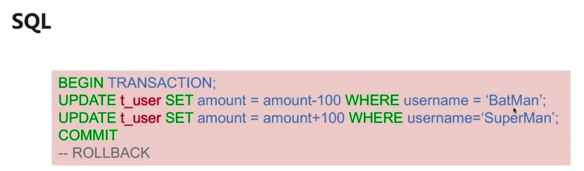

# 微服务系统的最大挑战

**数据一致性问题**

- 数据的并发访问, 修改
- 不同请求之间的数据隔离
- 多个服务共同完成的一个业务请求, 保证都完成或失败
- 发生异常时的数据回滚

# 事务的原则与实现

## 事务的原则

- A : 原子性
- C : 一致性
- I : 隔离性
- D : 持久性

**隔离级别**

- 读未提交 READ UNCOMMITED
- 读已提交 READ COMMITED
- 可重复读 
- 串行化

## SQL实现数据库事务管理

## JDBC实现事务管理

