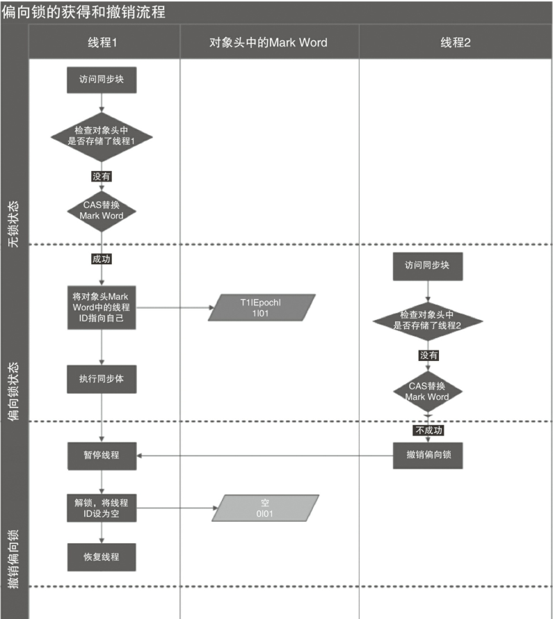
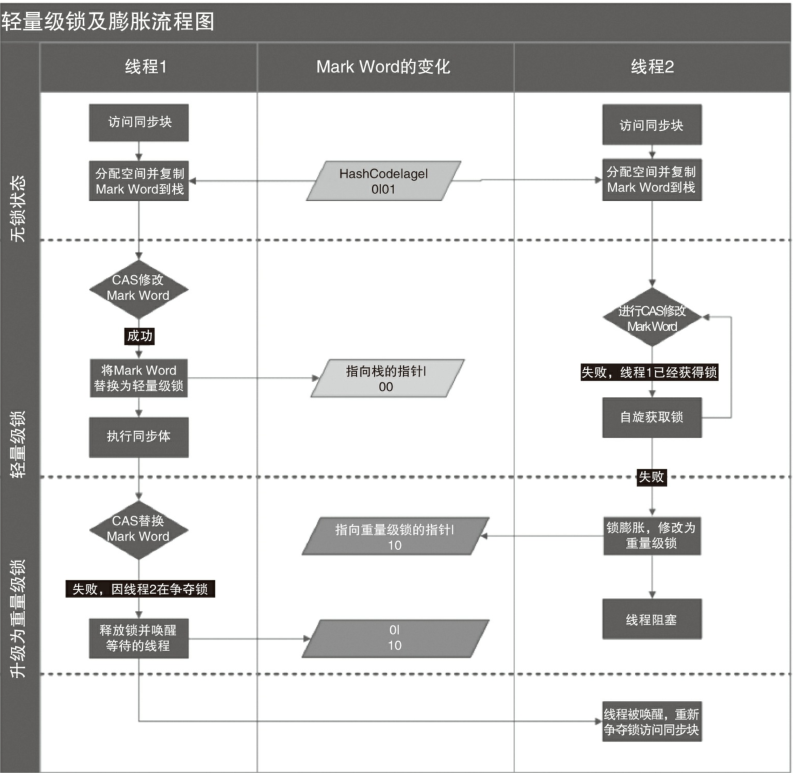

# synchronized概述

>  synchronized就是所谓的重量级锁, 但是自从jdk1.6引入了偏向锁, 轻量级锁之后, synchronized就没有那么重了。

# synchronized用法

- 对于普通同步方法，锁是当前实例对象
- 对于静态同步方法，锁是当前类的Class对象
- 对于同步方法块，锁是Synchonized括号里配置的对象

# synchronized实现原理

- 任何对象都有一个monitor与之关联，当且一个monitor被持有后，它将处于锁定状态
- 使用monitorenter和monitorexit指令实现
  - monitorenter指令是在编译后插入到同步代码块的开始位置
  - 线程执行到monitorenter指令时，将会尝试获取对象所对应的monitor的所有权，即尝试获得对象的锁
  - monitorexit是插入到方法结束处和异常处
  - JVM要保证每个monitorenter必须有对应的monitorexit与之配对
- synchronized用的锁是存在Java对象头里的
- 

# Java对象头

## Java对象头的长度

|  长  度  |         内  容         |             说  明             |
| :------: | :--------------------: | :----------------------------: |
| 32/64bit |       Mark Word        |   存储对象的hashCode或锁信息   |
| 32/64bit | Class Metadata Address |    存储到对象类型数据的指针    |
| 32/64bit |      Array length      | 数组的长度(如果当前对象是数组) |

## Java对象头的存储结构

> Java对象头里的Mark Word里默认存储对象的HashCode、分代年龄和锁标记位

**32位JVM的Mark Word的默认存储结构 :**

|  锁状态  |     25bit      |      4bit      | 1bit是否偏向锁 | 2bit锁标志位 |
| :------: | :------------: | :------------: | :------------: | :----------: |
| 无锁状态 | 对象的hashCode | 对象的分代年龄 |       0        |      01      |

**64位JVM的Mark Word的默认存储结构 :**

<table >
    <tr>
        <th rowspan="2">锁状态</th> 
        <th>25bit</th>
     	<th>31bit</th> 
        <th>1bit</th> 
     	<th>4bit</th> 
        <th>1bit</th>
        <th>2bit</th> 
   </tr>
    <tr>
        <td></td>
     	<td></td> 
        <td>cms_free</td> 
     	<td>分代年龄</td> 
        <td>偏向锁</td>
        <td>锁标志位</td> 
    </tr>
    <tr>
       <td>无锁</td> 
        <td>unused</td>
     	<td>hasCode</td> 
        <td></td> 
     	<td></td> 
        <td>0</td>
        <td>01</td> 
    </tr>
  	<tr >
       	<td>偏向锁</td> 
        <td colspan="2">ThreadID(51bit)Epoch(2bit)</td>
        <td></td> 
     	<td></td> 
        <td>1</td>
        <td>01</td> 
    </tr>
</table>

**在运行期间，Mark Word里存储的数据会随着锁标志位的变化而变化。Mark Word可能变化为存储以下4种数据:**

<table>
    <tr>
        <th align-texrowspan="2">
锁状态
</th> 
        <th colspan="2">
25bit
</th> 
     	<th rowspan="2">
4bit
</th> 
        <th>
1bit
</th>
        <th>
2bit
</th> 
   </tr>
     <tr>
        <td>23bit</td>
        <td>2bit</td>
        <td>是否偏向锁</td>
        <td>锁标志位</td>
    </tr>
    <tr>
        <td>轻量级锁</td>
        <td colspan="4">指向栈中锁记录的指针</td>
        <td>00</td>
    </tr>
    <tr>
       <td>重量级锁</td> 
	   <td colspan="4">指向互斥量(重量级锁)的指针</td>
       <td>10</td>
    </tr>
    <tr >
       	<td>GC标记</td> 
        <td colspan="4">
空
</td>
        <td>11</td> 
    </tr>
    <tr >
       	<td>偏向锁</td> 
        <td>线程ID</td>
        <td>Epoch</td> 
        <td>对象分代年龄</td>
        <td>1</td>
        <td>01</td> 
    </tr>
</table>

# 锁的升级与对比

## 锁状态

> 在JDK1.6之后, 锁存在四种状态, 级别从低到高依次是 : 
>
> - 无锁状态
> - 偏向锁状态
> - 轻量级锁状态
> - 重量级锁状态
>
> 这几个状态会随着竞争情况逐渐升级。锁可以升级但不能降级，意味着偏向锁升级成轻量级锁后不能降级成偏向锁。这种锁升级却不能降级的策略，目的是为了提高获得锁和释放锁的效率。

## 偏向锁

**偏向锁引入原因:**

> 由于大多数情况下，锁不仅不存在多线程竞争，而且总是由同一线程多次获得，为了让线程获得锁的代价更低而引入了偏向锁

### 偏向锁获取流程

**流程说明 :**

1. 线程进入同步代码块时, 先判断对象头的Mark Word是否无锁状态,是否可偏向(锁标志位01, 偏向锁状态为0), 是的话CAS设置偏向锁状态为1, 表示启用偏向锁, 并将偏向锁指向当前线程然后执行步骤6, 否则的话继续进行下面的判断
2. 判断对象头的Mark Word中是否存储着指向当前线程的偏向锁, 如果是表示获取偏向锁成功, 则执行步骤6, 否则执行步骤3
3. 判断Mark Word中偏向锁标识是否设置为1(表示当前是偏向锁), 如果是的话指向步骤4 ,否则执行步骤5
4. 尝试使用CAS将对象头的偏向锁指向当前线程, 成功表示获取偏向锁成功, 则执行步骤6, 失败则表示存在竞争, 偏向锁要升级为轻量级锁, 偏向锁撤销和升级的流程下面再进行说明
5. 表示已经不是偏向锁了, 使用CAS竞争锁
6. 执行同步代码块

### 偏向锁撤销

**线程1获取偏向锁的流程和上面偏向锁获取流程一致, 这里就省略了, 从线程2开始对上述流程做一个说明 :**

1. 线程2访问同步代码块, 发现对象头Mark Word中偏向锁标志为1, 锁标志位为01, 表示可偏向, 因为线程1已经获取了偏向锁, 这个时候对象头的状态已经由线程1更新为偏向锁状态了

2. 检查对象头中偏向锁是否指向了线程2, 发现并不是,这时还是指向线程1

3. 尝试使用CAS将对象头的偏向锁指向当前线程, CAS替换Mark Word成功表示获取偏向锁成功, 这里由于对象头中Mark Word已经指向了线程1, 所以替换失败, 需要撤销偏向锁

   > 这里关于CAS替换Mark Word这一步, 个人的理解就是, 一个偏向锁只能由一个线程获得, 如果第二个线程来试图获取偏向锁时, 偏向模式就宣告结束。根据所对象目前是否处于被锁定状态, 执行撤销偏向锁恢复到无锁状态,或者将偏向锁升级为轻量级锁状态

4. 撤销偏向锁, 需要等待全局安全点(safepoint)

5. 首先暂停拥有偏向锁的线程, 检查持有偏向锁的线程是否存活 , 如果线程存活, 则锁升级为轻量级锁, 否则进行偏向锁撤销

6. 偏向锁撤销之后, 恢复线程1,  线程2再去以偏向模式获取偏向锁

### 偏向锁关闭

- 偏向锁是默认开启的，而且开始时间一般是比应用程序启动慢几秒，如果不想有这个延迟，那么可以使用-XX:BiasedLockingStartUpDelay=0；

- 如果不想要偏向锁，那么可以通过-XX:-UseBiasedLocking = false来设置；

## 轻量级锁

### 轻量级锁加锁

> 线程在执行同步块之前，JVM会先在当前线程的栈桢中创建用于存储锁记录的空间，并将对象头中的Mark Word复制到锁记录中，官方称为Displaced Mark Word。然后线程尝试使用CAS将对象头中的Mark Word替换为指向锁记录的指针。如果成功，当前线程获得锁，如果失败，表示其他线程竞争锁，当前线程便尝试使用自旋来获取锁。

### 轻量级锁解锁

> 轻量级解锁时，会使用原子的CAS操作将Displaced Mark Word替换回到对象头，如果成功，则表示没有竞争发生。如果失败，表示当前锁存在竞争，**锁就会膨胀成重量级锁**。下图就是竞争导致锁膨胀的流程图:

> 因为自旋会消耗CPU，为了避免无用的自旋（比如获得锁的线程被阻塞住了），一旦锁升级
> 成重量级锁，就不会再恢复到轻量级锁状态。当锁处于这个状态下，其他线程试图获取锁时，
> 都会被阻塞住，当持有锁的线程释放锁之后会唤醒这些线程，被唤醒的线程就会进行新一轮
> 的夺锁之争。

## 锁对比

|    锁    |                             优点                             |                       缺点                       |               适用场景               |
| :------: | :----------------------------------------------------------: | :----------------------------------------------: | :----------------------------------: |
|  偏向锁  | 加锁和解锁不需要额外的消耗，和执行非同步方法比仅存在纳秒级的差距。 | 如果线程间存在锁竞争，会带来额外的锁撤销的消耗。 |  适用于只有一个线程访问同步块场景。  |
| 轻量级锁 |          竞争的线程不会阻塞，提高了程序的响应速度。          |  如果始终得不到锁竞争的线程使用自旋会消耗CPU。   | 追求响应时间。同步块执行速度非常快。 |
| 重量级锁 |              线程竞争不使用自旋，不会消耗CPU。               |             线程阻塞，响应时间缓慢。             |   追求吞吐量。同步块执行速度较长。   |