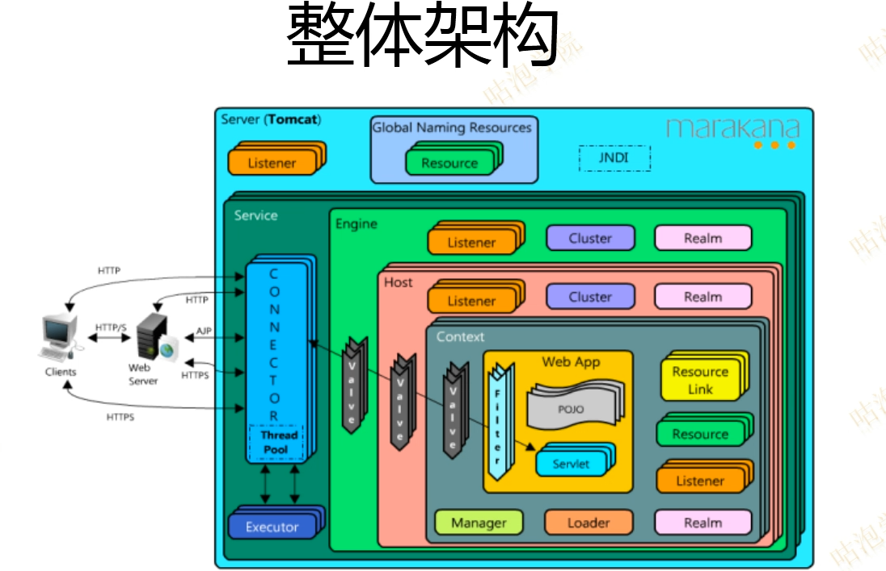

# Tomcat

## Tomcat架构



### 目录结构

#### conf目录

- `catalina.policy` : Tomcat安全策略文件，控制JVM相关权限，具体可以参考`java.security.Permission`
- `catalina.properties` : Tomcat Catalina 行为控制配置文件， 如Common ClassLoader
- `loging.properties` : Tomcat 日志配置文件，JDK Logging
- `server.xml` : Tomcat Server配置文件
  - `GlobleNamingResource` : 全局JNDI资源
- `context.xml` : 全局 Context配置文件
- `tomcat-user.xml` : Tomcat角色配置文件，=（Realm 文件实现方式）
- `web.xml` : Servlet 标准的web.xml配置文件，Tomcat默认实现部分配置：
  - `org.apache.catalina.servlets.DefaultServlet`
  - `org.apache.jasper.servlet.JspServlet`

#### lib目录

- Tomcat 存放公用类库
  - `ecj-*.jar` : Eclipse Java 编译器
  - `jasper.jar` : JSP 编译器

#### logs 目录

- `localhost.${date}.log` : 当Tomcat 应用启动不起来时，多看这个日志

#### webapps 目录

- 简化web应用部署

### 部署web应用

配置web应用访问根路径

#### 方法一 ： 放置在 `webapps`目录

#### 方法二 ： 修改 `config/server.xml`

添加 `Context`元素：

```xml
<Context docBase="${webAPPAbsolutePath}" path="/" reloadable ="true" />
<Context docBase="${webAPPAbsolutePath}" path="tomcat" reloadable ="true" />
```

*注意 : 不支持动态部署, 建议生产环境使用* 

#### 方法三 : 独立的 `Context.xml` 文件

独立context.xml 配置文件路径 : `${TOMCAT_HOME}/conf/Catalina/localhost` + `${ContextPath}`.xml

- 独立context.xml文件时, 设置`path`属性是无效的
- 设置根路径 : 独立context.xml 配置文件路径 : `${TOMCAT_HOME}/conf/${Engine.name}/${HOST.name}/ROOT.xml`

*注意 : 该方式可以实现热部署*, 建议在开发环境使用过

## 嵌入式Tomcat


### Maven插件

### API编程

### Spring Boot 嵌入式Tomcat 

## Tomcat 性能调优

### 减少配置优化

场景一 : 假设当前是一个REST应用

- Servlet
- valve

### 配置调整

- 关闭自动部署
- 

### 预编译优化

