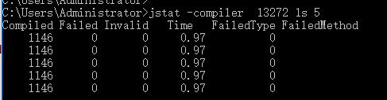

# JVM参数

## JVM参数类型

### 标准参数

### X参数

- -Xint : 解释执行
- -Xcomp : 第一次使用就编译成本地代码
- -Xmixed : 混合模式, JVM自己来决定是否编译成本地代码

### XX参数

- Boolean类型

  > - 格式 :-XX[+-]\<name>表示启用或禁用name属性
  > - 如: -XX:+UseConcMarkSweepGC, 表示启用CMS收集器, -XX:+UseG1GC, 使用G1收集器

- 非Boolean类型

  > 格式: -XX:\<name>=\<value>表示name属性的值是value

- -Xmx -Xms是XX参数而非X参数
  - -Xmx等价于-XX:InitialHeapSize, 初始堆大小
  - -Xmx等价于-XX:MaxHeapSize, 最大堆大小

## 查看JVM运行时参数

-XX:+PrintFlagsInitial : 查看初始参数

-XX:+PrintFlagsFinal : 查看最终参数

-XX:+UnlockExperimentalVMOptions : 解锁实验参数

-XX:+UnlockDiagnosticVMOptions : 解锁诊断参数

-XX:+PrintCommandLineFlag : 打印命令行参数

=表示初始值, :=表示被修改过的值 

### jps

官网文档地址: https://docs.oracle.com/javase/8/docs/technotes/tools/unix/jps.html

> 用于查看操作系统上有哪些java进程, 类似于Linux系统下的ps命令, jps也支持查看远程主机上的java进程, 这个用处不大

#### 参数

- 不加任何参数 : 显示进程id,以及main方法所在类名

  

- -q : 只显示进程id

  

- -m : 显示进程id,main方法所在类名, 以及传递给main方法的参数(如果有的话)

  

- -l : 展示类的完整路径或jar包的完整路径

  

- -v(小写的v) : 展示传递给JVM的参数, 如-Xms1024m

  

- V(大写的V) : 隐藏传递给Main方法的参数, 输出和jps是一样的

  

### jinfo

查看最大内存: jinfo -flag MaxHeapSize pid

查看垃圾回收器 : jinfo -flag UseParallelGC pid

## jstat查看JVM统计信息

官网文档地址 : https://docs.oracle.com/javase/8/docs/technotes/tools/unix/jstat.html

> 监控JVM统计信息

命令格式: **jstat** [ *generalOption* | *outputOptions vmid* [ *interval*[s|ms] [ *count* ] ]

*generalOption* : jstat命令选项,如 -help或-options

*outputOptions* : 包含一个statOption的输出选项

*vmid* : JVM的id, 即java进程id

*interval [s|ms]*: 监控间隔时间, 单位是秒或毫秒, 不加单位默认为毫秒

*count* : 表示总共监控多少次, 默认是一直执行

### 参数说明

#### 一般参数

- -help : 打印帮助信息

- -options : 展示参数列表

  

#### 输出参数

##### statOption(静态参数)

- -class : 展示类加载信息
- -compiler : 展示JVM即时编译器的一些统计信息
- -gc : 展示gc信息, 主要是堆的gc信息
- -gccapacity : 展示各代(新生代,老年代等)的容量以及相应的空间信息

- -gccause : 展示gc概要信息(类似于gcutil), 展示最后一次和当前gc事件的原因
- -gcnew : 展示新生代gc相关信息
- -gcnewcapacity : 展示新生代(new generation)容量及其对应空间
- -gcold : 展示老年代(old generation)以及元空间(metaspace)相关gc信息
- -gcoldcapacity : 展示老年代容量信息
- -gcmetacapacity : 展示元空间(metaspace)容量信息
- -gcutil : 展示gc概要信息
- -printcompilation : 展示编译方法(JIT)相关信息

##### 其他参数

- -h n : 每n行展示一次列标题
- -t : 添加一个时间戳列到第一列, 时间戳时间是从JVM启动开始计算

##### 参数输出结果说明

###### - class

- Loaded: 加载的class数量
- Bytes : 加载的class类大小, 单位KB
- Unloaded : 未加载的class数量
- Bytes : 未加载的class类大小, 单位KB

###### -compiler

- Compiled: 执行的编译任务的数量
- Failed: 编译任务失败的数量
- Invalid: 无效编译任务的数量
- Time: 用于执行编译任务的时间
- FailedType: 上次编译失败的编译类型
- FailedMethod: 上次编译失败的类名和方法

###### -gc

- S0C: 当前S0(Survivor 0)空间容量, 单位KB.

- S1C: 当前S1(Survivor 1)空间容量, 单位KB.

- S0U: S0空间使用量, 单位KB.

- S1U:  S1空间使用量, 单位KB.

- EC: 当前Eden区域容量, 单位KB.
- EU: Eden区域使用量, 单位KB.

- OC: 当前老年代容量, 单位KB.

- OU: 老年代使用量, 单位KB.

- MC: 元空间(Metaspace)容量, 单位KB.

- MU: 元空间(Metaspace)使用量, 单位KB.

- CCSC: 类指针压缩空间容量, 单位KB.

- CCSU: 类指针压缩空间容量, 单位KB.

- YGC: 新生代GC(Minor GC/Young GC)发生的次数.

- YGCT: YGC所消耗的时间, 单位s.

- FGC: Full GC发生的次数

- FGCT: Full GC消耗的时间, 单位s.

- GCT: 所有GC消耗的总时间, 单位s.

###### -gccapacity

- NGCMN: 新生代最小容量, 单位KB.  
- NGCMX: 新生代最大容量, 单位KB.  
- NGC: 当前新生代容量, 单位KB.  
- S0C: 当前S0空间(survivor 0)容量, 单位KB.  
- S1C: 当前S1空间(survivor 1)容量, 单位KB.   
- EC: 当前Eden空间容量,  单位KB.  
- OGCMN: 老年代最小容量, 单位KB. 
- OGCMX: 老年代最大容量, 单位KB.   
- OGC: 当前老年代容量, 单位KB.  
- OC: 当前老年代容量, 单位KB.  *ps:这个参数有点费解, 和OGC是一样的*
- MCMN: 元空间(metaspace )最小容量, 单位KB.  
- MCMX: 元空间(metaspace )最大容量, 单位KB.  
- MC: 当前元空间(metaspace )容量, 单位KB.  
- CCSMN: CCS(Compressed class space)区域最小容量, 单位KB.   
- CCSMX: CCS空间最大容量, 单位KB. 
- CCSC: 当前CCS空间容量, 单位KB. 
- YGC: Young GC(Minor GC)发生次数 .
- FGC: Full GC发生次数

###### -gccause

和gcutil展示信息一样, 额外添加了两列LGCC, GCC

- LGCC : 上次GC原因
- GCC : 当前GC原因

###### -gcnew

- S0C: 当前S0(Survivor 0)空间容量, 单位KB.

- S1C: 当前S1(Survivor 1)空间容量, 单位KB.

- S0U: S0空间使用量, 单位KB.

- S1U:  S1空间使用量, 单位KB.

- TT: 对象在新生代存活的次数.
- MTT: 对象在新生代存活的最大次数.
- DSS: 期望的survivor空间大小, 单位KB.

- EC: 当前Eden区域容量, 单位KB.
- EU: Eden区域使用量, 单位KB.
- YGC: 新生代GC(Minor GC/Young GC)发生的次数.

- YGCT: YGC所消耗的时间, 单位s.

###### -gcnewcapacity

- NGCMN: 新生代最小容量, 单位KB.  
- NGCMX: 新生代最大容量, 单位KB.  
- NGC: 当前新生代容量, 单位KB.  
- S0CMX: S0空间最大容量, 单位KB.  
- S0C: 当前S0空间容量, 单位KB.  
- S1CMX: S1空间最大容量, 单位KB.  
- S1C: 当前S1空间容量, 单位KB.  
- ECMX:  Eden空间最大容量, 单位KB.  
- EC: 当前Eden空间容量, 单位KB.  
- YGC: 新生代GC(Minor GC/Young GC)发生的次数.
- FGC: Full GC发生的次数

###### -gcold

- MC: 元空间(Metaspace)容量, 单位KB.
- MU: 元空间(Metaspace)使用量, 单位KB.
- CCSC: CCS空间容量, 单位KB.
- CCSU: CCS空间使用量, 单位KB.
- OC: 当前老年代容量, 单位KB.
- OU:  老年代使用量, 单位KB.
- YGC: 新生代GC(Minor GC/Young GC)发生的次数.
- FGC: Full GC发生的次数.
- FGCT: Full GC消耗的时间.
- GCT: 所有GC消耗的总时间(包含YGC和FGC).

###### -gcoldcapacity

- OGCMN: 老年代最小容量, 单位KB. 
- OGCMX: 老年代最大容量, 单位KB. 
- OGC: 当前老年代容量, 单位KB. 
- OC: 当前老年代容量, 单位KB.  ps:这个和OGC输出是一样的
- YGC: 新生代GC(Minor GC/Young GC)发生的次数.
- FGC: Full GC发生的次数.
- FGCT: Full GC消耗的时间.
- GCT: 所有GC消耗的总时间(包含YGC和FGC).

###### -gcmetacapacity

- MCMN: 元空间(Metaspace)最小容量, 单位KB. 
- MCMX: 元空间(Metaspace)最大容量, 单位KB. 
- MC: 当前元空间(Metaspace)容量, 单位KB. 
- CCSMN: CCS空间最小容量, 单位KB.
- CCSMX: CCS空间最大容量, 单位KB.
- YGC: 新生代GC(Minor GC/Young GC)发生的次数.
- FGC: Full GC发生的次数.
- FGCT: Full GC消耗的时间.
- GCT: 所有GC消耗的总时间(包含YGC和FGC).

###### -gcutil

- S0: S0(Survivor 0)空间使用百分比(相对于当前容量).
- S1: S1(Survivor 1)空间使用百分比(相对于当前容量).
- E: Eden空间使用百分比(相对于当前容量).
- 老年代空间使用百分比(相对于当前容量)..
- M:  元空间(Metaspace )使用百分比(相对于当前容量).
- CCS: CCS空间使用百分比.
- YGC: 新生代GC(Minor GC/Young GC)发生的次数

- YGCT: YGC所消耗的时间, 单位s.

- FGC: Full GC发生的次数

- FGCT: Full GC消耗的时间, 单位s.

- GCT: 所有GC消耗的总时间, 单位s.

###### -printcompilation

- Compiled: 由最近编译的方法执行的编译任务的数量.
- Size: 最近编译的方法的字节码的字节数.
- Type: 最近编译的方法的编译类型.
- Method: 标识最近编译的方法的类名和方法名. 

## jmap+MAT分析内存溢出

- 导出内存映像文件 : -XX:+HeapDumpOnOutOfMemoryError, -XX:HeapDumpPath=./
- 使用jmap命令手动导出 : jmap -dump:format

# Btrace

- 拦截普通方法 : @OnMethod(clazz="", method="")
- 拦截构造方法 : @OnMethod(clazz="", method="<init>")
- 拦截同名函数 : 使用参数区分

## 拦截时机

- Kind.ENTRY : 入口拦截, 默认值
- Kind.RETURN : 返回
- Kind.THROW : 异常
- Kind.Line : 行

## 拦截复杂参数, 环境变量, 正则匹配规则

- 简单类型 : 直接获取
- 复杂类型 : 使用反射获取  

## 注意事项

- 默认只能本地运行
- 生产环境下可以使用, 但是被修改的字节码不会被还原

# Tomcat性能监控与调优

