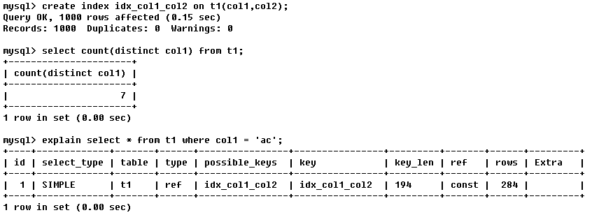

# MySQL Query Optimizer简介

- MySQL中有专门负责优化SELECT语句的优化器模块, 主要功能 : 通过计算分析系统中收集到的统计信息, 为客户端请求的Query提供它认为最优的执行计划
- 当客户端向MySQL请求一条Query, 命令解析器模块完成请求分类, 区别出事SELECT并转发给MySQL Query Optimizer时, MySQL Query Optimizer首先会对整条Query进行优化, 处理掉一些常量表达式的预算, 直接换算成常量值。并对Query中的查询条件进行简化和转换, 如去掉一些无用而显而易见的条件, 结构调整等。然后分析Query中的Hint信息(如果有), 看显示Hint信息是否可以完全确定该Query的执行计划。如果没有Hint或Hint信息还不足以完全确定执行计划, 则会读取所涉及对象的统计信息, 根据Query进行相应的计算分析, 然后再得出最后的执行计划。

# MySQL常见瓶颈

- CPU : CPU在饱和的时候一般发生在数据装入内存或从磁盘上读取数据的时候
- IO : 磁盘I/O瓶颈发生装入数据远大于内存容量的时候
- 服务器硬件的性能瓶颈 : top, free, iostat和vmstat等命令来查看系统性能状态
- 程序中SQL语句问题, Explain查看执行计划

上面的三个问题一般会有对应的运维人员去处理, 作为开发人员最需要关注的是SQL问题

# 覆盖索引(Covering Index), 又称为索引覆盖

这个概念下面需要用到,先放在这里

> - 理解方式一 : 就是SELECT的数据列只用从索引中就能够取到, 不必读取数据行, MySQL可以利用索引返回SELECT列表中的字段, 而不必根据索引再次读取数据文件, 换句话说, 查询列要被所建的索引覆盖。
> - 理解方式二 : 索引是高效找到行的一个方法, 但是一般数据库也能使用索引找到一个列的数据, 因此它不必读取整个行。毕竟索引的叶子节点存储了它们索引的数据; 当能通过读取索引就可以得到想要的数据, 那就不需要读取行了。一个索引包含了(或覆盖了)满足查询结果的数据就叫做覆盖索引

**注意 :** 

> 如果要使用覆盖索引, 一定要注意SELECT列表中只取出需要的列, 不能SELECT *, 因为如果将所有字段一起做索引会导致索引文件过大, 查询性能下降。

# 执行计划(Explain)详解

## 简介

> 使用EXPLAIN关键字可以模拟优化器执行SQL的查询语句, 从而知道MySQL是如何处理你的SQL语句的。分析你的查询语句或是表结构的性能瓶颈

## Explain能得到哪些信息

- 表的读取顺序
- 数据读取操作的操作类型
- 哪些索引可以使用
- 哪些索引被实际使用
- 表之间的引用
- 每张表有多少行被优化器查询

## 使用方法

- explain + SQL语句

**执行计划包含的信息:**

## 执行计划信息详解

### id

> select查询的序列号, 包含一组数字, 表示查询中执行select子句或操作表的顺序

- **id相同 :** 执行顺序由上向下

  

- **id不同** :  如果是子查询, id序号会递增, id值越大, 优先级越高, 越先被执行

  

- **ID相同不同, 同时存在 :** id如果相同.可以认为是一组, 从上往下顺序执行; 在所有组中, id值越大, 优先级越高, 越先执行

  

  > derived表示衍生, 第一行中的derived2表示, 这个虚表是由id为2的语句所衍生的

### select_type

> 查询的类别, 主要用于区别普通查询, 联合查询, 子查询等复杂查询

- **SIMPLE :** 简单的select查询, 查询中不包含子查询或者UNION
- **PRIMARY :** 查询中包含任何负责的子查询, 最外层查询被标记为PRIMARY
- **SUBQUERY :** 在SELECT或WHERE列表中包含子查询
- **DERIVED :** 在FROM列表中包含的子查询被标记为DERIVED(衍生), MySQL会递归执行这些子查询, 把结果放在临时表里
- **UNION :** 若第二个SELECT出现在UNION之后, 则被标记为UNION; 若UNION包含在FROM子句的子查询中, 外层SELECT被标记为 : DERIVED
- **UNION RESULT :** 从UNION表获取结果的SELECT

### table

> 显示这一行的数据是关于哪张表的

### type

> 访问类型, 显示查询使用了何种类型, **从最好到最差依次是 :** 
>
> system>const>eq_ref>ref>range>index>ALL
>
> **一般来说, 要保证查询至少达到range级别, 最好能达到ref**

- **system :** 表只有一行记录(等于系统表), 这是const类型的特例, 平时不会出现

- **const :** 表示通过索引依次就找到了, const用于比较primary key或者unique索引。因为只匹配一行数据, 索引很快, 如将主键置于where列表中, MySQL就能将该查询转换为一个常量

  

- **eq_ref :** 唯一性索引扫描, 对于每个索引键, 表中只有一条记录与之匹配。常见于主键或唯一索引扫描

  

- **ref :** 非唯一性索引扫描, 返回匹配某个单独值的所有行。本质上也是一种索引访问, 它返回所有匹配某个单独值的行, 可能会找到多个符合条件的行, 所以这个应该属于查找和扫描的混合体

  

- **range :** 只检索给定范围的行, 使用一个索引来选择行。key列显示使用了哪个索引, 一般就是在where语句中出现了between, < ,> ,in等的查询。这种范围索引扫描比全表扫描要好, 因为它只需要开始于索引的某一点, 而结束于另一点, 不用扫描全部索引。

  

- **index :** Full Index Scan, index与ALL的区别为index类型只遍历索引树。这通常比ALL快, 因为索引文件通常比数据文件小。(也就是说虽然ALL和Index都是读全表, 但index是从索引中读取的, 而all是从硬盘中读取的)

  

-  **ALL :** Full Table Scan(全表扫描), 将遍历全表以找到匹配的行

  

### possible_keys, key

**possible_keys :** 

> 显示可能应用在这张表中的索引, 一个或多个。
>
> 查询涉及到的字段是若存在索引, 则该索引将被列出, **但不一定被查询实际使用**

**key :**

> 实际使用的索引, 如果为NULL, 则没有使用索引。
>
> 查询中若使用了覆盖索引, 则该索引仅出现在key列表中

**覆盖索引演示 :**

### key_len 

> - 表示索引中使用的字节数, 可通过该列计算查询中使用的索引的长度。在不损失精确性的情况下, 长度越短越好。
> - key_len显示的值为索引字段的最大可能长度, **并非实际使用长度**, 即key_len是根据表定义计算而得, 不是通过表内检索获得的

### ref

> 显示索引的哪一列被使用了, 如果可能的话, 最好是一个常数。哪些列或常量被用于查找索引列上的值

### rows

> 根据表统计信息及索引选用情况, 大致估算出找到所需记录所需要读取的行数

### Extra

> 包含不适合在其他列中显示但十分重要的额外信息

- Using filesort : 说明MySQL会对数据使用一个外部的索引排序, 而不是按照表内索引顺序进行读取。MySQL中无法利用索引完成的排序操作称为"文件排序"。

  

- Using temporary : 使用了临时表保存中间结果, MySQL在对查询结果排序时使用了临时表。常见于排序order by和分组查询group by。 

  

- Using index : 表示相应的SELECT操作中使用了覆盖索引(Covering Index), 避免了访问表的数据行, 效率还可以

  如果同时出现Using where, 表明索引被用来执行索引键值的查找;

  如果没有出现同时出现Using where, 表明索引用来读取数据而非执行查找动作

  

- Using where : 使用了where过滤
- Using join buffer : 使用了连接缓存
- Impossible WHERE : where子句值总是false, 不能用来获取任何数据, 如name='张三' and name='李四'
- SELECT tables optimized away : 在没有group by子句的情况下, 基于索引优化MIN/MAx操作或者对于MyIsam存储引擎优化COUNT(*)操作, 不必等到执行阶段再进行计算, 查询执行计划生成阶段即完成优化。
- distinct : 优化distinct操作, 在找到第一匹配的元组后即停止找同样值的动作

# 慢查询日志

- MySQL的慢查询日志是MySQL提供的一种日志记录, 它用来记录在MySQL中响应时间超过阈值的语句, 具体指运行时间超过long_query_time值的SQL, 则会被记录到慢查询日志中。
- long_query_time的默认值为10, 意思是运行10秒以上的语句。
- 根据慢查询查询出来的SQL语句, 结合explain进行全面分析