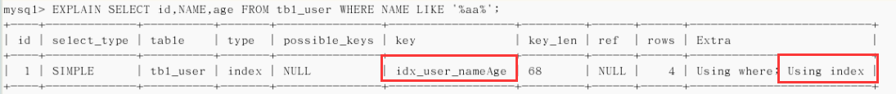
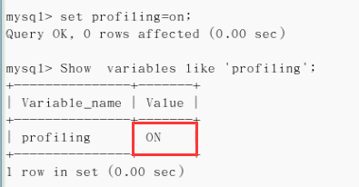

# 索引定义

- 在数据之外, 数据库系统还维护着满足特定查找算法的数据结构, 这些数据结构以某种方式引用(指向)数据, 这样就可以在这些数据结构上实现高级查找算法。这种数据结构, 就是索引。

- 一般来说索引本身也很大, 不可能全部存储在内存中, 因此索引往往以索引文件的形式存储在磁盘上

- 平常所说的索引, 如果没有特别指明的话, 一般都是B树(多路搜索树)结构的索引。其中聚集索引,次要索引,复合索引,前缀索引, 唯一索引默认都是使用B+树索引, 统称索引。

# 索引的优劣势

## 优势

- 提高数据检索效率, 降低数据库IO成本
- 通过索引列队数据进行排序, 降低了数据排序的成本, 降低了CPU消耗

## 劣势

- 实际上索引也是一张表, 该表保存了主键与索引字段, 并指向实体表的记录, 所以索引列也是要占用空间的
- 虽然索引大大提高了查询速度, 同时却会降低更新表的速度, 如对表进行INSERT, UPDATE和DELETE。因为更新表时,MySQL不仅要保存数据, 还要保存一下索引文件每次更新添加了索引列的字段, 都会调整因为更新锁带来的键值变化后的索引信息
- 索引只是提高效率的一个因素, 如果MySQL有大数据量的表, 就需要花时间建立最优秀的索引, 或优化查询语句

# 索引分类

- 单值索引 : 一个索引只包含单列, 一个表可以有多个单列索引
- 唯一索引 : 索引列的值必须唯一, 但允许有空值
- 复合索引 : 一个索引包含多个列

## 索引语法

**创建索引:**

```SQL
-- 两种方式, 加了UNIQUE表示唯一索引, 不加表示普通索引
CREATE [UNIQUE] INDEX indexName ON tableName(columnname(length));
ALTER tableName ADD [UNIQUE] INDEX indexName ON (columnname(length));
```

**删除索引 :**

```SQL
DROP INDEX indexName ON tableName
```

**查看索引 :**

```SQL
SHOW INDEX FROM tableName\G
```


# 索引结构

- BTree索引
- Hash索引
- full-text全文索引
- R-Tree索引

# 索引创建情况

## 需要创建索引的情况

- 主键自动建立唯一索引
- 频繁作为查询条件的字段应该创建索引
- 查询中与其它表关联的字段, 外键关系建立索引
- 单值/组合索引选择问题,  优先选择复合索引
- 查询中排序的字段, 排序字段若通过索引访问将大大提高排序速度
- 查询中统计或者分组的字段(分组之前需要先排序的)

**不需要创建索引的情况 :**

- 表记录太少, 不需要创建索引
- 经常增删改的表, 不需要创建索引, 因为每次更新不单单是更新了记录还会更新索引

- 数据重复且分布平均的表字段, 如果某个数据列包含许多重复的内容, 为它建立索引就没有太大的实际效果。因此应该只为最经常查询和最经常排序的数据列建立索引。
- where条件里用不到的字段不创建索引

# 避免索引失效

- **全值匹配最优 :** 用于查询的条件和顺序最好和索引顺序和个数一致

- **最佳左前缀法则 :** 如果索引了多列, 要遵守最佳左前缀法则。指的是查询从索引的最左前列开始并且**不跳过索引中的列。**如果最左边的列没有包含, 会造成索引失效。

  

- **不在索引列上做任何操作(计算, 函数, (自动或手动)类型转换)**, 会导致索引失效而转向全表扫描

  

- **存储引擎不能使用索引中范围条件右边的列 :** 复合索引中有列使用了范围条件, 则该列之后的索引全部失效, 只能用到该列之前的部分索引

  

- 尽量使用覆盖索引(只访问索引的查询(索引列和查询列一致)), 减少SELECT *

  

- MySQL在使用不等于(!=或<>)的时候无法使用索引会导致全表扫描

  

- is null, is not null也无法使用索引

    

- like以通配符开头('%abc...'), MySQL索引失效会变成全表扫描的操作; %最好写右边;如果确实需要用两边%, 推荐使用覆盖索引

  

  

- 字符串不加单引号索引失效(底层做了自动类型转换)

   

- 少用or, 用它来连接时会索引失效

# 索引优化建议

## 一般性建议

- 对于单值索引, 尽量选择针对当前查询过滤性更好的索引
- 在选择组合索引的时候, 当前查询中过滤性最好的字段在索引字段顺序中, 位置越靠前越好
- 在选择组合索引的时候, 尽量选择可以能够包含当前查询中where子句中更多字段的索引
- 尽可能通过分析统计信息和调整查询的写法来达到选择合适索引的目的

- 永远小表驱动大表, 即小的数据集驱动大的数据集, 类似嵌套循环Nested Loop

## ORDER BY排序优化

- ORDER BY子句, 尽量使用Index方式排序, 避免使用FileSort方式排序

  > - MySQL支持两种方式的排序, FileSort和Index, Index效率高。它指MySQL扫描索引本身完成排序。FileSort效率低。
  > - ORDER BY满足两种情况, 会使用Index方式排序:
  >   1. ORDER BY语句使用索引最左前列
  >   2. 使用WHERE子句与ORDER BY子句条件列组合满足最佳左前缀法则

- 尽可能在索引列上完成排序操作, 遵照索引建立的最佳左前缀法则

- 如果不在索引列上, filesort有两种算法, 双路排序和单路排序

  > **双路排序 :** 
  >
  > - MySQL4.1之前使用双路排序, 字面意思就是两次扫描磁盘, 最终得到数据, 读取行指针和ORDER BY列, 对它们进行排序, 然后扫描已排序好的列表, 按照列表中的值从重新从列表中读取对应的数据输出。
  >
  > - 从磁盘去排序字段, 在buffer进行排序, 再从磁盘取其他字段。
  > - 取一批数据, 要对磁盘进行两次扫描, 众所周知, IO是很耗时的, 所以在MySQL4.1之后, 出现了第二种改进的算法, 就是单路排序
  >
  > **单路排序 :**
  >
  > - 从磁盘读取查询所需要的所有列, 按照ORDER BY列在buffer对它们进行排序, 然后扫描排序后的列表进行输出, 它的效率更快一些, 避免了第二次读取数据。并且把随机IO变成了顺序IO, 但是它会使用更多的空间, 因为它把每一行都保存在内存中了。
  >
  >  **总结 :**
  >
  > - 总体而言, 单路好过双路
  > - **单路排序存在问题 :** 在sort_buffer中, 单路比双路要多占用很多空间, 因为单路是把所有字段都取出, 所以有可能取出的数据的总大小超出了sort_buffer的容量, 导致每次只能取sort_buffer容量大小的数据, 进行排序(创建tmp文件, 多路合并), 排完再去取sort_buffer容量的大小, 循环多次, 从而导致多次IO, 本想节约一次IO, 反而导致了大量的IO操作, 反而得不偿失
  >
  > **优化策略 :**
  >
  > - 增大sort_buffer_size参数的设置
  > - 增大max_length_for_sort_data参数的设置

### 提高ORDER BY的速度

- 为排序使用索引

  > 1. MySQL两种排序方式 : 文件排序或扫描有序索引排序
  > 2. MySQL能为排序与查询使用相同的索引

  

- ORDER BY是使用SELECT *是一个大忌, 值查询需要的字段, 这点非常重要

  > 1. 当查询的字段大小综合小于max_length_for_sort_data而且排序字段不是TEXT|BLOB时, 会用改进后的算法, 单路排序, 否则用老算法-多路排序
  > 2. 两种算法的数据都有可能超出sort_buffer的容量, 超出之后, 会创建tmp文件进行合并排序, 导致多次IO, 但用单路排序算法的风险会更大一点, 所以要提高sort_buffer_size

- 尝试提高sort_buffer_size, 不管用哪种算法, 提高这个参数都会提高效率, 当然, 要根据系统能力去提高, 因为这个参数是针对每个进程的
- 尝试提高max_length_for_sort_data, 提高这个参数, 会增加改用改进算法的概率。但是如果设的太高, 数据总容量超出sort_buffer_size的概率就增大, 明显症状是高的磁盘IO活动和低的CPU使用率

## GROUP BY分组优化

- 当无法使用索引列, 增大max_length_for_sort_data参数的设置+增大sort_buffer_size的参数设置
- WHERE高于HAVING, 能写在where限定的条件就不要去HAVING限定了
- GROUP BY实质是先排序后进行分组, 遵照索引建的最佳左前缀法则, 所以其他的特点参考ORDER BY优化即可

# Show Profile

- 是MySQL提供的可以用来分析当前会话中语句执行的资源消耗情况。可以用于SQL的调优测量
- 默认情况下, 参数处于关闭状态, 并保存最近15次的运行结果

## 分析步骤

1. 查看当前MySQL版本是否支持, Show variables like 'profiling'

   

2. 开启功能, 默认是关闭的, 命令: set profiling=on;

   

3. 运行SQL

4. 查看结果, show profiles 

   

5. 诊断SQL, show profile cpu, block io for query [query_id], query_id表示上一步中查询的SQL的ID

   

   > **参数详解 :**
   >
   > ALL : 显示所有的开销信息
   >
   > BLOCK IO : 显示块IO相关的开销
   >
   > CONTEXT SWITCHES : 上下文切换相关开销
   >
   > CPU : 显示CPU相关开销信息
   >
   > IPC : 显示发送和接收相关开销信息
   >
   > MEMORY : 显示内存相关开销信息
   >
   > PAGE FAULTS : 显示页面错误相关开销信息
   >
   > SOURCE : 显示和Source_function, Source_file, Source_line相关的开销信息
   >
   > SWAPS : 显示交换次数相关的开销信息

6. 日常开发需要注意的结论

   > - converting HEAP to MyISAM : 查询结果太大, 内存不够用了, 需要往磁盘上搬
   > - Creating tmp table : 创建临时表, 拷贝数据到临时表, 用完之后再删除
   > - Copying to tmp table on disk : 把内存中临时表复制到磁盘
   > - locked

   

# 全局查询日志

- 配置启用

  > 在mysql的my.cnf中设置如下:
  >
  > \# 开启
  >
  > general_log=1
  >
  > \# 记录日志文件路径
  >
  > general_log_file=/path/logfile
  >
  > \# 输出格式
  >
  > log_output=FILE

- 编码启用

  ```SQL
  set global general_log=1;
  set global log_out_put='TABLE';
  # 此后, 你所编写的SQL语句将会记录到MySQL库里的general_log表, 可以用下面的命令从查看
  SELECT * FROM MYSQL.GENERAL_LOG;
  ```

   

- **不要在生产环境使用**