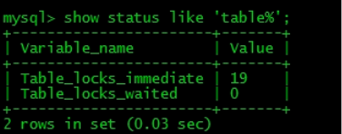
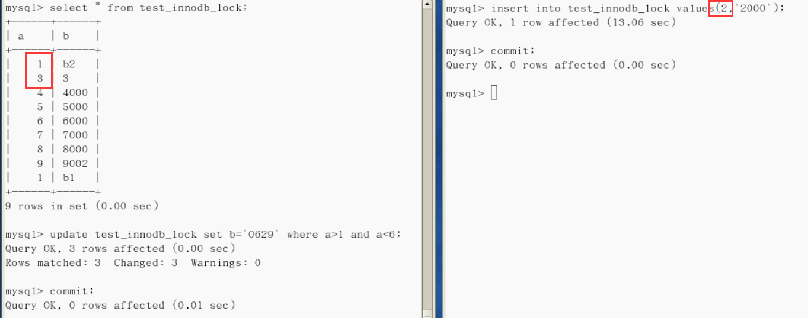

# 概述

> 锁是计算机协调多个进程或线程并发访问某一资源的机制。
>
> 在数据库中, 出传统的计算资源(如CPU, RAM, IO等)的争用以外, 数据也是一种供许多用户共享的资源。如何保证数据并发访问的一致性, 有效性是所有数据库必须解决的一个问题, 锁冲突也是影响数据库并发访问性能的一个重要因素。从这个角度来说, 锁对数据库而言显得尤其重要, 也更加复杂。

# 锁的分类

## 按照数据操作类型分类

读锁(共享锁) : 针对同一份数据, 多个读操作可以同时进行而不会互相影响。

写锁(排他锁) : 当前写操作没有完成前, 会阻断其他写锁和读锁

## 按照数据操作粒度来分

### 表锁(偏读)

> MyISAM存储引擎, 开销小, 加锁快, 无死锁; 锁定粒度大, 发生锁冲突概率最高, 并发度最低。

- MyISAM在执行查询语句前, 会自动给涉及的所有表加读锁, 在执行增删改操作前, 会自动给涉及的表加写锁。

- MySQL的表级锁有两种模式:

  > - 表共享读锁(Table Read Lock)
  >
  > - 表独占写锁(Table Write Lock)
  >
  >   | 锁类型 | 是否兼容 | 读锁 | 写锁 |
  >   | :----: | :------: | :--: | :--: |
  >   |  读锁  |    是    |  是  |  否  |
  >   |  写锁  |    是    |  否  |  否  |

**总结:**

> 结合上表, 所以对MyISAM表进行操作, 会有以下情况 :
>
> - 对MyISAM表的读操作(加读锁), 不会阻塞其他进程对同一表的读请求, 但会阻塞对同一表的写请求。只有当读锁释放后, 才会执行其它进程的写操作
>
> - 对MyISAM表的写操作(加写锁), 会阻塞其他进程对同一表的读和写操作, 只有当写锁释放后, 才会执行其它进程的读写操作
>
>   **简而言之, 就是读锁会阻塞写, 但是不会阻塞读。而写锁则会把读和写都阻塞。**

#### 表锁分析

- 查看哪些表被加锁了 : show open tables

- 如何分析表锁定 : 可以通过检查table_locks_waited和table_locks_immediate状态变量来分析系统上的表锁定, 使用命令 : show status like 'table%';

  > table_locks_immediate : 产生表级锁定的次数, 表示可以立即获取锁的查询次数, 每立即获取锁值加1
  >
  > table_locks_waited : 出现表级锁定争用而发生等待多的次数(不能立即获取锁的次数, 每等待一次锁值加1), 此值高则说明存在着较严重的表级锁争用情况。

  

- 此外, MyISAM的读写锁调度室写优先, 这也是MyISAM不适合作为偏写的引擎。因为写锁后, 其他线程不能做任何操作, 大量更新会使查询很难得到锁, 从而造成永久阻塞

### 行锁

> - 偏写InnoDB存储引擎, 开销大, 加锁慢; 会出现死锁; 锁定粒度最小, 发生锁冲突的概率最低, 并发度也最高
> - InnoDB与MyISAM的最大不同有两点 : 一是支持事务(TRANSACTION); 二是采用了行级锁
> - 索引失效会导致行锁变成表锁, 最常见的情况, varchar字段没写引号
> - 可以使用SELECT xxx for update手动锁定一行, 在锁定某一行后, 其他的操作会被阻塞, 直到锁定行的会话提交commit;

#### 行锁分析

- 通过检查InnoDB_row_lock状态变量来分析系统上行锁的争夺情况

- 使用命令show status like 'InnoDB_row_lock%';

- 对各个状态量含义如下: 

  > - InnoDB_row_lock_current_waits : 当前正在等待锁定的数量;
  > - InnoDB_row_lock_time : 从系统启动到现在锁定总时间长度;
  > - InnoDB_row_lock_time_avg : 每次等待所花平均时间;
  > - InnoDB_row_lock_time_max : 从系统启动到现在等待最长的一次所花的时间
  > - InnoDB_row_lock_waits : 系统启动后到现在总共等待的次数;
  >
  > 对于这5个状态变量, 比较重要的是**InnoDB_row_lock_time_avg(等待平均时长), InnoDB_row_lock_waits (等待总次数), InnoDB_row_lock_time(等待总时长)**这三项
  >
  > 尤其当等待次数很高, 而且每次等待时长也不小的时候, 我们就需要分析系统中为什么会有如此多的等待, 然后根据分析结果着手制定优化计划。

#### 优化建议

- 尽可能让所有的数据检索都通过索引来完成, 避免无索引行锁升级为表锁
- 合理设计索引, 尽量缩小锁的范围
- 尽可能减少检索条件, 避免间隙锁
- 尽量控制事务大小, 减少锁定资源量和时间长度
- 尽可能低级别事务隔离

### 间隙锁

> **定义 :**
>
> 当我们用范围条件而不是相等条件检索数据, 并请求共享或排他锁时, InnoDB会给符合条件的已有数据记录的索引项加锁; 对于键值在这个条件范围内, 但并不存在的记录, 叫做"间隙(GAP)", InnoDB也会对这个"间隙"加锁, 这种锁机制就是所谓的间隙锁(Next-Key锁)。
>
> **危害 :**
>
> 因为查询执行过程中通过范围查找的话, 会锁定整个范围内所有的索引值, 即使这个简直并不存在。间隙锁有一个比较致命的弱点, 就是当锁定一个范围键值之后, 即使某些不存在的键值也会被无辜的锁定, 而造成在锁定的时候无法插入锁定键值范围内的任何数据。在某些场景下这可能会对性能造成很大的危害。

**间隙锁演示:** 

### 页锁

> - 开销和加锁时间介于表锁和行锁之间; 
> - 会出现死锁
> - 锁定粒度介于表锁和行锁之间, 并发度一般
> - 简单了解即可

