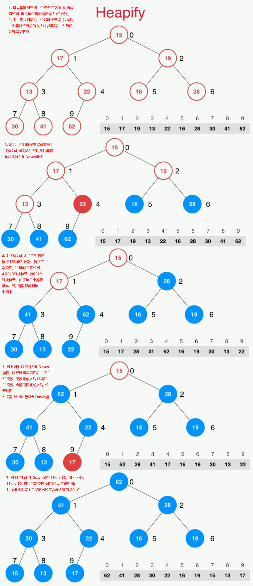
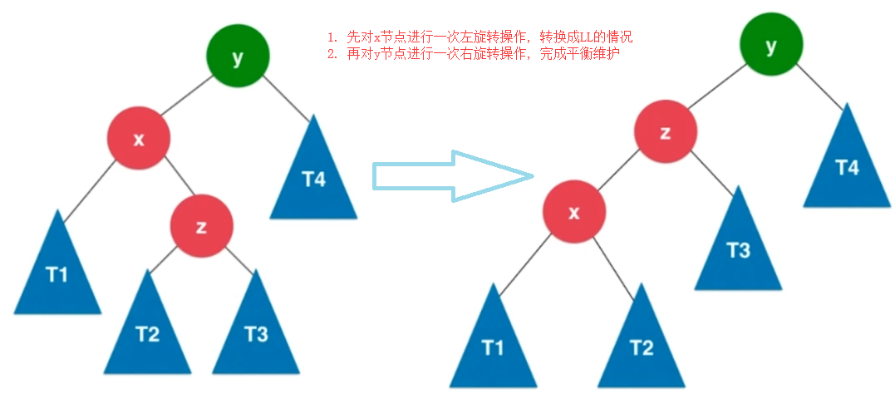

# 二分搜索树(Binary Search Tree)

### 特点

- 动态数据结构

- 是一颗二叉树

- 二分搜索树的每个节点的值:

  > - 每个节点的值都大于其左子树的所有节点的值
  > - 每个节点的值都小于其右子树的所有节点的值

- 每一颗子树也是二分搜索树

- 存储的元素必须有可比较性, Java中的话就要求二分搜索树保存的数据类型要实现Comparable接口, 或者使用额外的比较器实现

- 一般二分搜索树不包含重复元素, 当然也可以定义包含重复元素的二分搜索树

  > 如果想要包含重复元素的话, 只需要定义二分搜索树的左节点的值小于等于当前节点的值或右节点的值大于等于当前节点即可

- 二分搜索树天然的具有递归特性

**下面是二分搜索树的几个样例 :**


## 操作

在进行相关操作之前, 先定义一个支持泛型的节点类, 用于存储二分搜索树每个节点的信息, 这个类作为二分搜索树的一个内部类, 二分搜索树的类声明以及Node节点类声明如下:

```java
/**
 * 递归实现二分搜索树
 * 这里设计的树是不存储重复元素的, 重复添加元素只保存一个
 * @author 七夜雪
 *
 */
public class BSTree<E extends Comparable<E>> {
	
	// 根节点
	private Node root ;
	// 树容量
	private int size ;
	
	public BSTree() {
		this.root = null ;
		this.size = 0 ;
	}
	
	public boolean isEmpty() {
		return size == 0 ;
	}
	
	public int getSize(){
		return size;
	}
    
    /**
	 * 二分搜索树节点类
	 * @author 七夜雪
	 *
	 */
	private class Node {
		public E	e ;
		// 左右子树
		public Node	left , right ;
		
		public Node(E e) {
			this.e = e ;
			this.left = null ;
			this.right = null ;
		}
	}
}
```


### 添加元素

由于二分搜索树本身的递归特性, 所以可以很方便的使用递归实现向二分搜索树中添加元素, 步骤如下:

- 定义一个公共的add方法, 用于添加元素

- 定义一个递归的add方法用于实际向二分搜索树中添加元素

  > 对于这个递归方法, 设定的方法语义为,向以node为根节点的树上添加一个元素, 并返回插入新节点后的二分搜索树的根节点

具体代码实现如下,:

```java
// 类声明 : public class BSTree<E extends Comparable<E>>
	
	/**
	 * 向二分搜索树上添加节点,
	 * @param e
	 */
	public void add(E e) {
		root = add(root, e) ;
	}
	
	/**
	 * 向以node节点为根节点的树上添加元素E
	 * 递归方法
	 * @param node
	 * @param e
	 * @return 返回插入新节点后的二分搜索树的根节点
	 */
	private Node add(Node node, E e) {
		/*
         * 递归终止条件, node为null, 表示查找到要添加的节点了
		if (node == null) {
			size++ ;
			return new Node(e) ;
		}
		
		// 添加的元素小于当前元素, 向左递归
		if (node.e.compareTo(e) > 0) {
			/*
             * 由于递归的add方法的语义是添加新元素, 并返回新的二分搜索树的根节点
			 * 所以这里需要使用node.left = add(node.left, e), 接收递归方法返回的值
			 */
			node.left = add(node.left, e) ;
			// 添加的元素小于当前元素, 向右递归
		} else if (node.e.compareTo(e) < 0) {
        	// 和向左递归一个道理
			node.right = add(node.right, e) ;
		}
		// 由于定义的二分搜索树不保存重复元素, 所以针对node.e.compareTo(e) == 0的这种情况这里不做任何处理
		return node ;
	}
```

### 查找元素

由于二分搜索树没有下标, 所以针对二分搜索树的查找操作, 这里定义一个contains方法, 查看二分搜索树是否包含某个元素, 返回一个布尔型变量, 这个查找的操作一样是一个递归的过程, 具体代码实现如下:

```java
	/**
	 * 判断树中是否包含元素e
	 * @param e
	 * @return
	 */
	public boolean contains(E e) {
		return contains(root, e) ;
	}
	
	/**
	 * 判断以node为根节点的二分搜索树中是否包含元素e
	 * 递归方法
	 * @param node
	 * @param e
	 * @return
	 */
	private boolean contains(Node node, E e) {
		// 递归终结条件, 当node等于null时, 表示已经查询到根节点了, 但是没有找到对应的元素E
		if (node == null) { 
			return false ; 
		}
		
        // 递归终结条件
		if (node.e.compareTo(e) == 0) { // node.e == e
			return true;
        // 根据二分搜索树特性, e小于当前节点的值时, 向左递归
		} else if (node.e.compareTo(e) > 0) { // node.e > e
			return contains(node.left, e) ;
        // 根据二分搜索树特性, e大于当前节点的值时, 向右递归
		} else { // node.e < e
			return contains(node.right, e) ;
		} 
		
	}
```

### 遍历操作

- 遍历操作就是把所有的节点都访问一遍

- 访问的原因和业务相关

- 遍历分类

  > **深度优先遍历 :**
  >
  > - 前序遍历 : 对当前节点的遍历在对左右孩子节点的遍历之前, 遍历顺序 : 当前节点->左孩子->右孩子
  > - 中序遍历 : 对当前节点的遍历在对左右孩子节点的遍历中间, 遍历顺序 : 左孩子->当前节点->右孩子
  > - 后序遍历 : 对当前节点的遍历在对左右孩子节点的遍历之后, 遍历顺序 : 左孩子->右孩子->当前节点
  >
  > **广度优先遍历 :**
  >
  > - 层序遍历 : 按层从左到右进行遍历

#### 前序遍历

- 最自然的遍历方式
- 最常用的遍历方式

这里一样使用递归来实现遍历, 对于一颗二分搜索树进行遍历, 如果要使用非递归方式实现的话, 可以使用一个栈来赋值进行遍历, 代码如下:

```java
	/**
	 * 前序遍历树
	 */
	public void preOrder() {
		preOrder(root) ;
	}
	
	/**
	 * 
	 * 前序遍历的递归方法, 深度优先
	 * 前序遍历是指,先访问当前节点, 然后再访问左右子节点
	 * @param node
	 */
	private void preOrder(Node node) {
		// 递归终止条件
		if (node == null) { 
			return ; 
		}
		
		// 1. 前序遍历先访问当前节点
		System.out.println(node.e) ;
		// 2. 前序遍历访问左孩子
		preOrder(node.left) ;
		// 3. 前序遍历访问右孩子
		preOrder(node.right) ;
	}
```

**非递归写法 :**

```java
	/**
	 * 前序遍历的非递归方法, 深度优先
	 * 这里使用栈进行辅助实现
	 * 前序遍历是指,先访问当前节点, 然后再访问左右子节点
	 */
	public void preOrderNr() {
		// 使用栈辅助实现前序遍历
		Stack<Node> stack = new Stack<>();
		/*
		 * 前序遍历的过程就是先访问当前节点, 然后再访问左子树, 然后右子树
		 * 所以使用栈实现时, 可以先将当前节点入栈, 当前节点出栈时, 
		 * 分别将当前节点的右孩子, 左孩子压入栈
		 */
		// 首先将根节点压入栈
		stack.push(root);
		while (!stack.isEmpty()) {
			Node cur = stack.pop();
			// 前序遍历当前节点
			System.out.println(cur.e) ;
			// 由于栈是后入先出, 前序遍历是先左孩子, 再右孩子, 所以这里需要先将右孩子压入栈
			if (cur.right != null) {
				stack.push(cur.right);
			}
			
			if (cur.left != null) {
				stack.push(cur.left);
			}
			
		}
		
	}
```

#### 中序遍历

- 二分搜索树的中序遍历的结果是顺序的

```java
	/**
	 * 中序遍历树, 深度优先
	 */
	public void inOrder() {
		inOrder(root) ;
	}
	
	/**
	 * 
	 * 中序遍历的递归方法, 深度优先
	 * 中序遍历指的是访问当前元素的顺序放在访问左右子节点之间
	 * 中序遍历的结果是有序的
	 * @param node
	 */
	private void inOrder(Node node) {
		// 递归终止条件
		if (node == null) { 
			return ; 
		}
		
		// 1. 中序遍历访问左孩子
		inOrder(node.left) ;
		// 2. 中序遍历先访问当前节点
		System.out.println(node.e) ;
		// 3. 中序遍历访问右孩子
		inOrder(node.right) ;
		
	}
```

#### 后序遍历

- 后序遍历的一个应用 : 为二分搜索树释放内存, Java中其实并不需要手动释放内存

```java
	/**
	 * 
	 * 后序遍历的递归方法, 深度优先
	 * 后序遍历指的是访问当前元素的顺序放在访问左右子节点之后
	 * @param node
	 */
	private void postOrder(Node node) {
		// 递归终止条件
		if (node == null) { 
			return ; 
		}
		
		// 1. 后序遍历访问左孩子
		postOrder(node.left) ;
		// 2. 后序遍历访问右孩子
		postOrder(node.right) ;
		// 3. 后序遍历先访问当前节点
		System.out.println(node.e) ;
	}
```

#### 前,中,后序遍历总结

可以认为在遍历的时候每个节点要访问三次, 对当前节点进行遍历操作时一次, 访问当前节点左子树时一次, 访问当前节点右子树时一次, 可以认为前序遍历就是在第一次访问当前节点时进行操作, 以方便我们理解遍历结果, 下面几张图演示前中后序遍历的访问顺序, 蓝色的点表示在这次访问时对当前节点进行遍历操作

**前序遍历示意图:**


**中序遍历示意图 :**


**后序遍历示意图 :**


#### 层序遍历

- 按层从左到右进行遍历
- 广度优先遍历
- 针对上面那颗树, 遍历结果为 : 28 16 32 13 22 29 42

**层序遍历代码实现, 使用队列进行辅助实现 :** 

```java
	/**
	 * 层序遍历, 从左到右一层一层遍历
	 * 借助队列实现
	 */
	public void levelOrder(){
		// LinkedList实现了Queue接口
		Queue<Node> queue = new LinkedList<>();
		/*
		 * 遍历过程:
		 * 1. 首先根节点入队
		 * 2. 每次出队时, 都将当前节点的左右孩子先后入队
		 * 3. 如果队列为空的话, 则表示层序遍历结束
		 *      5      
         *    /   \    
         *   3    6   
         *  / \    \   
         * 2  4     8
		 * 针对上面的二分搜索树, 详细描述一下层序遍历步骤
		 * 1. 5入队, 队列元素 : head->[5]<-tail
		 * 2. 5出队, 5的左子树3, 6入队, 由于队列是先入先出(FIFO), 所以先左后右, 队列元素 : head->[3, 6]<-tail
		 * 3. 3出队, 2, 4入队, 队列元素  : head->[6, 2, 4]<-tail
		 * 4. 6出队, 左孩子为空,所以8入队, 队列元素  : head->[2, 4, 8]<-tail
		 * 5. 2,4,8依次出队, 由于这三个节点都是叶子节点, 无子节点, 所以这三个节点出队后队列为空, 层序遍历完成
		 * 6. 按照出队的顺序演示的遍历结果为 : 5 3 6 2 4 8
		 */
		 queue.add(root);
		 
		 while(!queue.isEmpty()){
			 Node cur = queue.poll();
			 if (cur.left != null) {
				queue.add(cur.left);
			}
			 if (cur.right != null) {
				queue.add(cur.right);
			}
		 }
	}
```

**广度优先遍历的意义 :**

- 更快找到问题的解
- 常用于算法设计中-最短路径

### 删除节点

在删除节点前, 先看两种特殊的情况, 删除最小节点和删除最大节点

#### 删除最小值

在删除最小节点之前, 先要找到这个最小节点, 根据二分搜索树的特性可知, 从根节点一直往左找, 最后一个没有左子树的节点一定就是整棵树的最小值。

对于删除最小值时,存在两种情况 :

- 最小值就是一个叶子节点, 直接删除该节点即可
- 如果最小值所在的节点还有右子树, 则用右子树的根节点替换当前节点即可, 如下图所示


**代码实现如下 :**

```java
	/**
	 * 查找树中最小元素
	 * @return
	 */
	public E minimum(){
		if (size == 0) {
			throw new IllegalArgumentException("BSTree is empty");
		}
		return minimum(root).e;
	}
	
	/**
	 * 查找以node为根节点的最小元素, 递归方法
	 * @param node
	 * @return
	 */
	private Node minimum(Node node){
		if (node.left == null) {
			return node;
		}
		return minimum(node.left);
	}

	/**
	 * 删除二分搜索树中的最小值
	 * @return
	 */
	public E removeMin(){
		E ret = minimum();
		root = removeMin(root);
		return ret;
	}
	
	/**
	 * 删除以node为根节点的树的最小值
	 * @param node
	 * @return 返回删除后的新的二分搜索树的根
	 */
	private Node removeMin(Node node){
		// 递归终止条件
		if(node.left == null){
			Node rightNode = node.right;
			node.right = null;
			size --;
			return rightNode;
		}
		
		node.left = removeMin(node.left);
		return node;
	}
```

#### 删除最大值

最大值的删除和最小值删除原理是一样的, 先右找到最后一个没有右子树的节点就是整颗树的最大值, 然后进行删除最大值操作 :

- 最大值为叶子节点时, 直接删除该节点即可

- 最大值所在节点还有左子树时, 则使用最大值左子树的根节点替换当前节点即可, 如下图所示

  

**代码实现如下 :**

```java
	/**
	 * 查找树中最大元素
	 * @return
	 */
	public E maximum(){
		if (size == 0) {
			throw new IllegalArgumentException("BSTree is empty");
		}
		return maximum(root).e;
	}
	
	/**
	 * 查找以node为根节点的最大元素, 递归方法
	 * @param node
	 * @return
	 */
	private Node maximum(Node node){
		if (node.right == null) {
			return node;
		}
		return maximum(node.right);
	}

	/**
	 * 删除二分搜索树中的最大值
	 * @return
	 */
	public E removeMax(){
		E ret = maximum();
		root = removeMax(root);
		return ret;
	}
	
	/**
	 * 删除以node为根节点的树的最大值
	 * @param node
	 * @return 返回删除后的新的二分搜索树的根
	 */
	private Node removeMax(Node node){
		// 递归终止条件
		if(node.right == null){
			Node leftNode = node.left;
			node.left = null;
			size --;
			return leftNode;
		}
		
		node.right = removeMin(node.right);
		return node;
	}
```

#### 删除任意节点

**删除任意节点可以分为以下几种情况 :**

- 删除叶子节点, 直接删除即可

- 删除只有右子树的节点, 逻辑同删除最小值, 虽然这个节点不一定是最小值, 但是删除逻辑是一样的

- 删除只有左子树的节点, 逻辑同删除最大值

- 删除同时具有左右子树的节点, 这个时候删除节点的步骤稍微复杂一些

  > - 首先找到要删除的节点
  > - 然后找到对应节点的前驱或者后继节点, 前驱就是指当前节点的左子树中最大的元素节点, 后继就是指当前节点右子树中最小的元素节点, 下图就是基于后继节点的删除演示
  > - 使用后继节点替换当前节点, 然后再删除要删除的节点
  >
  > 

**具体代码实现如下 :**

```java
	/**
	 * 删除指定元素e所在的节点
	 * @param e
	 */
	public void remove(E e){
		root = remove(root, e);
	}
	
	/**
	 * 删除以node为根节点中的二分搜索树中
	 * @param node
	 * @param e
	 * @return 返回删除后的新二分搜索树的根节点
	 */
	private Node remove(Node node, E e){
		if (node == null) {
			return null;
		}
		
		// node.e > e
		if (node.e.compareTo(e) > 0) {
			node.left =remove(node.left, e);
			return node;
		// node.e < e	
		} else if (node.e.compareTo(e) < 0) {
			node.right = remove(node.right, e);
			return node;
		} else { // e == node.e
			// 待删除节点左子树为空的情况
			if (node.left == null) {
				Node rightNode = node.right;
				node.right = null;
				size --;
				return rightNode;
			}
			
			// 待删除节点右子树为空的情况
			if (node.right == null) {
				Node leftNode = node.left;
				node.left = null;
				size --;
				return leftNode;
			}
			
			// 待删除节点左右子树均不为空的情况
			
			// 查找待删除节点的后继节点
			// 用后继节点替换当前待删除节点
			
			// 查找后继节点, 从待删除节点的右子树,查找最小值
			Node successor = minimum(node.right);
			/*
			 *  需要注意的是, 这里removeMin中进行了size--操作, 
			 *  但是实际上最小的元素变成了successor, 并没有删除
			 *  所以按照逻辑的话, 这里应该有一个size++
			 *  但是后面删除了元素之后,需要再进行一次size--, 所以这里就不对size进行操作了
			 */
			successor.right = removeMin(node.right);
			successor.left = node.left;
			// 后继节点完成替换, 删除当前节点
			node.left = node.right = null;
			return successor;
		}
	}
```

至此就完成了整个二分搜索树的全部代码, 完整代码如下 :

```java
package tree.bst ;

import java.util.LinkedList ;
import java.util.Queue ;
import java.util.Stack ;

/**
 * 递归实现二分搜索树
 * 这里设计的树是不存储重复元素的, 重复添加元素只保存一个
 * @author 七夜雪
 *
 */
public class BSTree<E extends Comparable<E>> {
	
	// 根节点
	private Node root ;
	// 树容量
	private int size ;
	
	public BSTree() {
		this.root = null ;
		this.size = 0 ;
	}
	
	public boolean isEmpty() {
		return size == 0 ;
	}
	
	public int getSize(){
		return size;
	}
	
	/**
	 * 向二分搜索树上添加节点
	 * @param e
	 */
	public void add(E e) {
		root = add(root, e) ;
	}
	
	/**
	 * 向以node节点为根节点的树上添加节点e
	 * 递归方法
	 * @param node
	 * @param e
	 */
	private Node add(Node node, E e) {
		// 递归终止条件
		if (node == null) {
			size++ ;
			return new Node(e) ;
		}
		
		// 添加的元素小于当前元素, 向左递归
		if (node.e.compareTo(e) > 0) {
			node.left = add(node.left, e) ;
			// 添加的元素小于当前元素, 向右递归
		} else if (node.e.compareTo(e) < 0) {
			node.right = add(node.right, e) ;
		}
		
		return node ;
	}
	
	/**
	 * 判断树中是否包含元素e
	 * @param e
	 * @return
	 */
	public boolean contains(E e) {
		return contains(root, e) ;
	}
	
	/**
	 * 判断树中是否包含元素e
	 * 递归方法
	 * @param node
	 * @param e
	 * @return
	 */
	private boolean contains(Node node, E e) {
		// 递归终结条件
		if (node == null) { 
			return false ; 
		}
		
		if (node.e.compareTo(e) == 0) {
			return true;
		} else if (node.e.compareTo(e) > 0) {
			return contains(node.left, e) ;
		} else { // node.e < e
			return contains(node.right, e) ;
		} 
		
	}
	
	/**
	 * 前序遍历树
	 */
	public void preOrder() {
		preOrder(root) ;
	}
	
	/**
	 * 
	 * 前序遍历的递归方法, 深度优先
	 * 前序遍历是指,先访问当前节点, 然后再访问左右子节点
	 * @param node
	 */
	private void preOrder(Node node) {
		// 递归终止条件
		if (node == null) { 
			return ; 
		}
		
		// 1. 前序遍历先访问当前节点
		System.out.println(node.e) ;
		// 2. 前序遍历访问左孩子
		preOrder(node.left) ;
		// 3. 前序遍历访问右孩子
		preOrder(node.right) ;
	}
	
	/**
	 * 前序遍历的非递归方法, 深度优先
	 * 这里使用栈进行辅助实现
	 * 前序遍历是指,先访问当前节点, 然后再访问左右子节点
	 */
	public void preOrderNR() {
		// 使用栈辅助实现前序遍历
		Stack<Node> stack = new Stack<>();
		/*
		 * 前序遍历的过程就是先访问当前节点, 然后再访问左子树, 然后右子树
		 * 所以使用栈实现时, 可以先将当前节点入栈, 当前节点出栈时, 
		 * 分别将当前节点的右孩子, 左孩子压入栈
		 */
		// 首先将根节点压入栈
		stack.push(root);
		while (!stack.isEmpty()) {
			Node cur = stack.pop();
			// 前序遍历当前节点
			System.out.println(cur.e) ;
			// 由于栈是后入先出, 前序遍历是先左孩子, 再右孩子, 所以这里需要先将右孩子压入栈
			if (cur.right != null) {
				stack.push(cur.right);
			}
			
			if (cur.left != null) {
				stack.push(cur.left);
			}
			
		}
		
	}
	
	/**
	 * 中序遍历树, 深度优先
	 */
	public void inOrder() {
		inOrder(root) ;
	}
	
	/**
	 * 
	 * 中序遍历的递归方法, 深度优先
	 * 中序遍历指的是访问当前元素的顺序放在访问左右子节点之间
	 * 中序遍历的结果是有序的
	 * @param node
	 */
	private void inOrder(Node node) {
		// 递归终止条件
		if (node == null) { 
			return ; 
		}
		
		// 1. 中序遍历访问左孩子
		inOrder(node.left) ;
		// 2. 中序遍历先访问当前节点
		System.out.println(node.e) ;
		// 3. 中序遍历访问右孩子
		inOrder(node.right) ;
		
	}
	
	/**
	 * 后序遍历树, 深度优先
	 */
	public void postOrder() {
		postOrder(root) ;
	}
	
	/**
	 * 
	 * 后序遍历的递归方法, 深度优先
	 * 后序遍历指的是访问当前元素的顺序放在访问左右子节点之后
	 * @param node
	 */
	private void postOrder(Node node) {
		// 递归终止条件
		if (node == null) { 
			return ; 
		}
		
		// 1. 后序遍历访问左孩子
		postOrder(node.left) ;
		// 2. 后序遍历访问右孩子
		postOrder(node.right) ;
		// 3. 后序遍历先访问当前节点
		System.out.println(node.e) ;
	}
	
	/**
	 * 层序遍历, 从左到右一层一层遍历
	 * 借助队列实现
	 */
	public void levelOrder(){
		// LinkedList实现了Queue接口
		Queue<Node> queue = new LinkedList<>();
		/*
		 * 遍历过程:
		 * 1. 首先根节点入队
		 * 2. 每次出队时, 都将当前节点的左右孩子先后入队
		 * 3. 如果队列为空的话, 则表示层序遍历结束
		 *      5      
         *    /   \    
         *   3    6   
         *  / \    \   
         * 2  4     8
		 * 针对上面的二分搜索树, 详细描述一下层序遍历步骤
		 * 1. 5入队, 队列元素 : head->[5]<-tail
		 * 2. 5出队, 5的左子树3, 6入队, 由于队列是先入先出(FIFO), 所以先左后右, 队列元素 : head->[3, 6]<-tail
		 * 3. 3出队, 2, 4入队, 队列元素  : head->[6, 2, 4]<-tail
		 * 4. 6出队, 左孩子为空,所以8入队, 队列元素  : head->[2, 4, 8]<-tail
		 * 5. 2,4,8依次出队, 由于这三个节点都是叶子节点, 无子节点, 所以这三个节点出队后队列为空, 层序遍历完成
		 * 6. 按照出队的顺序演示的遍历结果为 : 5 3 6 2 4 8
		 */
		 queue.add(root);
		 
		 while(!queue.isEmpty()){
			 Node cur = queue.poll();
			 if (cur.left != null) {
				queue.add(cur.left);
			}
			 if (cur.right != null) {
				queue.add(cur.right);
			}
		 }
	}
	
	/**
	 * 查找树中最小元素
	 * @return
	 */
	public E minimum(){
		if (size == 0) {
			throw new IllegalArgumentException("BSTree is empty");
		}
		return minimum(root).e;
	}
	
	/**
	 * 查找以node为根节点的最小元素, 递归方法
	 * @param node
	 * @return
	 */
	private Node minimum(Node node){
		if (node.left == null) {
			return node;
		}
		return minimum(node.left);
	}
	
	/**
	 * 查找树中最大元素
	 * @return
	 */
	public E maximum(){
		if (size == 0) {
			throw new IllegalArgumentException("BSTree is empty");
		}
		return maximum(root).e;
	}
	
	/**
	 * 查找以node为根节点的最大元素, 递归方法
	 * @param node
	 * @return
	 */
	private Node maximum(Node node){
		if (node.right == null) {
			return node;
		}
		return maximum(node.right);
	}
	
	/**
	 * 删除二分搜索树中的最小值
	 * @return
	 */
	public E removeMin(){
		E ret = minimum();
		root = removeMin(root);
		return ret;
	}
	
	/**
	 * 删除以node为根节点的树的最小值
	 * @param node
	 * @return 返回删除后的新的二分搜索树的根
	 */
	private Node removeMin(Node node){
		// 递归终止条件
		if(node.left == null){
			Node rightNode = node.right;
			node.right = null;
			size --;
			return rightNode;
		}
		
		node.left = removeMin(node.left);
		return node;
	}
	
	/**
	 * 删除二分搜索树中的最大值
	 * @return
	 */
	public E removeMax(){
		E ret = maximum();
		root = removeMax(root);
		return ret;
	}
	
	/**
	 * 删除以node为根节点的树的最大值
	 * @param node
	 * @return 返回删除后的新的二分搜索树的根
	 */
	private Node removeMax(Node node){
		// 递归终止条件
		if(node.right == null){
			Node leftNode = node.left;
			node.left = null;
			size --;
			return leftNode;
		}
		
		node.right = removeMin(node.right);
		return node;
	}
	
	/**
	 * 删除指定元素e所在的节点
	 * @param e
	 */
	public void remove(E e){
		root = remove(root, e);
	}
	
	/**
	 * 删除以node为根节点中的二分搜索树中
	 * @param node
	 * @param e
	 * @return 返回删除后的新二分搜索树的根节点
	 */
	private Node remove(Node node, E e){
		if (node == null) {
			return null;
		}
		
		// node.e > e
		if (node.e.compareTo(e) > 0) {
			node.left =remove(node.left, e);
			return node;
		// node.e < e	
		} else if (node.e.compareTo(e) < 0) {
			node.right = remove(node.right, e);
			return node;
		} else { // e == node.e
			// 待删除节点左子树为空的情况
			if (node.left == null) {
				Node rightNode = node.right;
				node.right = null;
				size --;
				return rightNode;
			}
			
			// 待删除节点右子树为空的情况
			if (node.right == null) {
				Node leftNode = node.left;
				node.left = null;
				size --;
				return leftNode;
			}
			
			// 待删除节点左右子树均不为空的情况
			
			// 查找待删除节点的后继节点
			// 用后继节点替换当前待删除节点
			
			// 查找后继节点, 从待删除节点的右子树,查找最小值
			Node successor = minimum(node.right);
			/*
			 *  需要注意的是, 这里removeMin中进行了size--操作, 
			 *  但是实际上最小的元素变成了successor, 并没有删除
			 *  所以按照逻辑的话, 这里应该有一个size++
			 *  但是后面删除了元素之后,需要再进行一次size--, 所以这里就不对size进行操作了
			 */
			successor.right = removeMin(node.right);
			successor.left = node.left;
			// 后继节点完成替换, 删除当前节点
			node.left = node.right = null;
			return successor;
		}
	}
	
	
	@Override
	public String toString() {
		StringBuilder res = new StringBuilder();
		generateString(root, 0, res);
		return res.toString();
	}
	
	/**
	 * 生成以node为根节点，深度为depth的描述二叉树的字符串
	 * @param node 根节点
	 * @param depth 深度
	 * @param res 用于拼接字符串的StringBuilder
	 * @return
	 */
	private void generateString(Node node, int depth, StringBuilder res){
		if (node == null) {
			res.append(generateDepthString(depth) + "null\n");
            return; 
		}
		res.append(generateDepthString(depth)).append(node.e + "\n");
		generateString(node.left, depth + 1, res);
		generateString(node.right, depth + 1, res);
	}

	private StringBuilder generateDepthString(int depth){
		StringBuilder res = new StringBuilder();
		for (int i = 0; i < depth; i++) {
			res.append("--");
		}
		return res;
	}

	/**
	 * 二分搜索树节点类
	 * @author 七夜雪
	 *
	 */
	private class Node {
		public E	e ;
		// 左右子树
		public Node	left , right ;
		
		public Node(E e) {
			this.e = e ;
			this.left = null ;
			this.right = null ;
		}
	}
}

```

**测试代码, 这里使用了Junit进行测试 :**

```java
package tree.bst;

import org.junit.Test ;


public class BSTreeTest {
	static int[] nums = {5, 3, 6, 8, 4, 2};
	static BSTree<Integer> bsTree;
	static{
		bsTree = new BSTree<>();
		for (int i = 0; i < nums.length; i++) {
			bsTree.add(nums[i]);
		}
	}
	
	@Test
	public void testOrder() {
		
		
        /////////////////
        //      5      //
        //    /   \    //
        //   3    6    //
        //  / \    \   //
        // 2  4     8  //
        /////////////////
		
		System.out.println(bsTree) ;
		
		// 前序遍历, 5->3->2->4->6->8
		bsTree.preOrder();
		System.out.println("-------------------------------------------------") ;
		// 前序遍历非递归, 5->3->2->4->6->8
		bsTree.preOrderNR();
		// 中序遍历, 2->3->4->5->6->8
		bsTree.inOrder();
		System.out.println("-------------------------------------------------") ;
		// 后序遍历, 2->4->3->8->6->5
		bsTree.postOrder();
		
	}
	
	/**
	 * 测试二分搜索树删除
	 */
	@Test
	public void testRemove(){
		for (int i : nums) {
			System.out.println("------------------------" + i + "-------------------------") ;
			bsTree.remove(i);
			bsTree.inOrder();
		}
	}
```

# 集合

- 集合不能添加重复元素
- 可以使用二分搜索树很方便的实现集合
- Java中的HashSet和TreeSet分别基于哈希表和红黑树实现, 红黑树是一种平衡二分搜索树

**集合的典型应用 :**

- 客户统计
- 词汇量统计

## 代码实现

集合可以很方便的使用二分搜索树进行实现, 现在引用上面实现的二分搜索树实现集合

**集合接口定义 :**

```java
package set;


public interface Set<E extends Comparable<E>> {
	/**
	 * 集合中添加元素
	 * @param e
	 */
	void add(E e);
	/**
	 * 集合中删除元素
	 * @param e
	 */
	void remove(E e);
	/**
	 * 查看集合中是否包含元素E
	 * @param e
	 * @return
	 */
	boolean contains(E e);
	/**
	 * 获取集合大小
	 * @return
	 */
	int getSize();
	/**
	 * 判断集合是否为空
	 * @return
	 */
	boolean isEmpty();
}

```

**集合实现 :**

```java
package set;

import tree.bst.BSTree ;

/**
 * 直接使用二分搜索树实现集合
 * @author 七夜雪
 *
 * @param <E>
 */
public class BSTSet<E extends Comparable<E>> implements Set<E> {
	private BSTree<E> bst;
	
	public BSTSet() {
		this.bst = new BSTree<>() ;
	}

	@Override
	public void add(E e) {
		bst.add(e);
	}

	@Override
	public void remove(E e) {
		bst.remove(e);
	}

	@Override
	public boolean contains(E e) {
		return bst.contains(e) ;
	}

	@Override
	public int getSize() {
		return bst.getSize() ;
	}

	@Override
	public boolean isEmpty() {
		return bst.isEmpty() ;
	}		
	
}

```

# 映射

- 存储键值(Key, Value)数据对的数据结构
- 根据键(Key),寻找值(Value)
- 非常容易使用链表或二分搜索树进行实现
- Java中的HashMap和TreeMap底层分别基于哈希表和红黑树进行实现

**代码实现 :**

```java
package map;

/**
 * 使用二分搜索树实现Map
 * @author 七夜雪
 *
 * @param <K>
 * @param <V>
 */
public class BSTMap<K extends Comparable<K>, V> implements Map<K, V> {
	// 根节点
	private Node root ;
	// 映射大小
	private int size ;
	
	@Override
	public void add(K k, V v) {
		root = add(root, k, v) ;
	}
	
	/**
	 * 向以node节点为根节点的树上添加节点e
	 * 递归方法
	 * @param node
	 * @param k
	 */
	private Node add(Node node, K k, V v) {
		// 递归终止条件
		if (node == null) {
			size++ ;
			return new Node(k, v) ;
		}
		
		// 添加的元素键小于当前元素键, 向左递归
		if (node.k.compareTo(k) > 0) {
			node.left = add(node.left, k, v) ;
			// 添加的元素键小于当前元素键, 向右递归
		} else if (node.k.compareTo(k) < 0) {
			node.right = add(node.right, k, v) ;
		} else { // 这里设置如果键已存在, 就更新
			node.v = v;
		}
		
		return node ;
	}

	@Override
	public V remove(K k) {
		V retV = get(k);
		if (retV != null) {
			root = remove(root, k);
		}
		return retV;
	}
	
	/**
	 * 删除以node为根节点中的二分搜索树中
	 * @param node
	 * @param e
	 * @return 返回删除后的新二分搜索树的根节点
	 */
	private Node remove(Node node, K k){
		if (node == null) {
			return null;
		}
		
		// node.k > k
		if (node.k.compareTo(k) > 0) {
			node.left =remove(node.left, k);
			return node;
		// node.k < k	
		} else if (node.k.compareTo(k) < 0) {
			node.right = remove(node.right, k);
			return node;
		} else { // k == node.k
			// 待删除节点左子树为空的情况
			if (node.left == null) {
				Node rightNode = node.right;
				node.right = null;
				size --;
				return rightNode;
			}
			
			// 待删除节点右子树为空的情况
			if (node.right == null) {
				Node leftNode = node.left;
				node.left = null;
				size --;
				return leftNode;
			}
			
			// 待删除节点左右子树均不为空的情况
			
			// 查找待删除节点的后继节点
			// 用后继节点替换当前待删除节点
			
			// 查找后继节点, 从待删除节点的右子树,查找最小值
			Node successor = minimum(node.right);
			/*
			 *  需要注意的是, 这里removeMin中进行了size--操作, 
			 *  但是实际上最小的元素变成了successor, 并没有删除
			 *  所以按照逻辑的话, 这里应该有一个size++
			 *  但是后面删除了元素之后,需要再进行一次size--, 所以这里就不对size进行操作了
			 */
			successor.right = removeMin(node.right);
			successor.left = node.left;
			// 后继节点完成替换, 删除当前节点
			node.left = node.right = null;
			return successor;
		}
	}

	@Override
	public boolean contains(K k) {
		return contains(root, k) ;
	}
	
	/**
	 * 判断树中是否包含元素e
	 * 递归方法
	 * @param node
	 * @param k
	 * @return
	 */
	private boolean contains(Node node, K k) {
		// 递归终结条件
		if (node == null) { 
			return false ; 
		}
		
		if (node.k.compareTo(k) == 0) {
			return true;
		} else if (node.k.compareTo(k) > 0) {
			return contains(node.left, k) ;
		} else { // node.e < e
			return contains(node.right, k) ;
		} 
	}

	@Override
	public V get(K k) {
		Node retNode = get(root, k);
		return root == null ? null : retNode.v ;
	}
	
	/**
	 * 根据键查找值
	 * 递归方法
	 * @param node
	 * @param k
	 * @return
	 */
	private Node get(Node node, K k) {
		// 递归终结条件
		if (node == null) { 
			return null ; 
		}
		
		if (node.k.compareTo(k) == 0) {
			return node;
		} else if (node.k.compareTo(k) > 0) {
			return get(node.left, k) ;
		} else { // node.k < k
			return get(node.right, k) ;
		}
	}

	@Override
	public void set(K k, V v) {
		if (!contains(k)) {
			throw new IllegalArgumentException("不存在的键值 :" + k);
		}
		// 直接调用增加元素的方法, add方法中包含更新逻辑
		add(k, v);
		
	}

	@Override
	public int getSize() {
		return size ;
	}

	@Override
	public boolean isEmpty() {
		return size == 0 ;
	}
	
	/**
	 * 查找树中最小元素
	 * @return
	 */
	public K minimum(){
		if (size == 0) {
			throw new IllegalArgumentException("BSTMap is empty");
		}
		return minimum(root).k;
	}
	
	/**
	 * 查找以node为根节点的最小元素, 递归方法
	 * @param node
	 * @return
	 */
	private Node minimum(Node node){
		if (node.left == null) {
			return node;
		}
		return minimum(node.left);
	}
	
	/**
	 * 删除二分搜索树中的最小值
	 * @return
	 */
	public K removeMin(){
		K ret = minimum();
		root = removeMin(root);
		return ret;
	}
	
	/**
	 * 删除以node为根节点的树的最小值
	 * @param node
	 * @return 返回删除后的新的二分搜索树的根
	 */
	private Node removeMin(Node node){
		// 递归终止条件
		if(node.left == null){
			Node rightNode = node.right;
			node.right = null;
			size --;
			return rightNode;
		}
		
		node.left = removeMin(node.left);
		return node;
	}
	
	
	
	/**
	 * 二分搜索树节点类
	 * @author 七夜雪
	 *
	 */
	private class Node {
		public K	k ;
		public V	v ;
		// 左右子树
		public Node	left , right ;
		
		public Node(K k, V v) {
			this.k = k ;
			this.v = v ;
			this.left = null ;
			this.right = null ;
		}
	}
}
```

# 堆

- 二叉堆(Binary Heap)
  - 二叉堆是一颗完全二叉树
  - 堆中某个节点的值总是大于等于(或小于等于)其子节点, 对应的就是最大堆和最小堆

**可以用数组存储二叉堆, 数组下标以1开始,可以如下展示 :**


**数组从0开始, 展示如下 :**


## 操作

### 添加元素

- 在数组的最后一个位置添加一个新元素

- 新的元素进行上浮(Sift Up), 上浮操作如下图:

  

### 取出元素

堆每次只能取出最大的元素, 具体取出元素的步骤如下 :

- 将堆的根节点与最后一个元素交换位置

- 删除最后的一个元素, 此时最后一个元素位于根节点

- 如果左右子节点不小于现在的根节点, 则将现有根节点和左右子节点中较大的那个交换位置

- 重复上一步, 直到不再需要最后的那个节点找到它应该存放的位置, 示意图如下:

  

### 替换元素

**取出堆中的最大元素, 再放入新元素, 步骤如下:**

- 直接将堆顶元素替换成新元素
- 对新元素执行Sift Down操作

### 将任意数组整理成堆(heapify)

- 首先将数组当成一个完全二叉树

- 找到最后一个非叶子节点, 方法是根据最后一个元素计算其父节点

- 从最后一个非叶子节点之前的节点都执行Sift Down操作

  

**完整最大堆代码实现如下 :**

```java
package heap;

import java.util.ArrayList ;
import java.util.Collection ;

/**
 * 使用动态数组实现最大堆, 这里jdk中ArrayList实现
 * 数组下标以0开始时,父节点parent(i)=i/2, left child (i)= 2*i, right child = 2*i +1
 * 数组下标以1开始时,父节点parent(i)=(i-1)/2, left child (i)= 2*i + 1, right child = 2*i +2
 * 这里使用下标为0开始
 *  
 * @author 七夜雪
 *
 */
public class MaxHeap<E extends Comparable<E>> {
	// 使用动态数组保存堆中元素
	private ArrayList<E> data;
	
	public MaxHeap(int capacity){
		data = new ArrayList<>(capacity);
	}
	
	public MaxHeap(){
		data = new ArrayList<>();
	}
	
	/**
	 * Heapify方式将集合中的元素添加到最大堆中
	 * @param collection
	 */
	public MaxHeap(Collection<E> collection){
		data = new ArrayList<>(collection);
		for(int i = parent(data.size() -1); i >= 0; i--){
			siftDown(i);
		}
	}
	
	/**
	 * 返回堆中元素个数
	 * @return
	 */
	public int getSize(){
		return data.size();
	}
	
	/**
	 * 返回堆是否为空
	 * @return
	 */
	public boolean isEmpty(){
		return data.isEmpty();
	}
	
	/**
	 * 返回下标为index的节点的父节点下标值
	 * @param index
	 * @return
	 */
	private int parent(int index){
		if (index == 0) {
			throw new IllegalArgumentException("下标为0的节点不存在父节点");
		}
		return (index - 1) / 2; 
	}
	
	/**
	 * 返回下标为index的节点的左孩子节点
	 * @param index
	 * @return
	 */
	private int leftChild(int index){
		return 2 * index +1;
	}
	
	/**
	 * 返回下标为index的节点的右孩子节点
	 * @param index
	 * @return
	 */
	private int rightChild(int index){
		return 2 * index +2;
	}
	
	/**
	 * 向最大堆中添加元素
	 * @param e
	 */
	public void add(E e)	{
		data.add(e);
		siftUp(data.size() - 1);
	}
	
	/**
	 * 节点上浮
	 * @param index
	 */
	private void siftUp(int index){
		// 不是根节点, 且当前节点大于父节点时, 和父节点交换位置
		while (index != 0 && data.get(parent(index)).compareTo(data.get(index)) < 0) {
			swap(index, parent(index));
			index = parent(index);
		}
	}
	
	/**
	 * 查询最大堆中的最大元素
	 * @return
	 */
	public E findMax(){
		if (data.isEmpty()) {
			throw new IllegalArgumentException("当前堆为空, 无最大值");
		}
		return data.get(0);
	}

	/**
	 * 取出最大堆的元素
	 * @return
	 */
	public E extractMax(){
		// 获取最大值
		E ret = findMax();
		// 将最大值和最后一个叶子节点交换位置, 即用最后一个叶子节点替换了根节点
		swap(0, data.size() -1);
		// 删除最后一个叶子节点, 即删除了最大值
		data.remove(data.size() - 1);
		// 现在的根节点下沉
		siftDown(0);
		return ret;
	}
	
	/**
	 * 节点下沉
	 * @param index
	 */
	private void siftDown(int index){
		// 不是根节点, 且当前节点小于父节点时, 和父节点交换位置
		while (leftChild(index) < data.size()) {
			// 用于和index节点进行比较的节点, 先默认为左孩子节点
			int swapIndex = leftChild(index);
			/*
			 * swapIndex + 1 < data.size表示右孩子也不为空
			 * 右孩子节点值大于左孩子时, 使用右子树与当前节点进行比较
			 */
			if (swapIndex + 1 < data.size() && data.get(swapIndex + 1).compareTo(data.get(swapIndex)) > 0) {
				// 右孩子下标进行替换, 这里也可以直接写成swapIndex ++;
				swapIndex = rightChild(index);
			}
			
			if (data.get(swapIndex).compareTo(data.get(index)) > 0) {
				swap(index, swapIndex);
				index = swapIndex;
			} else {
				return;
			}
			
		}
	}
	
	/**
	 * 对data中的元素交换位置
	 * @param first
	 * @param second
	 */
	private void swap(int first, int second){
		E temp = data.get(first);
		data.set(first, data.get(second));
		data.set(second, temp);
	}
	
	/**
	 * 替换根节点
	 * @param e
	 * @return
	 */
	public E replace(E e){
		E ret = findMax();
		// 替换根节点
		data.set(0, e);
		// 根节点下沉
		siftDown(0);
		return ret;
	}
		
}

```

# 优先队列

- 普通队列 : 先进先出(FIFO); 后进后出
- 优先队列 : 出队顺序和入队顺序无关, 和优先级相关

使用最大堆可以很方便的实现优先队列, 代码如下 :

```java
package queue;

import heap.MaxHeap ;

/**
 * 使用最大堆实现优先队列
 * @author 七夜雪
 *
 * @param <E>
 */
public class PriorityQueue<E extends Comparable<E>> implements Queue<E> {
	
	private MaxHeap<E> maxHeap;
	
	public PriorityQueue() {
		maxHeap = new MaxHeap<>();
	}
	
	@Override
	public void enqueue(E e) {
		maxHeap.add(e);
	}

	@Override
	public E dequeue() {
		return maxHeap.extractMax() ;
	}

	@Override
	public E getFront() {
		return maxHeap.findMax() ;
	}

	@Override
	public int getSize() {
		return maxHeap.getSize() ;
	}

	@Override
	public boolean isEmpty() {
		return maxHeap.isEmpty() ;
	}
	
}

```

# 线段树

## 特点

- 线段树不是完全二叉树
- 线段树是平衡二叉树

**对于给定区间, 支持更新和查询操作 :**

- 更新 : 更新区间中的一个元素或者一个区间的值
- 查询  : 查询一个区间[i, j]的最大值, 最小值, 或者区间数字和

## 使用数组构建线段树

如下图所示数组A, 以求和为例, 根节点A[0-7]存放的就是A[0-3]节点和A[4-7]节点之和, 下面的每个节点存放的值都是该节点对应左右孩子节点的和, 这样就用数组构建出了一个线段树,


- 可以把线段树当成满二叉树进行处理
- 对于有n个元素的区间, 数组只需要4n的空间就可以完全存储整颗线段树, 4n的空间会有部分浪费, 最坏的情况可能会有接近2n的空间被浪费
- 不考虑添加元素

## 线段树区间查找

**如下图所示, 线段树查找步骤如下:**

1. 在0-7的区间内查找2-5, 左右子树都包含部分, 所以在左侧查询2-3, 右侧查询4-5
2. 继续在0-3的区间查找2-3, 在4-7的区间查找4-5
3. 将查找到的2-3区间和4-5区间进行一次merge操作, 得到的就是2-5的区间


## 线段树更新

> 线段树更新的方法也很简单, 更新对应位置的值之后, 包含该位置的区间的值也都要进行更新

## 线段树代码实现

**线段树完整代码实现如下 :**

```java
package tree.segment;

/**
 * 使用数组实现线段树
 * @author 七夜雪
 *
 * @param <E>
 */
public class SegmentTree<E> {
	
	private Merger<E> merger;
	private E[] tree;
	private E[] data;
	
	@SuppressWarnings("unchecked")
	public SegmentTree (E[] arr, Merger<E> merger){
		this.merger = merger;
		// java中无法直接使用new E[arr.length];这种方式创建泛型数组
		data = (E[])new Object[arr.length];
		for (int i = 0; i < arr.length; i++) {
			data[i] = arr[i];
		}
		
		// 对于有n个元素的区间, 使用数组实现线段树的话, 需要4n的空间来存储
		tree = (E[])new Object[arr.length * 4];
		buildSegmentTree(0, 0, data.length - 1);
	}
	
	/**
	 * 在treeIndex的位置, 创建表示区间[l, r]的线段树
	 * 递归算法
	 * @param treeIndex
	 * @param l
	 * @param r
	 */
	private void buildSegmentTree(int treeIndex, int l, int r){
		// 递归到底的情况
		if (l == r) {
			tree[treeIndex] = data[l];
			return;
		}
		
		int leftTreeIndex = leftChild(treeIndex);
		int rightTreeIndex = rightChild(treeIndex);
		int mid = l + (r - l) / 2;
		buildSegmentTree(leftTreeIndex, l, mid);
		buildSegmentTree(rightTreeIndex, mid + 1, r);
		// 根据具体场景自定义merge方法
		tree[treeIndex] = merger.merge(tree[leftTreeIndex], tree[rightTreeIndex]);
	}
	
	/**
	 * 计算index节点左孩子的位置
	 * @param index
	 * @return
	 */
	private int leftChild(int index){
		return 2 * index + 1;
	}
	
	/**
	 * 计算index节点左孩子的位置
	 * @param index
	 * @return
	 */
	private int rightChild(int index){
		return 2 * index + 2;
	}
	
	/**
	 * 查询QueryL~QueryR之间的区间
	 * @param queryL
	 * @param queryR
	 * @return
	 */
	public E query(int queryL, int queryR){
		if (queryL < 0 || queryL >=data.hashCode() || 
			queryR < 0 || queryR >= data.length ||
			queryL > queryR) {
			throw new IllegalArgumentException("无效的区间[" + queryL + ", " + queryR + "]");
		}
		
		return query(0, 0, data.length - 1 , queryL, queryR);
	}
	
	/**
	 * 从treeIndex节点开始, 在l~r的范围内查找QueryL~QueryR之间的区间
	 * @param treeIndex
	 * @param queryL
	 * @param queryR
	 * @return
	 */
	private E query(int treeIndex, int l, int r, int queryL, int queryR){
		// 递归终结条件, 左右边界相同时, 表示找到了对应的区间
		if (l == queryL && r == queryR) {
			return tree[treeIndex];
		}
		
		int mid = l + (r - l) / 2;
		int leftTreeIndex = leftChild(treeIndex);
		int rightTreeIndex = rightChild(treeIndex);
		// 要查找的区间右边界小于mid时, 说明只需要到左子树进行查找即可
		if (queryR <= mid) {
			return query(leftTreeIndex, l, mid, queryL, queryR);
		// 要查找的区间左边界大于mid时, 说明只需要到右子树进行查找即可
		} else if (queryL > mid){
			return query(rightTreeIndex, mid + 1, r, queryL, queryR);
		// queryL <=mid < queryR这种情况需要对左右子树分别进行查找
		} else { // queryL <=mid < queryR
			return merger.merge(query(leftTreeIndex, l, mid, queryL, mid), query(rightTreeIndex, mid + 1, r, mid + 1, queryR));
		}
	}
	
	/**
	 * 更新位置index的值
	 * @param index
	 * @param value
	 */
	public void set(int index, E value){
		 if(index < 0 || index >= data.length)
	            throw new IllegalArgumentException("下标越界");

	        data[index] = value;
	        set(0, 0, data.length - 1, index, value);
	}
	
	/**
	 * 在以treeIndex为根的线段树中更新index的值为e
	 * 递归算法
	 * @param treeIndex
	 * @param l
	 * @param r
	 * @param index
	 */
	private void set(int treeIndex, int l, int r, int index, E value){
		// 递归终止条件
		if (l == r) {
			tree[treeIndex] = value;
			return;
		}
		
        int leftTreeIndex = leftChild(treeIndex);
        int rightTreeIndex = rightChild(treeIndex);
        int mid = l + (r - l) / 2;
		if (index <= mid) {
			set(leftTreeIndex, l, mid, index, value);
		} else { // index > mid
			set(rightTreeIndex, mid + 1, r, index, value);
		}
        
		// 因为所有包含index区间的值都要更新, 所以需要对treeIndex节点进行一次merge操作
		tree[treeIndex] = merger.merge(tree[leftTreeIndex], tree[rightTreeIndex]);
	}
	
	// size
	public int getSize(){
		return data.length;
	}
	
	// get
	public E get(int index){
		if (index < 0 || index >=data.length) {
			throw new IllegalArgumentException("无效的位置 : " + index);
		}
		return data[index];
	}

	@Override
	public String toString() {
		StringBuilder res = new StringBuilder(); 
		res.append("SegmentTree [");
		for (int i = 0; i < tree.length; i++) {
			if (tree[i] != null) {
				res.append(tree[i]);
			} else {
				res.append("null");
			}
			
			if (i != tree.length -1) {
				res.append(", ");
			}
		}
		res.append("]");
		return res.toString();
	}
	
	

	
}

```

**使用的merger融合器代码如下 :**

```java
package tree.segment;

/**
 * 融合器
 * 用于将两个元素融合成一个元素
 * 配合线段树的合并操作使用
 * @FunctionalInterface这个注解是jdk8中函数式接口声明, 加不加不影响
 * @author 七夜雪
 *
 */
@FunctionalInterface
public interface Merger<E> {
	E merge(E a, E b);
}
```

**使用Junit进行简单测试的代码如下 :**

```java
package tree.segment;

import org.junit.Test ;

public class SegmentTreeTest {
	
	@Test
	public void testBuild(){
		Integer[] nums = {2, 3, 4, -1 , -2, 3};
		// jdk8的lambda表达式写法
		SegmentTree<Integer> segment = new SegmentTree<>(nums, (a, b) -> a + b);
		System.out.println(segment) ;
		System.out.println(segment.query(1, 3)) ;
	}
	
	@Test
	public void testBuildSet(){
		Integer[] nums = {2, 3, 4, -1 , -2, 3};
		// jdk8的lambda表达式写法
		SegmentTree<Integer> segment = new SegmentTree<>(nums, (a, b) -> a + b);
		System.out.println(segment) ;
		segment.set(3, 1);
		segment.set(4, 2);
		System.out.println(segment) ;
	}
		
}
```

# Trie/字典树/前缀树


# 并查集

- 一种特殊的树, 由子节点执行父节点
- 方便解决连接问题

## 主要操作

### union(p,q)

> 用于合并p, q所在的集合

### isConnected(p,q)

> 判断p,q是否相连

## 代码实现

**首先先定义并查集的接口, 接口定义如下:**

```java
package tree.uf;

/**
 * 并查集接口
 * @author 七夜雪
 *
 */
public interface UF {
	/**
	 *  合并p,q两个节点
	 * @param p
	 * @param q
	 */
	public void union(int p, int q);
	/**
	 *  判断p,q两个节点是否相连
	 * @param p
	 * @param q
	 * @return
	 */
	public boolean isConnected(int p, int q);
	
    // 获取并查集中数据数量
	public int getSize();
}

```

### 基于数组的并查集实现

- 使用一组数组存储并查集的数据

- 数组的索引表示数据的编号

- 数组的值表示数据所属的集合, 具有相同值的数据表示在同一个集合, 如下图所示:

    

**代码实现如下 :**

```java
package tree.uf;

/**
 * 第一版并查集, quick-sort方式实现
 * 查询时间复杂度O(1)
 * union时间复杂度O(n)
 * 使用数组实现并查集:
 * 		数组下标表示并查集id
 * 		数组值表示并查集所属的集合
 * @author 七夜雪
 *
 */
public class UnionFind1 implements UF {
	private int[] id;
	
	public UnionFind1(int size) {
		this.id = new int[size];
		for (int i = 0; i < size; i++) {
			id[i] = i;
		}
	}
	
	/**
	 * 合并两个节点
	 * 合并两个节点之后, 表示这两个节点相连了
	 * 同样的, 这两个节点的所有其他元素也都相连了
	 * 所以可以认为两个节点合并之后, 就是把这两个节点所在的集合合并成一个集合
	 */
	@Override
	public void union(int p, int q) {
		int pid = find(p);
		int qid = find(q);
		if (pid == qid) {
			return;
		}
		
		for (int i = 0; i < id.length; i++) {
			if (find(i) != pid) {
				id[i] = pid;
			}
		}
		
	}
	
	/**
	 * 判断节点p和节点q是否相连
	 * p,q属于一个集合时, 表示p,q相连
	 */
	@Override
	public boolean isConnected(int p, int q) {
		return find(p) == find(q) ;
	}
	
	/**
	 * 查找节点p所属的集合
	 * @param p
	 * @return
	 */
	private int find(int p) {
		if (p < 0 || p >= id.length) {
			throw new IllegalArgumentException("节点id越界");
		}
		return id[p];
	}
	
	
	@Override
	public int getSize() {
		return id.length ;
	}
	
}

```

### 基于树的并查集实现

- 将每个元素, 看做一个节点

- 由子节点指向父节点, 根节点指向自身

- 具有相同根节点的两个节点之间是相连的

- 两个节点合并时将其中一个节点所在树的根节点指向另一个节点所在树的根节点即可

  

  > 上图中567三个几点所在的集合与123三个节点所在的集合进行union操作时, 只需要将567所在的树的根节点5指向123所在的根节点2, 或者将2指向5即可

虽然是基于树实现并查集, 但是由于每个节点都只有一个父节点, 所以依然可以使用数组表示并查集中的数据, 表示方式如下 :

- 使用数组的下标表示数据的编号

- 数组的值表示该节点对应的父节点的数组下标值,  初始时将自己指向自己, 表示每个数据都是一个单独的集合,下图就是使用数组演示基于树实现并查集的union操作

  

- 进行查找时, 当数组的下标值等于数组的值时, 表示该节点为根节点, 如parent[8] == 8, 所以8是根节点

**具体代码如下 :**

```java
package tree.uf;

/**
 * 第二版并查集, quick-union方式实现
 * 使用树来实现并查集
 * 将数组组织成树的形式, 每个节点都指向一个父节点, 根节点指向自己
 * 使用数组索引表示当前节点位置, 数组值表示父节点索引位置
 * 
 * 查询和union操作时间复杂度都是O(h), h表示树高度
 * @author 七夜雪
 *
 */
public class UnionFind2 implements UF {
	private int[] parent;
	
	public UnionFind2(int size) {
		this.parent = new int[size];
		for (int i = 0; i < size; i++) {
			parent[i] = i;
		}
	}
	
	/**
	 * 合并两个节点
	 * 合并两个节点之后, 表示这两个节点相连了
	 * 同样的, 这两个节点的所有其他元素也都相连了
	 * 所以可以认为两个节点合并之后, 就是把这两个节点所在的集合合并成一个集合
	 * 合并方式:
	 * 		找到节点p的根节点, 将p的根节点指向q的根节点
	 * 
	 */
	@Override
	public void union(int p, int q) {
		// p的根节点
		int pRoot = find(p);
		// q的根节点
		int qRoot = find(q);
		if (pRoot == qRoot) {
			return;
		}
		
		// 将p的根节点指向q的根节点
		parent[pRoot] = qRoot;
	}
	
	/**
	 * 判断节点p和节点q是否相连
	 * p,q属于一个集合时, 表示p,q相连, 这里表示p,q有一个共同的根节点
	 */
	@Override
	public boolean isConnected(int p, int q) {
		return find(p) == find(q) ;
	}
	
	/**
	 * 查找节点p所属的跟节点
	 * @param p
	 * @return
	 */
	private int find(int p) {
		if (p < 0 || p >= parent.length) {
			throw new IllegalArgumentException("节点id越界");
		}
		while(p != parent[p]){
			p = parent[p];
		}
		return p;
	}
	
	
	@Override
	public int getSize() {
		return parent.length ;
	}
	
}
```

### 基于size的优化

针对上一个版本的并查集, 存在一个问题, 每次都是随机合并的, 会存在数据量大的集合向数据量小的集合进行合并, 会导致合并后的树高度比较高, 如果每次合并的时候, 都是数据量较小的集合往数据量较大的集合合并的话, 会使合并后的集合的树的高度没有那么高, 性能会有一定提高, 优化后代码如下 :

```java
package tree.uf;

/**
 * 第三版并查集, 记录每个根节点所在的树的节点数量, 合并时数量少的树合并到数量多的树上面
 * 使用树来实现并查集
 * 将数组组织成树的形式, 每个节点都指向一个父节点, 根节点指向自己
 * 使用数组索引表示当前节点位置, 数组值表示父节点索引位置
 * 
 * 查询和union操作时间复杂度都是O(h), h表示树高度
 * @author 七夜雪
 *
 */
public class UnionFind3 implements UF {
	private int[] parent;
	// 下标为对应根节点下标, 数组值为对应根节点对应树的节点数量
	private int[] sz;
	
	public UnionFind3(int size) {
		this.parent = new int[size];
		this.sz = new int[size];
		for (int i = 0; i < size; i++) {
			parent[i] = i;
			sz[i] = 1;
		}
	}
	
	/**
	 * 合并两个节点
	 * 合并两个节点之后, 表示这两个节点相连了
	 * 同样的, 这两个节点的所有其他元素也都相连了
	 * 所以可以认为两个节点合并之后, 就是把这两个节点所在的集合合并成一个集合
	 * 合并方式:
	 * 		找到节点p的根节点, 将p的根节点指向q的根节点
	 * 
	 */
	@Override
	public void union(int p, int q) {
		// p的根节点
		int pRoot = find(p);
		// q的根节点
		int qRoot = find(q);
		if (pRoot == qRoot) {
			return;
		}
		
		if (sz[pRoot] < sz[qRoot]) {
			// 将p的根节点指向q的根节点
			parent[pRoot] = qRoot;
			 sz[qRoot]+= sz[pRoot];
		} else {
			// 将q的根节点指向p的根节点
			parent[qRoot] = pRoot;
			sz[pRoot]+= sz[qRoot];
		}
	}
	
	/**
	 * 判断节点p和节点q是否相连
	 * p,q属于一个集合时, 表示p,q相连, 这里表示p,q有一个共同的根节点
	 */
	@Override
	public boolean isConnected(int p, int q) {
		return find(p) == find(q) ;
	}
	
	/**
	 * 查找节点p所属的跟节点
	 * @param p
	 * @return
	 */
	private int find(int p) {
		if (p < 0 || p >= parent.length) {
			throw new IllegalArgumentException("节点id越界");
		}
		while(p != parent[p]){
			p = parent[p];
		}
		return p;
	}
	
	
	@Override
	public int getSize() {
		return parent.length ;
	}
	
}

```

### 基于rank的优化

上面的优化其实并不是很精确, 仅仅考虑集合元素数量, 有时候树的元素数量,和高度并不一致, 如下图所示, 对4,2进行合并时, 按照上面的逻辑会将节点8指向节点7, 事实上节点7指向节点8的话, 效果会更好一点, 这个时候就可以根据树的高度进行合并操作, 而不是单单考虑集合元素数量.


**代码实现如下:**

```java
package tree.uf;

/**
 * 第四版并查集, 对比第三版, 将合并时以两个数节点数量为标准改为了以树高度为标准
 * 
 * 查询和union操作时间复杂度都是O(h), h表示树高度
 * @author 七夜雪
 *
 */
public class UnionFind4 implements UF {
	private int[] parent;
	// 下标为对应根节点下标, 数组值为对应根节点对应树的高度
	private int[] rank;
	
	public UnionFind4(int size) {
		this.parent = new int[size];
		this.rank = new int[size];
		for (int i = 0; i < size; i++) {
			parent[i] = i;
			rank[i] = 1;
		}
	}
	
	/**
	 * 合并两个节点
	 * 合并两个节点之后, 表示这两个节点相连了
	 * 同样的, 这两个节点的所有其他元素也都相连了
	 * 所以可以认为两个节点合并之后, 就是把这两个节点所在的集合合并成一个集合
	 * 合并方式:
	 * 		找到节点p的根节点, 将p的根节点指向q的根节点
	 * 
	 */
	@Override
	public void union(int p, int q) {
		// p的根节点
		int pRoot = find(p);
		// q的根节点
		int qRoot = find(q);
		if (pRoot == qRoot) {
			return;
		}
		
		if (rank[pRoot] < rank[qRoot]) {
			// 将p的根节点指向q的根节点
			parent[pRoot] = qRoot;
		} else if(rank[pRoot] > rank[qRoot]) {
			// 将q的根节点指向p的根节点
			parent[qRoot] = pRoot;
		} else {
			parent[qRoot] = pRoot;
			rank[pRoot] = rank[pRoot] + 1; 
		}
	}
	
	/**
	 * 判断节点p和节点q是否相连
	 * p,q属于一个集合时, 表示p,q相连, 这里表示p,q有一个共同的根节点
	 */
	@Override
	public boolean isConnected(int p, int q) {
		return find(p) == find(q) ;
	}
	
	/**
	 * 查找节点p所属的跟节点
	 * @param p
	 * @return
	 */
	private int find(int p) {
		if (p < 0 || p >= parent.length) {
			throw new IllegalArgumentException("节点id越界");
		}
		while(p != parent[p]){
			p = parent[p];
		}
		return p;
	}
	
	
	@Override
	public int getSize() {
		return parent.length ;
	}
	
}
```

### 路径压缩

经过上述优化之后, 虽然尽量避免了树的高度不平衡问题, 但是极端情况下, 仍然会出现树的高度较高的情况, 在这种情况下, 可以进行路径压缩操作, 即每次合并时, 对路径进行压缩, 如下图所示:


这里可以简单的使用parent[p] = parent[parent[p]], 即每次都将该节点指向其父节点的父节点的方式简单的进行压缩操作, 具体代码实现如下 :

```java
package tree.uf;

/**
 * 第五版并查集, 对比第四版, 在find时,添加了路径压缩
 * 同时rank不在实际表示树的高度了,只是用来标识高度大小
 * 
 * @author 七夜雪
 *
 */
public class UnionFind5 implements UF {
	private int[] parent;
	// 下标为对应根节点下标, 数组值为对应根节点对应树的高度
	private int[] rank;
	
	public UnionFind5(int size) {
		this.parent = new int[size];
		this.rank = new int[size];
		for (int i = 0; i < size; i++) {
			parent[i] = i;
			rank[i] = 1;
		}
	}
	
	/**
	 * 合并两个节点
	 * 合并两个节点之后, 表示这两个节点相连了
	 * 同样的, 这两个节点的所有其他元素也都相连了
	 * 所以可以认为两个节点合并之后, 就是把这两个节点所在的集合合并成一个集合
	 * 合并方式:
	 * 		找到节点p的根节点, 将p的根节点指向q的根节点
	 * 
	 */
	@Override
	public void union(int p, int q) {
		// p的根节点
		int pRoot = find(p);
		// q的根节点
		int qRoot = find(q);
		if (pRoot == qRoot) {
			return;
		}
		
		if (rank[pRoot] < rank[qRoot]) {
			// 将p的根节点指向q的根节点
			parent[pRoot] = qRoot;
		} else if(rank[pRoot] > rank[qRoot]) {
			// 将q的根节点指向p的根节点
			parent[qRoot] = pRoot;
		} else {
			parent[qRoot] = pRoot;
			rank[pRoot] = rank[pRoot] + 1; 
		}
	}
	
	/**
	 * 判断节点p和节点q是否相连
	 * p,q属于一个集合时, 表示p,q相连, 这里表示p,q有一个共同的根节点
	 */
	@Override
	public boolean isConnected(int p, int q) {
		return find(p) == find(q) ;
	}
	
	/**
	 * 查找节点p所属的跟节点
	 * @param p
	 * @return
	 */
	private int find(int p) {
		if (p < 0 || p >= parent.length) {
			throw new IllegalArgumentException("节点id越界");
		}
		while(p != parent[p]){
			parent[p] = parent[parent[p]];
			p = parent[p];
		}
		return p;
	}
	
	
	@Override
	public int getSize() {
		return parent.length ;
	}
	
}
```

# 平衡二叉树

- 满二叉树一定是平衡二叉树
- 完全二叉树也是平衡二叉树
- 对于任意一个节点, 左子树和右子树的高度差不能超过1
- 平衡二叉树的高度和节点数量之间的关系是O(logn)的关系 

# AVL树

- 自平衡二叉树

- 标注节点高度, 所有叶子节点高度都为1, 非叶子节点高度为左右孩子节点中高度较高的节点高度加一, 如下图所示

  

- 计算平衡因子, 即左右子树的高度差的绝对值, 如果存在节点的平衡因子大于1, 则表示这个树不是平衡二叉树了

  

**AVL树Node节点代码如下 :**

```java
	/**
	 * 二分搜索树节点类
	 * 这个AVL树是保存<key, value>映射的, 所有使用key, value两个变量
	 * @author 七夜雪
	 *
	 */
	private class Node {
		public K key ;
		public V value;
		// 左右子树
		public Node	left , right ;
        // 节点高度
		public int height;
		
		public Node(K key, V value) {
			this.key = key ;
			this.value = value ;
			// 叶子节点高度默认为1
			this.height = 1;
			this.left = null ;
			this.right = null ;
		}
	}
```

## 自平衡操作

- 维护平衡的操作在插入之后进行维护,  沿着节点向上维护平衡性, 如下图所示 : 

  

- 删除操作在针对二分搜索树完成节点删除之后的平衡维护操作和插入节点的平衡维护操作是一致的

**AVL树存在下面四种失去平衡的情况, 如下图所示 :**

> 
>
> 1. 插入节点在不平衡节点的左侧的左侧(LL), 需要对y节点进行右旋转操作
> 2. 插入节点在不平衡节点的右侧的右侧(RR), 需要对y节点进行左旋转操作
> 3. 插入节点在不平衡节点的左侧的右侧(LR), 需要先对x节点进行左旋转操作, 转换成LL的情况, 再对y节点进行右旋转操作
> 4. 插入节点在不平衡节点的右侧的左侧(RL), 需要先对x节点进行右旋转操作, 转换成RR的情况, 再对y节点进行左旋转操作

### 插入的元素在不平衡节点的左侧的左侧(LL)

> - LL的情况需要进行右旋转
> - 左侧的树插入节点5之后, 向上追溯, 在节点12处, 平衡因子>1,破坏了AVL树的平衡性, 所以需要维护节点12的平衡性
> - 右侧的树在插入节点2之后, 从节点2向上追溯, 在节点8处, 平衡因子>1, 破坏了AVL树的平衡性, 所以需要维护节点8的平衡性
>
> 

**对于上述情况, 需要通过右旋转进行平衡性维护, 具体操作步骤如下 :**

> 1. 对于上面两种情况, 抽象成下图, 对于下图, 存在如下关系 : T1 < z < T2 < x < T3 < y < T4
> 2. 首先将x节点的右孩子指向y节点
> 3. 将y节点的左孩子指向T3节点, 这就完成了右旋转操作, 而且并没有破坏二分搜索树的特性
>
> 

**右旋转操作代码 :**

```java
	/**
	 * 对y节点进行右旋转操作
	 *          y                                  x
     *         / \                               /   \
     *       x   T4     向右旋转 (y)             z      y
     *      / \       - - - - - - - ->        / \    /  \
     *     z   T3                            T1  T2 T3  T4
     *    / \
     *  T1   T2
	 * 
	 * @param y
	 * @return 返回旋转之后的平衡二叉树的根节点
	 */
	private Node rightRotate(Node y){
		Node x = y.left;
		Node T3 = x.right;
		
		// 右旋转操作
		x.right = y;
		y.left = T3;
		
		// 高度维护, 因为x节点的高度要依赖于y的高度, 所以要先计算y节点的高度
		y.height = Math.max(getHeight(y.left), getHeight(y.right)) + 1;
		x.height = Math.max(getHeight(x.left), getHeight(x.right)) + 1;
		
		return x;
	}
```


### 插入元素在不平衡节点的右侧的右侧(RR)

RR的情况需要对y节点进行左旋转操作


**左旋转操作详解 :**

> - 如下图所示, 节点大小存在如下关系 : T4 < y < T3 < x < T1 < z < T2
> - 让x节点的左孩子指向y节点
> - y节点的右孩子指向T3节点, 完成左旋转操作
>
> 

**左旋转代码 :**

```java
	/**
	 * 对y节点进行左旋转操作
	 * 
     *           y                                 x
     *         /  \                            /       \
     *       T1    x      向左旋转 (y)          y         z
     *             / \   - - - - - - - ->     / \      /   \
     *           T2   z                      T1  T2   T3   T4
     *               / \
     *              T3 T4
	 * @param y
	 * @return 返回旋转之后的平衡二叉树的根节点
	 */
	private Node leftRotate(Node y){
		Node x = y.right;
		Node T3 = x.left;
		
		// 右旋转操作
		x.left = y;
		y.right = T3;
		
		// 高度维护, 因为x节点的高度要依赖于y的高度, 所以要先计算y节点的高度
		y.height = Math.max(getHeight(y.left), getHeight(y.right)) + 1;
		x.height = Math.max(getHeight(x.left), getHeight(x.right)) + 1;
		
		return x;
	}
```


### 插入节点在不平衡节点的左侧的右侧(LR)

1. LR的情况需要先对x节点进行一次左旋转
2. 再对y节点进行一次右旋转操作, 如下图所示 :



具体代码只要结合上面两中情况的左旋转, 右旋转操作即可实现, 伪码如下 : 

```java
	// 先对x左旋转		
	leftRotate(x);
	// 再对y右旋转
	rightRotate(y);
```

### 插入节点在不平衡节点的右侧的左侧(RL)

1. RL的情况需要先对x节点进行一次右旋转操作

2. 再对y节点进行一次左旋转操作, 如下图所示

   

   具体代码只要结合上面两中情况的左旋转, 右旋转操作即可实现, 伪码如下 : 

   ```java
   	// 先对x右旋转		
   	rightRotate(x);
   	// 再对y左旋转
   	leftRotate(y);
   ```

## AVL树完整代码

```java
package tree.avl ;

import java.util.ArrayList ;
import java.util.List ;

/**
 * 递归实现AVL平衡二叉树
 * 这里设计的树是不存储重复元素的, 重复添加元素只保存一个
 * @author 七夜雪
 *
 */
public class AVLTree<K extends Comparable<K>, V> {
	
	// 根节点
	private Node root ;
	// 树容量
	private int size ;
	
	public AVLTree() {
		this.root = null ;
		this.size = 0 ;
	}
	
	public boolean isEmpty() {
		return size == 0 ;
	}
	
	public int getSize(){
		return size;
	}
	
	/**
	 * 获取节点高度
	 * @param node
	 * @return
	 */
	private int getHeight(Node node){
		if (node == null) {
			return 0;
		}
		return node.height;
	}
	
	/**
	 * 获取节点平衡因子
	 * @param node
	 * @return
	 */
	private int getBalanceFactor(Node node){
		if (node == null) {
			return 0;
		}
		return getHeight(node.left) - getHeight(node.right);
	}
	
	/**
	 * 判断树是否符合二分搜索树的特点
	 * 根据二分搜索树的中序遍历具有顺序的特点来判断
	 * @return
	 */
	public boolean isBST(){
		List<K> keys = new ArrayList<>();
		inOrder(root, keys);
		for (int i = 1; i < keys.size(); i++) {
			if (keys.get(i - 1).compareTo(keys.get(i)) > 0) {
				return false;
			}
		}
		
		return  true;
	}
	
	/**
	 * 
	 * 中序遍历的递归方法, 深度优先
	 * 中序遍历指的是访问当前元素的顺序放在访问左右子节点之间
	 * 中序遍历的结果是有序的
	 * @param node
	 */
	private void inOrder(Node node, List<K> keys) {
		// 递归终止条件
		if (node == null) { 
			return ; 
		}
		
		// 1. 中序遍历访问左孩子
		inOrder(node.left, keys) ;
		// 2. 中序遍历先访问当前节点
		keys.add(node.key);
		// 3. 中序遍历访问右孩子
		inOrder(node.right, keys) ;
	}
	
	/**
	 * 判断是否为平衡二叉树
	 * @return
	 */
	public boolean isBalanced(){
		return isBalanced(root);
	}
	
	/**
	 *  判断node节点的平衡因子是否符合AVL树特性
	 *  递归方法
	 * @param node
	 * @return
	 */
	private boolean isBalanced(Node node){
		// 递归终止条件
		if (node == null) {
			return true;
		}
		
		// 获取节点平衡因子
		int balanceFactor = getBalanceFactor(node);
		// 节点平衡因子大于1时表示不再是AVL树
		if (Math.abs(balanceFactor) > 1) {
			System.out.println(node.key +  ":" + balanceFactor) ;
			return false;
		}
		
		return isBalanced(node.left) && isBalanced(node.right);
	}
	
	
	/**
	 * 向二分搜索树上添加节点
	 * @param e
	 */
	public void add(K key, V value) {
		root = add(root, key, value) ;
	}
	
	/**
	 * 向以node节点为根节点的树上添加节点e
	 * 递归方法
	 * @param node
	 * @param e
	 */
	private Node add(Node node, K key, V value) {
		// 递归终止条件
		if (node == null) {
			size++ ;
			return new Node(key, value) ;
		}
		
		// 添加的元素小于当前元素, 向左递归
		if (node.key.compareTo(key) > 0) {
			node.left = add(node.left, key, value) ;
			// 添加的元素小于当前元素, 向右递归
		} else if (node.key.compareTo(key) < 0) {
			node.right = add(node.right, key, value) ;
		} else {
			node.value = value;
		}
		
		// 更新节点高度
		node.height = Math.max(getHeight(node.left), getHeight(node.right)) + 1;
		
		// 计算平衡因子
		int balanceFactor = getBalanceFactor(node);
		
		// 平衡维护, 右旋转,  LL 
		if (balanceFactor > 1 && getBalanceFactor(node.left) >= 0) {
			return rightRotate(node);
		}
		
		// 平衡维护, 左旋转,  RR
		if (balanceFactor < -1 && getBalanceFactor(node.right) <= 0) {
			return leftRotate(node);
		}
		
		// 平衡维护, LR, 先左旋转转换成LL, 再右旋转
		if (balanceFactor > 1 && getBalanceFactor(node.left) < 0) {
			// LR的情况先对当前节点的左孩子进行左旋转
			node.left = leftRotate(node.left);
			// 再对当前节点进行右旋转
			return rightRotate(node);
		}
		
		// 平衡维护, RL, 先右旋转转换成RR, 再左旋转
		if (balanceFactor < -1 && getBalanceFactor(node.right) > 0) {
			// RL的情况先对当前节点的右孩子进行右旋转
			node.right = rightRotate(node.right);
			// 再对当前节点进行左旋转
			return leftRotate(node);
		}
		
		return node ;
	}
	
	/**
	 * 对y节点进行右旋转操作
	 *          y                                      x
     *         / \                                   /    \
     *       x   T4     向右旋转 (y)                 z       y
     *      / \       - - - - - - - ->            / \     /  \
     *     z   T3                               T1   T2  T3   T4
     *    / \
     *  T1   T2
	 * 
	 * @param y
	 * @return 返回旋转之后的平衡二叉树的根节点
	 */
	private Node rightRotate(Node y){
		Node x = y.left;
		Node T3 = x.right;
		
		// 右旋转操作
		x.right = y;
		y.left = T3;
		
		// 高度维护, 因为x节点的高度要依赖于y的高度, 所以要先计算y节点的高度
		y.height = Math.max(getHeight(y.left), getHeight(y.right)) + 1;
		x.height = Math.max(getHeight(x.left), getHeight(x.right)) + 1;
		
		return x;
	}
	
	/**
	 * 对y节点进行左旋转操作
	 * 
     *           y                                      x
     *         /  \                                 /       \
     *       T1    x      向左旋转 (y)              y         z
     *             / \   - - - - - - - ->        / \      /   \
     *           T2   z                         T1 T2    T3   T4
     *                / \
     *               T3 T4
	 * @param y
	 * @return 返回旋转之后的平衡二叉树的根节点
	 */
	private Node leftRotate(Node y){
		Node x = y.right;
		Node T2 = x.left;
		
		// 右旋转操作
		x.left = y;
		y.right = T2;
		
		// 高度维护, 因为x节点的高度要依赖于y的高度, 所以要先计算y节点的高度
		y.height = Math.max(getHeight(y.left), getHeight(y.right)) + 1;
		x.height = Math.max(getHeight(x.left), getHeight(x.right)) + 1;
		
		return x;
	}
	
	/**
	 * 判断树中是否包含元素e
	 * @param e
	 * @return
	 */
	public boolean contains(K key) {
		return contains(root, key) ;
	}
	
	/**
	 * 判断树中是否包含元素e
	 * 递归方法
	 * @param node
	 * @param e
	 * @return
	 */
	private boolean contains(Node node, K key) {
		// 递归终结条件
		if (node == null) { 
			return false ; 
		}
		
		if (node.key.compareTo(key) == 0) {
			return true;
		} else if (node.key.compareTo(key) > 0) {
			return contains(node.left, key) ;
		} else { // node.e < e
			return contains(node.right, key) ;
		} 
		
	}
	
	/**
	 * 根据key值获取value
	 * @param key
	 * @return
	 */
	public V get(K key){
		return get(root, key);
	}
	
	/**
	 * 判断树中是否包含元素e
	 * 递归方法
	 * @param node
	 * @param e
	 * @return
	 */
	private V get(Node node, K key) {
		// 递归终结条件
		if (node == null) { 
			return null ; 
		}
		
		if (node.key.compareTo(key) == 0) {
			return node.value;
		} else if (node.key.compareTo(key) > 0) {
			return get(node.left, key) ;
		} else { // node.e < e
			return get(node.right, key) ;
		} 
		
	}
	
	
	/**
	 * 查找树中最小元素
	 * @return
	 */
	public K minimum(){
		if (size == 0) {
			throw new IllegalArgumentException("BSTree is empty");
		}
		return minimum(root).key;
	}
	
	/**
	 * 查找以node为根节点的最小元素, 递归方法
	 * @param node
	 * @return
	 */
	private Node minimum(Node node){
		if (node.left == null) {
			return node;
		}
		return minimum(node.left);
	}
	
	/**
	 * 查找树中最大元素
	 * @return
	 */
	public K maximum(){
		if (size == 0) {
			throw new IllegalArgumentException("BSTree is empty");
		}
		return maximum(root).key;
	}
	
	/**
	 * 查找以node为根节点的最大元素, 递归方法
	 * @param node
	 * @return
	 */
	private Node maximum(Node node){
		if (node.right == null) {
			return node;
		}
		return maximum(node.right);
	}
	
	
	/**
	 * 删除指定元素e所在的节点
	 * @param e
	 */
	public void remove(K key){
		root = remove(root, key);
	}
	
	/**
	 * 删除以node为根节点中的二分搜索树中
	 * @param node
	 * @param e
	 * @return 返回删除后的新二分搜索树的根节点
	 */
	private Node remove(Node node, K key){
		if (node == null) {
			return null;
		}
		
		Node retNode;
		// node.e > e
		if (node.key.compareTo(key) > 0) {
			node.left =remove(node.left, key);
			retNode = node;
		// node.e < e	
		} else if (node.key.compareTo(key) < 0) {
			node.right = remove(node.right, key);
			retNode = node;
		} else { // e == node.e
			// 待删除节点左子树为空的情况
			if (node.left == null) {
				Node rightNode = node.right;
				node.right = null;
				size --;
				retNode = rightNode;
			// 待删除节点右子树为空的情况
			} else if (node.right == null) {
				Node leftNode = node.left;
				node.left = null;
				size --;
				retNode = leftNode;
			// 待删除节点左右子树均不为空的情况
			} else {
				// 查找待删除节点的后继节点
				// 用后继节点替换当前待删除节点
				
				// 查找后继节点, 从待删除节点的右子树,查找最小值
				Node successor = minimum(node.right);
				// 这个时候要删除的节点的key和successor的key是相等的
				successor.right = remove(node.right, successor.key);
				successor.left = node.left;
				// 后继节点完成替换, 删除当前节点
				node.left = node.right = null;
				retNode = successor;
			}
		}
		
		if (retNode == null) {
			return null;
		}
		
		/**********************平衡维护操作******************************/
		// 更新节点高度
		retNode.height = Math.max(getHeight(retNode.left), getHeight(retNode.right)) + 1;
		
		// 计算平衡因子
		int balanceFactor = getBalanceFactor(retNode);
		
		// 平衡维护, 右旋转,  LL 
		if (balanceFactor > 1 && getBalanceFactor(retNode.left) >= 0) {
			return rightRotate(retNode);
		}
		
		// 平衡维护, 左旋转,  RR
		if (balanceFactor < -1 && getBalanceFactor(retNode.right) <= 0) {
			return leftRotate(retNode);
		}
		
		// 平衡维护, LR, 先左旋转转换成LL, 再右旋转
		if (balanceFactor > 1 && getBalanceFactor(retNode.left) < 0) {
			// LR的情况先对当前节点的左孩子进行左旋转
			node.left = leftRotate(retNode.left);
			// 再对当前节点进行右旋转
			return rightRotate(retNode);
		}
		
		// 平衡维护, RL, 先右旋转转换成RR, 再左旋转
		if (balanceFactor < -1 && getBalanceFactor(retNode.right) > 0) {
			// RL的情况先对当前节点的右孩子进行右旋转
			node.right = rightRotate(retNode.right);
			// 再对当前节点进行左旋转
			return leftRotate(retNode);
		}
		/**********************平衡维护操作******************************/
		
		return retNode;
	}
	
	
	@Override
	public String toString() {
		StringBuilder res = new StringBuilder();
		generateString(root, 0, res);
		return res.toString();
	}
	
	/**
	 * 生成以node为根节点，深度为depth的描述二叉树的字符串
	 * @param node 根节点
	 * @param depth 深度
	 * @param res 用于拼接字符串的StringBuilder
	 * @return
	 */
	private void generateString(Node node, int depth, StringBuilder res){
		if (node == null) {
			res.append(generateDepthString(depth) + "null\n");
            return; 
		}
		res.append(generateDepthString(depth)).append(node.key + "\n");
		generateString(node.left, depth + 1, res);
		generateString(node.right, depth + 1, res);
	}

	private StringBuilder generateDepthString(int depth){
		StringBuilder res = new StringBuilder();
		for (int i = 0; i < depth; i++) {
			res.append("--");
		}
		return res;
	}

	/**
	 * 二分搜索树节点类
	 * @author 七夜雪
	 *
	 */
	private class Node {
		public K key ;
		public V value;
		// 左右子树
		public Node	left , right ;
		public int height;
		
		public Node(K key, V value) {
			this.key = key ;
			this.value = value ;
			// 叶子节点高度默认为1
			this.height = 1;
			this.left = null ;
			this.right = null ;
		}
	}
}
```


