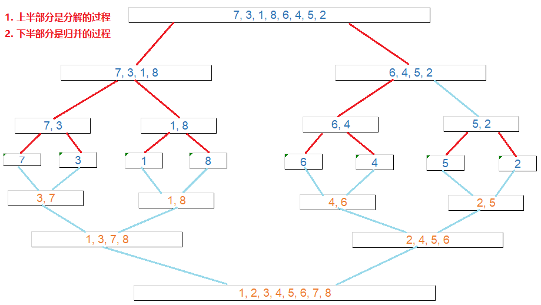
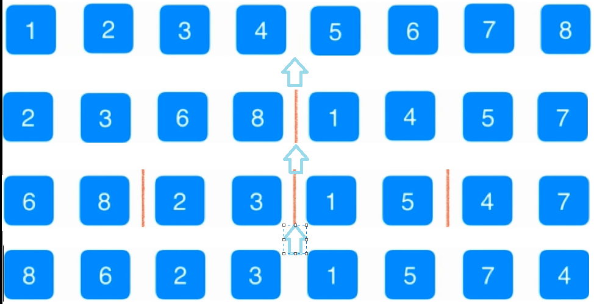

# 选择排序

- O(n²)级别算法

- 以从小到大排列为例, 每次循环找到剩余未排序数组中最小的值, 和为排序数组的第一个位置交换位置

  > 如针对数组[3, 4, 1, 8, 7], 排序步骤如下:
  >
  > 1. 第一次循环结束 : [1, 4, 3, 8, 7]
  > 2. 第二次 : [1, 3, 4, 8, 7]
  > 3. 第三次 : [1, 3, 4, 8, 7], 由于4已经是剩下的里面最小的了, 这次不需要交换
  > 4. 第四次  : [1, 3, 4, 7, 8], 其实这一次已经是顺序的了
  > 5. 第五次  : [1, 3, 4, 7, 8]

## 代码实现

```java
	/**
	 * 对int类型数组arr进行排序
	 * @param arr
	 */
	@Override
	public void sort(int[] arr){
		for (int i = 0; i < arr.length; i++) {
			// 保存最小元素所在位置
			int minIndex = i;
			for (int j = i + 1; j < arr.length; j++) {
				if (arr[j] < arr[minIndex]) {
					minIndex = j;
				}
			}
            // 自定义的用于数组元素交换的函数
			ArrayUtil.swap(arr, i, minIndex);
		}
	}
```

# 插入排序

- O(n²)级别算法

- 插入排序对近乎有序的数组排序效率非常高, 甚至超过O(nlogn)级别的算法

- 从后往前, 每次排序都选择当前元素应该插入的位置

  > 针对数组[8, 6, 2, 3, 1, 5, 7, 4], 第一个元素默认位置是正确的, 从第二个元素开始排序, 进行插入排序之后, 每次循环结束排序结果如下 :
  >
  > 1. [6, 8, 2, 3, 1, 5, 7, 4], 找到元素6应该在的位置6,8交换位置
  > 2. [2, 6, 8, 3, 1, 5, 7, 4], 找到元素2应该在的位置, 交换2,8位置, 交换2,6位置
  > 3. [2, 3, 6, 8, 1, 5, 7, 4], 找到元素3应该在的位置, 交换3,8位置, 交换3,6位置
  > 4. [1, 2, 3, 6, 8, 5, 7, 4], 找到元素1应该在的位置, 1与8,6,3,2依次交换位置
  > 5. [1, 2, 3, 5, 6, 8, 7, 4], 找到元素5应该在的位置, 5与8,6依次交换位置
  > 6. [1, 2, 3, 5, 6, 7, 8, 4], 找到元素7应该在的位置, 7与8交换位置
  > 7. [1, 2, 3, 4, 5, 6, 7, 8], 找到元素4应该在的位置, 4与8,7,6,5依次交换位置

## 代码实现

**代码实现1 :**

```java
	public void sort(int [] arr) {
		for (int i = 0; i < arr.length; i++) {
			for (int j = i; j > 0; j--) {
				if (arr[j] < arr[j - 1]) {
					ArrayUtil.swap(arr, j, j -1);
				} else {
					break;
				}
			}
		}
	}
```

对于上述的实现方法, 每次比较时都要进行交换操作, 而交换操作是比较耗性能的, 可以考虑用一个变量记录元素i应该插入的位置, 找到具体应该插入的位置时, 再进行一次插入操作, 性能会更好, 代码如下:

```java
	public void sort(int [] arr) {
		for (int i = 0; i < arr.length; i++) {
			int temp = arr[i];
			// 保存元素i应该插入的位置
			int j;
			// arr[j - 1] > temp表示还未找到元素i应该插入的位置
			for (j = i; j > 0 && arr[j - 1] > temp ; j--) {
				// 未找到元素i应该插入的位置之前, 前面的元素只要每次往后移动一位即可
				arr[j] = arr[j - 1];
			}
			// 循环结束, j的位置就是元素i应该插入的位置
			arr[j] = temp;
		}
	}
```

## 测试

**使用下面的测试代码对选择排序和两种插入排序的性能做一个简单的测试 :**

```java
	/**
	 * 测试选择排序和两次插入排序性能
	 */
	@Test
	public void testSort(){
		// 生成一个随机数组
		int[] arr = ArrayUtil.generateArray(100000, 0, 100000);
		int[] arr1 = ArrayUtil.copyArray(arr);
		int[] arr2= ArrayUtil.copyArray(arr);
		System.out.println("随机数组->选择排序 : " + ArrayUtil.testSort(arr, new SelectionSort()) + "s") ;
		System.out.println("随机数组->插入排序1 : " + ArrayUtil.testSort(arr1, new InsertSort()) + "s") ;
		System.out.println("随机数组->插入排序2 : " + ArrayUtil.testSort(arr2, new InsertSort2()) + "s") ;
		
		/*
		 * 生成一个近乎有序的数组
		 * 100000 : 数组元素个数
		 * 10 : 在一个完全有序的数组上进行多少次元素交换
		 */
		arr = ArrayUtil.generateNearlyOrderedArray(100000, 10);
		arr1 = ArrayUtil.copyArray(arr);
		arr2= ArrayUtil.copyArray(arr);
		System.out.println("近乎有序的数组->选择排序:" + ArrayUtil.testSort(arr, new SelectionSort()) + "s") ;
		System.out.println("近乎有序的数组->插入排序1:" + ArrayUtil.testSort(arr1, new InsertSort()) + "s") ;
		System.out.println("近乎有序的数组->插入排序2:" + ArrayUtil.testSort(arr2, new InsertSort2()) + "s") ;

	}
```

**执行结果 :**

> 随机数组->选择排序 : 2.435s
> 随机数组->插入排序1 : 3.605s
> 随机数组->插入排序2 : 2.429s
> 近乎有序的数组->选择排序:2.397s
> 近乎有序的数组->插入排序1:0.003s
> 近乎有序的数组->插入排序2:0.002s
>
> 从上述输出结果来看可以发现, 在对于近乎有序的数组进行排序的话, 插入排序性能是很高的, 特别是优化后的插入排序

# 冒泡排序

- O(n²)级别算法
- 每次比较对比相邻两个元素位置, 如果后面的元素大于前面的元素, 则进行位置交换, 代码如下 :

## 代码实现

**代码实现1 :**

```java
	@Override
	public void sort(int [] arr) {
		for (int i = 0; i < arr.length - 1; i++) {
			for (int j = 0; j < arr.length - i - 1; j++) {
				if (arr[j] > arr[j + 1]) {
					ArrayUtil.swap(arr, j, j + 1);
				}
			}
		}
	}
```

针对上述排序算法, 可能会存在如果循环进行了一半, 其实数组已经有序了, 但是仍然会将剩下的循环进行到底, 就会浪费一些性能, 可以增加一个参数用来标识数组是否有序了, 如果数组已经有序了, 就不再进行循环了, 直接返回, **优化后代码如下 :** 

```java
	public void sort(int [] arr) {
		for (int i = 0; i < arr.length - 1; i++) {
			// 用于记录数组是否已经是有序的了
			boolean isSorted = true;
			for (int j = 0; j < arr.length - i - 1; j++) {
				// 如果本次循环数组发生交换, 就认为数组还不是有序的
				if (arr[j] > arr[j + 1]) {
					ArrayUtil.swap(arr, j, j + 1);
					isSorted = false;
				}
			}
			
			// 如果内存循环结束, isSorted扔为true, 则表示数组已经排序完成
			if (isSorted) {
				break;
			}
		}
	}
```

## 测试

**下面通过一个测案例, 对上述选择排序, 插入排序, 冒泡排序的性能进行测试 :**

```java
	/**
	 * 测试选择排序和两种插入排序已及两种冒泡排序的性能
	 */
	@Test
	public void testSort(){
		// 生成一个随机数组
		int[] arr = ArrayUtil.generateArray(100000, 0, 100000);
		int[] arr1 = ArrayUtil.copyArray(arr);
		int[] arr2 = ArrayUtil.copyArray(arr);
		int[] arr3 = ArrayUtil.copyArray(arr);
		int[] arr4 = ArrayUtil.copyArray(arr);
		System.out.println("随机数组->选择排序 : " + ArrayUtil.testSort(arr, new SelectionSort()) + "s") ;
		System.out.println("随机数组->插入排序1 : " + ArrayUtil.testSort(arr1, new InsertSort()) + "s") ;
		System.out.println("随机数组->插入排序2 : " + ArrayUtil.testSort(arr2, new InsertSort2()) + "s") ;
		System.out.println("随机数组->冒泡排序1 : " + ArrayUtil.testSort(arr3, new BubbleSort()) + "s") ;
		System.out.println("随机数组->冒泡排序2 : " + ArrayUtil.testSort(arr4, new BubbleSort2()) + "s") ;

		/*
		 * 生成一个近乎有序的数组
		 * 100000 : 数组元素个数
		 * 10 : 在一个完全有序的数组上进行多少次元素交换
		 */
		arr = ArrayUtil.generateNearlyOrderedArray(100000, 10);
		arr1 = ArrayUtil.copyArray(arr);
		arr2 = ArrayUtil.copyArray(arr);
		arr3 = ArrayUtil.copyArray(arr);
		arr4 = ArrayUtil.copyArray(arr);
		System.out.println("近乎有序的数组->选择排序:" + ArrayUtil.testSort(arr, new SelectionSort()) + "s") ;
		System.out.println("近乎有序的数组->插入排序1:" + ArrayUtil.testSort(arr1, new InsertSort()) + "s") ;
		System.out.println("近乎有序的数组->插入排序2:" + ArrayUtil.testSort(arr2, new InsertSort2()) + "s") ;
		System.out.println("近乎有序的数组->冒泡排序1:" + ArrayUtil.testSort(arr3, new BubbleSort()) + "s") ;
		System.out.println("近乎有序的数组->冒泡排序2:" + ArrayUtil.testSort(arr4, new BubbleSort2()) + "s") ;

	}
```

**执行结果 :**

> 随机数组->选择排序 : 2.407s
> 随机数组->插入排序1 : 3.565s
> 随机数组->插入排序2 : 2.402s
> 随机数组->冒泡排序1 : 14.171s
> 随机数组->冒泡排序2 : 14.414s
> 近乎有序的数组->选择排序:2.385s
> 近乎有序的数组->插入排序1:0.002s
> 近乎有序的数组->插入排序2:0.003s
> 近乎有序的数组->冒泡排序1:1.903s
> 近乎有序的数组->冒泡排序2:1.561s

# 归并排序

- O(nlogn)级别算法
- 需要额外的空间
- 稳定的排序算法

**排序步骤 :**

1. 首先将一个数组递归进行分解, 知道分解为每一部分都是一个元素, 这时每一部分都是有序的了

2. 然后两两进行归并, 递归进行, 直到再归并成一个数组, 排序就完成了, 如下图所示:

   

## 代码实现

```java
package sort.merge;

import sort.Sort ;

/**
 * 归并排序
 * @author 七夜雪
 *
 */
public class MergeSort implements Sort {
	
	@Override
	public void sort(int [] arr) {
		mergeSort(arr, 0, arr.length - 1);
	}
	
	/**
	 * 对数组arr的[l, r]的区间进行排序
	 * @param arr
	 * @param l
	 * @param r
	 */
	private void mergeSort(int[] arr, int l, int r){
		// 递归终止条件
		if (l >= r) {
			return;
		}
		
		int mid = l + (r - l) / 2;
		// 对[l, mid]部分进行归并排序
		mergeSort(arr, l, mid);
		// 对[mid + 1, r]进行归并排序
		mergeSort(arr, mid + 1, r);
		// 对[l, mid], [mid + 1, r]这两部分进行归并
		merge(arr, l, mid, r);
	}
	
	
	/**
	 * 对数组[l, mid], [mid + 1, r]这两部分进行归并
	 * @param arr
	 * @param l
	 * @param mid
	 * @param r
	 */
	private void merge(int[] arr, int l, int mid, int r){
		// 用于归并排序的辅助空间, 因为[l, r]是前闭后闭的区间, 所以aux的大小是r - l + 1
		int[] aux = new int[r - l + 1];
		for (int i = 0; i < aux.length; i++) {
			aux[i] = arr[i + l];
		}
		
//		for (int i = l; i <= r; i++) {
//			aux[i - l] = arr[i];
//		}
		
		// 用于记录左半部分数组下标
		int leftIndex = l;
		// 用于记录右半部分数组下标
		int rightIndex = mid + 1;
		// 循环进行归并
		for (int k = l; k <= r; k++) {
			// 表示左侧部分已经完成归并, 直接使用右侧部分进行归并
			if (leftIndex > mid) {
				arr[k] = aux[rightIndex - l];
				rightIndex++;
			// 表示右侧部分已经完成归并, 直接使用左侧部分进行归并
			} else if (rightIndex > r) {
				arr[k] = aux[leftIndex - l];
				leftIndex++;
			// 左侧元素小于右侧元素, 使用左边元素进行归并
			} else if (aux[leftIndex - l] < aux[rightIndex - l]) {
				arr[k] = aux[leftIndex - l];
				leftIndex++;
			} else {
				arr[k] = aux[rightIndex - l];
				rightIndex++;
			}
		}
	}
	
}

```

### 归并排序优化

虽然归并排序是nlogn级别的算法, 但是在数组数据量比较小的时候, 插入排序的效率仍然是高于归并排序的, 所以可以在对数组分解到足够小之后, 使用插入排序, 然后再递归进行归并排序, 具体代码如下 :

```java
package sort.merge;

import sort.Sort ;
import utils.ArrayUtil ;

/**
 * 归并排序
 * 优化 : 对于较小的数组使用插入排序性能要优于归并排序, 
 * 所以可以在分解到较小的部分时, 使用插入排序对数组进行排序
 * @author 七夜雪
 *
 */
public class MergeSort2 implements Sort {
	
	@Override
	public void sort(int [] arr) {
		mergeSort(arr, 0, arr.length - 1);
	}
	
	/**
	 * 对数组arr的[l, r]的区间进行排序
	 * @param arr
	 * @param l
	 * @param r
	 */
	private void mergeSort(int[] arr, int l, int r){
		// 递归终止条件, 小于等于16个元素时使用插入排序
		if (r - l < 16) {
            // 对arr数组的[l,r]区间进行排序, 插入排序算法
			ArrayUtil.insertSort(arr, l, r);
			return;
		}
		
		int mid = l + (r - l) / 2;
		// 对[l, mid]部分进行归并排序
		mergeSort(arr, l, mid);
		// 对[mid + 1, r]进行归并排序
		mergeSort(arr, mid + 1, r);
		// 对[l, mid], [mid + 1, r]这两部分进行归并
		merge(arr, l, mid, r);
	}
	
	
	/**
	 * 对数组[l, mid], [mid + 1, r]这两部分进行归并
	 * @param arr
	 * @param l
	 * @param mid
	 * @param r
	 */
	private void merge(int[] arr, int l, int mid, int r){
		// 用于归并排序的辅助空间, 因为[l, r]是前闭后闭的区间, 所以aux的大小是r - l + 1
		int[] aux = new int[r - l + 1];
		for (int i = 0; i < aux.length; i++) {
			aux[i] = arr[i + l];
		}
		
//		for (int i = l; i <= r; i++) {
//			aux[i - l] = arr[i];
//		}
		
		// 用于记录左半部分数组下标
		int leftIndex = l;
		// 用于记录右半部分数组下标
		int rightIndex = mid + 1;
		// 循环进行归并
		for (int k = l; k <= r; k++) {
			// 表示左侧部分已经完成归并, 直接使用右侧部分进行归并
			if (leftIndex > mid) {
				arr[k] = aux[rightIndex - l];
				rightIndex++;
			// 表示右侧部分已经完成归并, 直接使用左侧部分进行归并
			} else if (rightIndex > r) {
				arr[k] = aux[leftIndex - l];
				leftIndex++;
			// 左侧元素小于右侧元素, 使用左边元素进行归并
			} else if (aux[leftIndex - l] < aux[rightIndex - l]) {
				arr[k] = aux[leftIndex - l];
				leftIndex++;
			} else {
				arr[k] = aux[rightIndex - l];
				rightIndex++;
			}
		}
	}
	
	
}
```

如果一个数组是近乎有序的, 或者说是完全有序的, 上述步骤会有很多无用的merge操作, 所以可以在进行merge前增加一个判断, 效率也会有一定的提高, 代码如下 :

```java
	/**
	 * 对数组arr的[l, r]的区间进行排序
	 * @param arr
	 * @param l
	 * @param r
	 */
	private void mergeSort(int[] arr, int l, int r){
		// 递归终止条件, 小于等于16个元素时使用插入排序
		if (r - l < 16) {
			ArrayUtil.insertSort(arr, l, r);
			return;
		}
		
		int mid = l + (r - l) / 2;
		// 对[l, mid]部分进行归并排序
		mergeSort(arr, l, mid);
		// 对[mid + 1, r]进行归并排序
		mergeSort(arr, mid + 1, r);
        // 判断是否需要进行merge, 因为[l, mid], [mid + 1, r]这两部分都是排好序的数组
		if (arr[mid] > arr[mid + 1]) {
			// 对[l, mid], [mid + 1, r]这两部分进行归并
			merge(arr, l, mid, r);
		}
	}
```

### 自底向上的归并排序

上面的归并排序是自顶向下的归并排序, 对于归并排序也可以自底向上进行归并, 排序方法如下 :

1. 从下往上分解成小块, 然后一层层往上进行归并, 最终归并成一整个数组, 如下图所示 :

   

   > 上图从下往上步骤如下:
   >
   > 1. 每个元素作为一部分, 进行归并, 归并后结果如第三行
   > 2. 然后按照每两个元素作为一部分, 进行归并, 归并后结果如第二行
   > 3. 最后对每四个元素作为一部分, 进行归并, 归并后结果如第一行, 整个数组已经有序了

**代码实现 :**

```java
	public void sort(int [] arr) {
		int length = arr.length;
		// 数组元素个数小于等于16时, 直接使用插入排序
		if (length <= 16) {
			ArrayUtil.insertSort(arr, 0, length);
			return;
		}
		
		for (int sz = 8; sz < length; sz += sz) {
			// 每次遍历2*sz个长度
			for (int i = 0; i + sz < length; i +=sz + sz) {
				if (sz == 8 ) {
					ArrayUtil.insertSort(arr, i, Math.min(i + sz + sz -1, length - 1));
				} else {
					if (arr[i + sz - 1] > arr[i + sz]) {
						// 对[i, i + sz -1]和[i + sz, 2*sz + i -1]区间进行merge操作
						merge(arr, i, i + sz - 1, Math.min(i + sz + sz -1, length - 1));
					}
				}
			}
		}
		
	}
```

## 测试

对插入排序, 进行了优化的各个版本的归并排序进行性能测试, 这里使用了Junit进行测试, 代码如下 :

```java
	/**
	 * 测试插入排序和归并排序性能
	 */
	@Test
	public void testSort(){
		// 生成一个随机数组
		int[] arr = ArrayUtil.generateArray(100000, 0, 100000);
		int[] arr1 = ArrayUtil.copyArray(arr);
		int[] arr2 = ArrayUtil.copyArray(arr);
		int[] arr3 = ArrayUtil.copyArray(arr);
		int[] arr4 = ArrayUtil.copyArray(arr);
		System.out.println("随机数组->插入排序 : " + ArrayUtil.testSort(arr, new InsertSort2()) + "s") ;
		System.out.println("随机数组->归并排序1 : " + ArrayUtil.testSort(arr1, new MergeSort()) + "s") ;
		System.out.println("随机数组->归并排序2 : " + ArrayUtil.testSort(arr2, new MergeSort2()) + "s") ;
		System.out.println("随机数组->归并排序3 : " + ArrayUtil.testSort(arr3, new MergeSort3()) + "s") ;
		System.out.println("随机数组->自底向上的归并排序 : " + ArrayUtil.testSort(arr4, new MergeSortBU()) + "s") ;

		/*
		 * 生成一个近乎有序的数组
		 * 100000 : 数组元素个数
		 * 10 : 在一个完全有序的数组上进行多少次元素交换
		 */
		arr = ArrayUtil.generateNearlyOrderedArray(100000, 10);
		arr1 = ArrayUtil.copyArray(arr);
		arr2 = ArrayUtil.copyArray(arr);
		arr3 = ArrayUtil.copyArray(arr);
		arr4 = ArrayUtil.copyArray(arr);
		System.out.println("近乎有序的数组->插入排序:" + ArrayUtil.testSort(arr, new InsertSort2()) + "s") ;
		System.out.println("近乎有序的数组->归并排序1:" + ArrayUtil.testSort(arr1, new MergeSort()) + "s") ;
		System.out.println("近乎有序的数组->归并排序2:" + ArrayUtil.testSort(arr2, new MergeSort2()) + "s") ;
		System.out.println("近乎有序的数组->归并排序3:" + ArrayUtil.testSort(arr3, new MergeSort3()) + "s") ;
		System.out.println("近乎有序的数组->自底向上的归并排序:" + ArrayUtil.testSort(arr4, new MergeSortBU()) + "s") ;

	}
```

**测试结果 :**

>随机数组->插入排序 : 2.353s
>随机数组->归并排序1 : 0.016s
>随机数组->归并排序2 : 0.017s
>随机数组->归并排序3 : 0.017s
>随机数组->自底向上的归并排序 : 0.015s
>近乎有序的数组->插入排序:0.002s
>近乎有序的数组->归并排序1:0.007s
>近乎有序的数组->归并排序2:0.005s
>近乎有序的数组->归并排序3:0.002s
>近乎有序的数组->自底向上的归并排序:0.003s

# 快速排序

