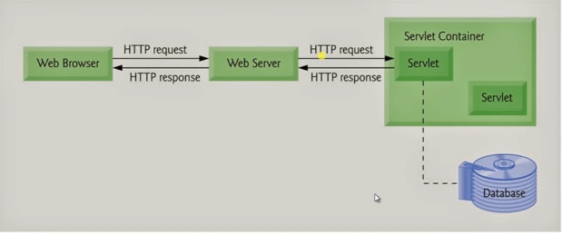
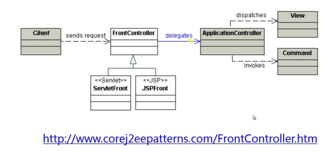
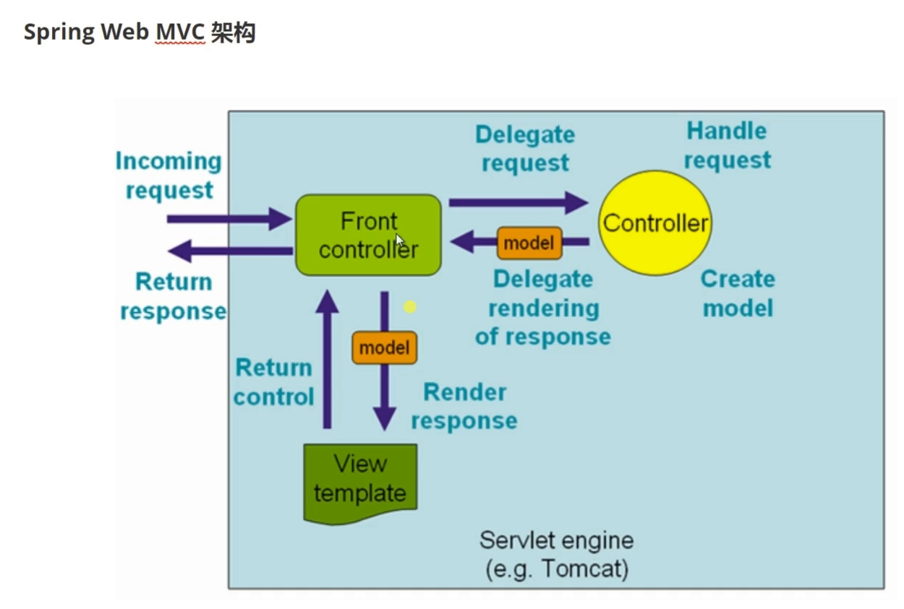
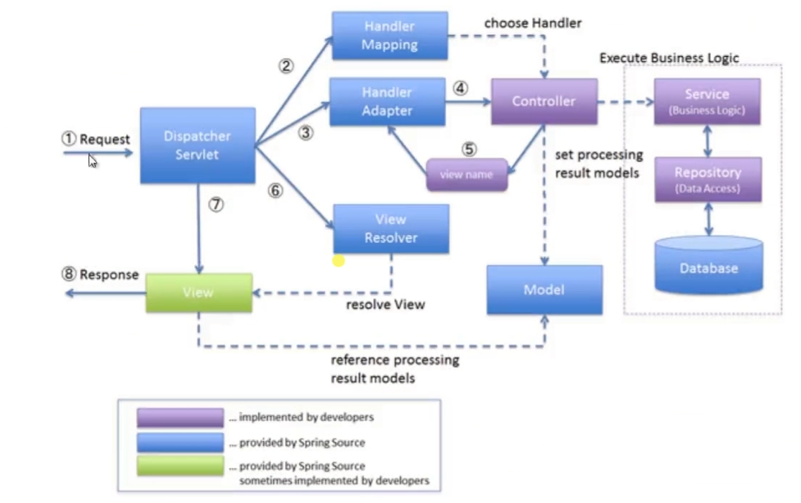

- 组件自动装配 : 规约大于配置, 专注核心业务

  > - 模式注解
  > - @Enable模块
  > - 条件装配
  > - 加载机制

- 外部化配置 : 一次构建, 按需调配, 到处运行

  > - Environment抽象
  > - 生命周期
  > - 破坏性变更

- 嵌入式容器 : 内置容器, 无需部署, 独立运行

  > - Servlet Web容器
  > - Reactive Web容器

- Spring Boot Starter : 简化依赖, 按需装配, 自我包含

  > - 依赖管理
  > - 装配条件
  > - 装配顺序

- Production-Ready : 一站式运维, 生态无缝整合

  > - 健康检查
  > - 数据指标
  > - @Endpoint管控

SpringBoot与Java EE规范

- Web : Servlet(JSR-315, JSR-340)
- SQL : JDBC(JSR-221)
- 数据校验 : Bean Validation (JSR-303, JSR-349)
- 缓存 : Java Caching API(JSR-107)
- WebSockets : Java API for WebSocket(JSR-356)
- Web Services : JAX-WS(JSR-224)
- Java管理 : JMX(JSR-3)
- 消息 : JMS(JSR-914)

# 核心特性

## 组件自动装配

- 激活 : @EnableAutoConfiguration
- 配置 : /META-INF/spring.factoties
- 实现 : XXXAutoConfiguration

### Web MVC

### Web Flux

### JDBC

## 嵌入式Web容器

### Web Servlet

#### Tomcat

#### Jetty

#### Undertow

### Web Reactive : Netty Web Server

## 生产准备特性

### 指标 : /actuator/metrics

### 健康检查 : /actuator/health

### 外部化配置 : /actuator/configprops

# Web应用

### 传统Servlet应用

- Servlet组件 : Servlet, Filter, Listener
- Servlet注册 : Servlet注解, Spring Bean, RegistrationBean
- 异步非阻塞 : 异步Servlet, 非阻塞Servlet

### Spring Web MVC应用

#### Web MVC视图

- ViewResolver
- View

##### 模板引擎

- Thymeleaf
- Freemarker
- JSP

##### 内容协商

- `ContentNegotiationConfigure`
- `ContentNegotiateStrategy`
- `ContentNegotiatingViewResolver`

##### 异常处理等

- `@ExceptionHandler`
- `HandlerExceptionResolver`
  - ExceptionHandlerExceptionResolver
- `BasicErrorController`

### Web MVC REST

#### 资源服务

- `@RequestMapping`
  - `@GetMapping`
  - `PostMapping`
- `@ResponseBody`
- `@RequestBody`

#### 资源跨域 

- `CrossOrigin`
- `WebMvcConfigurer#addCorsMapppings`
- 传统解决方案
  - IFrame
  - JSONP

#### 服务发现

- HATEOS

### Web MVC 核心

####  核心架构

#### 处理流程

#### 核心组件

- `DispatcherServlet`
- `HandlerMapping`
- `HandlerAdapter`
- `ViewResolver`

### Spring Web Flux

#### Reactor基础

##### Java Lambda

##### Mono

##### Flux

#### Web Flux 核心

##### Web MVC注解兼顾

- `@Controller`
- `@RequestMapping`
- `@ResponseBody`
- `@RequestMapping`
- ...

##### 函数式声明

- `RouterFunction`

##### 异步非阻塞

- Servlet 3.1+
- Netty Reactor

##### 使用场景

###### 页面渲染

###### REST 应用

### Web Server应用

#### 切换Web Server

- Tomcat ->Jetty

  ```xml
  <!-- 修改maven的pom文件, 排除Tomcat,添加Jetty依赖 -->
  <dependency>
      <groupId>org.springframework.boot</groupId>
      <artifactId>spring-boot-starter-web</artifactId>
      <!--排除Tomcat-->
      <exclusions>
          <exclusion>
              <groupId>org.springframework.boot</groupId>
              <artifactId>spring-boot-starter-tomcat</artifactId>
          </exclusion>
      </exclusions>
  </dependency>
  <!--使用Jetty-->
  <dependency>
      <groupId>org.springframework.boot</groupId>
      <artifactId>spring-boot-starter-jetty</artifactId>
  </dependency>
  ```

- 替换Servlet容器为WebFlux

  ```xml
  <!--和Servlet容器同时存在时, Servlet容器优先级较高, 所以需要将Servlet容器去除-->
  <dependency>
      <groupId>org.springframework.boot</groupId>
      <artifactId>spring-boot-starter-webflux</artifactId>
  </dependency>
  ```


#### 自定义Servlet Web Server

- `WebServerFactoryCustomizer`

#### 自定义Reactive Web Server

- `ReactiveWebServerFactoryCustomizer`


# 数据相关

## 关系型数据

### JDBC

**依赖:**

```xml
<dependency>
    <groupId>org.springframework.boot</groupId>
    <artifactId>spring-boot-starter-jdbc</artifactId>
</dependency>
```

#### 数据源

- `javax.sql.DataSource`
- `JdbcTemplate`

#### 自动装配

- `DataSourceAutoConfiguration`

### JPA

**依赖:**

```xml
<dependency>
    <groupId>org.springframework.boot</groupId>
    <artifactId>spring-boot-starter-data-jpa</artifactId>
</dependency>
```

#### 实体映射关系

- `@javax.persistence.OneToOne`
- `javax.persistence.OneToMany`
- `javax.persistence.ManyToOne`
- `javax.persistence.ManyToMany`

#### 实体操作

- `javax.persistence.EntityManager`

#### 自动装配

- `HibernateJpaAutoConfiguration`

### 事务

**依赖:**

```xml
<dependency>
    <groupId>org.springframework</groupId>
    <artifactId>spring-tx</artifactId>
</dependency>
```

#### Spring事务抽象

- `PlatformTransactionManager`

#### JDBC事务处理

- `DataSourceTransactionManager`

#### 自动装配

- `TransactionAutoConfiguration`

# 功能扩展

## Spring Boot应用

### SpringApplication

#### 失败分析

-  `FailureAnalysisReporter`

#### 应用特性

- `SpringApplication` Fluent API

#### 事件监听

### Spring Boot配置

#### 外部化配置

- `ConfigurationProperty`
- `@Profile`

#### 配置属性

- `PropertySources`

### Spring Boot Starter

#### Starter开发

#### 最佳实践

# 运维管理

## Spring Boot Actuator

**依赖:**

```xml
<dependency>
    <groupId>org.springframework.boot</groupId>
    <artifactId>spring-boot-starter-actuator</artifactId>
</dependency>
```

### 端点(Endpoints)

#### Web Endpoints

#### JMX Endpoints

- 端点 : 各类Web和JMX Endpoints
- 健康检查 : Health, HealthIndicator
- 指标 : 内建Metrics, 自定义Metrics

# 走向自动装配

## Spring Framework 手动装配

### Spring 模式注解装配

- 定义 : 一种用于声明在应用中, 扮演 "组件"角色的注解, 如@Component, @Service, @Configuration等
- 装配方式 : \<context:component-scan\>或@ComponentScan

#### 模式注解举例

| SpringFramework注解 | 场景说明          | 起始版本 |
| ------------------- | ----------------- | -------- |
| `@Repository`       | 数据仓储模式注解  | 2.0      |
| `@Component`        | 通用组件模式注解  | 2.5      |
| `@Service`          | 服务模式注解      | 2.5      |
| `@Controller`       | Web控制器模式注解 | 2.5      |
| `@Configuration`    | 配置类模式注解    | 3.0      |

#### 装配方式

- `<context:component-scan\>`方式

  ```xml
  <?xml version="1.0" encoding="UTF-8"?>
  <beans xmlns="http://www.springframework.org/schema/beans"
  xmlns:xsi="http://www.w3.org/2001/XMLSchema-instance"
  @ComponentScan 方式
  自定义模式注解
  @Component “派生性”
  @Component
  @Repository
  FirstLevelRepository
  xmlns:context="http://www.springframework.org/schema/context"
  xsi:schemaLocation="http://www.springframework.org/schema/beans
  http://www.springframework.org/schema/beans/spring-beans.xsd
  http://www.springframework.org/schema/context http://www.springframework.org/schema/context/spring-
  context.xsd">
  <!-- 激活注解驱动特性 -->
  <context:annotation-config />
  <!-- 找寻被 @Component 或者其派生 Annotation 标记的类（Class），将它们注册为 Spring Bean -->
  <context:component-scan base-package="com.imooc.dive.in.spring.boot" />
  </beans>
  ```

- `@ComponentScan`方式

  ```java
  @ComponentScan(basePackages = "com.imooc.dive.in.spring.boot")
  public class SpringConfiguration {
      ...
  }
  ```

#### 自定义模式注解

##### `@Component`"派生性"

```java
@Target({ElementType.TYPE})
@Retention(RetentionPolicy.RUNTIME)
@Documented
@Repository
public @interface FirstLevelRepository {
	String value() default "";
}
```

- `@Component`
  - `@Repository`
    - `FirstLevelRepositor`

##### `@Component`"层次性"

```java
@Target({ElementType.TYPE})
@Retention(RetentionPolicy.RUNTIME)
@Documented
@FirstLevelRepository
public @interface SecondLevelRepository {
	String value() default "";
}
```

- `@Component`
  - `@Repository`
    - `FirstLevelRepository`
      - `SecondLevelRepository`

### Spring @Enable 模块装配

- 定义 : 具备相同领域的功能组件集合, 组合形成一个独立的单元
- Spring Framework 3.1 开始支持”@Enable 模块驱动“。所谓“模块”是指具备相同领域的功能组件集合， 组合所形成一个独立的单元。比如 Web MVC 模块、AspectJ代理模块、Caching（缓存）模块、JMX（Java 管 理扩展）模块、Async（异步处理）模块等。

#### `@Enable` 注解模块举例

| 框架实现         | @Enable 注解模块                 | 激活模块            |
| ---------------- | -------------------------------- | ------------------- |
| Spring Framework | `@EnableWebMvc`                  | Web MVC模块         |
|                  | `@EnableTransactionManagement`   | 事务管理模块        |
|                  | `@EnableCaching`                 | Caching模块         |
|                  | `@EnableMBeanExport`             | JMX 模块            |
|                  | `@EnableAsync`                   | 异步处理模块        |
|                  | `@EnableWebFlux`                 | Web Flux 模块       |
|                  | `@EnableAspectJAutoProxy`        | AspectJ 代理模块    |
|                  |                                  |                     |
| Spring Boot      | `@EnableAutoConfiguration`       | 自动装配模块        |
|                  | `@EnableManagementContext`       | Actuator管理模块    |
|                  | `@EnableConfigurationProperties` | 配置属性绑定模块    |
|                  | `@EnableOAuth2Sso`               | OAuth2 单点登录模块 |
|                  |                                  |                     |
| Spring Cloud     | `@EnableEurekaServer`            | Eureka服务器模块    |
|                  | `@EnableConfigServer`            | 配置服务器模块      |
|                  | `@EnableFeignClients`            | Feign客户端模块     |
|                  | `@EnableZuulProxy`               | 服务网关 Zuul 模块  |
|                  | `@EnableCircuitBreaker`          | 服务熔断模块        |

#### 实现方式

##### 注解驱动方式

```java
@Retention(RetentionPolicy.RUNTIME)
@Target(ElementType.TYPE)
@Documented
@Import(DelegatingWebMvcConfiguration.class)
public @interface EnableWebMvc {
}
```

##### 接口编程方式

```java
@Target(ElementType.TYPE)
@Retention(RetentionPolicy.RUNTIME)
@Documented
@Import(CachingConfigurationSelector.class)
public @interface EnableCaching {
	...
}
```

```java
public class CachingConfigurationSelector extends AdviceModeImportSelector<EnableCaching> {
    public String[] selectImports(AdviceMode adviceMode) {
        switch (adviceMode) {
        	case PROXY:
       			return new String[] {
        AutoProxyRegistrar.class.getName(),ProxyCachingConfiguration.class.getName() };
       	 	case ASPECTJ:
        		return new String[] {
        			AnnotationConfigUtils.CACHE_ASPECT_CONFIGURATION_CLASS_NAME };
        	default:
        		return null;
    }
}
```


### Spring条件装配

- 从SpringFramework 3.1开始, 允许在Bean装配时增加前置条件判断

#### 条件装配举例

| Spring注解     | 场景说明       | 起始版本 |
| -------------- | -------------- | -------- |
| `@Profile`     | 配置化条件装配 | 3.1      |
| `@Conditional` | 编程条件装配   | 4.0      |

#### 实现方式

##### @Profile方式

##### @Conditional方式

## Spring Boot 自动装配

- 定义 : 基于约定大于配置的原则, 实现Spring组件自动装配的目的
- 装配 : 模式注解, @Enable模块, 条件装配, 工厂加载机制
- 实现 : 激活自动装配, 实现自动装配, 配置自动装配实现

### 底层装配技术

- Spring模式注解装配
- Spring `@Enable`模块装配
- Spring条件装配
- Spring 工厂加载机制
  - 实现类 : `SpringFactoriesLoader`
  - 配置资源 : `META-INF/spring.factories`

### 实现方法

1. 激活自动装配 - `@EnableAutoConfiguration`
2. 实现自动装配 - `XXXAutoConfiguration`
3. 配置自动装配实现 - `META-INF/spring.factories`

### 自定义自动装配

# 理解 SpringApplication

## 基础技术

### Spring 模式注解

### Spring 应用上下文

### Spring 工厂加载机制

### Spring 应用上下文初始器

### Spring Environment 抽象

### Spring 应用事件/监听器

## 衍生技术Spring Boot

### SpringApplication

- 定义 : Spring应用引导类, 提供便利的自定义行为方法
- 场景 : 嵌入式Web应用和非Web应用
- 运行 : SpringApplication#run(String ...)

#### SpringApplication 基本使用

**`SpringApplication`运行**

```java
SpringApplication.run(XXXSpringBootApplication.class, args);
```

#### 自定义SpringApplication

##### 通过`SpringApplication` API调整

```java
SpringApplication springApplication = new SpringApplication(XXXSpringBootApplication.class);
springApplication.setBannerMode(Banner.Mode.CONSOLE);
SpringApplication.setWebApplicationType(WebApplicationType.NONE);
springApplication.setAdditionalProfiles("prd");
SpringApplication.setHeadless(true);
```

##### 通过`SpringApplicationBuilder`API 调整

```java
new SpringApplicationBuilder(XXXSpringBootApplication.class)
    .bannerMode(Banner.Mode.CONSOLE)
    .web(WebApplicationType.NONE)
    .profiles("prd")
    .headless(true)
    .run(args);
```

#### 准备阶段

- 配置 : Spring Bean来源
- 推断 : Web 应用类型 和 主引导类(Main Class)
- 加载 : 应用上下文初始器 和 应用事件监听器

##### 配置Spring Boot Bean 源

Java配置Class 或 XML上下文配置集合, 用于Spring Boot `BeanDefinitionLoader`读取, 并且将配置源解析加载为Spring Bean定义

- 数量 : 一个或多个

###### Java 配置 Class

用于Spring注解驱动中Java配置类, 大多数情况是Spring模式注解所标注的类, 如 `@Configuration`

###### XML 上下文配置文件

用于Spring传统配置驱动中的XML文件

##### 推断Web应用类型

根据当前应用的ClassPath中是否存在相关实现类类推断Web应用类型, 包括:

- Web Reactive : `WebApplicationType.REACTIVE`
- Web Servlet : `WebApplicationType.SERVLET`
- 非Web : `WebApplicationType.NONE`

> 参考方法 : `org.springframework.boot.SpringApplication#构造方法`
>
> ```java
> // org.springframework.boot.WebApplicationType	
> static WebApplicationType deduceFromClasspath() {
> 		if (ClassUtils.isPresent(WEBFLUX_INDICATOR_CLASS, null)
> 				&& !ClassUtils.isPresent(WEBMVC_INDICATOR_CLASS, null)
> 				&& !ClassUtils.isPresent(JERSEY_INDICATOR_CLASS, null)) {
> 			return WebApplicationType.REACTIVE;
> 		}
> 		for (String className : SERVLET_INDICATOR_CLASSES) {
> 			if (!ClassUtils.isPresent(className, null)) {
> 				return WebApplicationType.NONE;
> 			}
> 		}
> 		return WebApplicationType.SERVLET;
> 	}
> 
> 	static WebApplicationType deduceFromApplicationContext(
> 			Class<?> applicationContextClass) {
> 		if (isAssignable(SERVLET_APPLICATION_CONTEXT_CLASS, applicationContextClass)) {
> 			return WebApplicationType.SERVLET;
> 		}
> 		if (isAssignable(REACTIVE_APPLICATION_CONTEXT_CLASS, applicationContextClass)) {
> 			return WebApplicationType.REACTIVE;
> 		}
> 		return WebApplicationType.NONE;
> 	}
> ```

##### 推断引导类(Main Class)

根据Main线程执行堆栈判断实际的引导类

> 参考方法 : `org.springframework.boot.SpringApplication#deduceMainApplicationClass`
>
> ```java
> 	private Class<?> deduceMainApplicationClass() {
> 		try {
> 			StackTraceElement[] stackTrace = new RuntimeException().getStackTrace();
> 			for (StackTraceElement stackTraceElement : stackTrace) {
> 				if ("main".equals(stackTraceElement.getMethodName())) {
> 					return Class.forName(stackTraceElement.getClassName());
> 				}
> 			}
> 		}
> 		catch (ClassNotFoundException ex) {
> 			// Swallow and continue
> 		}
> 		return null;
> 	}
> ```

##### 加载应用上下文初始器(`ApplicationContextInitializer`)

利用spring工厂加载机制, 实例化`ApplicationContextInitializer`实现类, 并排序对象集合。

> - 实现 : SpringApplication#getSpringFactoriesInstances
>
> ```java
> 	private <T> Collection<T> getSpringFactoriesInstances(Class<T> type,
> 			Class<?>[] parameterTypes, Object... args) {
> 		ClassLoader classLoader = getClassLoader();
> 		// Use names and ensure unique to protect against duplicates
> 		Set<String> names = new LinkedHashSet<>(
> 				SpringFactoriesLoader.loadFactoryNames(type, classLoader));
> 		List<T> instances = createSpringFactoriesInstances(type, parameterTypes,
> 				classLoader, args, names);
> 		AnnotationAwareOrderComparator.sort(instances);
> 		return instances;
> 	}
> ```
>
> - 技术
>   - 实现类 : `org.sprigframework.core.io.support.SpringFactoriesLoader`
>   - 配置资源 : `META-INF/spring.factories`
>   - 排序 : `AnnotationAwareOrderComparator#sort`

##### 加载应用事件监听器(`ApplicationListener`)

利用Spring工厂加载机制, 实例化`ApplicationListener`实现类, 并排序对象集合

#### SpringApplication 运行阶段

- 加载 : SpringApplication 运行监听器

  > 利用Spring工厂机制, 读取`SpringApplicationRunListener`对象集合, 并且封装到组合类`SpringApplicationRunListeners`

- 运行 : SpringApplication 运行监听器, `SpringApplicationRunListener`监听多个运行状态方法:

  | 监听方法                                           | 阶段说明                                                     | Spring Boot起始版本 |
  | -------------------------------------------------- | ------------------------------------------------------------ | ------------------- |
  | `starting()`                                       | Spring应用刚启动                                             | 1.0                 |
  | `environmentPrepared(ConfigurableEnvironment)`     | `ConfigurableEnvironment`准备妥当, 允许将其调整              | 1.0                 |
  | `contextPrepared(ConfigurableApplicationContext)`  | `ConfigurableApplicationContext`准备妥当, 允许将其调整       | 1.0                 |
  | `contextLoaded(ConfigurableApplicationContext)`    | `ConfigurableApplicationContext`已装载, 但仍未启动           | 1.0                 |
  | `started(ConfigurableApplicationContext)`          | `ConfigurableApplicationContext`已启动, 此时Spring Bean已初始化完成 | 2.0                 |
  | `running(ConfigurableApplicationContext)`          | Spring应用正在运行                                           | 2.0                 |
  | `failed(ConfigurableApplicationContext,Throwable)` | Spring应用运行失败                                           | 2.0                 |

- 监听 : Spring Boot 事件, Spring 事件

  > Spring Boot 通过`SpringApplicationRunListener`的实现类`EnvironmentRunListener`利用Spring Framework 事件API, 广播Spring Boot事件

##### 运行阶段

- 创建 : 应用上下文, Environment等
- 失败 : 故障分析报告
- 回调 : CommandLineRunner, ApplicationRunner
- 

### SpringApplication Builder API

### SpringApplication 运行监听器 

### SpringApplication 参数

### SpringApplication 故障分析

### Spring Boot 应用事件/监听器

# Web MVC核心

## 理解Spring Web MVC 架构

### 基础架构 : Servlet



#### Servlet 特点

- 请求/响应式(Request/Response)
- 屏蔽网络通讯的细节
- 完整的生命周期

#### Servlet 职责

- 处理请求
- 资源管理
- 视图渲染

#### 核心架构 : 前端控制器(Front Controller)



### Spring Web MVC 架构



### 认识 Spring Web MVC

#### Spring Framework 时代的一般认识

- 实现Controller

  ```java
  @Controller
  public class HelloWorldController {
  	@RequestMapping("")
  	public String index (Model model) {
  		return "index";
  	}
  }
  
  ```

- 配置 Web MVC 组件

  ```xml
  <context:component-scan base-package="com.qiyexue.web" />
  ```

  ```xml
  <bean class="org.springframework.web.servlet.mvc.method.annotation.RequestMappingHandlerMapping />
  ```

  ```xml
  < bean class="org.springframework.web.servlet.mvc.method.annotation.RequestMappingHandlerAdapter />
  ```

  ```xml
  <bean id="viewResolver" class="org.springframework.web.servlet.view.InternalResourceViewResolver">
  	<property name="viewClass" value="org.springframework.web.servlet.view.JstlView" />
      <property name="prefix" value="/WEB-INF/views/" />
      <property name="suffix" value=".jsp" />
  </bean>
  ```

- 部署 DispatcherServlet

  ```xml
  <!-- 将DispatcherServlet部署在web.xml文件中 -->
  <servlet>
      <servlet-name>app</servlet-name>
      <servlet-class>org.springframework.web.servlet.DispatcherServlet</servlet-class>
      <init-param>
      	<param-name>contextConfigLocation</param-name>
          <param-value>/WEB-INF/app-context.xml</param-value>
      </init-param>
      <load-on-startup>1</load-on-startup>
  </servlet>
  
  <servlet-mapping>
  	<servlet-name>app</servlet-name>
      <url-pattern>/</url-pattern>
  </servlet-mapping>
  ```

#### Spring Framework 时代的重新认识

##### Web MVC 核心组件

- 处理器管理
  - 映射 : HandlerMapping
  - 适配 : HandlerAdapter
  - 执行 : HandlerExecutionChain
- 页面渲染
  - 视图解析器 : ViewResolver
  - 国际化 : LocaleResolver, LocaleContextResolver
  - 个性化 : ThemeResolver
- 异常处理
  - 异常解析 : HandlerExceptionResolver

| 组件 Bean 类型                       | 说明                                                         |
| ------------------------------------ | ------------------------------------------------------------ |
| HandlerMapping                       | 映射请求（Request）到处理器（Handler）加上其关联的拦截器<br/>（HandlerInterceptor）列表，其映射关系基于不同的 HandlerMapping 实现的一些
标准细节。其中两种主要  HandlerMapping 实现，  RequestMappingHandlerMapping
支持标注  @RequestMapping 的方法，  SimpleUrlHandlerMapping 维护精确的URI
路径与处理器的映射 |
| HandlerAdapter                       | 帮助  DispatcherServlet 调用请求处理器（Handler），无需关注其中实际的调用细节。比如，调用注解实现的 Controller 需要解析其关联的注解.  HandlerAdapter的主要目的是为了屏蔽与  DispatcherServlet 之间的诸多细节。 |
| HandlerExceptionResolver             | 解析异常，可能策略是将异常处理映射到其他处理器（Handlers） 、或到某个 HTML错误页面，或者其他。 |
| ViewResolver                         | 从处理器（Handler）返回字符类型的逻辑视图名称解析出实际的  View 对象，该对象将渲染后的内容输出到HTTP 响应中。 |
| LocaleResolver,LocaleContextResolver | 从客户端解析出  Locale ，为其实现国际化视图。                |
| MultipartResolver                    | 解析多部分请求（如 Web 浏览器文件上传）的抽象实现            |



##### Web MVC 注解驱动

版本依赖 : Spring Framework 3.1+

**基本配置步骤**

注解配置 : @configuration(Spring 范式注解)

组件激活 : @EnableWebMvc(Spring 模块装配)

自定义组件 : WebMvcConfigurer(Spring Bean)

**Spring Web MVC 常用注解**

- 模块属性 : @ModelAttribute
- 请求头 : @RequestHeader
- Cookie : @CookieValue
- 检验参数 : @Valid, @Validated
- 注解处理 : @ExceptionHandler
- 切面通知 : @ControllerAdvice

##### Web MVC 自动装配

## Spring Boot 时代的简化