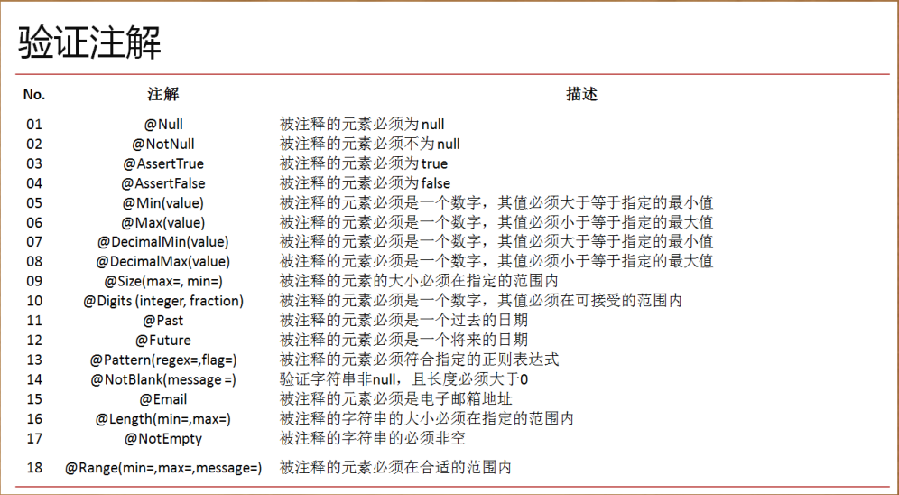

# Quick Start

1. 新建一个maven工程

2. 引入SpringBoot的父pom

   ```xml
   	<parent>
   		<groupId>org.springframework.boot</groupId>
   		<artifactId>spring-boot-starter-parent</artifactId>
   		<version>2.0.6.RELEASE</version>
   		<relativePath /> <!-- lookup parent from repository -->
   	</parent>
   ```

3. 由于是web项目, 添加SpringBoot web项目依赖

   ```xml
   	<dependencies>
   		<dependency>
   			<groupId>org.springframework.boot</groupId>
   			<artifactId>spring-boot-starter-web</artifactId>
   		</dependency>
   	</dependencies>
   	<build>
   		<plugins>
   			<plugin>
   				<groupId>org.springframework.boot</groupId>
   				<artifactId>spring-boot-maven-plugin</artifactId>
   			</plugin>
   		</plugins>
   	</build>
   ```

4. 测试代码, 直接运行main方法即可

   ```java
   package hello;
   
   import org.springframework.boot.SpringApplication ;
   import org.springframework.boot.autoconfigure.EnableAutoConfiguration ;
   import org.springframework.stereotype.Controller ;
   import org.springframework.web.bind.annotation.RequestMapping;
   import org.springframework.web.bind.annotation.ResponseBody ;
   
   @Controller
   @EnableAutoConfiguration
   public class HelloController {
   
       @RequestMapping("/")
       @ResponseBody
       public String index() {
           return "Hello World!";
       }
       
       public static void main(String [] args) {
   		SpringApplication.run(HelloController.class, args);
   	}
   
   }
   ```

5. 浏览器输入http://localhost:8080/即可显示Hello World!

# 统一父pom管理

1. 建立一个统一父pom文件, 导入SpringBoot依赖包

   ```xml
   <?xml version="1.0"?>
   <project
   	xsi:schemaLocation="http://maven.apache.org/POM/4.0.0 http://maven.apache.org/xsd/maven-4.0.0.xsd"
   	xmlns="http://maven.apache.org/POM/4.0.0" xmlns:xsi="http://www.w3.org/2001/XMLSchema-instance">
   	<modelVersion>4.0.0</modelVersion>
   	<parent>
   		<groupId>qiyexue</groupId>
   		<artifactId>qiyexue-demo</artifactId>
   		<version>0.0.1-SNAPSHOT</version>
   	</parent>
   	<artifactId>SpringBoot</artifactId>
   	<packaging>pom</packaging>
   	<name>SpringBoot</name>
   	<url>http://maven.apache.org</url>
   	<modules>
   		<module>quick-start</module>
   		<module>springboot-base</module>
   	</modules>
   
   	<properties>
   		<project.build.sourceEncoding>UTF-8</project.build.sourceEncoding>
   		<project.reporting.outputEncoding>UTF-8</project.reporting.outputEncoding>
   		<java.version>1.8</java.version>
   		<springboot.version>2.0.6.RELEASE</springboot.version>
   	</properties>
   
   	<dependencyManagement>
   		<dependencies>
   			<dependency>
   				<groupId>org.springframework.boot</groupId>
   				<artifactId>spring-boot-dependencies</artifactId>
   				<version>${springboot.version}</version>
   				<type>pom</type>
   				 <!-- 这里需要添加scope为import -->
                   <scope>import</scope>
   			</dependency>
   		</dependencies>
   	</dependencyManagement>
   
   	<build>
   		<plugins>
   			<plugin>
   				<groupId>org.springframework.boot</groupId>
   				<artifactId>spring-boot-maven-plugin</artifactId>
   			</plugin>
   		</plugins>
   	</build>
   
   </project>
   
   ```

2. 新建一个子模块继承这个父pom, 并引入spring-boot-starter-web依赖

   ```xml
   <?xml version="1.0"?>
   <project
   	xsi:schemaLocation="http://maven.apache.org/POM/4.0.0 http://maven.apache.org/xsd/maven-4.0.0.xsd"
   	xmlns="http://maven.apache.org/POM/4.0.0" xmlns:xsi="http://www.w3.org/2001/XMLSchema-instance">
   	<modelVersion>4.0.0</modelVersion>
   	<parent>
   		<groupId>qiyexue</groupId>
   		<artifactId>SpringBoot</artifactId>
   		<version>0.0.1-SNAPSHOT</version>
   	</parent>
   	<artifactId>springboot-base</artifactId>
   	<name>springboot-base</name>
   	<url>http://maven.apache.org</url>
   	<properties>
   		<project.build.sourceEncoding>UTF-8</project.build.sourceEncoding>
   	</properties>
   	<dependencies>
   		<dependency>
   			<groupId>org.springframework.boot</groupId>
   			<artifactId>spring-boot-starter-web</artifactId>
   		</dependency>
   		<dependency>
   			<groupId>junit</groupId>
   			<artifactId>junit</artifactId>
   			<scope>test</scope>
   		</dependency>
   	</dependencies>
   </project>
   ```

3. 同样的, 使用上面的代码进行测试, 可以得到同样的结果

   ```java
   package hello;
   
   import org.springframework.boot.SpringApplication ;
   import org.springframework.boot.autoconfigure.EnableAutoConfiguration ;
   import org.springframework.stereotype.Controller ;
   import org.springframework.web.bind.annotation.RequestMapping;
   import org.springframework.web.bind.annotation.ResponseBody ;
   
   @Controller
   @EnableAutoConfiguration
   public class HelloController {
   
       @RequestMapping("/")
       @ResponseBody
       public String index() {
           return "Hello World!";
       }
       
       public static void main(String [] args) {
   		SpringApplication.run(HelloController.class, args);
   	}
   
   }
   ```

# SpringBoot基本概念

## SpringBoot代码测试

1. 引入Junit和spring-boot-starter-test依赖

   ```xml
   <?xml version="1.0"?>
   <project
   	xsi:schemaLocation="http://maven.apache.org/POM/4.0.0 http://maven.apache.org/xsd/maven-4.0.0.xsd"
   	xmlns="http://maven.apache.org/POM/4.0.0" xmlns:xsi="http://www.w3.org/2001/XMLSchema-instance">
   	<modelVersion>4.0.0</modelVersion>
   	<parent>
   		<groupId>qiyexue</groupId>
   		<artifactId>SpringBoot</artifactId>
   		<version>0.0.1-SNAPSHOT</version>
   	</parent>
   	<artifactId>springboot-base</artifactId>
   	<name>springboot-base</name>
   	<url>http://maven.apache.org</url>
   	<properties>
   		<project.build.sourceEncoding>UTF-8</project.build.sourceEncoding>
   	</properties>
   	<dependencies>
   		<dependency>
   			<groupId>org.springframework.boot</groupId>
   			<artifactId>spring-boot-starter-web</artifactId>
   		</dependency>
           <!--这里不需要写版本号, 版本号统一由父pom的spring-boot-dependencies进行管控了-->
   		<dependency>
   			<groupId>org.springframework.boot</groupId>
   			<artifactId>spring-boot-starter-test</artifactId>
   			<scope>test</scope>
   		</dependency>
   		<dependency>
   			<groupId>junit</groupId>
   			<artifactId>junit</artifactId>
   			<scope>test</scope>
   		</dependency>
   	</dependencies>
   </project>
   
   ```

2. 新建一个测试类, 代码如下:

   ```java
   import org.junit.Test ;
   import org.junit.runner.RunWith ;
   import org.springframework.beans.factory.annotation.Autowired ;
   import org.springframework.boot.test.context.SpringBootTest ;
   import org.springframework.test.context.junit4.SpringJUnit4ClassRunner ;
   import org.springframework.test.context.web.WebAppConfiguration ;
   import junit.framework.TestCase ;
   
   // 表示时springboot测试, 测试的是HelloController类
   @SpringBootTest(classes=HelloController.class)
   @RunWith(SpringJUnit4ClassRunner.class)
   // web工程, 以web方式启动
   @WebAppConfiguration
   public class HelloControllerTest {
   	
   	@Autowired
   	private HelloController helloController;
   	
   	@Test
   	public void testIndex(){
   		TestCase.assertEquals(helloController.index(), "Hello World!");
   	}
   	
   }
   ```

## SpringBoot启动注解

| 注解                     | 说明                                                         |
| ------------------------ | ------------------------------------------------------------ |
| @Controller              | 进行控制器的配置注解, 表明当前类为控制器类                   |
| @EnableAutoConfiguration | 开启自动配置处理                                             |
| @RequestMapping("/")     | 表示访问映射路径, 这里"/"表示路径就是http://localhost:8080/  |
| @ResponseBody            | 在Restful架构之中, 该注解表示将结果以字符串或JSON形式返回    |
| @SpringBootApplication   | 启动SpringBoot程序+子包扫描, 等同于@SpringBootApplication = @EnableAutoConfiguration + @ComponentScan + 其它配置 |

将上面的代码拆分为一个启动主类和一个Controller类, 代码如下

1. 启动类代码 :

   ```java
   package hello;
   
   
   import org.springframework.boot.SpringApplication ;
   import org.springframework.boot.autoconfigure.SpringBootApplication ;
   
   // 启动SpringBoot程序, 扫描子包
   @SpringBootApplication
   public class Application {
   
       public static void main(String [] args) {
   		SpringApplication.run(Application.class, args);
   	}
   
   }
   ```

2. Controller代码 :

   ```java
   package hello.controller ;
   
   
   import org.springframework.stereotype.Controller ;
   import org.springframework.web.bind.annotation.RequestMapping;
   import org.springframework.web.bind.annotation.ResponseBody ;
   
   // 这个类最好放在Application的子包下面, 如果不放在子包下面, 则需要添加@ComponentScan注解
   @Controller
   public class HelloController {
   
       @RequestMapping("/")
       @ResponseBody
       public String index() {
           return "Hello World!";
       }
   
   }
   ```

   ---

   **强烈建议（Spring  官方建议）：如果要想进行 简单方便的开发，所有的程序类一定要在启动类所在包的子包下**

## 配置访问路径

- 在实际的项目开发之中，控制器的路径可能会有许多的个，而且在进行控制器编写的时候也会有两种运行模式：跳转配置、Restful 显示。

- 在传统的SpringMVC项目中, 使用@Controller定义控制器, 使用@ResponseBody将控制器中的返回值变为Rest内容, 如下所示:

  ```java
  package qiyexue.path;
  
  import org.springframework.stereotype.Controller ;
  import org.springframework.web.bind.annotation.RequestMapping ;
  import org.springframework.web.bind.annotation.ResponseBody ;
  
  @Controller
  public class PathConfig {
  	
  	@RequestMapping("/hello")
  	@ResponseBody
  	public String hello(){
  		return "Hello World";
  	}
  	
  }
  ```

- 如果存在很多rest方法, 就需要在每个类上添加一个@ResponseBody, 针对这种情况, SpringBoot有一个

- 上面只是简单的进行简单的信息返回, 同样的也可以进行信息接收, 代码如下:

  ```java
  	@RequestMapping("/say")
  	@ResponseBody
  	public String say(String msg){
  		// 访问路径 http://localhost:8080/say?msg=qiyexue
  		// URL中的msg参数要和方法中msg名称一致
  		return "Hello " + msg;
  	}
  ```

- SpringBoot支持Rest风格处理, 所以可以使用路径的方式接收参数, 代码如下:

  ```java
  	@RequestMapping("/rest/{message}")
  	@ResponseBody
  	public String rest(@PathVariable("message") String msg){
  		// 访问路径 http://localhost:8080/rest/qiyexue
  		return "Hello " + msg;
  	}
  ```

- SpringBoot支持自动加载, 不用每次修改之后都进行重启, 需要增加两个Maven依赖, 配置如下:

  ```xml
  			<!--版本号使用父pom统一管理-->
  			<dependency>
  				<groupId>org.springframework</groupId>
  				<artifactId>springloaded</artifactId>
  			</dependency>
  			<dependency>
  				<groupId>org.springframework.boot</groupId>
  				<artifactId>spring-boot-devtools</artifactId>
  			</dependency>
  ```

## 使用内置对象

 SpringBoot 可以和SpringMVC一样的去使用JSP的内置对象, 代码如下:

```java
	@RequestMapping("/object")
	public String object(HttpServletRequest request, HttpServletResponse response){
		System.out.println("*** 客户端IP地址：" + request.getRemoteAddr());
		System.out.println("*** 取得客户端响应编码：" + response.getCharacterEncoding());
		System.out.println("*** 取得SessionID：" + request.getSession().getId());
		System.out.println("*** 取得真实路径：" + request.getServletContext().getRealPath("/upload/"));
		return "七夜雪";
	}
```

## 项目打包发布

1. 首先在pom文件中配置编译打包插件

   ```xml
   	<build>
   		<plugins>
   			<plugin>
   				<groupId>org.springframework.boot</groupId>
   				<artifactId>spring-boot-maven-plugin</artifactId>
   				<configuration> <!-- 设置程序执行的主类 -->
   					<mainClass>qiyexue.MainSpringBootApplication</mainClass>
   				</configuration>
   				<executions>
   					<execution>
   						<goals>
   							<goal>repackage</goal>
   						</goals>
   					</execution>
   				</executions>
   			</plugin>
   		</plugins>
   	</build>
   ```

2. 在项目target目录下找到生成的jar包, jar包中包含所有的依赖

3. 直接在命令行使用"java -jar jar包名"即可启动项目, Linux下也可使用同样命令

## 配置文件

- SpringBoot存在两种形式的配置文件, 一种是传统的 application.properties, 一种是yaml格式的 application.yml, 配置文件名称最好保持一致, SpringBoot会默认加载这两个配置文件

- SpringBoot会优先加载application.properties配置文件, 然后再加载application.yml, 当两个配置文件存在相同配置时, 以properties文件为主

  ```properties
  # properties格式配置文件
  server.servlet.context-path=/qiyexue
  ```

  ```yml
  # yaml格式配置文件
  server:
    port:8080
  ```

## 读取资源文件

在实际的项目开发之中资源文件一定不可或缺，因为所有的提示文字信息都要求在资源文件之中进行定义，而且资源文件是实现国际化技术的主要手段。如果要想在 SpringBoot 里面进行资源文件的配置只需要做一些简单的 application.yml 配置即可，而且所有注入的资源文件都可以像最初的 Spring 处理那样直接使用 MessageSource 进行读取

1. 为了统一管理资源文件，在“src/main/resources”目录之中建立有一个 i18n 的存储目录；

2. 在“src/main/resources/i18n”目录之中建立一个资源文件Messages.properties：

   ```properties
   welcome.url=www.qiyexue.cn
   welcome.msg=欢迎{0}光临！
   ```

3. 修改 application.yml 配置文件：

   ```yml
   spring: # 表示该配置直接为Spring容器负责处理
     messages: # 表示进行资源配置
       basename: i18n/Messages # 资源文件的名称
   server:
     port: 80 # 此处设置的服务的访问端口配置
   ```

4. 当执行完以上的配置之后会自动为用户创建 MessageSource 对象，那么用户在使用的时候直接注入此对象即可

   ```java
   package qiyexue.resource;
   
   import java.util.Locale ;
   import org.springframework.beans.factory.annotation.Autowired ;
   import org.springframework.context.MessageSource ;
   import org.springframework.web.bind.annotation.RequestMapping ;
   import org.springframework.web.bind.annotation.RestController ;
   
   @RestController
   public class ResourceController {
   	
   	@Autowired
   	private MessageSource messageSource;
   	
   	@RequestMapping("/welcome")
   	public String welcome(String name){
   		System.out.println("访问地址 : " +  messageSource.getMessage("welcome.url", new String[]{name}, Locale.getDefault())) ;
   		return messageSource.getMessage("welcome.msg", new String[]{name}, Locale.getDefault());
   	}
   	
   }
   ```

## Bean  配置

在使用 Spring 进行开发配置的时候有两类选择：*.xml 配置文件、配置的 Bean（@Configure）, 代码如下:

```java
package qiyexue.beanconfig;

import org.springframework.stereotype.Service ;

@Service
public class TestBean {
	
	public String say(){
		return "hello 七夜雪";
	}
}
```

```java
	@Autowired
	private TestBean testBean;
	@RequestMapping("/say")
	public String say(){
		return testBean.say();
	}
```

**SpringBoot中Bean配置 :**

1. 新建一个配置类, 添加@Configuration注解

   ```java
   package qiyexue.config;
   
   import org.springframework.context.annotation.Bean ;
   import org.springframework.context.annotation.Configuration ;
   import org.springframework.context.annotation.ImportResource ;
   import qiyexue.beanconfig.TestBean2 ;
   
   //  此处为配置项, 一样是必须放到SpringBoot启动类的子包下面
   @Configuration
   public class BeanConfig {
   	
   	// 此处返回的是一个Spring的配置Bean，与xml的“<bean>”等价
   	@Bean 
   	// 方法名称随便写
   	public TestBean2 geTestBean2(){
   		return new TestBean2();
   	}
   	
   }
   
   ```

   Bean代码:

   ```java
   package qiyexue.beanconfig;
   
   // 这个bean必须在SpringBoot启动类的子包下
   public class TestBean2 {
   	public String bye(){
   		return "bye 七夜雪";
   	}
   }
   
   ```

2. 然后就可以直接使用autowired注解进行注入使用了:

   ```java
   	@Autowired
   	private TestBean2 testBean2;
   	@RequestMapping("/bye")
   	public String bye(){
   		return testBean2.bye();
   	}
   ```

3. 对于历史项目中存在的.xml配置, SpringBoot可以使用@ImportResource注解进行导入, 这个注解可以放在config配置类中使用, 也可以直接放在SpringBoot启动类中使用, 如下:

   配置文件:

   ```xml
   <?xml version="1.0" encoding="UTF-8"?>
   <beans xmlns="http://www.springframework.org/schema/beans"
   	xmlns:xsi="http://www.w3.org/2001/XMLSchema-instance"
   	xsi:schemaLocation="http://www.springframework.org/schema/beans http://www.springframework.org/schema/beans/spring-beans.xsd">
   	
   	<bean id="testBean3" class="qiyexue.beanconfig.TestBean3"></bean>
   
   </beans>
   ```

   Bean文件:

   ```java
   package qiyexue.beanconfig;
   
   
   public class TestBean3 {
   	
   	public String info(){
   		return "听雪楼中听雪落, 彼岸花开彼岸零";
   	}
   }
   ```

   这里直接放在启动类中:

   ```java
   package qiyexue;
   
   import org.springframework.boot.SpringApplication ;
   import org.springframework.boot.autoconfigure.SpringBootApplication ;
   import org.springframework.context.annotation.ImportResource ;
   
   @SpringBootApplication
   @ImportResource(locations={"classpath:spring-common.xml"})
   public class MainSpringBootApplication {
   	
   	public static void main(String [] args) {
   		SpringApplication.run(MainSpringBootApplication.class, args);
   	}
   }
   
   ```

   演示代码:

   ```java
   	@Autowired
   	private TestBean3 testBean3;
   
   	@RequestMapping("/info")
   	public String testBean3(){
   		return testBean3.info();
   	}
   ```

## 模板渲染

在web开发中, 大多数数据最终都是要展示在页面上的, java开发中,对于前台的显示模版常见的一共有三类技术：FreeMarker、Velocity、thymeleaf（推荐使用）,SpringBoot推荐使用thymeleaf, 下面就简单看下thymeleaf的使用步骤:

1. 如果需要使用thymeleaf, 首先需要导入依赖的jar包

   ```xml
   <dependency>
       <groupId>org.springframework.boot</groupId>
       <artifactId>spring-boot-starter-thymeleaf</artifactId>
   </dependency>
   ```

2. 需要一个controller跳转到页面进行展示, SpringMVC中使用ModelAndView传递, SpringBoot中直接在方法中定义一个Model即可

   ```java
   package qiyexue.controller;
   
   import org.springframework.stereotype.Controller ;
   import org.springframework.ui.Model ;
   import org.springframework.web.bind.annotation.RequestMapping ;
   
   @Controller
   public class MessageController {
   	
   	@RequestMapping("/index")
   	public String index(String name, Model model){
   		model.addAttribute("name", "七夜雪");
   		model.addAttribute("name", "www.qiyexue.com");
   		return "index";
   	}
   	
   }
   ```

3. 因为需要进行跳转, 所以controller要使用@Controller注解, 必须在CLASSPATH路径下建立一个templates目录用于存放所有thymeleaf的相关页面

4. 编写index.html 页面, thymeleaf要求所有的页面元素必须完结

   ```html
   <!DOCTYPE HTML>
   <html xmlns:th="http://www.thymeleaf.org">
   <head>
   <title>SpringBoot模版渲染</title>
   <meta http-equiv="Content-Type" content="text/html;charset=UTF-8" />
   </head>
   <body>
   	<p th:text="' 官方网站： ' + ${url}" />
   	<p th:text="' 用户名： ' + ${name}" />
   </body>
   </html>
   ```

5. 运行服务, 输入访问路径http://localhost/index?name=qiyexue

6. 如果是不需要通过Controller访问的静态路径, 可以在templates目录之外新建一个static目录用于存放静态文件, 实际开发中像 js、css、images 等信息文件一般都放在 static 目录里面

7. thymeleaf 默认的访问的页面路径的后缀为*.html，那么也可以通过修改 application.yml 配置文件进行变更, 但是通常不会更改这个配置：

   ```yml
   spring: # 表示该配置直接为Spring容器负责处理
   	thymeleaf:
   		suffix: .htm
   ```

## profile配置

在实际开发中, 不同的环境配置不一样,如开发环境, 测试环境, 生产环境等, SpringBoot支持多环境配置, yml和properties都支持多环境配置

1. yml文件多环境配置

   ```yml
   spring:
     profiles:
       active: sit
   --- 
   spring:
     profiles: dev
   server:
     port: 80 # 此处设置的服务的访问端口配置
   
   --- 
   spring:
     profiles: sit
   server:
     port: 8080 # 此处设置的服务的访问端口配置
   
   --- 
   spring:
     profiles: prd
   server:
     port: 9090 # 此处设置的服务的访问端口配置
   ```

2. 此时所有的 thymeleaf 页面都保存在“src/main/view”目录之中，而且所有的 SpringBoot 配置文件（*.yml）这个文件也应该都一起输出到 jar 文件里面，那么就需要配置一个资源的引用，修改父 pom.xml 配置文件, 在build标签中添加resources标签, 如下：

   ```xml
   	<build>
   		<resources>
   		<resource>
   			<directory>src/main/resources</directory>
   			<includes>
   				<include>**/*.properties</include>
   				<include>**/*.yml</include>
   				<include>**/*.xml</include>
   				<include>**/*.tld</include>
   			</includes>
   			<filtering>false</filtering>
   		</resource>
   		<resource>
   			<directory>src/main/java</directory>
   			<includes>
   				<include>**/*.properties</include>
   				<include>**/*.xml</include>
   				<include>**/*.tld</include>
   			</includes>
   			<filtering>false</filtering>
   		</resource>
   		<resource>
   			<directory>src/main/view</directory>
   			<includes>
   				<include>**/*.*</include>
   			</includes>
   			<filtering>false</filtering>
   		</resource>
   	</resources>
   		<plugins>
   			<plugin>
   				<groupId>org.springframework.boot</groupId>
   				<artifactId>spring-boot-maven-plugin</artifactId>
   				<configuration> <!-- 设置程序执行的主类 -->
   					<mainClass>qiyexue.MainSpringBootApplication</mainClass>
   				</configuration>
   				<executions>
   					<execution>
   						<goals>
   							<goal>repackage</goal>
   						</goals>
   					</execution>
   				</executions>
   			</plugin>
   		</plugins>
   	</build>
   ```

3. 将项目进行打包处理, 如果要使用默认的环境配置, 直接使用java -jar启动即可, 为了方便使用,可以在启动时指定使用哪个环境的配置, 在执行的时候添加一个参数即可

   > java -jar xxx.jar **--spring.profiles.active=dev**

4. 如果使用过 application.properties进行多环境配置的话, 需要编写多个配置文件, 如application-dev.properties, application-sit.properties,application-prd.properties, 然后在application-dev.properties文件中指定默认环境, 同样的可以在启动时使用 --spring.profiles.active=dev参数指定环境:

   ```properties
   # 同样的可以在启动时使用 --spring.profiles.active=dev指定环境
   spring.profiles.active=dev
   ```

# 异常处理

## 数据验证错误

以表单提交的方式验证

1. 建立一个 Member.java 的 VO 类

   ```java
   package qiyexue.vo ;
   
   import java.io.Serializable ;
   import java.util.Date ;
   
   public class Member implements Serializable {
   	
   	private static final long serialVersionUID = 1L ;
   	private String	name ;
   	private Integer	age ;
   	private Double	salary ;
   	private Date	birthday ;
   	
       // getter, setter略
   	
   }
   
   ```

2. 由于此时的程序之中需要进行日期的转换处理操作，那么就需要为其做一个转换处理的格式配置，修改 AbstractBaseController类，追加如下的转换操作方法绑定：

   ```java
   	@InitBinder
   	public void initBinder(WebDataBinder binder) { // 在本程序里面需要针对于日期格式进行处理
   		// 首先建立一个可以将字符串转换为日期的工具程序类
   		SimpleDateFormat sdf = new SimpleDateFormat("yyyy-MM-dd") ;
   		// 明确的描述此时需要注册一个日期格式的转化处理程序类
   		binder.registerCustomEditor(java.util.Date.class, new CustomDateEditor(sdf, true)) ;
   	}
   ```

3. 建立一个 MemberController 程序类，负责实现 Member 的控制层处理操作

   ```java
   package qiyexue.controller ;
   
   import org.springframework.stereotype.Controller ;
   import org.springframework.web.bind.annotation.RequestMapping ;
   import org.springframework.web.bind.annotation.RequestMethod ;
   import org.springframework.web.bind.annotation.ResponseBody ;
   import qiyexue.vo.Member ;
   
   @Controller
   public class MemberController {
   	
   	@RequestMapping(value = "/addPre", method = RequestMethod.GET)
   	public String addPre() { // 增加前的准备操作路径
   		return "member_add" ;
   	}
   	
   	@RequestMapping(value = "/add", method = RequestMethod.POST)
   	@ResponseBody
   	public Object add(Member vo) {  // 增加前的准备操作路径
   		return vo ;
   	}
   	
   }
   ```

4. 编写一个页面进行用户的表单填写（在 src/main/view/templates 下建立）：member_add.html

   ```html
   <!DOCTYPE HTML>
   <html xmlns:th="http://www.thymeleaf.org">
   <head>
   <title>SpringBoot模版渲染</title>
   <meta http-equiv="Content-Type" content="text/html;charset=UTF-8" />
   </head>
   <body>
   	<form action="add" method="post">
   		用户邮箱：<input type="text" name="mid" value="qiyexue@163.com" /><br />
   		用户年龄：<input type="text" name="age" value="18" /><br /> 
   		用户工资：<input type="text" name="salary" value="10086.11" /><br />
   		用户生日: <input type="text" name="birthday" value="2018-10-10" /><br />
   		<input type="submit" value=" 提交 " /> <input type="reset" value=" 重置 " />
   	</form>
   </body>
   </html>
   ```

5. 此时的代码只是一个最为普通的处理操作，但是这个时候对于该程序也是存在有如下问题的：

   - 如果某些数据没有输入，则内容是 null，如果要进行严格控制，这些 null 不应该存在；
     · 某些数据需要进行格式验证，例如：用户名应该是邮箱，这个的信息应该进行邮箱验证；

   - 所以现在如果要想进行这些的验证，SpringBoot 里面有默认的支持，只不过这种支持未必是最好的，在 SpringBoot 里面为了

   - 方便用户编写验证专门提供有一个 hibernate-validation.jar 工具包，这个工具包是由 hibernate 开发框架提供的。

     

6. 如果要想进行验证，那么首先要解决的问题就必须是错误的提示信息问题，而在 SpringBoot 里面对于错误信息的保存，都要求其保存在 ValidationMessages.properties 文件，在“src/main/resources”目录中建立此文件:

   ```properties
   member.name.notnull.error=用户名不允许为空！
   member.name.email.error=用户名的注册必须输入正确的邮箱！
   member.name.length.error=用户名的格式错误！
   member.age.notnull.error=年龄不允许为空
   member.age.digits.error=年龄必须是合法数字！
   member.salary.notnull.error=工资不允许为空！
   member.salary.digits.error=工资必须是合法数字！
   member.birthday.notnull.error=生日不允许为空！
   ```

   注 : 这种配置太过麻烦, 最好还是使用拦截器进行处理

7. 修改 Member.java 程序类追加验证的处理方式：

   ```java
   package qiyexue.vo ;
   
   import java.io.Serializable ;
   import java.util.Date ;
   import javax.validation.constraints.Digits ;
   import javax.validation.constraints.Email ;
   import javax.validation.constraints.NotNull ;
   
   public class Member implements Serializable {
   	
   	private static final long	serialVersionUID	= 1L ;
   	@NotNull(message="{member.name.notnull.error}")
   	@Email(message="{member.name.email.error}")
   	private String name ;
   	@NotNull(message="{member.age.notnull.error}")
   	@Digits(integer=3,fraction=0,message="{member.age.digits.error}")
   	private Integer age ;
   	@NotNull(message="{member.salary.notnull.error}")
   	@Digits(integer=20,fraction=2,message="{member.salary.digits.error}")
   	private Double salary ;
   	@NotNull(message="{member.birthday.notnull.error}")
   	private Date birthday ;
   	
   	
   }
   ```

## 错误页配置

错误页绝对是所有的 WEB 项目之中必须具有的一项信息显示处理，在传统的 WEB 项目开发过程之中，错误页都是在web.xml 文件之中进行配置的, 但是SpringBoot并不存在 web.xml配置文件

1. 所有的错误页都是普通的静态文件，那么建议在“src/main/view/static”目录下创建几个常见的错误页

   >error-400.html,error-404.html,error-500.html

   ```html
   <!DOCTYPE HTML>
   <html xmlns:th="http://www.thymeleaf.org">
   <head>
   	<title>SpringBoot模版渲染</title>
   	<meta http-equiv="Content-Type" content="text/html;charset=UTF-8"/>
   </head>
   <body>
   	<h1>对不起，出现了400错误！</h1>
   	
   </body>
   </html>
   ```

2. 添加一个错误页的配置类，在启动类中编写一个错误页的配置项；

   ```java
   package qiyexue.config ;
   import org.springframework.boot.context.embedded.ConfigurableEmbeddedServletContainer ;
   import org.springframework.boot.context.embedded.EmbeddedServletContainerCustomizer ;
   import org.springframework.boot.web.servlet.ErrorPage ;
   import org.springframework.context.annotation.Bean ;
   import org.springframework.context.annotation.Configuration ;
   import org.springframework.http.HttpStatus ;
   
   // SpringBoot2.0以下版本
   @Configuration
   public class ErrorPageConfig {
   	
   	@Bean
   	public EmbeddedServletContainerCustomizer containerCustomizer() {
   		
   		return new EmbeddedServletContainerCustomizer() {
   			
   			@Override
   			public void customize(ConfigurableEmbeddedServletContainer container) {
   				ErrorPage errorPage400 = new ErrorPage(HttpStatus.BAD_REQUEST, "/error-400.html") ;
   				ErrorPage errorPage404 = new ErrorPage(HttpStatus.NOT_FOUND, "/error-404.html") ;
   				ErrorPage errorPage500 = new ErrorPage(HttpStatus.INTERNAL_SERVER_ERROR, "/error-500.html") ;
   				container.addErrorPages(errorPage400, errorPage404, errorPage500) ;
   			}
   		} ;
   	}
   }
   
   ```

   SpringBoot2.0以上版本:

   - SpringBoot2.0以上版本, EmbeddedServletContainerCustomizer 被WebServerFactoryCustomizer替代
   - EmbeddedServletContainerCustomizer被WebServerFactoryCustomizer替代

   ```java
   package qiyexue.config ;
   
   import org.springframework.boot.web.server.ConfigurableWebServerFactory ;
   import org.springframework.boot.web.server.ErrorPage ;
   import org.springframework.boot.web.server.WebServerFactoryCustomizer ;
   import org.springframework.context.annotation.Bean ;
   import org.springframework.context.annotation.Configuration ;
   import org.springframework.http.HttpStatus ;
   
   // SpringBoot2.0以上版本
   @Configuration
   public class ErrorPageConfig {
   	
   	@Bean
   	public WebServerFactoryCustomizer<ConfigurableWebServerFactory> webServerFactoryCustomizer() {
   		return new WebServerFactoryCustomizer<ConfigurableWebServerFactory>() {
   			@Override
   			public void customize(ConfigurableWebServerFactory container) {
   				ErrorPage errorPage400 = new ErrorPage(HttpStatus.BAD_REQUEST, "/error-400.html") ;
   				ErrorPage errorPage404 = new ErrorPage(HttpStatus.NOT_FOUND, "/error-404.html") ;
   				ErrorPage errorPage500 = new ErrorPage(HttpStatus.INTERNAL_SERVER_ERROR, "/error-500.html") ;
   				container.addErrorPages(errorPage400, errorPage404, errorPage500) ;
   			}
   
   		} ;
   	}
   }
   
   ```

## 全局异常处理

用于显示更加详细的错误信息

1.  定义一个全局的异常处理类：

   ```java
   package qiyexue.advice ;
   
   import javax.servlet.http.HttpServletRequest ;
   import org.springframework.web.bind.annotation.ControllerAdvice ;
   import org.springframework.web.bind.annotation.ExceptionHandler ;
   import org.springframework.web.servlet.ModelAndView ;
   
   @ControllerAdvice// 作为一个控制层的切面处理
   public class GlobalExceptionHandler {
   	
   	public static final String DEFAULT_ERROR_VIEW = "error" ; // 定义错误显示页，error.html
   	
   	@ExceptionHandler(Exception.class) // 所有的异常都是Exception子类
   	public ModelAndView defaultErrorHandler(HttpServletRequest request, Exception e) { // 出现异常之后会跳转到此方法
   		ModelAndView mav = new ModelAndView(DEFAULT_ERROR_VIEW) ; // 设置跳转路径
   		mav.addObject("exception", e) ; // 将异常对象传递过去
   		mav.addObject("url", request.getRequestURL()) ; // 获得请求的路径
   		return mav ;
   	}
   }
   
   ```

2. 定义一个error.html页面

# SpringBoot整合Tomcat

## SpringBoot整合Tomcat

1. 如果一个程序项目要想发布到 Tomcat 上运行，那么该项目一定要设置为 war 文件，于是首先第一步就需要修改项目的类型为war，修改 pom.xml 配置文件：

   ```xml
   <!-- 首先将打包的类型设置为 war 文件：-->
   <packaging>war</packaging>
   <!-- 项目最终需要进行打包操作，所以还需要设置一个 maven 的 war 文件的打包插件：-->
   <plugin>
   	<groupId>org.apache.maven.plugins</groupId>
       <artifactId>maven-war-plugin</artifactId>
   	<configuration>
   		<warName>qiyexue</warName>
   	</configuration>
   </plugin>
   <!-- 由于现在的项目打包为 war 文件之后需要通过 tomcat 执行，所以注销掉 jetty 的相关配置。-->
   ```

2. 由于现在项目模块追加了新的 maven 插件, 需要更新 maven工程, 更新完成会提示缺少web.xml文件, 在webapp目录下添加web.xml配置文件, 可以直接从Tomcat安装目录拷贝一个过来

3. 如果现在你的项目要想以 Tomcat 的形式运行，那么必须对 SpringBoot 的启动类做有一个简单的配置处理

   ```java
   package qiyexue ;
   
   import org.springframework.boot.SpringApplication ;
   import org.springframework.boot.autoconfigure.SpringBootApplication ;
   import org.springframework.boot.builder.SpringApplicationBuilder ;
   import org.springframework.boot.web.servlet.support.SpringBootServletInitializer ;
   
   // 需要继承一个SpringBootServletInitializer
   @SpringBootApplication
   public class MainSpringBootApplication extends SpringBootServletInitializer {
   	
       // 重写configure方法
   	@Override
   	protected SpringApplicationBuilder configure(SpringApplicationBuilder builder) {
   		return builder.sources(MainSpringBootApplication.class) ;
   	}
   	
   	public static void main(String [] args) {
   		
   		SpringApplication.run(MainSpringBootApplication.class, args) ;
   	}
   }
   
   ```

4. 对项目打包即可

## HTTPS访问控制

# thymeleaf页面处理

# 拦截器

## 基础拦截器


## AOP拦截器


