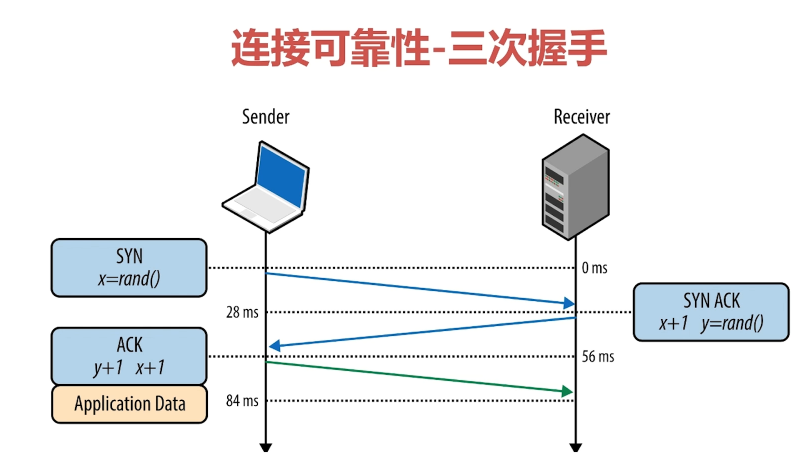

# 什么是网络编程

## 什么是网络

- 在计算机领域中，网络是信息传输、接收、共享的虚拟平台
- 通过它把各个点、面、体的信息联系到一起，从而实现这些资源的共享

## 网络编程

- 网络编程从大的方面说就是对信息的发送到接收
- 通过操作相应Api调度计算机硬件资源，并利用传输管道（网线）进行数据交换的过程
- 更为具体的设计：网络模型、套接字、数据包

### 七层网络模型-OSI

1. 应用层
2. 表示层
3. 会话层
4. 传输层
5. 网络层
6. 数据链路层
7. 物理层

# Socket与TCP、UDP

## Socket

- 简单来说是IP地 址与端口的结合协议（RFC 793）
- 一种地址与端口的结合描述协议
- TCP/IP协议的相关API的总称；是网络API的集合实现
- 涵盖了：Stream Socket/Datagram Socket

### Socket的作用于组成

- 在网络传输中用于唯一标示两个端点之间的链接
- 端点 ：IP + Port
- 四个要素：客户端地址、客户端端口、服务器地址、服务器端口

### 报文、协议、Mac地址

#### 报文段

- 报文段是指TCP/IP协议网络传输过程中，起着路由导航作用
- 用以查询各个网络路由网段、IP地址、交换协议等IP数据包
- 报文段充当整个TCP/IP协议数据包的导航路由功能
- 报文在传输过程中会不断的封装成分组、包、帧来传输
- 封装方式就是添加一些控制信息组成的首部，即报文头

#### 传输协议

- 规定，约束
- 约定大于配置， 网络的传输流程是健壮的稳定的，得益于基础的协议构成
- 简单来说就是A -> B，B -> A的传输数据，双方都能识别，这就是协议

#### Mac地址

- 用来定义网络设备的位置

## Socket之TCP

- TCP是面向连接的通信协议
- 通过三次握手建立连接，通讯完成时要拆除连接
- 由于TCP是面向连接的所以只能用于端到端的通讯

## Socket之UDP快速入门

- UDP是面向无连接的通讯协议
- UDP数据包括目的端口号和源端口号信息
- 由于通讯不需要连接，所以可以实现广播发送，并不局限于端到端
- UDP是一种**用户数据报协议**，又称**用户数据报文协议**
- 是一个简单的面向**数据报**的**传输层**协议，正式规范为RFC 768
- 用户数据协议、非连接协议

### 为什么不可靠

- 它一旦把应用程序发给网络层的数据发送出去，就不保留数据备份
- UDP在IP数据报的头部仅仅加入了复用和数据校验（字段）
- 发送端生产数据，接收端从网络中抓取数据
- 结构简单、无校验、速度快、容易丢包、可广播

### UDP能做什么

- DNS、TFTP、SNMP
- 视频、音频、普通数据（无关紧要数据）

### UDP包最大长度

**UDP头部信息（64位）：**

- 16位->2字节存储长度信息
- 2^16-1= 65535
- 自身协议占用32 + 32位=64位=8字节
- 65535-8=65507 byte

### UDP核心API

#### API-DatagramSocket

- 用于接收与发送UDP的类
- 负责发送某一个UDP包，或者接收UDP包
- 不同于TCP，UDP并没有合并到Socket API中
- DatagramSocket() 创建简单实例，不指定端口与IP
- DatagramSocket(int port) 创建监听固定端口的实例
- DatagramSocket(int port, InetAddress localAddr) 创建固定端口指定IP的实例
- receive(DatagramPacket d) ：接收
- send(DatagramPacket d) ：发送
- setSoTimeOut ： 设置超时时间，单位毫秒

#### API-DatagramPacket

- 用于处理报文

- 将Byte数组，目标地址，目标端口等数据包装成报文或者将报文拆卸成byte数组

- 是UDP的发送实体，也是接收实体

- DatagramPacket(byte buf[], int offset, int length,InetAddress address, int port)

  > - 前面上参数指定buf的使用区间
  > - 后面两个参数指定目标机器的地址与端口

- DatagramPacket(byte buf[], int offset, int length, SocketAddress address)

  > - 前面上参数指定buf的使用区间
  > - SocketAddress 相当于InetAddress + Port

### UDP 单播、广播、多播

#### 单播

- 点对点

#### 多播（组播）

- 一对多，分组，发送到一个组的所有用户

#### 广播

- 一对所有

**广播地址 ：**

## Socket之TCP快速入门

### TCP是什么

- TCP是传输层控制协议；是一种面向连接的、可靠的、基于字节流的传输层通信协议，由IETF的RFC 793定义

- TCP的机制：三次握手，四次挥手
- 具有校验机制、可靠、数据传输稳定

### TCP能做什么

- 聊天消息传输、推送
- 担任语音、视频聊天等
- 几乎UDP能做的TCP都能做，但需要考虑复杂性、性能问题
- 限制：无法进行广播，多播等操作

### TCP核心API

- socket() : 创建一个Socket
- bind(): 绑定一个Socket到一个本地地址和端口上
- connect() : 连接到远程套接字
- accept() : 接受一个新的连接，服务器端ServerSocket的方法
- write(): 把数据写入到Socket输出流
- read(): 从Socket输入流读取数据

**客户端建立连接流程：**

**服务器端建立连接：**

### TCP连接可靠性

#### 三次握手

- 服务端收到客户端的消息说明客户端的发送能力，和服务器的接收能力是正常的
- 服务端发送SYN ACK消息是告诉客户端，服务端能正常接收到消息
- 客户端收到服务端的响应，表示客户端知道此时服务端的发送和响应都是正常的，然后客户端接收消息也是正常的
- 然后客户端会再发一次ACK给客户端，表示自己能正常接收
- 通过三次握手能确保客户端和服务端的发送接收能力都是正常的

**三次握手-数据随机的必要性：**

#### 四次挥手

1. client发送断开请求

2. server接收到断开请求之后，回送可以断开请求，此时Server端可能还有些数据未处理完
3. Client收到Server的ACK之后，就可以停止向Server端发送消息了，但是还要保留接收Server端消息的能力
4. Server端处理完数据之后，发送一条断开连接请求给Client端
5. Client端接收到Server端断开连接的请求之后，就可以停止接收Server端请求了，并回送一条ACK给Server端
6. Server端收到之后就可以安全断开连接了

- 四次挥手保证全双工的连接

#### TCP传输可靠性—排序、丢弃、重发

- 排序、顺序发送、顺序组装
- 丢弃、超时
- 重发机制-定时器

#### 代码实现

##### TCP传输初始化配置

- 初始化服务器TCP链接监听
- 初始化客户端发起链接操作
- 服务器Socket链接处理

##### 基础类型数据传输

## UDP辅助TCP实现点对点传输

### UDP搜索IP与端口

构建基础口令消息

局域网广播口令信息（指定端口）

接收指定端口回送消息（得到客户端IP、Port）

### 收据发送与接收并行

- Socket的input,output分别用一个线程持有

# 简易聊天室

- 必要条件 : 客户端,服务器
- 必要约束 : 数据传输协议
- 原理: 服务器监听消息来源, 客户端连接服务器并发送消息到服务器
- 客户端发送数据到服务器,服务器再转发到其他客户端

## 服务器性能总结与优化方案

- CPU : 取决于数据的频繁性,数据的转发复杂性
- 内存 : 取决于客户端的数量, 客户端发送的数据大小
- 线程 : 取决于客户端的数量

### 优化方案

- 减少线程数量
- 增加线程执行繁忙状态
- 客户端Buffer复用机制

# 阻塞IO与非阻塞IO