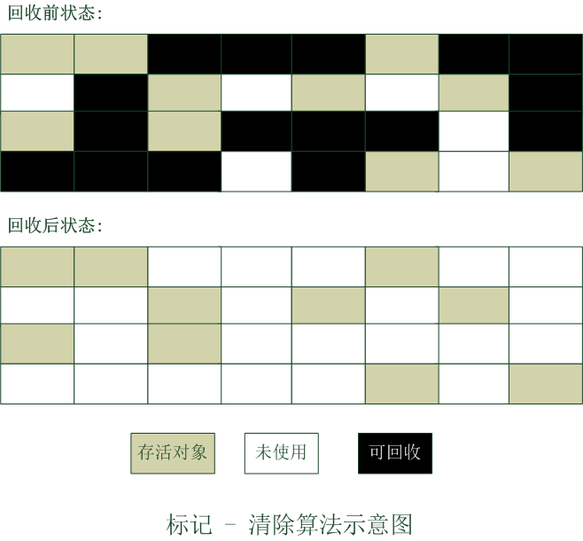
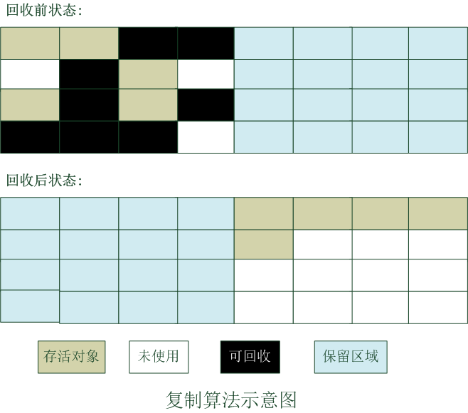
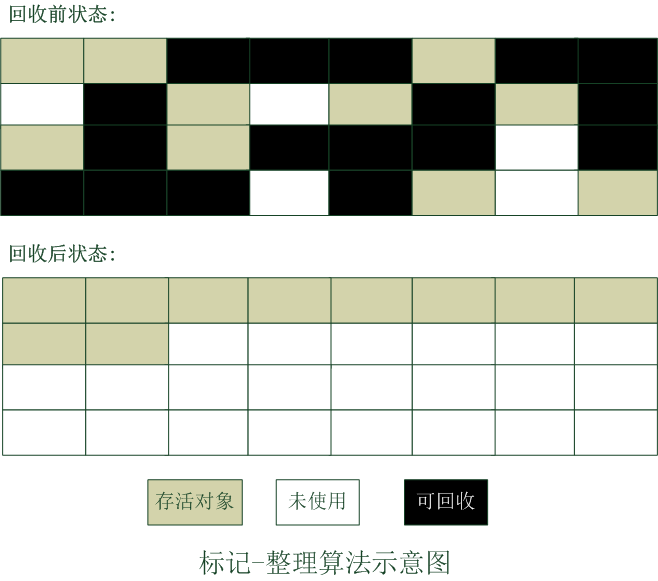

# 概述

GC需要完成的3件事 : 

- 哪些内存需要回收
- 什么时候回收
- 如何回收

# 判断对象是否存活算法

## 引用计数算法(Reference Counting)

- 给对象中添加一个引用计数器, 每当有一个地方引用它时, 计数器值就加1; 当引用失效时, 计数器值就减1;任何时刻计数器为0的对象就是不可能再被使用的
- 存在循环引用问题
- 由于循环引用问题, 所以主流的Java虚拟机没有使用引用计数算法来管理内存的

## 可达性分析算法(Reachability Analysis)

> 通过一系列的称为"GC Roots"的对象作为起始点, 从这些节点开始向下搜索, 搜索所走过的路径称为引用链(Reference Chain), 当一个对象到GC Roots没有任何引用链相连时, 则证明此对象是不可用的。如下图所示, object5, object6, object7虽然相互有关联, 但是它们到GC Roots是不可达的, 所以它们会被判定为可回收对象

**在Java中,可作为GC Roots的对象包括下面几种 :**

- 虚拟机栈(栈帧中的本地变量表)中引用的对象
- 方法区中类静态属性引用的对象
- 方法区中常量引用的对象
- 本地方法中JNI(即一般说的Native方法)引用的对象

## 引用类型

- 强引用(Strong Reference) : 强引用就是指在代码中普遍存在的, 类似"Object obj = new Object()"这类的引用, 只要强引用还存在, 垃圾收集器永远不会回收掉被引用的对象
- 软引用(Soft Reference) : 软引用是用来描述一些还有用但并非必需的对象。对于软引用关联着的对象, 在系统将要发生内存溢出异常之前, 将会把这些对象列进回收范围之中进行第二次回收。如果这次回收还没有足够的内存, 才会抛出内存溢出异常。
- 弱引用(Weak Reference) : 弱引用也是用来描述非必需对象的, 但是它的强度比软引用更弱一些, 被弱引用关联的对象只能生存到下一次垃圾回收发生之前。当垃圾收集器工作时, 无论当前内存是否足够, 都会回收掉只被弱引用关联的对象。使用WeakReference类来实现弱引用。
- 虚引用(Phantom Reference) : 虚引用也称为幽灵引用或者幻影引用, 它是最弱的一种引用关系。一个对象是否有虚引用的存在, 完全不会对其生存时间构成影响, 也无法通过虚引用来取得一个对象实例。为一个对象设置虚引用关联的唯一目的就是能在这个对象被GC回收时收到一个系统通知。使用PhantomReference类实现虚引用。

> 引用强度 : 强引用 > 软引用 > 弱引用 > 虚引用

## 回收方法区

> 方法区的垃圾回收主要回收两部分内容, 废弃常量和无用的类。回收废弃常量与回收Java堆中的对象很类似, 就是没有任何对象引用这个常量, 这个常量就是废弃常量。

**无用的类判断方法 :**

- 该类的所有实例都已经被回收, 也就是Java堆中不存在该类的任何实例
- 加载该类的ClassLoader已经被回收
- 该类对应的java.lang.Class对象没有任何地方被引用, 无法在任何地方通过反射访问该类的方法

虚拟机可以对满足上面三个条件的无用类进行回收, 这里说"可以", 而并不是和对象一样, 不使用了就必然回收。在大量使用反射, 动态代理, CGlib等ByteCode框架; 动态生成JSP以及OSGI这类频繁自定义ClassLoader的场景都需要虚拟机具备类卸载功能, 以保证永久代不会溢出。

# 垃圾收集算法

## 标记 - 清除算法

- 标记 : 首先标记出需要回收的对象
- 清除 : 在标记完成后统一回收被标记的对象

**缺点 :** 

- 效率问题, 标记和清除两个过程的效率都不高
- 空间问题, 标记清除之后会产生大量不连续的内存碎片, 空间碎片太多可能会导致以后在程序运行过程中需要分配较大对象时, 无法找到足够的连续内存而不得不提前触发另一次垃圾收集动作

**标记-清除算法示意图 :**

## 复制算法

- 将内存划分为大小相等的两块, 每次只使用其中一块

- 当这一块内存用完时, 就将还存活的对象复制到另外一块。

- 然后把已使用的内存整个回收。
- 新生代收集算法

**优点 :**

>  不存在内存碎片问题, 内存分配时只需要移动堆顶指针, 按顺序分配内存即可, 实现简单, 运行高效

**缺点 :**

> - 原理上来讲,浪费了一半的内存空间(事实上商用的虚拟机只会浪费少量的内存空间, 下面会有说明)
> - 对象存活率较高时就要进行较多的复制操作, 效率将会变低
> - 如果不想浪费50%的空间, 就需要有额外的空间进行分配担保, 以应对被使用内存中所有对象都100%存活的极端情况, 所以老年代一般不能直接选用这种算法。

**复制算法示意图 :**

**优化策略 :**

​	现在的商业虚拟机都采用这种算法回收新生代内存, 但是并不是按照1:1的比例来划分内存空间的, 具体的策略如下:

- 将内存分为一块较大的Eden空间和两块较小的Survivor空间
- 每次使用Eden空间和其中一块Survivor空间
- 当回收时, 将Eden空间和已使用的Survivor空间中存活的对象复制到另一块未使用的Survivor空间中
- 如果未使用的Survivor空间中内存不足以存放Eden空间和已使用的Survivor空间的存活对象, 这些对象通过内存分配担保机制直接进入老年代
- 最后清理掉Eden空间和刚使用过的Survivor空间
- HotSpot虚拟机(JDK默认的虚拟机)默认Eden和Survivor的比例为8:1, 也就是每次新生代中可用内存空间为整个新生代的90%, 只有10%的空间会被"浪费"

**下面是HotSpot中堆内存空间分配 :** 

## 标记 - 整理算法

- 标记 : 标记过程与标记-清除算法一样
- 整理 : 将所有存活对象都向一端移动
- 清除 : 清理掉存活对象边界以为的内存

**标记 - 整理算法示意图 :** 

## 分代收集算法

- 当前的商业虚拟机都采用"分代收集算法"
- 根据对象存活周期的不同, 将内存划分为几块, 一般是将Java堆分为新生代和老年代, 根据不同的年代特点使用不同的垃圾收集算法
- 新生代 : 每次垃圾收集时都发现有大批对象死去, 只有少量存活, 一般使用**复制算法**, 只需付出少量存活对象的复制成本就可以完成收集
- 老年代 : 对象存活率较高; 没有额外的空间进行空间分配担保; 所以在老年代中必须使用**标记 - 清除**或**标记 - 整理**算法来进行回收