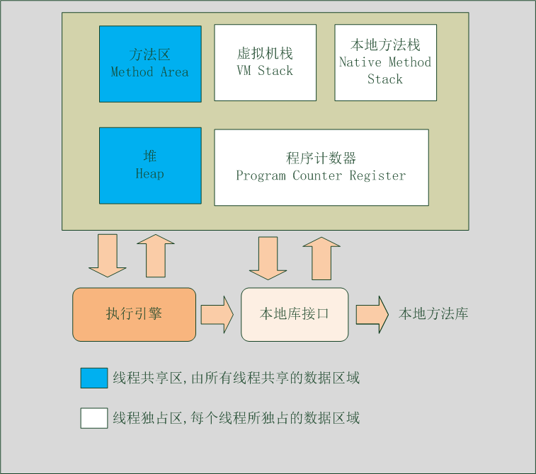
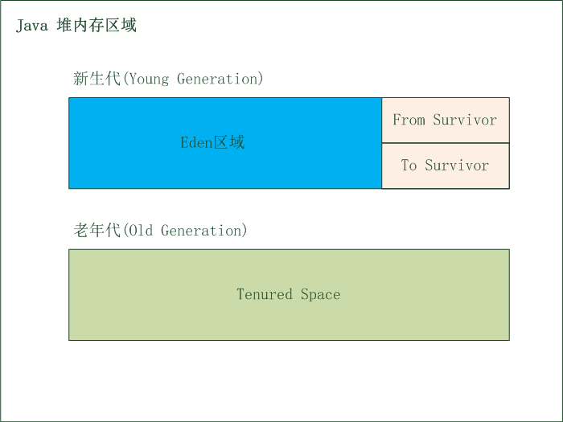

# JVM内存区域

# 线程独占区域
## 程序计数器(Program Counter Register)
**概述 :**
> 程序计数器是一块个较小的内存空间, 它可以看做是当前线程所执行的字节码的行号指示器. 在虚拟机的概念模型里(仅是概念模型, 各种虚拟机可能通过一些更高效的方式去实现), 字节码解释器工作时就是通过改变这个计数器的值来选取下一条执行的字节码指令, 分支,循环,跳转,异常处理,线程恢复等基础功能都需要依赖这个计数器来完成
- 可以看作当前线程所执行代码的行号指示器
- 线程独占/私有, 每个线程都有各自的程序计数器
- 执行java方法时记录字节码指令地址,执行native方法时为空(Undefined)
- 虚拟机中唯一一个没有OutOfMemoryError错误的区域
## Java虚拟机栈(Java Virtual Machine Stacks)
**概述 :**
> 虚拟机栈描述的是Java方法执行的内存模型 : 每个方法在执行的同时都会创建一个栈帧(Stack Frame)用于存储局部变量表, 操作数栈, 动态链接, 方法出口等信息. 每一个方法调用到执行完成的过程, 就对应着一个栈帧在虚拟机中入栈到出栈的过程. 
- 线程独占/私有
- 描述Java方法执行的内存模型, 栈帧
- 局部变量表, 我们通常所说的栈空间, 指的就是这一部分

   >- 存放编译器可知的各种基本类型(boolean, byte, char, short, int, long, float, double)
  	>- 对象引用 : reference类型
  	>
  	>  >- returnAddress类型 : 指向一条字节码指令的地址		
- 异常信息
  - StackOverflowError : 线程请求的栈深度大于虚拟机允许的栈深度
  - OutOfMemeroyError :虚拟机动态扩展时,申请不到足够的内存
## 本地方法栈(Native Method Stack)
> 本地方法栈与虚拟机栈所发挥的作用非常相似, 它们之间的区别不过是虚拟机栈为虚拟机执行Java方法服务, 而本地方法栈为虚拟机执行本地方法(native方法)服务.
# 线程共享区域
## Java堆(Java Heap)
**概述 :**
> Java 堆是Java虚拟机所管理的内存中最大的一块. Java堆是被所有线程共享的一块内存区域, 在虚拟机启动时创建. 此内存区域的唯一目的就是存放对象实例, 几乎所有的对象实例都在这里分配内存.
- 虚拟机中最大的一块内存区域, 虚拟机启动时创建
- 用于存放对象实例
- 线程共享区域
- 垃圾收集器管理的主要区域, 所以也称之为"GC 堆"
- 堆内存区域细分
  > **新生代 :**
  > - Eden 区域 : 新生对象优先分配到Eden区域, 默认占新生代80%的空间, 垃圾回收算法为*标记整理算法*
  > - Survivor 区域 : 分为From Survivor和To Survivor区域, 用于存放Eden区域经过垃圾回收之后存活的对象, 分为From和To两个区域是因为该区域使用的垃圾收集算法为*复制算法*, 默认From和To各占新生代10%的内存空间
  >   **老年代 : **用于存放经历多次垃圾回收依旧存活的对象, 还有较大的对象(可通过JVM参数定义多的的对象是大对象), 垃圾收集算法为*标记清除算法*

  

***注 :***
> 在JVM虚拟机规范中规定, 所有的对象实例以及数组都要在堆上分配, 但是随着JIT编译器的发展与逃逸分析技术逐渐成熟, 栈上分配,标量替换优化技术将会导致一些微妙的变化发生, 所有的对象都分配在堆上也并不是那么"绝对"了
## 方法区(Method Area)
**概述 :**
> 方法区与Java堆一样, 是线程共享区域, 它用于存储已被虚拟机加载的类信息,常量,静态变量,即时编译器编译后的代码等数据. 虽然Java虚拟机规范把方法区描述为堆的一个逻辑部分, 但是它却有一个别名叫做Non-Help(非堆), 目的应该是与Java堆区分开来.
- HotSpot虚拟机在JDK1.8之前使用永久代(PermGen)实现方法区, JDK1.8时,jvm去掉了永久代, 改为了元空间(Metaspace)
- 线程共享区域
- 用于存储已被虚拟机加载的类信息,常量,静态变量,即时编译器编译后的代码等数据
### 运行时常量池(Runtime Constant Pool)
- 方法区的一部分. Class文件除了有类的版本, 字段, 方法, 接口等描述信息外, 还有一项信息是常量池, 用于存放编译期生成的各种字面量和符号引用, 这部分内容将在类加载后进入方法区的运行时常量池中存放
- 一般来说, 除了Class文件中描述的符号引用外, 还会把翻译出来的直接饮用也存储在运行时常量池中
- 运行时常量池相对于Class文件常量池多的另外一个特征是具备动态性, Java语言并不要求常量一定只有在编译期才能产生, 也就是并非预置入Class文件中的常量池的内容才能进入方法区运行时常量池, 运行期间也可能将新的常量放入常量池中, 最常用的就是String的intern()方法
- OutOfMemeroyError : 无法再申请到内存时抛出
## 直接内存(Direct Memory)
- 主机内存, 不属于虚拟机, 不受虚拟机内存大小限制, 
- 一般只有在使用NIO时会用到