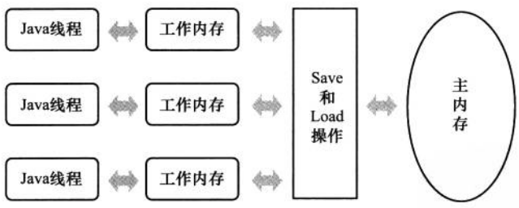
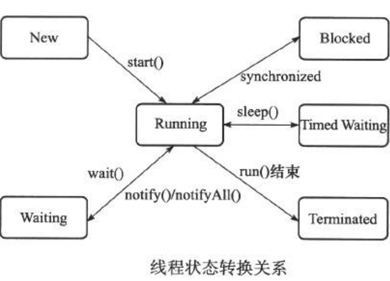

# 主内存与工作内存

## 概述

> Java内存模型的主要目标是定义程序中各个变量的访问规则, 即在虚拟机中将变量存储到内存和从内存中取出变量这样的低层细节.
>
> 变量 : 和Java编程中所说的变量有所区别, 它包括了实例字段, 静态字段和构成数组对象的元素,但不包括局部变量和方法参数,因为后者是线程私有的, 不会被共享.

## 线程,主内存,工作内存交互关系

**从变量, 主内存, 工作内存的定义来看:**

- 主内存 : 主要对应于java堆中的对象实例数据部分
- 工作内存 :  对应于虚拟机栈中的部分区域

## 内存间交互操作

### 操作类型

- lock(锁定) : 作用与主内存的变量, 它把一个变量标识为一条线程独占的状态
- unlock(解锁) : 作用于主内存变量, 它把一个处于锁定状态的变量释放出来, 释放后的变量才可以被其他线程锁定
- read(读取) : 作用于主内存的变量, 它把一个变量的值从主内存传输到工作内存中, 以便随后的load动作使用
- load(载入) : 作用于工作内存的变量, 它把read操作从主内存中得到的变量的值放入工作内存的变量副本中
- use(使用) : 作用于工作内存的变量, 它把工作内存中一个变量的值传递给执行引擎, 每当虚拟机遇到一个需要使用变量的值的字节码指令时将会执行这个操作
- assign(赋值) : 作用于工作内存的变量, 它把一个从执行引擎接收到的值赋给工作内存的变量, 每当虚拟机遇到一个给变量赋值的字节码指令时, 执行这个操作
- store(存储) : 作用于工作内存的变量, 它把工作内存中的一个变量的值传送到主内存中, 以便随后的write内存操作使用
- write(写入) : 作用于主内存的变量, 它把store操作从工作内存中得到的变量的值放入主内存的变量中

**Java内存模型还规定了在执行上述八种基本操作时必须满足如下规则:**

- 不允许read和load, store和write操作之一单独出现, 即不允许一个变量从主内存读取了但工作内存不接受, 或者从工作发起回写了但主内存不接受的情况出现
- read->laod, store->write这两组操作必须按顺序执行,但是不要求连续执行,如: read a->read b -> load b -> load a这种情况
- 不允许一个线程丢弃它的最近的assign操作, 即变量再工作内存中改变了之后必须把该变化同步回主内存
- 不允许一个线程无原因的(没有发生过任何assign操作)把数据从工作内存同步回主内存中
- 一个新的变量只能在主内存中"诞生", 不允许在工作内存中直接使用一个未被初始化(load或assign)的变量, 换句话说, 就是对一个变量实施use, store操作之前, 必须先执行过了assign和load操作
- 一个变量再同一时刻只允许一个线程对其进行lock操作, 但lock可以被同一个线程重复执行多次, 多次lock后, 只有执行相同次数的unlock操作, 变量才会被解锁
- 如果对一个变量执行lock操作, 那将会清空工作内存中此变量的值, 在执行引擎使用这个变量前, 需要重新执行load或assign操作初始化变量的值
- 如果一个变量事先没有被lock操作锁定, 那就不允许对它执行unlock操作, 也不允许去unlock一个被其他线程锁定的变量
- 对一个变量执行unlock操作之前, 必须把此变量同步回主内存中(执行store, write操作)

## volatile型变量的特殊规则

volatile变量只能保证**可见性**,所以在**不符合下面规则**的场景中,仍需要通过加锁来保证原子性:

- 运算结果并不依赖变量的当前值, 或者能够确保只有单一的线程修改变量的值
- 变量不需要与其他的状态变量共同参与不变约束 (禁止指令重排序优化)

Java内存模型(JMM)对volatile变量定义的特殊规则. 假定T表示一个线程, V和W分别表示两个volatile型变量, 那么在进行read, load, use, assign, store和write操作时需要满足如下规则:

- 只有当线程T对变量V执行的前一个动作是load的时候, 线程T才能对变量V执行use动作; 并且, 只有当线程T对变量V执行的后一个动作是use的时候, 线程T才能对变量V执行load动作. 线程T对变量V的use动作可以认为是和线程T对变量V的load, read动作相关联, 必须连续一起出现(这条规则要求在工作内存中, 每次使用V都必须从主内存刷新最新的值,用于保证能看见其他线程对变量V所做的修改后的值)
- 只有当线程T对变量V执行的前一个动作是assign的时候, 线程T才能对变量V执行store动作; 并且, 只有当线程T对变量V执行的后一个动作是store的时候, 线程T才能对变量V执行assign动作. 线程T对变量B的assign动作可以认为是和线程T对变量V的store, write动作相关联, 必须连续一起出现(这条规则要求在工作内存中, 每次修改V后都必须立刻同步回主内存中,用于保证其他线程可以看到自己对变量V所做的修改)
- 假定动作A是线程T对变量V实施的use或assign动作, 假定F是和动作A相关联的load或store操作, 假定P是和动作F相应的对变量V的read或write动作; 类似的, 假定动作B是线程T对变量W实施的use或assign动作, 假定动作G是和动作B相关联的load或store动作, 假定动作Q是和动作G相应的对变量W的read或write动作. 如果A先于B, 那么P先于Q(这条规则要volatile修饰的变量不会被指令重排序优化, 保证代码的执行顺序与程序的顺序相同)

## 对于long和double型变量的特殊规则

- JMM要求lock, unlock, read, load, assign, use, store, write这8个操作具有原子性
- 对于64位的数据类型(long和double) : 允许虚拟机将未被volatile修饰的64位数据的读写操作划分为两次32位操作类进行, 即允许虚拟机实现可以不保证64数据类型的load, store, read和write的原子性, 这点就是龙和double的非原子性协定(Nonatomic Threatment of double and 龙 Variablees). 虽然允许这么做, 但是目前的Java虚拟机都还选择把对64位数据的读写操作作为院子操作来对待.

## 原子性,可见性和有序性

### 原子性(Atomicity)

> 由Java内存模型来直接保证的原子性变量操作包括read, load, assign, use, store, 和write, 可以大致的认为基本数据类型的访问读写是具备原子性的

- 如果需要更大范围的原子性保证, Java内存模型还提供了lock和unlock操作来满足这种需求(对应锁的lock和unlock), 尽管虚拟机未把lock和unlock的操作直接开放给用户使用,但却提供了更高层次的字节码指令monitorenter和monitorexit来隐式的使用者两个操作, 这两个字节码反映到Java代码中就是同步块synchronized关键字, 因此synchronized块之间的操作也具备原子性

### 可见性

> 可见性是指当一个线程修改了共享变量的值, 其他线程能立即得知这个修改

- JMM是通过在变量修改后, 将更新值同步回主内存, 在变量读取前从主内存刷新变量值这种依赖主内存作为传递媒介的方式来实现可见性的, 无论是普通变量还是volatile变量都是如此, 普通变量与volatile变量的区别是, volatile的特殊规则保证了新值能立即同步到主内存, 以及每次使用变量前立即从主内存刷新. 因此, 可以说volatile保证了多线程操作时变量的可见性, 而普通变量则不能保证这一点.
- 除了volatile之外, synchronized和final也能实现可见性
  - 同步块synchronized的可见性是由"对一个变量执行unlock操作之前, 必须先把此变量同步回主内存中(执行store, write操作)"这条规则获得的
  - final关键字的可见性是指 : 被final修饰的字段在构造器中一旦初始化完成, 并且在构造器中没有把"this"的引用传递出去(this引用逃逸是一件很危险的事情, 其他线程有可能通过这个引用访问到"初始化了一半"的对象), 那在其他线程中就能看见final字段的值

### 有序性

> Java程序中天然的有序性可以总结为一句话 : 如果在本线程内观察, 所有操作都是有序的; 如果在一个线程观察另一个线程, 所有操作都是无序的.
>
> - 前半句是指"线程内表现为串行的语义"(Within-Thread As-If-Serial Semantics)
> - 后半句是指"**指令重排序**"现象和"**工作内存与主内存同步延迟**"现象

## 先行发生(happens-before)原则

JMM下存在一些"天然的"先行发生关系, 这些先行发生关系无须任何同步器协助就已经存在, 可以在编码中直接使用. 如果两个操作之间的关系不在此列, 并且无法根据这些规则推导出来的话, 它们就没有顺序性保障, 虚拟机可以对它们随意的进行重排序. JMM的一些happens-before如下 : 

- 程序次序规则(Program Order Rule) : 在一个线程内, 按照代码顺序, 书写在前面的操作要先行发生于书写在后面的操作. 准确的说, 应该是控制流顺序而不是程序代码顺序, 因为要考虑分支, 循环等结构.
- 管程锁定骨子额(Monitor Lock Rule) : 一个unlock操作先行发生于后面对同一个锁的lock操作. 这里必须强调的是同一个锁, 而"后面"是指时间上的先后顺序
- volatile变量规则(Volatile Variable Rule) : 对一个volatile变量的写操作, 先行发生于后面对这个变量的读操作, 这里的"后面"同样是指时间上的先后顺序
- 线程启动规则(Thread Start Rule) : Thread对象的start方法先行发生于此线程的每一个动作
- 线程终止规则(Thread Termination Rule) : 线程中的所有操作都先行发生于对此线程的终止检测, 我们可以通过Thread.join()方法结束, Thread.isAlive()的返回值等手段检测到线程已经终止执行
- 线程中断规则(Thread Interruption Rule) : 对线程interrupt()方法的调用先行发生于被中断线程的代码检测到中断事件的发生, 可以通过Thread.interrupted()方法检测到是否有中断发生.
- 对象终结规则(Finallizer Rule) : 一个对象的初始化完成(构造函数执行结束)先行发生于它的finalize()方法的开始
- 传递性(Transitivity) : 如果操作A先行发生于操作B, 操作B先行发生于操作C, 那么操作A也先行发生于C

# Java与线程

## 线程的实现

- 使用内核线程实现
- 使用用户线程实现
- 使用用户线程加轻量级进程混合实现
- Java线程的实现
  - JDK1.2之前是基于成为"绿色线程"(Green Threads)的用户线程实现的
  - JDK1.2及之后, 线程模型替换为基于操作系统原生线程模型来实现

## Java线程调度

> 线程调度是指系统为线程分配使用权的过程, 主要调度方式有两种, 分别是协同线程调度(Cooperative Threads-Scheduling)和抢占式线程调度(Preemptive Threads-Scheduling)

- 协同式线程调度 : 线程的执行时间由线程本身来控制, 线程把自己的工作执行完了之后, 要主动通知系统切换到另外一个线程上.
  - 优点 : 实现简单, 不存在线程同步问题
  - 缺点 : 线程执行时间不可控制, 甚至如果一个线程编写有问题, 一直不告知系统进行线程切换, 那么程序就会一直阻塞在那里
- 抢占式线程调度 : 每个线程将由系统来分配执行时间, 线程的 切换不由线程本身决定(在Java中, Thread.yield()可以让出执行时间, 但是要获取执行时间的话, 线程本身是没有什么办法的), 在这种实现线程调度的方式下, 线程的执行时间是系统可控的, 也不会有一个线程导致整个进程阻塞的问题, Java使用的线程调度方式就是抢占式调度.
- 可以使用线优先级"建议"系统给某些线程多分配一点执行时间, 另外的一些线程少分配一点. 
- 线程优先级并不是太靠谱, 原因是Java线程是通过映射到系统的原生线程上实现的, 所以线程调度最终还是取决于操作系统, 虽然很多操作系统都提供线程优先级的概念, 但是并不见得能与Java线程的优先级一一对应. Java设置了10个优先级.

## 状态转换

Java语言定义了五种线程状态, 在任意一个时间点, 一个线程有且只有其中的一种状态, 这五种状态如下 : 

- 新建(New) : 创建后尚未启动的线程处于这种状态
- 运行(Runnable) : Runnable包括了操作系统线程状态中的Running和Ready, 也就是处于此状态的线程有可能正在执行, 也有可能正在等待着CPU为它分配执行时间
- 无限期等待(Waiting) : 处于这种状态的线程不会被分配CPU执行时间, 它们要等待被其他线程显式的唤醒. 以下方法会让线程陷入无限期的等待状态 :
  - 没有设置Timeout参数的Object.wait()方法
  - 没有设置Timeout参数的Thread.join()方法
  - LockSupport.park()方法
- 限期等待(Timed Waiting) : 处于这种状态的线程也不会被分配CPU执行时间, 不过无须等待被其他线程显式的唤醒, 在一定时间之后它们会由系统自动唤醒. 以下方法会让线程进入限期等待状态 : 
  - Thread.sleep()方法
  - 设置了Timeout参数的Object.wait()方法
  - 设置了Timeout参数的Thread.join()方法
  - LockSupport.parkNanos()方法
  - LockSupport.parkUntil()方法
- 阻塞(Blocked) : 线程被阻塞了, "阻塞状态"和"等待状态"的区别是 : "阻塞状态"在等待着获取到一个排他锁, 这个时间将在另一个线程放弃这个锁的时候发生, 而等待状态则是在等待一段时间. 在程序等待进入同步区域的时候,线程将进入这种状态
- 结束(Terminated) : 已终止线程的线程状态, 线程已结束执行

**线程转换关系如下图 :**

