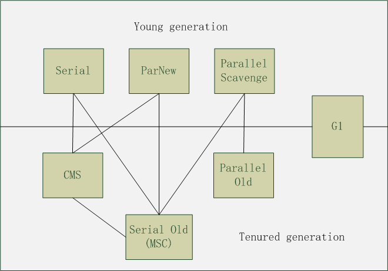
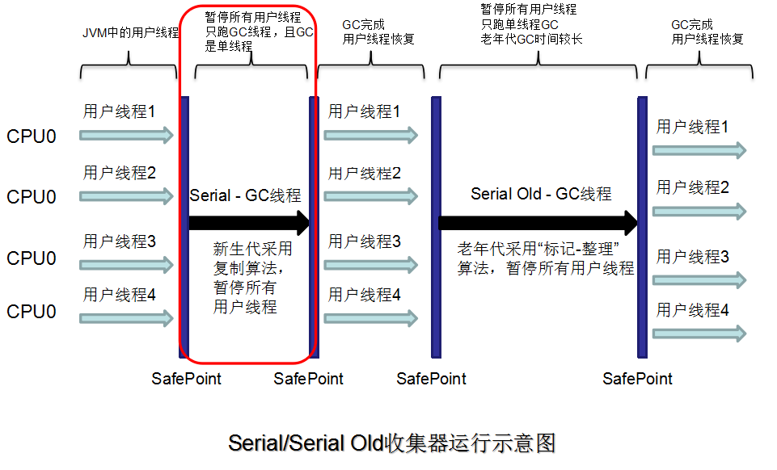
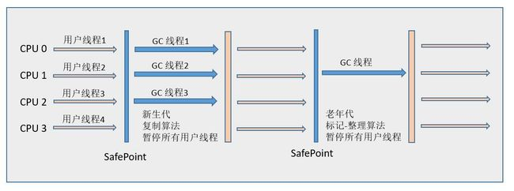
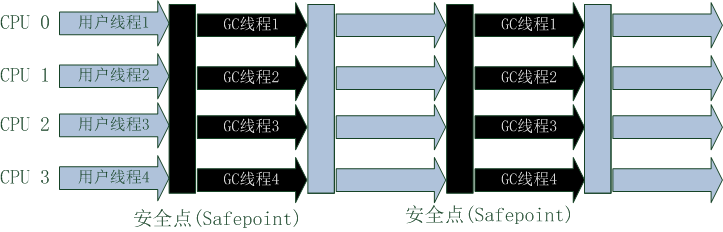
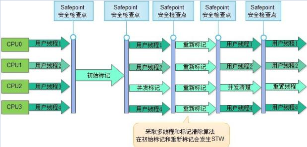
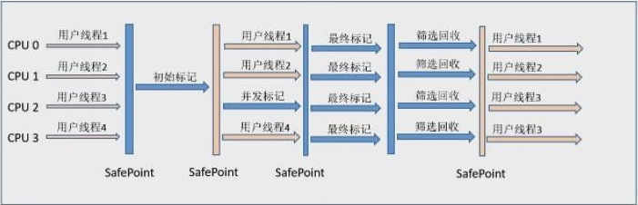

# HotSpot虚拟机垃圾收集器

上图为JDK 1.7 Update14之后的HotSpot虚拟机包含的所有收集器, 如果两个收集器之中存在连线, 就说明它们可以搭配使用。

# Serial收集器

- 单线程收集器
- 执行GC时会暂停其他所有工作线程(会造成应用暂停)
- 新生代收集器
- 复制算法
- 简单而高效(与其他收集器单线程相比)

# ParNew收集器

- Serial收集器的多线程版本
- 新生代收集器
- 采用复制算法

# Parallel Scavenge收集器

- 新生代收集器

- 复制算法

- 多线程收集器

- 目标是达到一个可控制的吞吐量

  > 吞吐量就是CPU用于运行用户代码的时间和CPU总消耗的时间的比值, 
  >
  > 即吞吐量 =  运行用户代码时间 / (运行用户代码时间 + 垃圾收集时间)

**运行示意图 :** 

# Serial Old收集器

- 老年代收集器
- Serial收集器的老年代版本
- 单线程收集器
- 标记-整理算法

**用途 :**

- JDK1.5的版本之前配合Parallel Scavenge使用
- 作为CMS收集器的备案, 在并发收集发生Concurrent Mode Failure时使用

**运行示意图 :**

# Parallel Old收集器

- 老年代收集器
- Parallel Scavenge的老年代版本
- 多线程收集器
- 标记 - 整理算法

**运行示意图 :** 

# CMS收集器(Concurrent Mark Sweep)

- 以获得最短回收停顿时间为目标的收集器
- 老年代收集器
- 多线程收集器
- 标记 - 清除算法

## 工作流程

- 初始标记(CMS initial mark) : 仅仅只是标记一下GC Roots能直接关联的对象, 速度很快, 会STW(Stop The World)
- 并发标记(CMS concurrent mark) : 进行GC Roots Tracing的过程
- 重新标记(CMS remark) : 为了修正并发标记期间因用户程序继续运作而导致标记产生变动的那一部分对象的标记记录, 这个阶段的停顿时间一般比初始标记阶段稍长, 但比并发标记要短, 会STW
- 并发清除(CMS concurrent sweep) : 并发清除垃圾对象

**优点 :** 

- 并发收集, 由于耗时最长的并发标记和并发清理都是和用户线程一起工作的, 所以总体上来说CMS内存回收过程是与用户线程一起并发执行的
- 低停顿,  只有初始标记, 重新标记两个阶段才会STW

**缺点 :**

- CMS收集器对CPU资源非常敏感。在并发阶段, 它虽然不会导致用户线程停顿, 但是会因为占用了一部分线程(或者说CPU资源)而导致应用程序变慢, 总吞吐量会降低。CMS默认启动的回收线程数是(CPU数量 + 3) / 4, 也就是当CPU4个以上时, 并发回收时垃圾收集器线程不少于25%的CPU资源, 并且随着CPU数量的增加而下降。但是当CPU数量不足4个时, CMS对用户程序的影响可能会变得很大。

- CMS无法处理浮动垃圾(Floating Garbage)

  > - 可能出现Concurrent Mode Failure失败而导致另一次Full GC的产生。出现Concurrent Mode Failure之后,虚拟机将启动后备预案, 临时启用Serial Old收集器来重新进行老年代的垃圾收集, 这样停顿时间就长了。
  > - 由于CMS并发清理阶段用户线程还在运行着, 伴随着程序运行自然还会有新的垃圾不断产生, 这一部分垃圾出现在标记过程之后, CMS无法在档次收集中处理掉它们, 只好留待下一次GC时再清理掉。这一部分垃圾就称为"浮动垃圾"。
  > - 也是由于垃圾收集阶段用户线程还需要运行, 那也就还需要预留有足够的内存空间给用户线程使用, 因此CMS收集器不能像其他收集器那样, 等到老年代几乎完全填满了再进行收集, 需要预留一部分空间提供并发收集时程序运行使用。

- 标记 - 清除算法本身就会产生大量的空间碎片, CMS提供了一个参数-XX : +UseCMSCompactAtFullCollection开关参数(默认开启), 用于在CMS收集器顶不住要进行Full GC时开启内存碎片整理合并过程, 内存整理的过程无法并发执行, 内存碎片没有了, 但是停顿时间不得不边长。

# G1 收集器

## 特点

- 并行与并发 : G1能充分利用多CPU, 多核环境下的硬件优势, 使用多个CPU来缩短STW停顿的时间, 部分收集器原本需要停顿Java线程执行GC动作, G!收集器仍然可以通过并发的方式让Java程序继续执行。
- 分代收集 : 虽然G1可以不需要其他收集器配合就能独立管理整个GC堆, 但它能采用不同的方式去处理新创建的对象和已经存活了一段时间, 熬过多次GC的旧对象以获取更好的收集效果。
- 空间整合 : 与CMS的"标记 - 清理"算法不同, G1收集器从整体来看是基于"标记 - 整理"算法实现的收集器, 从局部(两个Region之间)上来看是基于"复制"算法实现的, 但无论如何, 这两种算法都意味着G1运作期间不会产生内存空间碎片, 收集后能提供规整的可用内存。这种特性有利于程序长时间运行, 分配大对象时不会因为无法找到连续内存空间而提前触发下一次GC
- 可预测的停顿 : 这是G1相对于CMS的另一大优势, 降低停顿时间是G1和CMS共同的关注点, 但G1除了追求低停顿外, 还能建立可预测的停顿时间模型, 能让使用者明确指定在一个长度为M毫秒的时间片段内, 消耗在垃圾收集上的时间不得超过N毫秒, 这几乎已经是实时Java(RTSJ)的垃圾收集器的特征了。

## G1工作原理

### 使用G1时堆内存布局

> ​	使用G1收集器时, Java堆的内存布局与其他收集器有很大差别, 它将整个Java堆划分为多个大小相等的独立区域(Region), 虽然还保留有新生代和老年代的概念, 但新生代和老年代不再是物理隔离的了, 它们都是一部分Region(不需要连续)的集合
>
> ​	在G1收集器中, Region之间的对象引用以及其他收集器中的新生代与老年代之间的对象引用, 虚拟机都是使用Remembered Set来避免全堆扫描的。G1中每个Region都有一个与之对应的Remembered Set, 虚拟机发现程序在对Reference类型的数据进行写操作时, 会产生一个Write Barrier暂时中断写操作, 检查Reference引用的对象是否处于不同的Region之中(在分代的例子中就是检查是否老年代中的对象引用了新生代的对象),如果是, 便通过CardTable把相关引用信息记录到被引用对象所属的Region的Remembered Set之中。当进行内存回收时, 在GC根节点的枚举范围之中加入Remembered Set即可保证不对全堆扫描也不会有遗漏。

### 可预测的停顿原理

> G1收集器之所以能建立可预测的停顿时间模型, 是因为它可以有计划的避免在整个Java堆中进行全区域的垃圾收集。G1跟踪各个Region里面垃圾堆积的价值大小(回收所获得的的空间大小以及回收所需时间的经验值), 在后台维护一个优先列表, 每次根据允许的收集时间, 优先回收价值最大的Region(这也是Garbage-First名称的由来)。这种使用Region划分内存空间以及有优先级的区域回收方式, 保证了G1收集器在有限的时间内可以获取尽可能高的收集效率。

### G1工作原理

**不计算维护Remembered Set的操作, G1收集器的运作大致可分为下面几步 :** 

- 初始标记(Initial Marking)

  > 初始标记阶段仅仅只是标记一下GC Roots能直接关联到的对象, 并且修改TAMS(Next Top at Mark Start)的值, 让下一阶段用户程序并发运行时, 能在正确可用的Region中创建新对象, 这阶段需要停顿线程, 但耗时很短

- 并发标记(Concurrent Marking)

  > 从GC Root开始对堆中对象进行可达性分析, 找出存活对象, 这阶段耗时较长, 但可与用户程序并发执行。

- 最终标记(Final Marking)

  > 修正在并发标记期间因用户程序继续运作而导致标记产生变动的那一部分标记记录, 虚拟机将这段时间对象的变化记录在线程Remembered Set Logs里面, 最终标记阶段需要把Remembered Set Logs的数据合并到Remembered Set中, 这阶段需要停顿线程, 但是可并行执行。

- 筛选回收(Live Data Counting and Evacuation)

  > - 对各个Region的回收价值和成本进行排序
  > - 根据用户所期望的GC停顿时间来制定回收计划

**G1收集器运行示意图 :**

​                	*初始标记, 最终标记,筛选回收阶段会STW*

