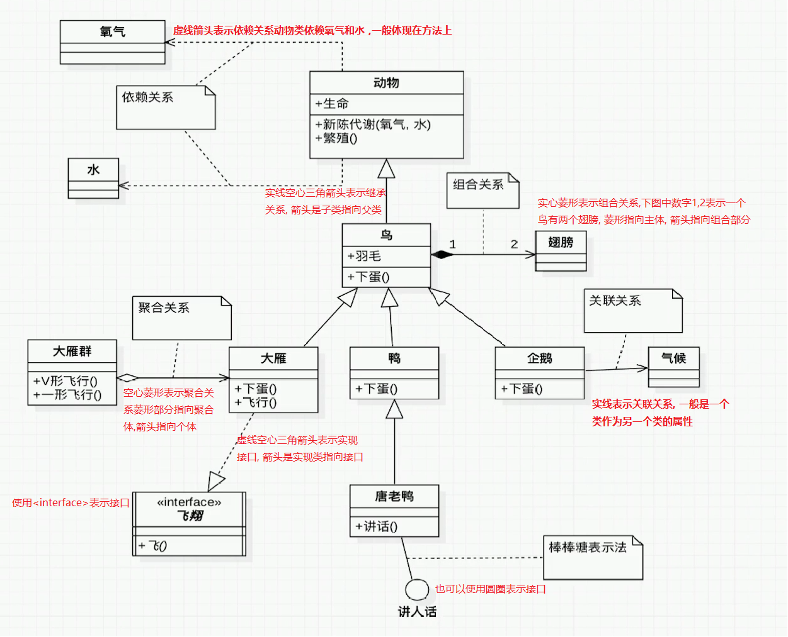
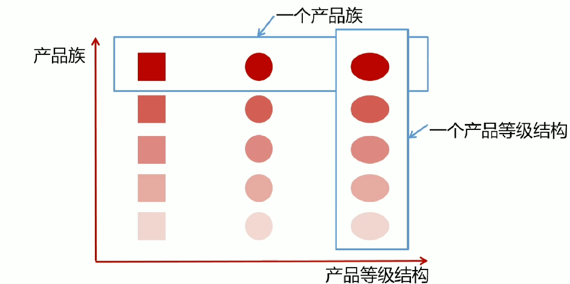

# UML

## 类图


- 上图最上面一行表示类名, 斜体表示抽象类

- 第二行表示属性名, 具体含义如下:

  > - \+ : 表示public权限,上图中name
  > - \- :  表示private权限, 上图中age
  > - \# : 表示protected权限, 上图中sex
  > - ~ : 或者不写表示default属性, 也即包权限, 上图中address
  > - ":String" : 表示属性类型为String
  > - 下划线 : 属性中加了下划线表示为静态属性, 上图中hobby

- 第三行表示类中方法, 具体含义如下:

  > - \+ : 表示public方法, 上图中Operation1方法
  > - \- :  表示private方法, 上图中Operation2方法
  > - \# : 表示protected方法, 上图中Operation3方法
  > - ~ : 或者不写表示default方法, 也即包权限, 上图中Operation4方法
  > - 下划线 : 表示静态方法, 上图中Operation5方法
  > - 斜体 : 表示抽象方法, , 上图中Operation6方法
  > - 括号中内容 : 表示方法参数, 上图中Operation1方法表示有一个String类型的入参
  > - 冒号后 : 表示方法返回值, 上图中Operation2方法表示返回值为String类型

## 类图之间关系说明

以下图为例进行说明:



- 虚线箭头表示依赖关系, 一般体现在方法上, 如作为方法的入参或者返回值, 如上图中动物类依赖于氧气类和水类
- 实线空心三角箭头表示继承关系, 箭头是有子类指向父类, 是一种is a的关系, 如上图中, 鸟是一种动物, 鸟继承了动物类
- 虚线空心三角箭头表示实现接口, 箭头一样是由实现类指向接口, 如上图所示, 大雁类就实现了一个飞翔接口
- 接口可以使用interface表示, 或者使用一个圆圈进行表示(棒棒糖表示法)
- 空心菱形表示聚合关系, 菱形部分指向聚合体, 箭头指向组成聚合体的个体, 上图中多个大雁聚合成一个大雁群
- 实心菱形表示组合关系, 菱形部分指向主体, 箭头指向组合部分, 同时可以用数字表示对应关系, 上图中表示一个鸟和两个翅膀组合成一个完整的鸟, 1,2两个数字分别表示1个鸟对应两个翅膀

# 设计原则

## 开闭原则

- **定义** : 一个软件实体如类, 模块和函数应该对扩展开放, 对修改关闭

- 用抽象构建框架, 用实现扩展细节

- **优点 :** 提高软件系统的可复用性及可维护性

## 依赖倒置原则

- **定义** : 高层模块不应该依赖低层模块, 两者都应该依赖其抽象

- 抽象不应该依赖细节; 细节应该依赖抽象
- 面向接口编程, 而不是面向实现编程

- **优点 :** 可以减少类间的耦合性, 提高系统稳定性, 提高代码可读性和维护性,  降低修改程序所造成的风险

## 单一职责原则

- **定义 :** 不要存在多于一个导致类变更的原因
- 一个类/接口/方法只负责一项职责
- **优点 :** 降低类的复杂度, 提高类的可读性, 提高系统的可维护性, 降低变更引起的风险

## 接口隔离原则

- **定义 :** 用多个专门的接口, 而不使用单一的总接口, 客户端不应该依赖它不需要的接口
- 一个类对一个类的依赖应该建立在最小的接口上
- 建立单一接口, 不要建立庞大臃肿的接口
- 尽量细化接口, 接口中的方法尽量少
- **优点** : 符合高内聚低耦合的设计思想, 从而使类具有很好的可读性, 可扩展性和可维护性
- 要适度

## 迪米特原则(最少知道原则)

- **定义 :** 一个对象应该对其他对象保持最少的了解
- 尽量降低类与类之间的耦合
- **优点 :** 降低类之间的耦合

## 里氏替换原则(LSP)

- 一个软件实体如果使用的是一个父类的话, 那么一定适用于其子类, 而且察觉不出父类和子类对象的区别。也就是说在软件里面, 把父类替换成它的子类, 程序行为没有变化

## 合成/复用原则(组合/复用原则)

- 就是在一个新的对象里面使用一些已有的对象，使之成为新对象的一部分；新的对象通过向这些对象的委派达到复用已有功能的目的。 
- 简短表述就是：要尽量使用组合，尽量不要使用继承。

# 创建型设计模式(Creational)

## 简单工厂模式(Simple Factory)

- **定义 :**  由一个工厂对象决定创建出哪一种产品类的实例
- **类型 :** 创建型, 但不属于GOF23种设计模式

### 适用场景

- 工厂类负责创建的对象比较少
- 客户端(应用层)只知道传入工厂的参数对于如何创建对象不关心

### 优点

- 只需要传入一个正确的参数, 就可以获取你所需要的对象而无需知道其创建细节

### 缺点

- 工厂类的职责相对过重, 增加新的产品需要修改工厂类的判断逻辑, 违背开闭原则

## 工厂方法模式(Factory Method)

- **定义 :** 定义一个创建对象的接口, 但让实现这个接口的类来决定实例化哪个类, 工厂方法让类的实例化推迟到子类中进行
- **类型 :** 创建型设计模式

### 适用场景

- 创建对象需要大量重复的代码
- 客户端不依赖于产品类实例如何被创建, 实现等细节
- 一个类通过其子类来指定创建哪个对象

### 优点

- 用户只需要关心所需产品对应的工厂, 无需关心创建细节
- 加入新产品符合开闭原则, 提高可扩展性

### 缺点

- 类的个数容易过多, 增加复杂度
- 增加了系统的抽象性和理解难度

### 模式角色

- **Product :** 定义工厂方法所创建的对象的接口
- **ConcreteProduct :** Product接口的实现
- **Creator :** 声明工厂方法，该方法返回一个Product类型的对象。也可以定义一个工厂方法的缺省实现，它返回一个缺省的ConcreteProduct对象。
- **ConcreteCreator :** 重定义工厂方法以创建一个ConcreteProduct实例

## 抽象工厂(Abstract Factory)

- **定义 :** 抽象工厂提供一个创建一系列相关或相互依赖对象的接口

- 无需指定它们具体的类

- **类型 :** 创建型设计模式

### 适用场景

- 客户端不依赖于产品实例如何被创建, 实现等细节
- 强调一系列相关的产品对象(属于同一产品组)一起使用创建对象需要大量重复的代码
- 提供一个产品类多的库, 所有的产品以同样的接口出现, 从而使客户端不依赖于具体实现

### 优点

- 具体产品在应用层代码隔离, 无需关心创建细节
- 将一个系列的产品族统一到一起创建

### 缺点

- 具体产品在应用层代码隔离, 无需关心创建细节
- 将一个系列的产品族统一到一起创建

### 产品等级结构与产品族




### 模式角色

- **AbstractFactory :** 声明一个创建抽象产品对象的操作接口
- **ConcreteFactory :** 实现创建具体产品对象的操作
- **AbstractProduct :** 为一类产品对象声明一个接口
- **ConcreteProduct :** 定义一个将被相应的具体工厂创建的产品对象; 实现AbstractProduct接口
- **Client :** 客户端, 仅使用由AbstractFactory 和AbstractProduct 类声明的接口

## 建造者模式(Builder)

- **定义 :** 将一个复杂对象的构建与它的表示分离, 是的同样的构建过程可以创建不同的表示
- 用户只需指定需要建造的类型就可以得到它们, 建造过程及细节不需要知道
- **类型 :** 创建型设计模式

### 适用场景

- 一个对象有非常复杂的内部结构
- 想把复杂对象的创建和使用分离

### 优点

- 封装性好, 创建和使用分离
- 扩展性好, 建造类之间独立, 一定程度上解耦

### 缺点

- 产生多余的Builder对象
- 产品内部发生变化, 建造者都要修改, 成本较大

### 模式角色

- Builder : 为创建一个Product对象的各个部件指定抽象接口

- ConcreteBuilder : Builder的实现类

  > - 实现Builder的接口以构造和装配该产品的各个部件
  > - 定义并明确它所创建的表示
  > - 提供一个检索产品的接口

- Director :  构造一个使用Builder接口的对象

- Product : 被构造的对象

  > - 表示被构造的复杂对象。ConcreteBuilder 创建该产品的内部表示并定义它的装配过程
  > - 包含定义组成部件的类，包括将这些部件装配成最终产品的接口

## 单例模式(Singleton)

- **定义 :** 保证一个类仅有一个实例, 并提供一个全局访问点

- **类型 :** 创建型

### 适用场景

- 想确保任何情况下都绝对只有一个实例

### 优点

- 在内存里只有一个实例, 减少了内存开销
- 可以避免对资源的多重占用
- 设置了全局访问点, 严格控制访问

### 缺点

- 没有接口, 扩展困难

### 重点

- 私有构造器
- 线程安全问题
- 延迟加载
- 序列化和反序列化安全问题
- 反射

### 分类

- 懒汉式
- 饿汉式

## 原型模式(Prototype)

- **定义 :** 指原型实例指定创建对象的种类, 并且通过拷贝这些原型创建新的对象
- 不需要知道任何创建细节, 不调用构造函数
- **类型 :** 创建型

### 适用场景

- 类初始化消耗较多资源
- new产生一个对象需要非常繁琐的过程(数据准备, 访问权限等)
- 构造函数比较复杂
- 循环体中生产大量对象时

### 优点

- 原型模式在性能上比直接new一个对象性能高
- 简化创建过程

### 缺点

- 必须配备克隆方法
- 对克隆复杂对象或克隆出的对象进行复杂改造时, 容易引入风险
- 深克隆, 浅克隆要运用得当

### 模式角色

- Prototype : 声明一个克隆自身的接口, 需要注意的是, 在Java中Object类中存在了clone方法, 所以这个角色就相当于Object类的角色了, 使用时不需要再声明接口了, 直接覆盖Object的clone方法即可
- ConcretePrototype : 实现一个克隆自身的操作
- Client : 即客户端, 让一个原型克隆自身从而创建一个新的对象

# 结构型设计模式(Structural)

## 外观模式(Facade)

- **定义 :** 又叫门面模式, 提供了一个统一的接口, 用来访问子系统中的一群接口
- 外观模式定义了一个高层接口, 让子系统更容易使用
- 类型 : 结构型

### 适用场景

- 子系统越来越复杂, 增加外观模式提供简单调用接口
- 构建多层系统架构, 利用外观对象作为每层的入口, 简化层间调用

### 优点

- 简化了调用过程, 无需了解深入子系统, 防止带来风险
- 减少了系统依赖, 松散耦合
- 更好的划分访问层次
- 符合迪米特法则, 即最少知道原则

### 缺点

- 增加子系统, 扩展子系统行为容易引入风险
- 不符合开闭原则

### 模式角色

- Facade

  > - 知道哪些子系统类负责处理请求; 
  > - 将客户的请求代理给适当的子系统对象

- SubSystem Classes

  > - 实现子系统的功能。
  > - 处理由Facade对象指派的任务。
  > - 没有Facade的任何相关信息；即没有指向Facade的引用。

## 装饰者模式(Decorator)

- **定义 :** 在不改变原有对象的基础之上, 将功能附加到对象上
- 提供了比继承更有弹性的替代方案(扩展原有对象功能)
- 又叫包装器Wrapper
- **类型 :** 结构型

### 适用场景

- 扩展一个类的功能或给一个类添加附加职责
- 动态的给一个对象添加功能, 这些功能可以再动态的撤销

### 优点

- 继承方式的有力补充, 比继承灵活, 在不改变原有对象的情况下给一个对象扩展功能
- 通过使用不同装饰类以及这些装饰类的排列组合, 可以实现不同效果

### 缺点

- 会出现更多的代码, 更多的类, 增加程序复杂性
- 动态装饰时, 多层装饰时更复杂

### 模式角色

- **Component :** 定义一个对象接口，可以给这些对象动态地添加职责

- **ConcreteComponent :** 定义一个对象，可以给这个对象添加一些职责

- **Decorator :**  维持一个指向Component对象的引用，并定义一个与Component接口一致的接口, Java中通常是使用构造器接收Component, Java中通常装饰者类和被装饰的类实现同样的接口, 所以这个角色大多数时候就使用Component接口

- **ConcreteDecorator  :**  向组件添加职责, Java中代表包装类

## 适配器模式(Adapter)

- **定义 :** 将一个类的接口转换成客户期望的另一个接口

- 使原本不兼容的类可以一起工作
- **类型 :** 结构型

### 适用场景

- 已经存在的类, 它的方法和需求不匹配时(方法结果相同或相似)
- 不是软件设计阶段考虑的设计模式, 而是随着软件维护, 由于不同产品, 不同厂家造成功能类似而接口不相同情况下的解决方案

### 优点

- 能提高类的透明性和复用, 现有的类复用但不需要改变
- 目标类和适配器类解耦, 提高程序扩展性
- 符合开闭原则

### 缺点

- 适配器编写过程需要全面考虑, 可能会增加系统的复杂性
- 增加系统可读的难度

### 分类

- 类适配器, 使用继承
- 对象适配器, 使用组合

### 模式角色

- Target : 定义Client使用的与特定领域相关的接口
- Client : 客户端, 与符合Target 接口的对象协同
- Adaptee : 定义一个已经存在的接口，这个接口需要适配
- Adapter : 对Adaptee的接口与Target 接口进行适配

## 享元模式(Flyweight)

- **定义 :** 提供了减少对象数量从而改善应用所需的对象结构的方式
- 运用共享技术有效的支持大量细粒度的对象
- **类型 :** 结构型

### 适用场景

- 常常应用于系统底层的开发, 以便解决系统的性能问题
- 系统有大量相似的对象, 需要缓冲池的场景

### 优点

- 减少对象的创建, 降低内存中对象的数量, 降低系统的内存, 提高效率
- 减少内存之外的其他资源占用

### 缺点

- 关注内/外部状态, 关注线程安全问题
- 使系统, 程序的逻辑复杂化

### 扩展

- 内部状态 
- 外部状态

### 模式角色

- Flyweight : 描述一个接口，通过这个接口Flyweight可以接受并作用于外部状态

- ConcreteFlyweight :  实 现Flyweight 接 口 ， 并 为 内 部 状 态 （ 如 果 有 的 话 ） 增 加 存 储 空 间 。
  ConcreteFlyweight 对象必须是可共享的。它所存储的状态必须是内部的；即它必须独立于ConcreteFlyweight 对象的场景。

- UNsharedConcreteFlyweight : 并非所有的Flyweight子类都需要被共享。Flyweight接口使共享成为可能，但它并不强制共享。在Flyweight对象结构的某些层次，UNsharedConcreteFlyweight 对象通常将ConcreteFlyweight 对象作为子节点

- FlyweightFactory

  > - 创建并管理Flyweight 对象。
  > - 确保合理地共享Flyweight当用户请求一个Flyweight 时，FlyweightFactory对象提供一个已创建的实例或者创建一个（如果不存在的话）。

- Client

  > - 维持一个对Flyweight 的引用。
  > - 计算或存储一个（多个)Flyweight 的外部状态。

## 组合模式(Composite)

- **定义 :** 将对象组合成树形结构以表示"部分-整体"的层次结构
- 组合模式使客户端对单个对象和组合对象保持一致的方式处理
- **类型 :** 结构型

### 适用场景

- 希望客户端可以忽略组合对象与单个对象的差异时
- 处理一个树形结构时

### 优点

- 清楚地定义分层次的复杂对象, 表示对象的全部或部分层次
- 让客户端忽略了层次的差异, 方便对整个层次结构进行控制
- 简化客户端代码
- 符合开闭原则

### 缺点

- 限制类型时会较为复杂
- 使设计变得更加抽象 

### 模式角色

- Component

  > - 为组合中的对象声明接口。
  >
  > - 在适当的情况下，实现所有类共有接口的缺省行为。 
  >
  > - 声明一个接口用于访问和管理Component的子组件。
  >
  > - (可选)在递归结构中定义一个接口，用于访问一个父部件，并在合适的情况下实现它。

- Leaf

  > - 在组合中表示叶节点对象，叶节点没有子节点。
  >
  > - 在组合中定义图元对象的行为。

- Composite

  > - 定义有子部件的那些部件的行为。
  >
  > - 存储子部件。
  >
  > - 在Component接口中实现与子部件有关的操作。

- Client : 通过Component接口操纵组合部件的对象。

## 桥接模式(Bridge)

- **定义 :** 将抽象部分与它的具体实现部分分离, 使它们都可以独立的变化
- 通过组合的方式建立两个类之间的联系, 而不是继承
- **类型 :** 结构型

### 适用场景

- 抽象和具体实现之间增加更多的灵活性
- 一个类存在两个或多个独立变化的维度, 且这两个或多个维度都需要独立进行扩展
- 不希望使用继承, 或因为多层继承导致系统类的个数剧增

### 优点

- 分离抽象部分及其具体实现部分
- 提高了系统的可扩展性
- 符合开闭原则
- 符合合成复用原则

### 缺点

- 增加了系统的理解与设计难度
- 需要正确识别出系统中两个独立变化的维度

### 模式角色

-  Abstraction

  > -  定义抽象类的接口。
  > -  维护一个指向Implementor类型对象的指针。

- RefinedAbstraction : 扩充由Abstraction定义的接口。
- Implementor : 定义实现类的接口，该接口不一定要与Abstraction的接口完全一致；事实上这两个接口可以完全不同。一般来讲，Implementor 接口仅提供基本操作，而Abstraction则定义了基于这些基本操作的较高层次的操作
- ConcreteImplementor : 实现Implementor接口并定义它的具体实现。

## 代理模式(Proxy)

- **定义 :** 为其他对象提供一种代理, 以控制对这个对象的访问
- 代理对象在客户端和目标对象之间起到中介的作用
- **类型 :** 结构型

### 适用场景

- 保护目标对象
- 增强目标对象

### 优点

- 代理模式能将代理对象与真实被调用的目标对象分离
- 一定程度上降低了系统的耦合度, 扩展性好
- 保护目标对象
- 增强目标对象

### 缺点

- 造成系统设计中类的数目增加
- 在客户端和目标对象之间增加了一个代理对象, 会造成一定的性能下降
- 增加了系统的复杂度

### 扩展

- 静态代理
- 动态代理 : 只能代理实现了接口的类
- CGLib代理 : 通过继承实现的, 所以要注意final关键字

#### Spring代理选择

- 当Bean中有实现接口时, Spring就会用JDK的动态代理

- 当Bean中没有实现接口时, Spring使用CGLib

- 也可以强制使用CGLib, 增加如下配置即可:

  ```xml
  <aop : aspectj-autoproxy proxy-target-class="true"/>
  ```

### 模式角色

- **Proxy :** 

  > - 保存一个引用使得代理可以访问实体。若 RealSubject和Subject的接口相同，Proxy会引用Subject。
  > - 提供一个与Subject的接口相同的接口，这样代理就可以用来替代实体。
  > - 控制对实体的存取，并可能负责创建和删除它。

- **Subject :** 定义RealSubject 和Proxy 的共用接口，这样就在任何使用 RealSubject的地方都可以使用Proxy。
- **RealSubject :** 定义Proxy所代表的实体

# 行为型设计模式(Behavioral)

## 模板方法(Template Method)

- 定义 : 定义了一个算法的骨架, 并允许子类为一个或多个步骤提供实现
- 模板方法使得子类可以在不改变算法结构的情况下, 重新定义算法的某些步骤
- 类型 : 行为型

### 适用场景

- 一次性实现一个算法的不变的部分, 并将可变的行为留给子类来实现
- 各子类中公共的行为被提取出来并集中到一个公共的父类中, 从而避免代码重复

### 优点

- 提供复用性
- 提高扩展性
- 符合开闭原则

### 缺点

- 类数目增加
- 增加了系统实现的复杂度
- 继承关系自身缺点, 如果父类添加新的抽象方法, 那么所有子类都要修改

### 扩展

- 钩子方法

### 模式角色

- **AbstractClass(抽象类) :**  

  > - 定义抽象的原语操作（primitive operation），具体的子类将重定义它们以实现一个算法的各步骤。
  > - 实现一个模板方法,定义一个算法的骨架。该模板方法不仅调用原语操作，也调用定义在AbstractClass或其他对象中的操作。

- **ConcreteClass(具体类) :**  实现原语操作以完成算法中与特定子类相关的步骤

## 迭代器模式(Iterator)

**定义 :** 提供一种方法, 顺序访问一个集合对象中的各个元素, 而又不暴露该对象的内部表示

**类型 :** 行为型

### 适用场景

- 访问一个集合对象的内容而无需暴露它的内部表示
- 为遍历不同的集合结构提供一个统一的接口

### 优点

- 分离了集合对象的遍历行为

### 缺点

- 类的个数成对增加

### 模式角色

- **Iterator(迭代器) :** 迭代器定义访问和遍历元素的接口。

- **ConcreteIterator(具体迭代器)** : 

  > - 具体迭代器实现迭代器接口。
  > - 对该聚合遍历时跟踪当前位置。

- **Aggregate(聚合) :**  聚合定义创建相应迭代器对象的接口。
- **ConcreteAggregate(具体聚合) :** 具体聚合实现创建相应迭代器的接口，该操作返回ConcreteIterator的一个适当的实例。

## 策略模式(Strategy)

- **定义 :** 定义了算法家族, 分别封装起来, 让他们之间可以互相替换, 此模式让算法的变化不会影响到使用算法的用户

- **类型 :** 行为型

### 适用场景

- 系统有很多类,  而它们的区别仅仅在于它们的行为不同
- 一个系统需要动态的在几种算法中选择一种

### 优点

- 开闭原则
- 避免使用多重条件转移语句
- 提高算法的保密性和安全性

### 缺点

- 客户端必须知道所有的策略类, 并自行决定使用哪一个策略类
- 会产生很多策略类

### 模式角色

- Strategy(策略) : 定义所有支持的算法的公共接口。Context 使用这个接口来调用某ConcreteStrategy定义的算法。

- ConcreteStrategy(具体策略) :  以Strategy接口实现某具体算法。

- Context : 

  > - 用一个ConcreteStrategy对象来配置。
  > -  维护一个对Strategy对象的引用。
  > -  可定义一个接口来让Strategy访问它的数据。

## 解释器模式(Interpreter)

- **定义 :** 给定一个语言, 定义它的文法的一种表示, 并定义一个解释器, 这个解释器使用该表示来解释语言中的句子
- 为了解释一种语言, 而为语言创建的解释器
- **类型 :** 行为型

### 适用场景

- 某个特定类型问题发生频率足够高

### 优点

- 语法由很多类表示, 容易改变及扩展此"语言"

### 缺点

- 当语法规则数目太多时, 增加了系统复杂度

### 模式角色

- **AbstractExpression (抽象表达式 ) :** 声明一个抽象的解释操作，这个接口为抽象语法树中所有的节点所共享。

- **TerminalExpression (终结符表达式) :** 

  > - 实现与文法中的终结符相 关联的解释操作。
  > - 一个句子中的每个终结符需要该类的一个实例。

- **NonterminalExpression (非终结符表达式) :** 

  > - 对文法中的每一条规则R ::= R1 R1 . . . Rn 都需要一个NonterminalExpression 类。为从R1到Rn的每个符号都维护一个AbstractExpression类型的实例变量。为文法中的非终结符实现解释 ( Interpret)操作。解释(Interpret)一般要递归地调用表示R1到Rn的那些对象的解释操作。

- **Context（上下文）:** 包含解释器之外的一些全局信息。

- **Client （客户）:**

  > - 构建(或被给定) 表示该文法定义的语言中一个特定的句子的抽象语法树。该抽象语法树由NonterminalExpression和TerminalExpression的实例装配而成。
  > - 调用解释操作。

## 观察者模式(Observer)

- **定义 :** 定义了对象之间的一对多依赖, 让多个观察者对象同时监听某一个主题对象, 当主题对象发生变化时, 它的所有依赖者(观察者)都会收到通知并更新
- **类型 :** 行为型

### 适用场景

- 关联行为场景, 建立一套触发机制

### 优点

- 观察者和被观察者之间建立一个抽象的耦合
- 观察者模式支持广播通信

### 缺点

- 观察者之间有过多的细节依赖, 提高时间消耗及程序复杂度
- 使用要得当, 要避免循环调用

### 模式角色

- Subject(目标)

  > - 目标知道它的观察者。可以有任意多个观察者观察同一个目标。
  > - 提供注册和删除观察者对象的接口。

- Observer（观察者）: 为那些在目标发生改变时需获得通知的对象定义一个更新接口。

- ConcreteSubject（具体目标）: 

  > - 将有关状态存入各ConcreteObserver对象。
  > - 当它的状态发生改变时, 向它的各个观察者发出通知。

- ConcreteObserver（具体观察者）:

  > - 维护一个指向ConcreteSubject对象的引用。
  > - 存储有关状态，这些状态应与目标的状态保持一致。
  > - 实现Observer的更新接口以使自身状态与目标的状态保持一致

## 备忘录模式(Memento)

**定义 :** 保存对象的某个状态, 以便在适当的时候恢复对象

**类型 :** 行为型

### 适用场景

- 保存及恢复数据相关业务场景
- 如游戏存档, 操作撤销, 即想恢复到之前的状态

### 优点

- 为用户提供一种可恢复机制
- 存档信息的封装

### 缺点

- 资源占用

### 模式角色

- **Memento(备忘录) :**

  > - 备忘录存储原发器对象的内部状态。原发器根据需要决定备忘录存储原发器的哪些内部状态。
  > - 防止原发器以外的其他对象访问备忘录。备忘录实际上有两个接口，管理者(Caretaker)只能看到备忘录的窄接口 — 它只能将备忘录传递给其他对象。相反 , 原发器能够看到一个宽接口, 允许它访问返回到先前状态所需的所有数据。理想的情况是只允许生成本备忘录的那个原发器访问本备忘录的内部状态。

- **Originator(原发器) :** 

  > - 原发器创建一个备忘录,用以记录当前时刻它的内部状态。
  > - 使用备忘录恢复内部状态。

- **Caretaker(负责人/管理者) :** 

  > - 负责保存好备忘录
  > - 不能对备忘录的内容进行操作或检查

## 命令模式(Command)

- **定义 :** 将"请求"封装成对象, 以便使用不同的请求
- 命令模式解决了应用车鞥徐中对象的职责以及它们之间的通信方式
- **类型 :** 行为型

### 适用场景

- 请求的调用者和请求的接收者需要解耦, 使得调用者和接收者不直接交互
- 需要抽象出等待执行的行为

### 优点

- 降低耦合
- 容易扩展新命令或者一组命令

### 缺点

- 命令的无限扩展会增加类的数量, 提高系统实现的复杂度

### 模式角色

- **Command :** 声明执行操作的接口。

- **ConcreteCommand :** 

  > - 将一个接收者对象绑定于一个动作
  > - 调用接收者相应的操作，以实现Excute

- **Invoker :** 要求该命令执行这个请求。可以理解为下达命令的对象, 有时候可以省略直接让Client担任这个角色
- **Receiver :** 知道如何实施与执行一个请求相关的操作。任何类都可能作为一个接收者。
- **Client :** 创建一个具体命令对象并设定它的接收者。

## 中介者模式(Mediator)

- **定义 :** 定义一个**封装一组对象如何交互**的对象
- 通过使对象明确的相互引用来促进松散耦合, 并允许独立的改变它们的交互
- **类型 :** 行为型

### 适用场景

- 系统中对象之间存在复杂的引用关系, 产生的相互依赖关系结构混乱且难以理解
- 交互的公共行为, 如果需要改变行为则可以增加新的中介者类

### 优点

- 将一对多转化成了一对一, 降低了程序复杂度
- 类之间解耦

### 缺点

- 中介者过多, 导致系统复杂

### 模式角色

- **Mediator(中介者) :** 中介者定义一个接口用于与各同事(Colleague)对象通信。

- **ConcreteMediator(具体中介者) :** 

  > - 具体中介者通过协调各同事对象实现协作行为。
  > - 了解并维护它的各个同事。

- **Colleague class(同事类) :** 

  > - 每一个同事类都知道它的中介者对象。
  > - 每一个同事对象在需与其他的同事通信的时候，与它的中介者通信

## 责任链模式(Chain of Responsibility)

- **定义 :**  又名职责链模式, 为请求创建一个接收此次请求对象的链
- **类型 :** 行为型

### 适用场景

- 一个请求的处理需要多个对象当中的一个或几个协作处理

### 优点

- 请求的发送者和接收者(请求的处理)解耦
- 责任链可以动态组合

### 缺点

- 责任链太长或者处理时间过长的话, 会影响性能
- 责任链有可能过多

### 模式角色

- **Handler :** 

  > - 定义一个处理请求的接口。
  > - (可选)实现后继链。

- **ConcreteHandler :**

  > - 处理它所负责的请求。
  > - 可访问它的后继者。
  > - 如果可处理该请求，就处理之；否则将该请求转发给它的后继者。

- **Client :** 向链上的具体处理者(ConcreteHandler )对象提交请求。

## 访问者模式(Visitor)

- **定义 :** 封装作用于某数据结构(如List/Set/Map等)中的各元素的操作
- 可以在不改变各元素的类的前提下, 定义左用于这些元素的操作
- **类型 :** 行为型

### 适用场景

- 一个数据结构(如List/Set/Map等)包含很多类型对象
- 数据结构与数据操作分离

### 优点

- 增加新的操作很容易, 即增加一个新的访问者

### 缺点

- 增加新的数据结构困难
- 具体元素变更比较麻烦

### 模式角色

- **Visitor(访问者) :** 为该对象结构中ConcreteElement的每一个类声明一个Visit操作。该操作的名字和特征标识了发送Vi s i t请求给该访问者的那个类。这使得访问者可以确定正被访问元素的具体的类。这样访问者就可以通过该元素的特定接口直接访问它。

- **ConcreteVisitor(具体访问者) :** 实现每个由Visitor声明的操作。每个操作实现本算法的一部分，而该算法片断乃是对应于结构中对象的类。ConcreteVisitor为该算法提供了上下文并存储它的局部状态。这一状态常常在遍历该结构的过程中累积结果。

- **Element(元素) :** 定义一个Accept操作，它以一个访问者为参数。

- **ConcreteElement(具体元素) :** 实现Accept操作，该操作以一个访问者为参数。

- **ObjectStructure(对象结构) :** 

  > - 能枚举它的元素
  > - 可以提供一个高层的接口以允许该访问者访问它的元素
  > - 可以是一个复合或是一个集合，如一个列表或一个无序集合

## 状态模式(State)

**定义 :** 允许一个对象在其内部状态改变时, 改变它的行为

**类型 :** 行为型

### 适用场景

- 一个对象存在多个状态(不同状态下行为不同), 且状态可相互转换

### 优点

- 将不同的状态隔离
- 把各种状态的转换逻辑分布到State子类中, 减少相互间依赖
- 增加新的状态很简单

### 缺点

- 状态多的业务场景导致类数目增加, 系统变复杂

### 模式角色

- **Context(环境) :** 

  > - 定义客户感兴趣的接口
  > - 维护一个ConcreteState子类的实例，这个实例定义当前状态。

- **State(状态) :**  定义一个接口以封装与Context的一个特定状态相关的行为。
- **ConcreteState subclasses(具体状态子类) :** 每一子类实现一个与Context的一个状态相关的行为。